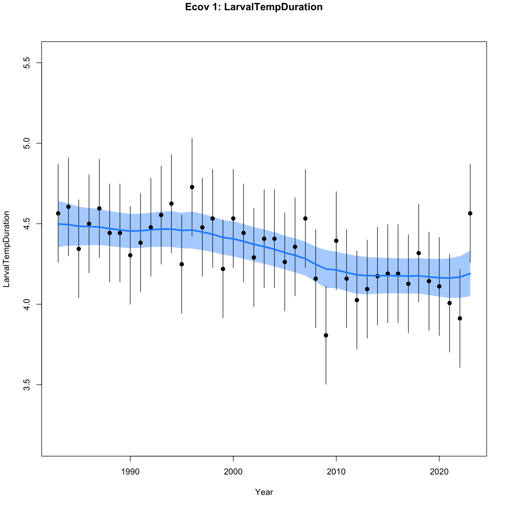

```{r setup, include=FALSE}
knitr::opts_chunk$set(echo = TRUE)
```

# ICES Title and Abstract

## Fit for the future? Environmental covariates and random effects in stock assessment

Considerable effort has been invested in evaluating potential environmental drivers of stock productivity, mortality, and/or availability in recent Northwest Atlantic stock assessments. Additional recent investment in regional ocean modeling is aimed at operational short term prediction of environmental conditions such as bottom temperature. Environmental drivers have been successfully included in stock assessments using the Woods Hole Assessment Model (WHAM), a state-space modeling framework. Here we review lessons learned and controversial opinions generated from attempts to include environmental recruitment covariates within a stock assessment for Atlantic herring. Environmental covariates were tailored to herring life history and implemented based on mechanistic hypotheses. Despite significant correlations with recruitment estimated from a prior (non-state-space) assessment model, none of the covariates were included in the final state-space model. We draw two main conclusions. First, even in a state of the art model there are limits on environmental covariate inclusion. For example, mechanistic linkages available for recruitment covariates dwindle if a stock recruit relationship cannot be estimated. Second, tradeoffs may exist between including mechanistic drivers as covariates and including random effects that account for variation from unidentified mechanisms. Herring recruitment covariates had much stronger explanatory power in the absence of numbers at age (NAA) random effects, but model fit was much better with NAA random effects. Given that some environmental covariates can be forecast, while some random effects cannot or it is not clear how, this presents a dilemma. Do we risk sacrificing short term prediction capability (needed by management) for assessment model fit (needed to get models accepted for use in management)? 

## ICES keywords

State space models, recruitment prediction, stock assessment, ecological indicators


# Introduction

Here we are looking at different WHAM assessment configurations with and without environmental covariates (ecov) and numbers at age random effects (NAA RE). 

This work will be presented at the 2025 ICES Annual Science Conference. We are speaking in the "Controversial opinions in stock assessment and fisheries management session. The submitted abstract outlines the presentation.

In this document we will work out the code for comparing models with different configurations and develop visualizations for the presentation. 

# Methods

## Compare models

This code follows that posted in the WHAM model vignettes https://timjmiller.github.io/wham/articles/ex02_CPI_recruitment.html 

We are using Atlantic herring assessment models developed for the 2025 Research Track assessment that have already been run and are stored locally.  Some were rerun using the script in this repository (https://github.com/sgaichas/whamtest-covariates/blob/main/Tests.R) to get a full set for comparison. 

We'll focus on the haddock predation models but can use similar code to read in the models evaluating temperature covariates.

First read in the stored model outputs and name them. Then make a list object of models for comparison.

We can compare models with and without NAA RE estimated as long as the input data is the same. So the base model can't be compared (ecov not included) but the other four can, and the NAAon_ecovoff model *should* be identical to base in all practical ways. Base is staying in the nix to ensure that is true.

```{r}

# keep the object names (base etc) and just sub in the temperature model directories if needed

base <- readRDS(here::here("WHAMfits/mm192_meanrecpar_4Feb25/mm192_meanrecpar_4Feb25.rds"))

NAAon_ecovoff <- readRDS(here::here("WHAMfits/mm204-ecovoff/mm204-ecovoff.rds"))

NAAon_ecovon <- readRDS(here::here("WHAMfits/mm205-test/mm205-test.rds"))

NAAoff_ecovoff <- readRDS(here::here("WHAMfits/mm206-ecovoff/mm206-ecovoff.rds"))

NAAoff_ecovon <- readRDS(here::here("WHAMfits/mm207-ecovon/mm207-ecovon.rds"))

mods <- list(base = base, 
             NAAon_ecovoff = NAAon_ecovoff, 
             NAAon_ecovon = NAAon_ecovon, 
             NAAoff_ecovoff = NAAoff_ecovoff, 
             NAAoff_ecovon = NAAoff_ecovon)

n.mods <- length(mods)
```

Make a table with names, setup, convergence, etc

```{r}
df.mods <- data.frame(Model = names(mods),
                      NAA_re_sigma = unlist(unname(lapply(mods, function(x) x$input$options$NAA_re$sigma))),
                      NAA_re_cor = unlist(unname(lapply(mods, function(x) x$input$options$NAA_re$cor))),
                      recruit_model = unlist(unname(lapply(mods, function(x) x$input$data$recruit_model))),
                      Ecov_how_R =  unlist(unname(lapply(mods, function(x) x$input$data$Ecov_how_R))),
                      n_poly_Ecov_R = unlist(unname(lapply(mods, function(x) x$input$data$n_poly_Ecov_R))),
                      Ecov_model =  names(unlist(unname(lapply(mods, function(x) x$input$data$Ecov_model)))),
                      Ecov_obs_sigma_opt =  unlist(unname(lapply(mods, function(x) x$input$data$Ecov_obs_sigma_opt))))

df.mods$Ecov_lag_R  <- ifelse(df.mods$Ecov_model %in% c("rw", "ar1"), unlist(unname(lapply(mods, function(x) which(x$input$years_Ecov==tail(x$input$years,1)) - x$input$data$ind_Ecov_out_end_R - 1))), "")

# end model year
#tail(x$input$years,1)

# lag
#which(x$input$years_Ecov==tail(x$input$years,1)) - x$input$data$ind_Ecov_out_end_R - 1

# use words
df.mods$recruit_model <- dplyr::case_match(df.mods$recruit_model, 1 ~ "Random walk", 2 ~ "Random about mean", 3 ~ "Bev-Holt", 4 ~ "Ricker")
df.mods$Ecov_how_R <- dplyr::case_match(df.mods$Ecov_how_R, 0 ~ "none", 1 ~ "controlling", 2 ~ "limiting", 3 ~ "lethal", 4 ~ "masking", 5 ~ "directive")
df.mods$n_poly_Ecov_R <- ifelse(df.mods$n_poly_Ecov_R == 1, "linear", paste0("polynomial-", df.mods$n_poly_Ecov_R))
df.mods$Ecov_obs_sigma_opt <- dplyr::case_match(df.mods$Ecov_obs_sigma_opt, 1~ "", 2 ~ "est_1", 4 ~ "est_re")

# reduce confusion about the base model
df.mods$Ecov_how_R <- ifelse(df.mods$Model == "base", "", df.mods$Ecov_how_R)
df.mods$n_poly_Ecov_R <- ifelse(df.mods$Model == "base", "", df.mods$n_poly_Ecov_R)


# get diagnostics
opt_conv = 1-sapply(mods, function(x) x$opt$convergence)
ok_sdrep = sapply(mods, function(x) if(x$na_sdrep==FALSE & !is.na(x$na_sdrep)) 1 else 0)
df.mods$conv <- as.logical(opt_conv)
df.mods$pdHess <- as.logical(ok_sdrep)
df.mods$NLL <- sapply(mods, function(x) round(x$opt$objective,3))

not_conv <- !df.mods$conv | !df.mods$pdHess
mods2 <- mods
mods2[not_conv] <- NULL

# take out the base model for final comparison
mods2 <- mods2[-1]

df.aic.tmp <- as.data.frame(wham::compare_wham_models(mods2, table.opts=list(sort=FALSE, calc.rho=T, print=F))$tab)
df.aic <- df.aic.tmp[FALSE,]
ct = 1
for(i in 1:n.mods){
  if(not_conv[i]){
    df.aic[i,] <- rep(NA,5)
  } else {
    df.aic[i,] <- df.aic.tmp[ct,]
    ct <- ct + 1
  }
}
df.aic <- tibble::rownames_to_column(df.aic)

df.mods <- dplyr::left_join(df.mods, df.aic, dplyr::join_by(Model == rowname))
df.mods <- df.mods[order(df.mods$dAIC, na.last=TRUE),]
df.mods[is.na(df.mods$AIC), c('dAIC','AIC','rho_R','rho_SSB','rho_Fbar')] <- "---"
rownames(df.mods) <- NULL

diagonly <- df.mods |>
  dplyr::select(Model, conv, pdHess, NLL, dAIC, AIC, rho_R, rho_SSB, rho_Fbar)

flextable::flextable(diagonly)
  


```

For kicks we can see that the base model has the same retrospective diagnostics as the NAAon-ecovoff model, as expected.

```{r}
basediag <- as.data.frame(wham::compare_wham_models(mods[1], table.opts=list(sort=FALSE, calc.rho=T, print=F))$tab)

flextable::flextable(basediag)

```

The models without NAA RE clearly fit more poorly than those with. 

We can see the WHAM comparison outputs of the ecov models by running this

```{r}
wham::compare_wham_models(mods2, do.table = F)
```


## Visualizations

We get max 8 slides to describe this rather complex work so streamline the visualization.

Correction! They want a 6 minute talk... 6 slides max!

## Title slide (cheating not counting this)

Controversial opinion/conclusion: 

Fitting the model isn't our ultimate goal!  Catch advice for 2-3 future years is.

Both random effects and environmental covariates can help explain modeled population dynamics, but they may interact in unexpected ways. 

RE represent cumulative unknown drivers, which can be difficult to project into the future without understanding mechanisms, while environmental covariates represent possibly predictable but incomplete mechanistic drivers, whose influence may change over time.

RE solve a lot of diagnostic issues in models (e.g. retrospective patterns) and are considerably easier to implement than environmental covariates, which often require investment in research and development.

Do we risk sacrificing short term prediction capability (needed by management) for assessment model fit (needed to get models accepted for use in management)? 

## Slide 1

Intro: goal was develop a new state space herring assessment and explore with ecological covariates

Map of herring stock we are talking about

History and current status: current low recruitment

## Slide 2 combine with slide 1

Possible ecological drivers: haddock predation

Micah's spatial modeling and index development

High inverse correlation of resulting haddock index with previously estimated herring recruitment/SSB

## Slide 3 need to combine with slide 4 somehow

New state space model developed with NAA RE, best fit with numbers at age transition correlations among ages but not years

Image of NAA RE pattern

Good model diagnostics

## Slide 4

Including the covariate in the model: only one approach possible because stock recruit relationship not estimable

Model estimates recruitment as annual iid RE around an estimated fixed effect recruitment scaling parameter ("mean-ish" recruitment)

Model estimates a fit to covariate data, then estimates parameters of relationship with recruitment scaling parameter (lag-1-linear)

Image of fit to haddock predation index covariate


## Slide 5

Given correlation with previous recruitment estimates, it was surprising how little impact the covariate had on recruitment or the full models

Side by side image of rec scaling parameter estimate with and without the covariate

```{r NAAonplots, fig.show='hold', out.width='49%'}
NAAmods <- mods2[c("NAAon_ecovoff", "NAAon_ecovon")]

# code from wham:::plot.NAA.4.panel in https://github.com/timjmiller/wham/blob/master/R/wham_plots_tables.R


plot.NAA.rec.panel <- function(mod){
  
  years <- mod$years
  years_full <- mod$years_full
  dat <- mod$env$data
  pred_NAA <- mod$rep$pred_NAA
  NAA <- mod$rep$NAA
  sigma_all <- exp(mod$parList$log_NAA_sigma) #n_stocks x n_ages
  stocks <- 1:dat$n_stocks
  regions <- 1:dat$n_regions
  ages <- 1 #1:dat$n_ages
  
  plot.colors <- viridisLite::viridis(n=length(1:dat$n_ages))

  for(s in stocks) for(r in regions) for (i in ages) if(dat$NAA_where[s,r,i])
	{
    sigma <- matrix(sigma_all[s,r,], length(years_full), dat$n_ages, byrow = TRUE)
    log_stdres <- (log(NAA[s,r,,])-log(pred_NAA[s,r,,]))/sigma
    y.max <- max(NAA[s,r,,i], na.rm = TRUE)
    if(!is.na(y.max)) {
      plot(years_full, NAA[s,r,,i], type='p', col=plot.colors[i], pch=1, xlab="Year", ylab="Abundance (1000s)",
        ylim=c(0, 1.1*y.max))
      lines(years_full, pred_NAA[s,r,,i], col=plot.colors[i], lwd=2)
      title(main = deparse(substitute(mod)))
      if(length(years_full) > length(years)) abline(v=tail(years,1), lty=2, lwd=1)
    }
  }
}

#purrr::map(NAAmods, plot.NAA.rec.panel)

plot.NAA.rec.panel(NAAon_ecovoff)
  
plot.NAA.rec.panel(NAAon_ecovon)


```


Didn't substantially improve model fit or reduce the process SD for recruitment, and the slope estimate CI included 0

## Slide 6

An experiment fitting the model without NAA RE on older ages and with the environmental covariate resulted in poorer model fit but a much stronger covariate effect

Image comparing recruitment deviations with and without NAA RE and impact of haddock predation index 

```{r NAAoffplots, fig.show='hold', out.width='49%'}
plot.NAA.rec.panel(NAAoff_ecovoff)
  
plot.NAA.rec.panel(NAAoff_ecovon)


```


And a different recruitment time series? NAA RE on ages soaking up some uncertainty that could be explained mechanistically

We dont have a recruitment index in this model so recruitment is more fungible


```{r}
#wham:::plot.recr.ssb.yr(NAAon_ecovoff, loglog=FALSE)

#wham:::plot.index.4.panel(NAAon_ecovoff)

#wham:::plot.NAA(NAAon_ecovoff)

#wham:::plot.SSB.F.trend(NAAon_ecovoff)

# code stolen from https://github.com/timjmiller/wham/blob/master/R/compare_wham_models.R
# 

x <- list()

for(i in 1:length(mods2)){
        x[[i]] <- wham::read_wham_fit(mods2[[i]])
    }
        
names(x) <- names(mods2)

df <- data.frame(matrix(NA, nrow=0, ncol=6))
colnames(df) <- c("Year","var","val","lo","hi","Model")
  
stock <- 1
region <- 1

for(i in 1:length(x)){
      #if(x[[i]]$is.wham){
        df <- rbind(df, data.frame(Year=x[[i]]$years_full, var="SSB", val=exp(x[[i]]$log_SSB_all$est), lo=x[[i]]$log_SSB_all$ci$lo, 
          hi=x[[i]]$log_SSB_all$ci$hi, Model=names(x)[i]))
        df <- rbind(df, data.frame(Year=x[[i]]$years_full, var="F", val=exp(x[[i]]$log_F_tot$est), lo=x[[i]]$log_F_tot$ci$lo, 
          hi=x[[i]]$log_F_tot$ci$hi, Model=names(x)[i]))
        df <- rbind(df, data.frame(Year=x[[i]]$years_full, var="Recruitment", val=exp(x[[i]]$log_NAA_rep$est[stock,region,,1]), 
          lo=x[[i]]$log_NAA_rep$ci$lo[stock,region,,1], hi=x[[i]]$log_NAA_rep$ci$hi[stock,region,,1], Model=names(x)[i]))
      
      #}
}
  
reconly <- ggplot2::ggplot(df |> dplyr::filter(var %in% "Recruitment")) +
  ggplot2::geom_line(ggplot2::aes(x=Year, y=val, color=Model)) +
  ggplot2::theme_bw()

recSSB <- ggplot2::ggplot(df |> 
                            dplyr::filter(var %in% c("Recruitment", "SSB")) |>
                            dplyr::select(Year, var, val, Model) |>
                            tidyr::pivot_wider(names_from = var, values_from = val) |>
                            dplyr::group_by(Model) |>
                            dplyr::mutate(recSSB = dplyr::lead(Recruitment)/SSB) |> # rec in year+1/SSB in year
                            dplyr::ungroup() 
                            ) +
  ggplot2::geom_line(ggplot2::aes(x=Year, y=recSSB, color=Model)) +
  ggplot2::theme_bw() +
  ggplot2::ylab("Rec/SSB")

# can I get the ASAP rec/SSB plot overlaid?


```

ASAP 2024 results for comparison. This is the contents of `RUN2.rdat` from the 2024 MT downloaded from https://apps-nefsc.fisheries.noaa.gov/saw/sasi.php with Search Criteria Used: 
Assessment Year:	2024
Species Name:	Atlantic herring
Stock Area:	Atlantic herring
Review Type:	Level 1 Direct Delivery
Information Type:	All

```{r}
ASAP2024 <- dget(here::here("ASAP24/RUN2.rdat"))

```

```{r}
rec24 <- ASAP2024$N.age[,1]

SSB24 <- ASAP2024$SSB

recSSB24 <- dplyr::lead(rec24)/SSB24 # has year of rec, want year of SSB compared with rec yr+1

recSSB24short <- recSSB24[-c(1:22)] |>
  tibble::enframe() |>
  dplyr::select(Year = name, recSSB = value) |>
  dplyr::mutate(Year = as.numeric(Year)-1)

recSSB <- ggplot2::ggplot(df |> 
                            dplyr::filter(var %in% c("Recruitment", "SSB")) |>
                            dplyr::select(Year, var, val, Model) |>
                            tidyr::pivot_wider(names_from = var, values_from = val) |>
                            dplyr::group_by(Model) |>
                            dplyr::mutate(recSSB = dplyr::lead(Recruitment)/SSB) |> # rec in year+1/SSB in year
                            dplyr::ungroup()
                            ) +
  ggplot2::geom_area(data = recSSB24short, ggplot2::aes(x=Year, y=recSSB, fill = "lightgray")) +
  ggplot2::geom_line(ggplot2::aes(x=Year, y=recSSB, color=Model)) +
  ggplot2::scale_fill_identity(name = '', guide = 'legend',labels = c('ASAP 24 MT')) +
  ggplot2::theme_bw() +
  ggplot2::ylab("Rec/SSB")

reconly <- ggplot2::ggplot(df |> dplyr::filter(var %in% "Recruitment")) +
  ggplot2::geom_area(data = rec24 |>
                       tibble::enframe() |>
                       dplyr::select(Year = name, Recruitment = value) |>
                       dplyr::mutate(Year = as.numeric(Year)),
                     ggplot2::aes(x=Year, y=Recruitment, fill = "lightgray")) +
  ggplot2::geom_line(ggplot2::aes(x=Year, y=val, color=Model)) +
  ggplot2::scale_fill_identity(name = '', guide = 'legend',labels = c('ASAP 24 MT')) +
  ggplot2::theme_bw()

reconly

recSSB

```


## Slide 7 

There are also issues with covariates

Implemented this way, they change the reference point calculation and stock status


We had several potential drivers so there could be more than one. But which mechanism to include? 

We got a similar effect with a different environmental covariate--optimal larval temperature. Try to include both??



And maybe its just herring's NAA RE? Yellowtail assessment had both NAA RE and an influential environmental covariate included. Maybe there is recruitment information in this model?

Image of larval temp covariate with and without NAA RE, image of Yellowtail fit if I can get it?

```{r larvaltempNAAonplots, fig.show='hold', out.width='49%'}
larvaltemp_NAAon_ecovoff <- readRDS(here::here("WHAMfits/mm192_LarvalTempDuration/m3.rds"))

larvaltemp_NAAon_ecovon <- readRDS(here::here("WHAMfits/mm192_LarvalTempDuration/m4.rds"))

larvaltemp_NAAoff_ecovoff <- readRDS(here::here("WHAMfits/mm192_LarvalTempDuration_NAA_REoff/m3.rds"))

larvaltemp_NAAoff_ecovon <- readRDS(here::here("WHAMfits/mm192_LarvalTempDuration_NAA_REoff/m4.rds"))

plot.NAA.rec.panel(larvaltemp_NAAon_ecovoff)
  
plot.NAA.rec.panel(larvaltemp_NAAon_ecovon)

```

```{r larvaltempNAAoffplots, fig.show='hold', out.width='49%'}
plot.NAA.rec.panel(larvaltemp_NAAoff_ecovoff)
  
plot.NAA.rec.panel(larvaltemp_NAAoff_ecovon)

```


## Conclusion

RE interactions with covariates in state space assessment models obviously needs more investigation

A lot of effort and review goes into historical model fit, then we do projections separately with a single best fit model, but projections are the thing used in management for catch advice

Past performance does not guarantee future returns!

