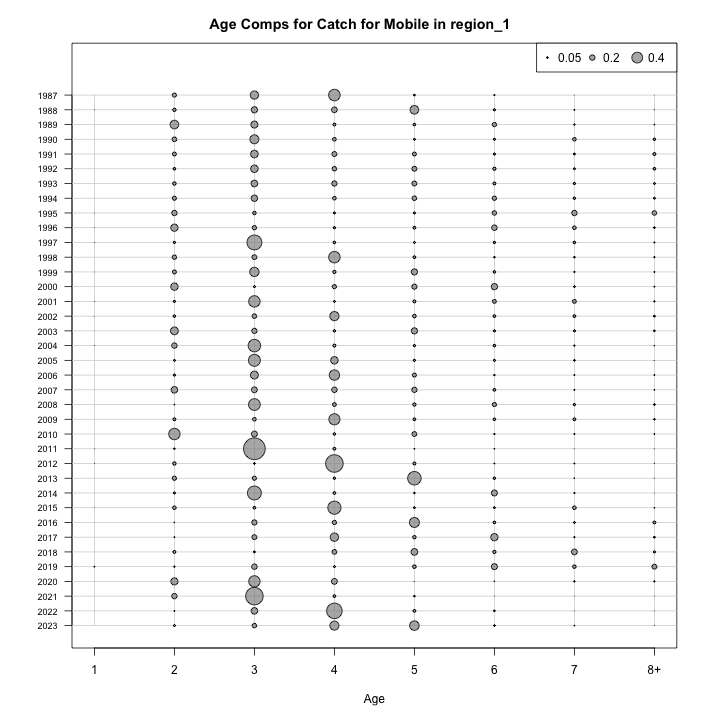
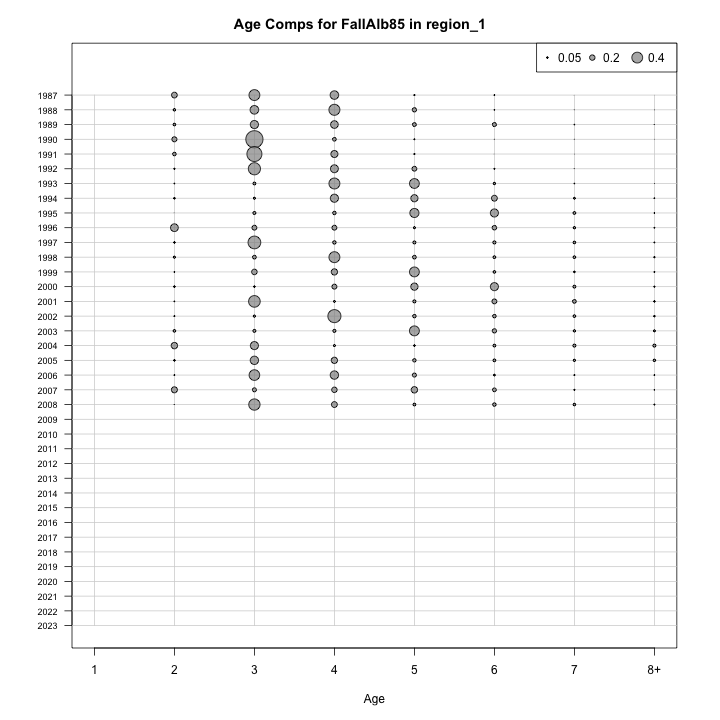
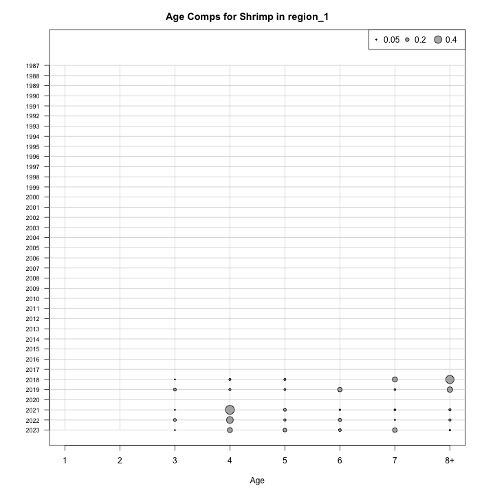
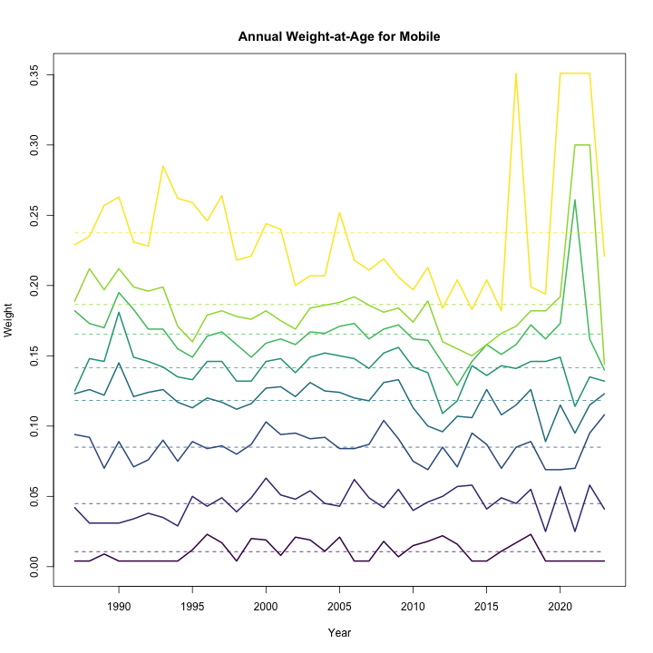
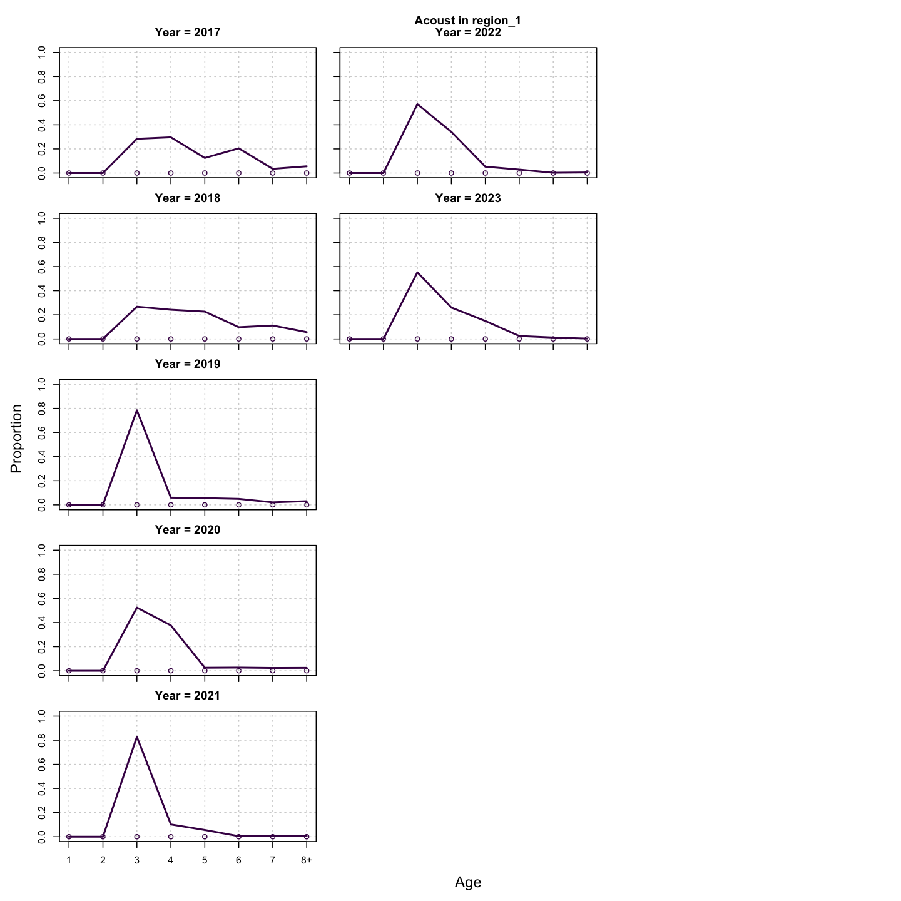
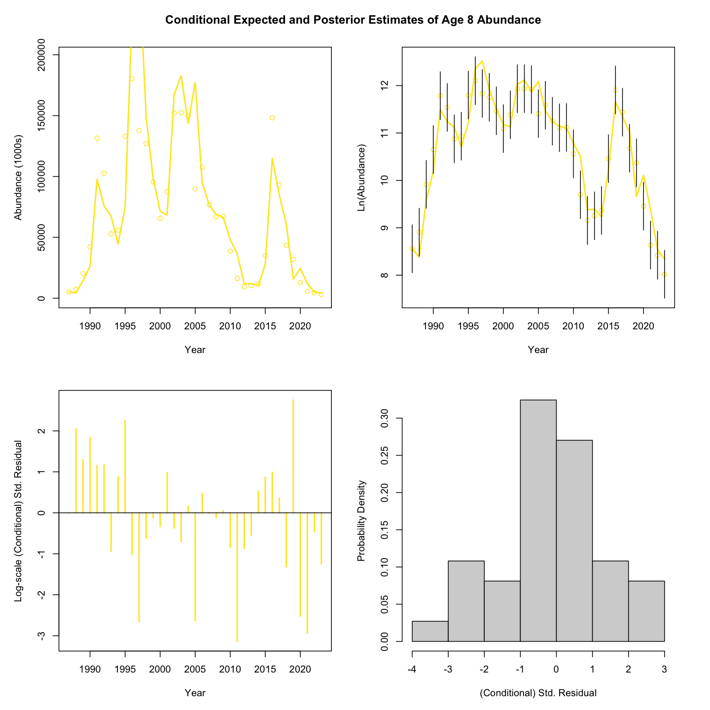
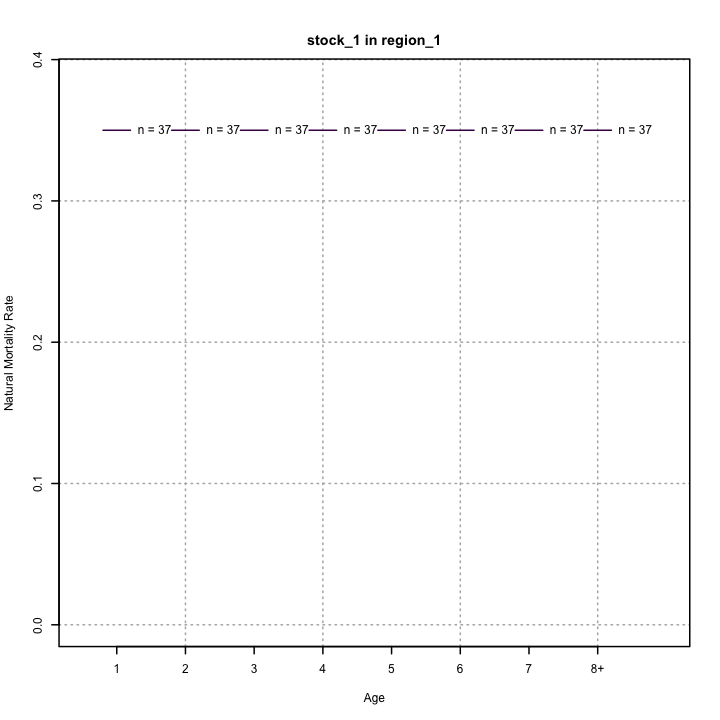
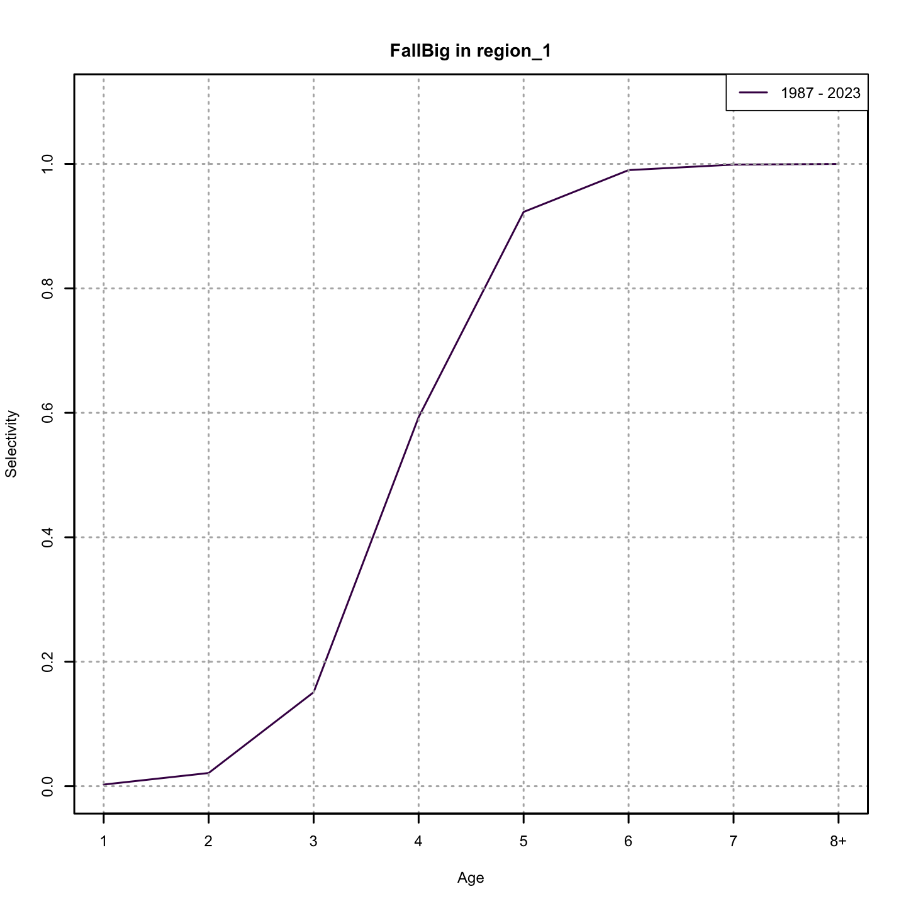
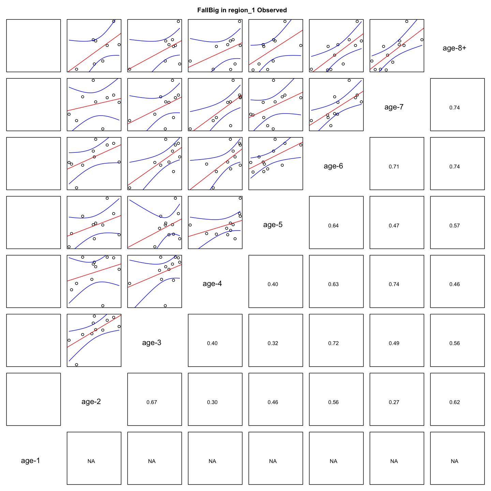
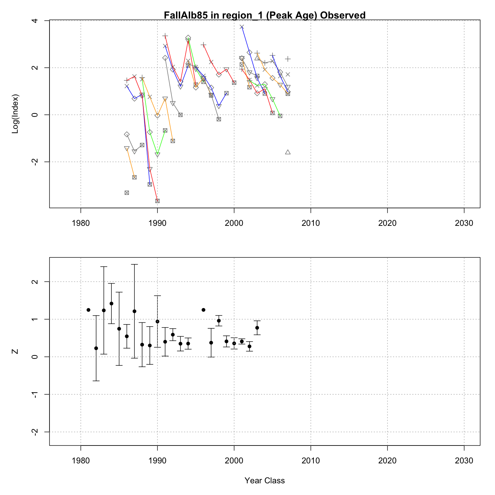

---
output:
  html_document:
    df_print: paged
    keep_md: yes
  word_document: default
  pdf_document:
    fig_caption: yes
    includes:
    keep_tex: yes
    number_sections: no
title: "WHAM figures and tables"
header-includes:
  - \usepackage{longtable}
  - \usepackage{booktabs}
  - \usepackage{caption,graphics}
  - \usepackage{makecell}
  - \usepackage{lscape}
  - \renewcommand\figurename{Fig.}
  - \captionsetup{labelsep=period, singlelinecheck=false}
  - \newcommand{\changesize}[1]{\fontsize{#1pt}{#1pt}\selectfont}
  - \renewcommand{\arraystretch}{1.5}
  - \renewcommand\theadfont{}
---

# {.tabset}

## Figures {.tabset}

### Input

### Diagnostics

### Results

### Retro

### Reference points

### Miscellaneous

## Tables {.tabset}

### Parameter estimates

<table class="table" style="margin-left: auto; margin-right: auto;">
<caption>Parameter estimates, standard errors, and confidence intervals. Rounded to 3 decimal places.</caption>
 <thead>
  <tr>
   <th style="text-align:left;">   </th>
   <th style="text-align:right;"> Estimate </th>
   <th style="text-align:right;"> Std. Error </th>
   <th style="text-align:right;"> 95\% CI lower </th>
   <th style="text-align:right;"> 95\% CI upper </th>
  </tr>
 </thead>
<tbody>
  <tr>
   <td style="text-align:left;"> stock 1 Mean Recruitment </td>
   <td style="text-align:right;"> $2681178.897$ </td>
   <td style="text-align:right;"> $691677.620$ </td>
   <td style="text-align:right;"> $1617100.150$ </td>
   <td style="text-align:right;"> $4445439.127$ </td>
  </tr>
  <tr>
   <td style="text-align:left;"> stock 1 NAA $\sigma$ (age 1) </td>
   <td style="text-align:right;"> $0.823$ </td>
   <td style="text-align:right;"> $0.127$ </td>
   <td style="text-align:right;"> $0.608$ </td>
   <td style="text-align:right;"> $1.114$ </td>
  </tr>
  <tr>
   <td style="text-align:left;"> stock 1 NAA $\sigma$ (ages 2-8+) </td>
   <td style="text-align:right;"> $0.257$ </td>
   <td style="text-align:right;"> $0.044$ </td>
   <td style="text-align:right;"> $0.184$ </td>
   <td style="text-align:right;"> $0.360$ </td>
  </tr>
  <tr>
   <td style="text-align:left;"> stock 1   NAA AR1 $\rho$ age </td>
   <td style="text-align:right;"> $0.837$ </td>
   <td style="text-align:right;"> $0.061$ </td>
   <td style="text-align:right;"> $0.671$ </td>
   <td style="text-align:right;"> $0.923$ </td>
  </tr>
  <tr>
   <td style="text-align:left;"> Shrimp fully selected q </td>
   <td style="text-align:right;"> $1.267\times 10^{-5}$ </td>
   <td style="text-align:right;"> $2.054\times 10^{-6}$ </td>
   <td style="text-align:right;"> $9.220\times 10^{-6}$ </td>
   <td style="text-align:right;"> $1.741\times 10^{-5}$ </td>
  </tr>
  <tr>
   <td style="text-align:left;"> Acoust fully selected q </td>
   <td style="text-align:right;"> $3.452\times 10^{-5}$ </td>
   <td style="text-align:right;"> $6.176\times 10^{-6}$ </td>
   <td style="text-align:right;"> $2.431\times 10^{-5}$ </td>
   <td style="text-align:right;"> $4.902\times 10^{-5}$ </td>
  </tr>
  <tr>
   <td style="text-align:left;"> SprAlb85 fully selected q </td>
   <td style="text-align:right;"> $7.685\times 10^{-6}$ </td>
   <td style="text-align:right;"> $1.217\times 10^{-6}$ </td>
   <td style="text-align:right;"> $5.634\times 10^{-6}$ </td>
   <td style="text-align:right;"> $1.048\times 10^{-5}$ </td>
  </tr>
  <tr>
   <td style="text-align:left;"> FallAlb85 fully selected q </td>
   <td style="text-align:right;"> $1.196\times 10^{-5}$ </td>
   <td style="text-align:right;"> $2.261\times 10^{-6}$ </td>
   <td style="text-align:right;"> $8.260\times 10^{-6}$ </td>
   <td style="text-align:right;"> $1.733\times 10^{-5}$ </td>
  </tr>
  <tr>
   <td style="text-align:left;"> SprBig fully selected q </td>
   <td style="text-align:right;"> $4.448\times 10^{-5}$ </td>
   <td style="text-align:right;"> $7.868\times 10^{-6}$ </td>
   <td style="text-align:right;"> $3.145\times 10^{-5}$ </td>
   <td style="text-align:right;"> $6.291\times 10^{-5}$ </td>
  </tr>
  <tr>
   <td style="text-align:left;"> FallBig fully selected q </td>
   <td style="text-align:right;"> $7.393\times 10^{-5}$ </td>
   <td style="text-align:right;"> $1.986\times 10^{-5}$ </td>
   <td style="text-align:right;"> $4.367\times 10^{-5}$ </td>
   <td style="text-align:right;"> $1.252\times 10^{-4}$ </td>
  </tr>
  <tr>
   <td style="text-align:left;"> Block 1: Mobile Selectivity for age 1 </td>
   <td style="text-align:right;"> $3.542\times 10^{-4}$ </td>
   <td style="text-align:right;"> $9.070\times 10^{-5}$ </td>
   <td style="text-align:right;"> $2.144\times 10^{-4}$ </td>
   <td style="text-align:right;"> $5.851\times 10^{-4}$ </td>
  </tr>
  <tr>
   <td style="text-align:left;"> Block 1: Mobile Selectivity for age 2 </td>
   <td style="text-align:right;"> $0.089$ </td>
   <td style="text-align:right;"> $0.016$ </td>
   <td style="text-align:right;"> $0.062$ </td>
   <td style="text-align:right;"> $0.127$ </td>
  </tr>
  <tr>
   <td style="text-align:left;"> Block 1: Mobile Selectivity for age 3 </td>
   <td style="text-align:right;"> $0.342$ </td>
   <td style="text-align:right;"> $0.056$ </td>
   <td style="text-align:right;"> $0.242$ </td>
   <td style="text-align:right;"> $0.459$ </td>
  </tr>
  <tr>
   <td style="text-align:left;"> Block 1: Mobile Selectivity for age 4 </td>
   <td style="text-align:right;"> $0.447$ </td>
   <td style="text-align:right;"> $0.066$ </td>
   <td style="text-align:right;"> $0.324$ </td>
   <td style="text-align:right;"> $0.576$ </td>
  </tr>
  <tr>
   <td style="text-align:left;"> Block 1: Mobile Selectivity for age 5 </td>
   <td style="text-align:right;"> $0.540$ </td>
   <td style="text-align:right;"> $0.067$ </td>
   <td style="text-align:right;"> $0.408$ </td>
   <td style="text-align:right;"> $0.666$ </td>
  </tr>
  <tr>
   <td style="text-align:left;"> Block 1: Mobile Selectivity for age 6 </td>
   <td style="text-align:right;"> $0.718$ </td>
   <td style="text-align:right;"> $0.067$ </td>
   <td style="text-align:right;"> $0.571$ </td>
   <td style="text-align:right;"> $0.830$ </td>
  </tr>
  <tr>
   <td style="text-align:left;"> Block 1: Mobile Selectivity for age 7 </td>
   <td style="text-align:right;"> $1.000$ </td>
   <td style="text-align:right;"> -- </td>
   <td style="text-align:right;"> -- </td>
   <td style="text-align:right;"> -- </td>
  </tr>
  <tr>
   <td style="text-align:left;"> Block 1: Mobile Selectivity for age 8+ </td>
   <td style="text-align:right;"> $1.000$ </td>
   <td style="text-align:right;"> -- </td>
   <td style="text-align:right;"> -- </td>
   <td style="text-align:right;"> -- </td>
  </tr>
  <tr>
   <td style="text-align:left;"> Block 2: Fixed Selectivity for age 1 </td>
   <td style="text-align:right;"> $0.038$ </td>
   <td style="text-align:right;"> $0.007$ </td>
   <td style="text-align:right;"> $0.027$ </td>
   <td style="text-align:right;"> $0.053$ </td>
  </tr>
  <tr>
   <td style="text-align:left;"> Block 2: Fixed Selectivity for age 2 </td>
   <td style="text-align:right;"> $1.000$ </td>
   <td style="text-align:right;"> -- </td>
   <td style="text-align:right;"> -- </td>
   <td style="text-align:right;"> -- </td>
  </tr>
  <tr>
   <td style="text-align:left;"> Block 2: Fixed Selectivity for age 3 </td>
   <td style="text-align:right;"> $0.238$ </td>
   <td style="text-align:right;"> $0.038$ </td>
   <td style="text-align:right;"> $0.171$ </td>
   <td style="text-align:right;"> $0.321$ </td>
  </tr>
  <tr>
   <td style="text-align:left;"> Block 2: Fixed Selectivity for age 4 </td>
   <td style="text-align:right;"> $0.103$ </td>
   <td style="text-align:right;"> $0.024$ </td>
   <td style="text-align:right;"> $0.065$ </td>
   <td style="text-align:right;"> $0.160$ </td>
  </tr>
  <tr>
   <td style="text-align:left;"> Block 2: Fixed Selectivity for age 5 </td>
   <td style="text-align:right;"> $0.069$ </td>
   <td style="text-align:right;"> $0.019$ </td>
   <td style="text-align:right;"> $0.040$ </td>
   <td style="text-align:right;"> $0.117$ </td>
  </tr>
  <tr>
   <td style="text-align:left;"> Block 2: Fixed Selectivity for age 6 </td>
   <td style="text-align:right;"> $0.062$ </td>
   <td style="text-align:right;"> $0.019$ </td>
   <td style="text-align:right;"> $0.034$ </td>
   <td style="text-align:right;"> $0.112$ </td>
  </tr>
  <tr>
   <td style="text-align:left;"> Block 2: Fixed Selectivity for age 7 </td>
   <td style="text-align:right;"> $0.059$ </td>
   <td style="text-align:right;"> $0.020$ </td>
   <td style="text-align:right;"> $0.030$ </td>
   <td style="text-align:right;"> $0.112$ </td>
  </tr>
  <tr>
   <td style="text-align:left;"> Block 2: Fixed Selectivity for age 8+ </td>
   <td style="text-align:right;"> $0.041$ </td>
   <td style="text-align:right;"> $0.013$ </td>
   <td style="text-align:right;"> $0.021$ </td>
   <td style="text-align:right;"> $0.076$ </td>
  </tr>
  <tr>
   <td style="text-align:left;"> Block 3: Shrimp Selectivity for age 1 </td>
   <td style="text-align:right;"> $0.000$ </td>
   <td style="text-align:right;"> -- </td>
   <td style="text-align:right;"> -- </td>
   <td style="text-align:right;"> -- </td>
  </tr>
  <tr>
   <td style="text-align:left;"> Block 3: Shrimp Selectivity for age 2 </td>
   <td style="text-align:right;"> $0.000$ </td>
   <td style="text-align:right;"> -- </td>
   <td style="text-align:right;"> -- </td>
   <td style="text-align:right;"> -- </td>
  </tr>
  <tr>
   <td style="text-align:left;"> Block 3: Shrimp Selectivity for age 3 </td>
   <td style="text-align:right;"> $0.058$ </td>
   <td style="text-align:right;"> $0.026$ </td>
   <td style="text-align:right;"> $0.024$ </td>
   <td style="text-align:right;"> $0.134$ </td>
  </tr>
  <tr>
   <td style="text-align:left;"> Block 3: Shrimp Selectivity for age 4 </td>
   <td style="text-align:right;"> $1.000$ </td>
   <td style="text-align:right;"> -- </td>
   <td style="text-align:right;"> -- </td>
   <td style="text-align:right;"> -- </td>
  </tr>
  <tr>
   <td style="text-align:left;"> Block 3: Shrimp Selectivity for age 5 </td>
   <td style="text-align:right;"> $1.000$ </td>
   <td style="text-align:right;"> -- </td>
   <td style="text-align:right;"> -- </td>
   <td style="text-align:right;"> -- </td>
  </tr>
  <tr>
   <td style="text-align:left;"> Block 3: Shrimp Selectivity for age 6 </td>
   <td style="text-align:right;"> $1.000$ </td>
   <td style="text-align:right;"> -- </td>
   <td style="text-align:right;"> -- </td>
   <td style="text-align:right;"> -- </td>
  </tr>
  <tr>
   <td style="text-align:left;"> Block 3: Shrimp Selectivity for age 7 </td>
   <td style="text-align:right;"> $1.000$ </td>
   <td style="text-align:right;"> -- </td>
   <td style="text-align:right;"> -- </td>
   <td style="text-align:right;"> -- </td>
  </tr>
  <tr>
   <td style="text-align:left;"> Block 3: Shrimp Selectivity for age 8+ </td>
   <td style="text-align:right;"> $1.000$ </td>
   <td style="text-align:right;"> -- </td>
   <td style="text-align:right;"> -- </td>
   <td style="text-align:right;"> -- </td>
  </tr>
  <tr>
   <td style="text-align:left;"> Block 4: Acoust Selectivity for age 1 </td>
   <td style="text-align:right;"> $0.000$ </td>
   <td style="text-align:right;"> -- </td>
   <td style="text-align:right;"> -- </td>
   <td style="text-align:right;"> -- </td>
  </tr>
  <tr>
   <td style="text-align:left;"> Block 4: Acoust Selectivity for age 2 </td>
   <td style="text-align:right;"> $0.000$ </td>
   <td style="text-align:right;"> -- </td>
   <td style="text-align:right;"> -- </td>
   <td style="text-align:right;"> -- </td>
  </tr>
  <tr>
   <td style="text-align:left;"> Block 4: Acoust Selectivity for age 3 </td>
   <td style="text-align:right;"> $1.000$ </td>
   <td style="text-align:right;"> -- </td>
   <td style="text-align:right;"> -- </td>
   <td style="text-align:right;"> -- </td>
  </tr>
  <tr>
   <td style="text-align:left;"> Block 4: Acoust Selectivity for age 4 </td>
   <td style="text-align:right;"> $1.000$ </td>
   <td style="text-align:right;"> -- </td>
   <td style="text-align:right;"> -- </td>
   <td style="text-align:right;"> -- </td>
  </tr>
  <tr>
   <td style="text-align:left;"> Block 4: Acoust Selectivity for age 5 </td>
   <td style="text-align:right;"> $1.000$ </td>
   <td style="text-align:right;"> -- </td>
   <td style="text-align:right;"> -- </td>
   <td style="text-align:right;"> -- </td>
  </tr>
  <tr>
   <td style="text-align:left;"> Block 4: Acoust Selectivity for age 6 </td>
   <td style="text-align:right;"> $1.000$ </td>
   <td style="text-align:right;"> -- </td>
   <td style="text-align:right;"> -- </td>
   <td style="text-align:right;"> -- </td>
  </tr>
  <tr>
   <td style="text-align:left;"> Block 4: Acoust Selectivity for age 7 </td>
   <td style="text-align:right;"> $1.000$ </td>
   <td style="text-align:right;"> -- </td>
   <td style="text-align:right;"> -- </td>
   <td style="text-align:right;"> -- </td>
  </tr>
  <tr>
   <td style="text-align:left;"> Block 4: Acoust Selectivity for age 8+ </td>
   <td style="text-align:right;"> $1.000$ </td>
   <td style="text-align:right;"> -- </td>
   <td style="text-align:right;"> -- </td>
   <td style="text-align:right;"> -- </td>
  </tr>
  <tr>
   <td style="text-align:left;"> Block 5: SprAlb85 Selectivity for age 1 </td>
   <td style="text-align:right;"> $0.000$ </td>
   <td style="text-align:right;"> -- </td>
   <td style="text-align:right;"> -- </td>
   <td style="text-align:right;"> -- </td>
  </tr>
  <tr>
   <td style="text-align:left;"> Block 5: SprAlb85 Selectivity for age 2 </td>
   <td style="text-align:right;"> $0.344$ </td>
   <td style="text-align:right;"> $0.051$ </td>
   <td style="text-align:right;"> $0.252$ </td>
   <td style="text-align:right;"> $0.450$ </td>
  </tr>
  <tr>
   <td style="text-align:left;"> Block 5: SprAlb85 Selectivity for age 3 </td>
   <td style="text-align:right;"> $1.000$ </td>
   <td style="text-align:right;"> -- </td>
   <td style="text-align:right;"> -- </td>
   <td style="text-align:right;"> -- </td>
  </tr>
  <tr>
   <td style="text-align:left;"> Block 5: SprAlb85 Selectivity for age 4 </td>
   <td style="text-align:right;"> $1.000$ </td>
   <td style="text-align:right;"> -- </td>
   <td style="text-align:right;"> -- </td>
   <td style="text-align:right;"> -- </td>
  </tr>
  <tr>
   <td style="text-align:left;"> Block 5: SprAlb85 Selectivity for age 5 </td>
   <td style="text-align:right;"> $1.000$ </td>
   <td style="text-align:right;"> -- </td>
   <td style="text-align:right;"> -- </td>
   <td style="text-align:right;"> -- </td>
  </tr>
  <tr>
   <td style="text-align:left;"> Block 5: SprAlb85 Selectivity for age 6 </td>
   <td style="text-align:right;"> $1.000$ </td>
   <td style="text-align:right;"> -- </td>
   <td style="text-align:right;"> -- </td>
   <td style="text-align:right;"> -- </td>
  </tr>
  <tr>
   <td style="text-align:left;"> Block 5: SprAlb85 Selectivity for age 7 </td>
   <td style="text-align:right;"> $1.000$ </td>
   <td style="text-align:right;"> -- </td>
   <td style="text-align:right;"> -- </td>
   <td style="text-align:right;"> -- </td>
  </tr>
  <tr>
   <td style="text-align:left;"> Block 5: SprAlb85 Selectivity for age 8+ </td>
   <td style="text-align:right;"> $1.000$ </td>
   <td style="text-align:right;"> -- </td>
   <td style="text-align:right;"> -- </td>
   <td style="text-align:right;"> -- </td>
  </tr>
  <tr>
   <td style="text-align:left;"> Block 6: FallAlb85 $a_{50}$ </td>
   <td style="text-align:right;"> $2.737$ </td>
   <td style="text-align:right;"> $0.141$ </td>
   <td style="text-align:right;"> $2.468$ </td>
   <td style="text-align:right;"> $3.020$ </td>
  </tr>
  <tr>
   <td style="text-align:left;"> Block 6: FallAlb85 1/slope (increasing) </td>
   <td style="text-align:right;"> $0.353$ </td>
   <td style="text-align:right;"> $0.042$ </td>
   <td style="text-align:right;"> $0.279$ </td>
   <td style="text-align:right;"> $0.446$ </td>
  </tr>
  <tr>
   <td style="text-align:left;"> Block 7: SprBig Selectivity for age 1 </td>
   <td style="text-align:right;"> $0.000$ </td>
   <td style="text-align:right;"> -- </td>
   <td style="text-align:right;"> -- </td>
   <td style="text-align:right;"> -- </td>
  </tr>
  <tr>
   <td style="text-align:left;"> Block 7: SprBig Selectivity for age 2 </td>
   <td style="text-align:right;"> $0.138$ </td>
   <td style="text-align:right;"> $0.034$ </td>
   <td style="text-align:right;"> $0.085$ </td>
   <td style="text-align:right;"> $0.218$ </td>
  </tr>
  <tr>
   <td style="text-align:left;"> Block 7: SprBig Selectivity for age 3 </td>
   <td style="text-align:right;"> $0.591$ </td>
   <td style="text-align:right;"> $0.100$ </td>
   <td style="text-align:right;"> $0.391$ </td>
   <td style="text-align:right;"> $0.765$ </td>
  </tr>
  <tr>
   <td style="text-align:left;"> Block 7: SprBig Selectivity for age 4 </td>
   <td style="text-align:right;"> $1.000$ </td>
   <td style="text-align:right;"> -- </td>
   <td style="text-align:right;"> -- </td>
   <td style="text-align:right;"> -- </td>
  </tr>
  <tr>
   <td style="text-align:left;"> Block 7: SprBig Selectivity for age 5 </td>
   <td style="text-align:right;"> $1.000$ </td>
   <td style="text-align:right;"> -- </td>
   <td style="text-align:right;"> -- </td>
   <td style="text-align:right;"> -- </td>
  </tr>
  <tr>
   <td style="text-align:left;"> Block 7: SprBig Selectivity for age 6 </td>
   <td style="text-align:right;"> $1.000$ </td>
   <td style="text-align:right;"> -- </td>
   <td style="text-align:right;"> -- </td>
   <td style="text-align:right;"> -- </td>
  </tr>
  <tr>
   <td style="text-align:left;"> Block 7: SprBig Selectivity for age 7 </td>
   <td style="text-align:right;"> $1.000$ </td>
   <td style="text-align:right;"> -- </td>
   <td style="text-align:right;"> -- </td>
   <td style="text-align:right;"> -- </td>
  </tr>
  <tr>
   <td style="text-align:left;"> Block 7: SprBig Selectivity for age 8+ </td>
   <td style="text-align:right;"> $1.000$ </td>
   <td style="text-align:right;"> -- </td>
   <td style="text-align:right;"> -- </td>
   <td style="text-align:right;"> -- </td>
  </tr>
  <tr>
   <td style="text-align:left;"> Block 8: FallBig $a_{50}$ </td>
   <td style="text-align:right;"> $3.821$ </td>
   <td style="text-align:right;"> $0.293$ </td>
   <td style="text-align:right;"> $3.254$ </td>
   <td style="text-align:right;"> $4.396$ </td>
  </tr>
  <tr>
   <td style="text-align:left;"> Block 8: FallBig 1/slope (increasing) </td>
   <td style="text-align:right;"> $0.475$ </td>
   <td style="text-align:right;"> $0.062$ </td>
   <td style="text-align:right;"> $0.368$ </td>
   <td style="text-align:right;"> $0.612$ </td>
  </tr>
  <tr>
   <td style="text-align:left;"> Mobile in region 1 age comp, logistic-normal: $\sigma$ </td>
   <td style="text-align:right;"> $12.095$ </td>
   <td style="text-align:right;"> $1.338$ </td>
   <td style="text-align:right;"> $9.737$ </td>
   <td style="text-align:right;"> $15.023$ </td>
  </tr>
  <tr>
   <td style="text-align:left;"> Mobile in region 1 age comp, logistic-normal: $\rho$ </td>
   <td style="text-align:right;"> $0.823$ </td>
   <td style="text-align:right;"> $0.041$ </td>
   <td style="text-align:right;"> $0.729$ </td>
   <td style="text-align:right;"> $0.889$ </td>
  </tr>
  <tr>
   <td style="text-align:left;"> Fixed in region 1 age comp, logistic-normal: $\sigma$ </td>
   <td style="text-align:right;"> $25.828$ </td>
   <td style="text-align:right;"> $2.442$ </td>
   <td style="text-align:right;"> $21.460$ </td>
   <td style="text-align:right;"> $31.086$ </td>
  </tr>
  <tr>
   <td style="text-align:left;"> Fixed in region 1 age comp, logistic-normal: $\rho$ </td>
   <td style="text-align:right;"> $0.819$ </td>
   <td style="text-align:right;"> $0.036$ </td>
   <td style="text-align:right;"> $0.739$ </td>
   <td style="text-align:right;"> $0.879$ </td>
  </tr>
  <tr>
   <td style="text-align:left;"> Shrimp in region 1 age comp, logistic-normal: $\sigma$ </td>
   <td style="text-align:right;"> $22.897$ </td>
   <td style="text-align:right;"> $5.918$ </td>
   <td style="text-align:right;"> $13.796$ </td>
   <td style="text-align:right;"> $38.002$ </td>
  </tr>
  <tr>
   <td style="text-align:left;"> Shrimp in region 1 age comp, logistic-normal: $\rho$ </td>
   <td style="text-align:right;"> $0.809$ </td>
   <td style="text-align:right;"> $0.107$ </td>
   <td style="text-align:right;"> $0.520$ </td>
   <td style="text-align:right;"> $0.943$ </td>
  </tr>
  <tr>
   <td style="text-align:left;"> SprAlb85 in region 1 age comp, logistic-normal: $\sigma$ </td>
   <td style="text-align:right;"> $23.201$ </td>
   <td style="text-align:right;"> $3.163$ </td>
   <td style="text-align:right;"> $17.761$ </td>
   <td style="text-align:right;"> $30.308$ </td>
  </tr>
  <tr>
   <td style="text-align:left;"> SprAlb85 in region 1 age comp, logistic-normal: $\rho$ </td>
   <td style="text-align:right;"> $0.884$ </td>
   <td style="text-align:right;"> $0.034$ </td>
   <td style="text-align:right;"> $0.798$ </td>
   <td style="text-align:right;"> $0.936$ </td>
  </tr>
  <tr>
   <td style="text-align:left;"> FallAlb85 in region 1 age comp, logistic-normal: $\sigma$ </td>
   <td style="text-align:right;"> $23.193$ </td>
   <td style="text-align:right;"> $3.341$ </td>
   <td style="text-align:right;"> $17.489$ </td>
   <td style="text-align:right;"> $30.759$ </td>
  </tr>
  <tr>
   <td style="text-align:left;"> FallAlb85 in region 1 age comp, logistic-normal: $\rho$ </td>
   <td style="text-align:right;"> $0.936$ </td>
   <td style="text-align:right;"> $0.020$ </td>
   <td style="text-align:right;"> $0.883$ </td>
   <td style="text-align:right;"> $0.966$ </td>
  </tr>
  <tr>
   <td style="text-align:left;"> SprBig in region 1 age comp, logistic-normal: $\sigma$ </td>
   <td style="text-align:right;"> $15.528$ </td>
   <td style="text-align:right;"> $2.749$ </td>
   <td style="text-align:right;"> $10.975$ </td>
   <td style="text-align:right;"> $21.968$ </td>
  </tr>
  <tr>
   <td style="text-align:left;"> SprBig in region 1 age comp, logistic-normal: $\rho$ </td>
   <td style="text-align:right;"> $0.754$ </td>
   <td style="text-align:right;"> $0.093$ </td>
   <td style="text-align:right;"> $0.533$ </td>
   <td style="text-align:right;"> $0.892$ </td>
  </tr>
  <tr>
   <td style="text-align:left;"> FallBig in region 1 age comp, logistic-normal: $\sigma$ </td>
   <td style="text-align:right;"> $22.041$ </td>
   <td style="text-align:right;"> $3.721$ </td>
   <td style="text-align:right;"> $15.831$ </td>
   <td style="text-align:right;"> $30.686$ </td>
  </tr>
  <tr>
   <td style="text-align:left;"> FallBig in region 1 age comp, logistic-normal: $\rho$ </td>
   <td style="text-align:right;"> $0.849$ </td>
   <td style="text-align:right;"> $0.055$ </td>
   <td style="text-align:right;"> $0.708$ </td>
   <td style="text-align:right;"> $0.929$ </td>
  </tr>
  <tr>
   <td style="text-align:left;"> Ecov LarvalTempDuration: RW Ecov$_1$ </td>
   <td style="text-align:right;"> $4.498$ </td>
   <td style="text-align:right;"> $0.073$ </td>
   <td style="text-align:right;"> $4.354$ </td>
   <td style="text-align:right;"> $4.642$ </td>
  </tr>
  <tr>
   <td style="text-align:left;"> Ecov LarvalTempDuration: RW $\sigma$ </td>
   <td style="text-align:right;"> $0.037$ </td>
   <td style="text-align:right;"> $0.014$ </td>
   <td style="text-align:right;"> $0.018$ </td>
   <td style="text-align:right;"> $0.079$ </td>
  </tr>
  <tr>
   <td style="text-align:left;"> Ecov: LarvalTempDuration obs. sd. </td>
   <td style="text-align:right;"> $0.156$ </td>
   <td style="text-align:right;"> $0.019$ </td>
   <td style="text-align:right;"> $0.123$ </td>
   <td style="text-align:right;"> $0.197$ </td>
  </tr>
</tbody>
</table>

### Abundance at age

<table class="table" style="margin-left: auto; margin-right: auto;">
<caption>Abundance at age (1000s) for stock 1 in region 1.</caption>
 <thead>
  <tr>
   <th style="text-align:left;">   </th>
   <th style="text-align:right;"> 1 </th>
   <th style="text-align:right;"> 2 </th>
   <th style="text-align:right;"> 3 </th>
   <th style="text-align:right;"> 4 </th>
   <th style="text-align:right;"> 5 </th>
   <th style="text-align:right;"> 6 </th>
   <th style="text-align:right;"> 7 </th>
   <th style="text-align:right;"> 8+ </th>
  </tr>
 </thead>
<tbody>
  <tr>
   <td style="text-align:left;"> 1987 </td>
   <td style="text-align:right;"> 1698959 </td>
   <td style="text-align:right;"> 1137455 </td>
   <td style="text-align:right;"> 557375 </td>
   <td style="text-align:right;"> 648139 </td>
   <td style="text-align:right;"> 106105 </td>
   <td style="text-align:right;"> 50450 </td>
   <td style="text-align:right;"> 11419 </td>
   <td style="text-align:right;"> 5204 </td>
  </tr>
  <tr>
   <td style="text-align:left;"> 1988 </td>
   <td style="text-align:right;"> 3147423 </td>
   <td style="text-align:right;"> 1894972 </td>
   <td style="text-align:right;"> 679532 </td>
   <td style="text-align:right;"> 509570 </td>
   <td style="text-align:right;"> 583936 </td>
   <td style="text-align:right;"> 93862 </td>
   <td style="text-align:right;"> 31284 </td>
   <td style="text-align:right;"> 7388 </td>
  </tr>
  <tr>
   <td style="text-align:left;"> 1989 </td>
   <td style="text-align:right;"> 2629920 </td>
   <td style="text-align:right;"> 2241611 </td>
   <td style="text-align:right;"> 645784 </td>
   <td style="text-align:right;"> 340536 </td>
   <td style="text-align:right;"> 257967 </td>
   <td style="text-align:right;"> 330437 </td>
   <td style="text-align:right;"> 56451 </td>
   <td style="text-align:right;"> 20256 </td>
  </tr>
  <tr>
   <td style="text-align:left;"> 1990 </td>
   <td style="text-align:right;"> 2764029 </td>
   <td style="text-align:right;"> 2120471 </td>
   <td style="text-align:right;"> 859452 </td>
   <td style="text-align:right;"> 406762 </td>
   <td style="text-align:right;"> 199733 </td>
   <td style="text-align:right;"> 147265 </td>
   <td style="text-align:right;"> 197202 </td>
   <td style="text-align:right;"> 42200 </td>
  </tr>
  <tr>
   <td style="text-align:left;"> 1991 </td>
   <td style="text-align:right;"> 3071104 </td>
   <td style="text-align:right;"> 3141690 </td>
   <td style="text-align:right;"> 1344685 </td>
   <td style="text-align:right;"> 750086 </td>
   <td style="text-align:right;"> 281337 </td>
   <td style="text-align:right;"> 116463 </td>
   <td style="text-align:right;"> 80908 </td>
   <td style="text-align:right;"> 131511 </td>
  </tr>
  <tr>
   <td style="text-align:left;"> 1992 </td>
   <td style="text-align:right;"> 2310956 </td>
   <td style="text-align:right;"> 3237565 </td>
   <td style="text-align:right;"> 2549230 </td>
   <td style="text-align:right;"> 1016066 </td>
   <td style="text-align:right;"> 471966 </td>
   <td style="text-align:right;"> 161070 </td>
   <td style="text-align:right;"> 62502 </td>
   <td style="text-align:right;"> 102661 </td>
  </tr>
  <tr>
   <td style="text-align:left;"> 1993 </td>
   <td style="text-align:right;"> 2101361 </td>
   <td style="text-align:right;"> 1678394 </td>
   <td style="text-align:right;"> 1427355 </td>
   <td style="text-align:right;"> 1051823 </td>
   <td style="text-align:right;"> 485520 </td>
   <td style="text-align:right;"> 179260 </td>
   <td style="text-align:right;"> 58017 </td>
   <td style="text-align:right;"> 52893 </td>
  </tr>
  <tr>
   <td style="text-align:left;"> 1994 </td>
   <td style="text-align:right;"> 1982678 </td>
   <td style="text-align:right;"> 1887823 </td>
   <td style="text-align:right;"> 805360 </td>
   <td style="text-align:right;"> 918714 </td>
   <td style="text-align:right;"> 718148 </td>
   <td style="text-align:right;"> 349482 </td>
   <td style="text-align:right;"> 110046 </td>
   <td style="text-align:right;"> 55958 </td>
  </tr>
  <tr>
   <td style="text-align:left;"> 1995 </td>
   <td style="text-align:right;"> 10624935 </td>
   <td style="text-align:right;"> 2218934 </td>
   <td style="text-align:right;"> 1484692 </td>
   <td style="text-align:right;"> 951841 </td>
   <td style="text-align:right;"> 1258058 </td>
   <td style="text-align:right;"> 868065 </td>
   <td style="text-align:right;"> 351702 </td>
   <td style="text-align:right;"> 133045 </td>
  </tr>
  <tr>
   <td style="text-align:left;"> 1996 </td>
   <td style="text-align:right;"> 6173281 </td>
   <td style="text-align:right;"> 9377875 </td>
   <td style="text-align:right;"> 1566108 </td>
   <td style="text-align:right;"> 1024965 </td>
   <td style="text-align:right;"> 650501 </td>
   <td style="text-align:right;"> 751484 </td>
   <td style="text-align:right;"> 400229 </td>
   <td style="text-align:right;"> 180326 </td>
  </tr>
  <tr>
   <td style="text-align:left;"> 1997 </td>
   <td style="text-align:right;"> 3565332 </td>
   <td style="text-align:right;"> 3040068 </td>
   <td style="text-align:right;"> 4362644 </td>
   <td style="text-align:right;"> 717519 </td>
   <td style="text-align:right;"> 413006 </td>
   <td style="text-align:right;"> 277373 </td>
   <td style="text-align:right;"> 222681 </td>
   <td style="text-align:right;"> 137753 </td>
  </tr>
  <tr>
   <td style="text-align:left;"> 1998 </td>
   <td style="text-align:right;"> 1333614 </td>
   <td style="text-align:right;"> 2326823 </td>
   <td style="text-align:right;"> 1264928 </td>
   <td style="text-align:right;"> 1979420 </td>
   <td style="text-align:right;"> 412358 </td>
   <td style="text-align:right;"> 206119 </td>
   <td style="text-align:right;"> 131660 </td>
   <td style="text-align:right;"> 127049 </td>
  </tr>
  <tr>
   <td style="text-align:left;"> 1999 </td>
   <td style="text-align:right;"> 4422971 </td>
   <td style="text-align:right;"> 1218188 </td>
   <td style="text-align:right;"> 1498925 </td>
   <td style="text-align:right;"> 879218 </td>
   <td style="text-align:right;"> 1164196 </td>
   <td style="text-align:right;"> 265546 </td>
   <td style="text-align:right;"> 105905 </td>
   <td style="text-align:right;"> 95587 </td>
  </tr>
  <tr>
   <td style="text-align:left;"> 2000 </td>
   <td style="text-align:right;"> 2088577 </td>
   <td style="text-align:right;"> 4466077 </td>
   <td style="text-align:right;"> 745578 </td>
   <td style="text-align:right;"> 801792 </td>
   <td style="text-align:right;"> 564198 </td>
   <td style="text-align:right;"> 535076 </td>
   <td style="text-align:right;"> 115499 </td>
   <td style="text-align:right;"> 65661 </td>
  </tr>
  <tr>
   <td style="text-align:left;"> 2001 </td>
   <td style="text-align:right;"> 1700584 </td>
   <td style="text-align:right;"> 1518986 </td>
   <td style="text-align:right;"> 3162450 </td>
   <td style="text-align:right;"> 548750 </td>
   <td style="text-align:right;"> 559442 </td>
   <td style="text-align:right;"> 431397 </td>
   <td style="text-align:right;"> 320932 </td>
   <td style="text-align:right;"> 87715 </td>
  </tr>
  <tr>
   <td style="text-align:left;"> 2002 </td>
   <td style="text-align:right;"> 7910880 </td>
   <td style="text-align:right;"> 1590459 </td>
   <td style="text-align:right;"> 993871 </td>
   <td style="text-align:right;"> 2389207 </td>
   <td style="text-align:right;"> 536267 </td>
   <td style="text-align:right;"> 395554 </td>
   <td style="text-align:right;"> 228947 </td>
   <td style="text-align:right;"> 152252 </td>
  </tr>
  <tr>
   <td style="text-align:left;"> 2003 </td>
   <td style="text-align:right;"> 4881029 </td>
   <td style="text-align:right;"> 3150011 </td>
   <td style="text-align:right;"> 685657 </td>
   <td style="text-align:right;"> 487631 </td>
   <td style="text-align:right;"> 1137640 </td>
   <td style="text-align:right;"> 333344 </td>
   <td style="text-align:right;"> 199930 </td>
   <td style="text-align:right;"> 152621 </td>
  </tr>
  <tr>
   <td style="text-align:left;"> 2004 </td>
   <td style="text-align:right;"> 4278083 </td>
   <td style="text-align:right;"> 4879158 </td>
   <td style="text-align:right;"> 2975639 </td>
   <td style="text-align:right;"> 743789 </td>
   <td style="text-align:right;"> 471739 </td>
   <td style="text-align:right;"> 707490 </td>
   <td style="text-align:right;"> 211659 </td>
   <td style="text-align:right;"> 149718 </td>
  </tr>
  <tr>
   <td style="text-align:left;"> 2005 </td>
   <td style="text-align:right;"> 902166 </td>
   <td style="text-align:right;"> 1161270 </td>
   <td style="text-align:right;"> 1111147 </td>
   <td style="text-align:right;"> 875179 </td>
   <td style="text-align:right;"> 293997 </td>
   <td style="text-align:right;"> 188163 </td>
   <td style="text-align:right;"> 204071 </td>
   <td style="text-align:right;"> 89973 </td>
  </tr>
  <tr>
   <td style="text-align:left;"> 2006 </td>
   <td style="text-align:right;"> 4530363 </td>
   <td style="text-align:right;"> 1029036 </td>
   <td style="text-align:right;"> 1182745 </td>
   <td style="text-align:right;"> 1133746 </td>
   <td style="text-align:right;"> 701251 </td>
   <td style="text-align:right;"> 205882 </td>
   <td style="text-align:right;"> 101726 </td>
   <td style="text-align:right;"> 107434 </td>
  </tr>
  <tr>
   <td style="text-align:left;"> 2007 </td>
   <td style="text-align:right;"> 1229093 </td>
   <td style="text-align:right;"> 3371619 </td>
   <td style="text-align:right;"> 676337 </td>
   <td style="text-align:right;"> 625654 </td>
   <td style="text-align:right;"> 623473 </td>
   <td style="text-align:right;"> 384857 </td>
   <td style="text-align:right;"> 100128 </td>
   <td style="text-align:right;"> 76740 </td>
  </tr>
  <tr>
   <td style="text-align:left;"> 2008 </td>
   <td style="text-align:right;"> 2576652 </td>
   <td style="text-align:right;"> 593257 </td>
   <td style="text-align:right;"> 1281687 </td>
   <td style="text-align:right;"> 294826 </td>
   <td style="text-align:right;"> 223119 </td>
   <td style="text-align:right;"> 239681 </td>
   <td style="text-align:right;"> 152820 </td>
   <td style="text-align:right;"> 66862 </td>
  </tr>
  <tr>
   <td style="text-align:left;"> 2009 </td>
   <td style="text-align:right;"> 18046495 </td>
   <td style="text-align:right;"> 3904997 </td>
   <td style="text-align:right;"> 887843 </td>
   <td style="text-align:right;"> 967444 </td>
   <td style="text-align:right;"> 173875 </td>
   <td style="text-align:right;"> 120016 </td>
   <td style="text-align:right;"> 100153 </td>
   <td style="text-align:right;"> 67316 </td>
  </tr>
  <tr>
   <td style="text-align:left;"> 2010 </td>
   <td style="text-align:right;"> 2760271 </td>
   <td style="text-align:right;"> 17104477 </td>
   <td style="text-align:right;"> 2738282 </td>
   <td style="text-align:right;"> 455068 </td>
   <td style="text-align:right;"> 416459 </td>
   <td style="text-align:right;"> 68653 </td>
   <td style="text-align:right;"> 40074 </td>
   <td style="text-align:right;"> 38575 </td>
  </tr>
  <tr>
   <td style="text-align:left;"> 2011 </td>
   <td style="text-align:right;"> 2552853 </td>
   <td style="text-align:right;"> 1170999 </td>
   <td style="text-align:right;"> 4575947 </td>
   <td style="text-align:right;"> 739858 </td>
   <td style="text-align:right;"> 129154 </td>
   <td style="text-align:right;"> 94042 </td>
   <td style="text-align:right;"> 16572 </td>
   <td style="text-align:right;"> 16267 </td>
  </tr>
  <tr>
   <td style="text-align:left;"> 2012 </td>
   <td style="text-align:right;"> 8271442 </td>
   <td style="text-align:right;"> 1436184 </td>
   <td style="text-align:right;"> 623197 </td>
   <td style="text-align:right;"> 2026152 </td>
   <td style="text-align:right;"> 305257 </td>
   <td style="text-align:right;"> 55983 </td>
   <td style="text-align:right;"> 31438 </td>
   <td style="text-align:right;"> 9452 </td>
  </tr>
  <tr>
   <td style="text-align:left;"> 2013 </td>
   <td style="text-align:right;"> 3155868 </td>
   <td style="text-align:right;"> 7203879 </td>
   <td style="text-align:right;"> 1047776 </td>
   <td style="text-align:right;"> 428391 </td>
   <td style="text-align:right;"> 1018664 </td>
   <td style="text-align:right;"> 133716 </td>
   <td style="text-align:right;"> 21987 </td>
   <td style="text-align:right;"> 10433 </td>
  </tr>
  <tr>
   <td style="text-align:left;"> 2014 </td>
   <td style="text-align:right;"> 3500853 </td>
   <td style="text-align:right;"> 1274511 </td>
   <td style="text-align:right;"> 2997130 </td>
   <td style="text-align:right;"> 432224 </td>
   <td style="text-align:right;"> 228246 </td>
   <td style="text-align:right;"> 494015 </td>
   <td style="text-align:right;"> 60579 </td>
   <td style="text-align:right;"> 11690 </td>
  </tr>
  <tr>
   <td style="text-align:left;"> 2015 </td>
   <td style="text-align:right;"> 1015959 </td>
   <td style="text-align:right;"> 1405938 </td>
   <td style="text-align:right;"> 447925 </td>
   <td style="text-align:right;"> 1226708 </td>
   <td style="text-align:right;"> 220595 </td>
   <td style="text-align:right;"> 151424 </td>
   <td style="text-align:right;"> 282590 </td>
   <td style="text-align:right;"> 34851 </td>
  </tr>
  <tr>
   <td style="text-align:left;"> 2016 </td>
   <td style="text-align:right;"> 404131 </td>
   <td style="text-align:right;"> 570453 </td>
   <td style="text-align:right;"> 753697 </td>
   <td style="text-align:right;"> 285279 </td>
   <td style="text-align:right;"> 617827 </td>
   <td style="text-align:right;"> 123519 </td>
   <td style="text-align:right;"> 83568 </td>
   <td style="text-align:right;"> 148224 </td>
  </tr>
  <tr>
   <td style="text-align:left;"> 2017 </td>
   <td style="text-align:right;"> 1895305 </td>
   <td style="text-align:right;"> 265786 </td>
   <td style="text-align:right;"> 364630 </td>
   <td style="text-align:right;"> 393432 </td>
   <td style="text-align:right;"> 172097 </td>
   <td style="text-align:right;"> 303018 </td>
   <td style="text-align:right;"> 57793 </td>
   <td style="text-align:right;"> 92850 </td>
  </tr>
  <tr>
   <td style="text-align:left;"> 2018 </td>
   <td style="text-align:right;"> 620552 </td>
   <td style="text-align:right;"> 873947 </td>
   <td style="text-align:right;"> 92479 </td>
   <td style="text-align:right;"> 92378 </td>
   <td style="text-align:right;"> 96660 </td>
   <td style="text-align:right;"> 52166 </td>
   <td style="text-align:right;"> 86101 </td>
   <td style="text-align:right;"> 43388 </td>
  </tr>
  <tr>
   <td style="text-align:left;"> 2019 </td>
   <td style="text-align:right;"> 6263655 </td>
   <td style="text-align:right;"> 722037 </td>
   <td style="text-align:right;"> 694556 </td>
   <td style="text-align:right;"> 53241 </td>
   <td style="text-align:right;"> 51046 </td>
   <td style="text-align:right;"> 47828 </td>
   <td style="text-align:right;"> 21973 </td>
   <td style="text-align:right;"> 31905 </td>
  </tr>
  <tr>
   <td style="text-align:left;"> 2020 </td>
   <td style="text-align:right;"> 2400461 </td>
   <td style="text-align:right;"> 1888343 </td>
   <td style="text-align:right;"> 229480 </td>
   <td style="text-align:right;"> 168556 </td>
   <td style="text-align:right;"> 11539 </td>
   <td style="text-align:right;"> 12871 </td>
   <td style="text-align:right;"> 12293 </td>
   <td style="text-align:right;"> 12792 </td>
  </tr>
  <tr>
   <td style="text-align:left;"> 2021 </td>
   <td style="text-align:right;"> 1350109 </td>
   <td style="text-align:right;"> 1034388 </td>
   <td style="text-align:right;"> 675883 </td>
   <td style="text-align:right;"> 83486 </td>
   <td style="text-align:right;"> 46436 </td>
   <td style="text-align:right;"> 3814 </td>
   <td style="text-align:right;"> 3551 </td>
   <td style="text-align:right;"> 5616 </td>
  </tr>
  <tr>
   <td style="text-align:left;"> 2022 </td>
   <td style="text-align:right;"> 1622847 </td>
   <td style="text-align:right;"> 791470 </td>
   <td style="text-align:right;"> 536357 </td>
   <td style="text-align:right;"> 320924 </td>
   <td style="text-align:right;"> 49890 </td>
   <td style="text-align:right;"> 27223 </td>
   <td style="text-align:right;"> 2119 </td>
   <td style="text-align:right;"> 4537 </td>
  </tr>
  <tr>
   <td style="text-align:left;"> 2023 </td>
   <td style="text-align:right;"> 2555845 </td>
   <td style="text-align:right;"> 1159259 </td>
   <td style="text-align:right;"> 553255 </td>
   <td style="text-align:right;"> 264874 </td>
   <td style="text-align:right;"> 153779 </td>
   <td style="text-align:right;"> 26005 </td>
   <td style="text-align:right;"> 13188 </td>
   <td style="text-align:right;"> 3037 </td>
  </tr>
</tbody>
</table>

### Fishing mortality at age by region

<table class="table" style="margin-left: auto; margin-right: auto;">
<caption>Total fishing mortality at age in region 1.</caption>
 <thead>
  <tr>
   <th style="text-align:left;">   </th>
   <th style="text-align:right;"> 1 </th>
   <th style="text-align:right;"> 2 </th>
   <th style="text-align:right;"> 3 </th>
   <th style="text-align:right;"> 4 </th>
   <th style="text-align:right;"> 5 </th>
   <th style="text-align:right;"> 6 </th>
   <th style="text-align:right;"> 7 </th>
   <th style="text-align:right;"> 8+ </th>
  </tr>
 </thead>
<tbody>
  <tr>
   <td style="text-align:left;"> 1987 </td>
   <td style="text-align:right;"> 0.025 </td>
   <td style="text-align:right;"> 0.739 </td>
   <td style="text-align:right;"> 0.482 </td>
   <td style="text-align:right;"> 0.493 </td>
   <td style="text-align:right;"> 0.560 </td>
   <td style="text-align:right;"> 0.725 </td>
   <td style="text-align:right;"> 0.992 </td>
   <td style="text-align:right;"> 0.979 </td>
  </tr>
  <tr>
   <td style="text-align:left;"> 1988 </td>
   <td style="text-align:right;"> 0.028 </td>
   <td style="text-align:right;"> 0.792 </td>
   <td style="text-align:right;"> 0.378 </td>
   <td style="text-align:right;"> 0.339 </td>
   <td style="text-align:right;"> 0.369 </td>
   <td style="text-align:right;"> 0.469 </td>
   <td style="text-align:right;"> 0.632 </td>
   <td style="text-align:right;"> 0.619 </td>
  </tr>
  <tr>
   <td style="text-align:left;"> 1989 </td>
   <td style="text-align:right;"> 0.031 </td>
   <td style="text-align:right;"> 0.870 </td>
   <td style="text-align:right;"> 0.424 </td>
   <td style="text-align:right;"> 0.386 </td>
   <td style="text-align:right;"> 0.421 </td>
   <td style="text-align:right;"> 0.536 </td>
   <td style="text-align:right;"> 0.724 </td>
   <td style="text-align:right;"> 0.709 </td>
  </tr>
  <tr>
   <td style="text-align:left;"> 1990 </td>
   <td style="text-align:right;"> 0.024 </td>
   <td style="text-align:right;"> 0.676 </td>
   <td style="text-align:right;"> 0.325 </td>
   <td style="text-align:right;"> 0.293 </td>
   <td style="text-align:right;"> 0.319 </td>
   <td style="text-align:right;"> 0.406 </td>
   <td style="text-align:right;"> 0.548 </td>
   <td style="text-align:right;"> 0.536 </td>
  </tr>
  <tr>
   <td style="text-align:left;"> 1991 </td>
   <td style="text-align:right;"> 0.010 </td>
   <td style="text-align:right;"> 0.310 </td>
   <td style="text-align:right;"> 0.288 </td>
   <td style="text-align:right;"> 0.324 </td>
   <td style="text-align:right;"> 0.377 </td>
   <td style="text-align:right;"> 0.494 </td>
   <td style="text-align:right;"> 0.682 </td>
   <td style="text-align:right;"> 0.677 </td>
  </tr>
  <tr>
   <td style="text-align:left;"> 1992 </td>
   <td style="text-align:right;"> 0.010 </td>
   <td style="text-align:right;"> 0.303 </td>
   <td style="text-align:right;"> 0.244 </td>
   <td style="text-align:right;"> 0.265 </td>
   <td style="text-align:right;"> 0.306 </td>
   <td style="text-align:right;"> 0.399 </td>
   <td style="text-align:right;"> 0.549 </td>
   <td style="text-align:right;"> 0.544 </td>
  </tr>
  <tr>
   <td style="text-align:left;"> 1993 </td>
   <td style="text-align:right;"> 0.017 </td>
   <td style="text-align:right;"> 0.482 </td>
   <td style="text-align:right;"> 0.287 </td>
   <td style="text-align:right;"> 0.285 </td>
   <td style="text-align:right;"> 0.320 </td>
   <td style="text-align:right;"> 0.413 </td>
   <td style="text-align:right;"> 0.563 </td>
   <td style="text-align:right;"> 0.555 </td>
  </tr>
  <tr>
   <td style="text-align:left;"> 1994 </td>
   <td style="text-align:right;"> 0.013 </td>
   <td style="text-align:right;"> 0.380 </td>
   <td style="text-align:right;"> 0.229 </td>
   <td style="text-align:right;"> 0.228 </td>
   <td style="text-align:right;"> 0.257 </td>
   <td style="text-align:right;"> 0.332 </td>
   <td style="text-align:right;"> 0.453 </td>
   <td style="text-align:right;"> 0.446 </td>
  </tr>
  <tr>
   <td style="text-align:left;"> 1995 </td>
   <td style="text-align:right;"> 0.005 </td>
   <td style="text-align:right;"> 0.162 </td>
   <td style="text-align:right;"> 0.158 </td>
   <td style="text-align:right;"> 0.179 </td>
   <td style="text-align:right;"> 0.209 </td>
   <td style="text-align:right;"> 0.274 </td>
   <td style="text-align:right;"> 0.379 </td>
   <td style="text-align:right;"> 0.376 </td>
  </tr>
  <tr>
   <td style="text-align:left;"> 1996 </td>
   <td style="text-align:right;"> 0.002 </td>
   <td style="text-align:right;"> 0.079 </td>
   <td style="text-align:right;"> 0.148 </td>
   <td style="text-align:right;"> 0.184 </td>
   <td style="text-align:right;"> 0.220 </td>
   <td style="text-align:right;"> 0.292 </td>
   <td style="text-align:right;"> 0.405 </td>
   <td style="text-align:right;"> 0.404 </td>
  </tr>
  <tr>
   <td style="text-align:left;"> 1997 </td>
   <td style="text-align:right;"> 0.004 </td>
   <td style="text-align:right;"> 0.151 </td>
   <td style="text-align:right;"> 0.206 </td>
   <td style="text-align:right;"> 0.247 </td>
   <td style="text-align:right;"> 0.292 </td>
   <td style="text-align:right;"> 0.386 </td>
   <td style="text-align:right;"> 0.534 </td>
   <td style="text-align:right;"> 0.533 </td>
  </tr>
  <tr>
   <td style="text-align:left;"> 1998 </td>
   <td style="text-align:right;"> 0.009 </td>
   <td style="text-align:right;"> 0.296 </td>
   <td style="text-align:right;"> 0.264 </td>
   <td style="text-align:right;"> 0.294 </td>
   <td style="text-align:right;"> 0.342 </td>
   <td style="text-align:right;"> 0.448 </td>
   <td style="text-align:right;"> 0.617 </td>
   <td style="text-align:right;"> 0.613 </td>
  </tr>
  <tr>
   <td style="text-align:left;"> 1999 </td>
   <td style="text-align:right;"> 0.009 </td>
   <td style="text-align:right;"> 0.292 </td>
   <td style="text-align:right;"> 0.286 </td>
   <td style="text-align:right;"> 0.325 </td>
   <td style="text-align:right;"> 0.380 </td>
   <td style="text-align:right;"> 0.498 </td>
   <td style="text-align:right;"> 0.687 </td>
   <td style="text-align:right;"> 0.683 </td>
  </tr>
  <tr>
   <td style="text-align:left;"> 2000 </td>
   <td style="text-align:right;"> 0.003 </td>
   <td style="text-align:right;"> 0.125 </td>
   <td style="text-align:right;"> 0.230 </td>
   <td style="text-align:right;"> 0.286 </td>
   <td style="text-align:right;"> 0.341 </td>
   <td style="text-align:right;"> 0.452 </td>
   <td style="text-align:right;"> 0.627 </td>
   <td style="text-align:right;"> 0.626 </td>
  </tr>
  <tr>
   <td style="text-align:left;"> 2001 </td>
   <td style="text-align:right;"> 0.007 </td>
   <td style="text-align:right;"> 0.224 </td>
   <td style="text-align:right;"> 0.224 </td>
   <td style="text-align:right;"> 0.256 </td>
   <td style="text-align:right;"> 0.300 </td>
   <td style="text-align:right;"> 0.393 </td>
   <td style="text-align:right;"> 0.543 </td>
   <td style="text-align:right;"> 0.539 </td>
  </tr>
  <tr>
   <td style="text-align:left;"> 2002 </td>
   <td style="text-align:right;"> 0.004 </td>
   <td style="text-align:right;"> 0.144 </td>
   <td style="text-align:right;"> 0.156 </td>
   <td style="text-align:right;"> 0.180 </td>
   <td style="text-align:right;"> 0.212 </td>
   <td style="text-align:right;"> 0.279 </td>
   <td style="text-align:right;"> 0.385 </td>
   <td style="text-align:right;"> 0.383 </td>
  </tr>
  <tr>
   <td style="text-align:left;"> 2003 </td>
   <td style="text-align:right;"> 0.003 </td>
   <td style="text-align:right;"> 0.114 </td>
   <td style="text-align:right;"> 0.202 </td>
   <td style="text-align:right;"> 0.250 </td>
   <td style="text-align:right;"> 0.298 </td>
   <td style="text-align:right;"> 0.395 </td>
   <td style="text-align:right;"> 0.548 </td>
   <td style="text-align:right;"> 0.547 </td>
  </tr>
  <tr>
   <td style="text-align:left;"> 2004 </td>
   <td style="text-align:right;"> 0.004 </td>
   <td style="text-align:right;"> 0.135 </td>
   <td style="text-align:right;"> 0.147 </td>
   <td style="text-align:right;"> 0.170 </td>
   <td style="text-align:right;"> 0.200 </td>
   <td style="text-align:right;"> 0.263 </td>
   <td style="text-align:right;"> 0.363 </td>
   <td style="text-align:right;"> 0.361 </td>
  </tr>
  <tr>
   <td style="text-align:left;"> 2005 </td>
   <td style="text-align:right;"> 0.009 </td>
   <td style="text-align:right;"> 0.297 </td>
   <td style="text-align:right;"> 0.316 </td>
   <td style="text-align:right;"> 0.365 </td>
   <td style="text-align:right;"> 0.429 </td>
   <td style="text-align:right;"> 0.564 </td>
   <td style="text-align:right;"> 0.779 </td>
   <td style="text-align:right;"> 0.775 </td>
  </tr>
  <tr>
   <td style="text-align:left;"> 2006 </td>
   <td style="text-align:right;"> 0.007 </td>
   <td style="text-align:right;"> 0.233 </td>
   <td style="text-align:right;"> 0.263 </td>
   <td style="text-align:right;"> 0.307 </td>
   <td style="text-align:right;"> 0.361 </td>
   <td style="text-align:right;"> 0.476 </td>
   <td style="text-align:right;"> 0.658 </td>
   <td style="text-align:right;"> 0.654 </td>
  </tr>
  <tr>
   <td style="text-align:left;"> 2007 </td>
   <td style="text-align:right;"> 0.008 </td>
   <td style="text-align:right;"> 0.272 </td>
   <td style="text-align:right;"> 0.252 </td>
   <td style="text-align:right;"> 0.283 </td>
   <td style="text-align:right;"> 0.330 </td>
   <td style="text-align:right;"> 0.432 </td>
   <td style="text-align:right;"> 0.596 </td>
   <td style="text-align:right;"> 0.592 </td>
  </tr>
  <tr>
   <td style="text-align:left;"> 2008 </td>
   <td style="text-align:right;"> 0.006 </td>
   <td style="text-align:right;"> 0.238 </td>
   <td style="text-align:right;"> 0.326 </td>
   <td style="text-align:right;"> 0.391 </td>
   <td style="text-align:right;"> 0.464 </td>
   <td style="text-align:right;"> 0.612 </td>
   <td style="text-align:right;"> 0.848 </td>
   <td style="text-align:right;"> 0.845 </td>
  </tr>
  <tr>
   <td style="text-align:left;"> 2009 </td>
   <td style="text-align:right;"> 0.001 </td>
   <td style="text-align:right;"> 0.102 </td>
   <td style="text-align:right;"> 0.313 </td>
   <td style="text-align:right;"> 0.403 </td>
   <td style="text-align:right;"> 0.486 </td>
   <td style="text-align:right;"> 0.646 </td>
   <td style="text-align:right;"> 0.899 </td>
   <td style="text-align:right;"> 0.899 </td>
  </tr>
  <tr>
   <td style="text-align:left;"> 2010 </td>
   <td style="text-align:right;"> 0.001 </td>
   <td style="text-align:right;"> 0.060 </td>
   <td style="text-align:right;"> 0.148 </td>
   <td style="text-align:right;"> 0.189 </td>
   <td style="text-align:right;"> 0.227 </td>
   <td style="text-align:right;"> 0.301 </td>
   <td style="text-align:right;"> 0.418 </td>
   <td style="text-align:right;"> 0.418 </td>
  </tr>
  <tr>
   <td style="text-align:left;"> 2011 </td>
   <td style="text-align:right;"> 0.002 </td>
   <td style="text-align:right;"> 0.104 </td>
   <td style="text-align:right;"> 0.239 </td>
   <td style="text-align:right;"> 0.303 </td>
   <td style="text-align:right;"> 0.364 </td>
   <td style="text-align:right;"> 0.482 </td>
   <td style="text-align:right;"> 0.671 </td>
   <td style="text-align:right;"> 0.670 </td>
  </tr>
  <tr>
   <td style="text-align:left;"> 2012 </td>
   <td style="text-align:right;"> 0.001 </td>
   <td style="text-align:right;"> 0.084 </td>
   <td style="text-align:right;"> 0.301 </td>
   <td style="text-align:right;"> 0.392 </td>
   <td style="text-align:right;"> 0.473 </td>
   <td style="text-align:right;"> 0.629 </td>
   <td style="text-align:right;"> 0.876 </td>
   <td style="text-align:right;"> 0.876 </td>
  </tr>
  <tr>
   <td style="text-align:left;"> 2013 </td>
   <td style="text-align:right;"> 0.001 </td>
   <td style="text-align:right;"> 0.089 </td>
   <td style="text-align:right;"> 0.279 </td>
   <td style="text-align:right;"> 0.361 </td>
   <td style="text-align:right;"> 0.435 </td>
   <td style="text-align:right;"> 0.579 </td>
   <td style="text-align:right;"> 0.805 </td>
   <td style="text-align:right;"> 0.805 </td>
  </tr>
  <tr>
   <td style="text-align:left;"> 2014 </td>
   <td style="text-align:right;"> 0.001 </td>
   <td style="text-align:right;"> 0.074 </td>
   <td style="text-align:right;"> 0.211 </td>
   <td style="text-align:right;"> 0.271 </td>
   <td style="text-align:right;"> 0.326 </td>
   <td style="text-align:right;"> 0.434 </td>
   <td style="text-align:right;"> 0.603 </td>
   <td style="text-align:right;"> 0.603 </td>
  </tr>
  <tr>
   <td style="text-align:left;"> 2015 </td>
   <td style="text-align:right;"> 0.001 </td>
   <td style="text-align:right;"> 0.072 </td>
   <td style="text-align:right;"> 0.231 </td>
   <td style="text-align:right;"> 0.299 </td>
   <td style="text-align:right;"> 0.360 </td>
   <td style="text-align:right;"> 0.479 </td>
   <td style="text-align:right;"> 0.666 </td>
   <td style="text-align:right;"> 0.666 </td>
  </tr>
  <tr>
   <td style="text-align:left;"> 2016 </td>
   <td style="text-align:right;"> 0.005 </td>
   <td style="text-align:right;"> 0.181 </td>
   <td style="text-align:right;"> 0.251 </td>
   <td style="text-align:right;"> 0.303 </td>
   <td style="text-align:right;"> 0.359 </td>
   <td style="text-align:right;"> 0.474 </td>
   <td style="text-align:right;"> 0.656 </td>
   <td style="text-align:right;"> 0.654 </td>
  </tr>
  <tr>
   <td style="text-align:left;"> 2017 </td>
   <td style="text-align:right;"> 0.004 </td>
   <td style="text-align:right;"> 0.153 </td>
   <td style="text-align:right;"> 0.214 </td>
   <td style="text-align:right;"> 0.258 </td>
   <td style="text-align:right;"> 0.306 </td>
   <td style="text-align:right;"> 0.403 </td>
   <td style="text-align:right;"> 0.559 </td>
   <td style="text-align:right;"> 0.557 </td>
  </tr>
  <tr>
   <td style="text-align:left;"> 2018 </td>
   <td style="text-align:right;"> 0.015 </td>
   <td style="text-align:right;"> 0.535 </td>
   <td style="text-align:right;"> 0.686 </td>
   <td style="text-align:right;"> 0.816 </td>
   <td style="text-align:right;"> 0.965 </td>
   <td style="text-align:right;"> 1.273 </td>
   <td style="text-align:right;"> 1.762 </td>
   <td style="text-align:right;"> 1.755 </td>
  </tr>
  <tr>
   <td style="text-align:left;"> 2019 </td>
   <td style="text-align:right;"> 0.010 </td>
   <td style="text-align:right;"> 0.294 </td>
   <td style="text-align:right;"> 0.207 </td>
   <td style="text-align:right;"> 0.217 </td>
   <td style="text-align:right;"> 0.248 </td>
   <td style="text-align:right;"> 0.322 </td>
   <td style="text-align:right;"> 0.441 </td>
   <td style="text-align:right;"> 0.436 </td>
  </tr>
  <tr>
   <td style="text-align:left;"> 2020 </td>
   <td style="text-align:right;"> 0.003 </td>
   <td style="text-align:right;"> 0.106 </td>
   <td style="text-align:right;"> 0.150 </td>
   <td style="text-align:right;"> 0.180 </td>
   <td style="text-align:right;"> 0.214 </td>
   <td style="text-align:right;"> 0.283 </td>
   <td style="text-align:right;"> 0.392 </td>
   <td style="text-align:right;"> 0.390 </td>
  </tr>
  <tr>
   <td style="text-align:left;"> 2021 </td>
   <td style="text-align:right;"> 0.005 </td>
   <td style="text-align:right;"> 0.157 </td>
   <td style="text-align:right;"> 0.110 </td>
   <td style="text-align:right;"> 0.116 </td>
   <td style="text-align:right;"> 0.132 </td>
   <td style="text-align:right;"> 0.172 </td>
   <td style="text-align:right;"> 0.235 </td>
   <td style="text-align:right;"> 0.233 </td>
  </tr>
  <tr>
   <td style="text-align:left;"> 2022 </td>
   <td style="text-align:right;"> 0.003 </td>
   <td style="text-align:right;"> 0.087 </td>
   <td style="text-align:right;"> 0.056 </td>
   <td style="text-align:right;"> 0.057 </td>
   <td style="text-align:right;"> 0.064 </td>
   <td style="text-align:right;"> 0.083 </td>
   <td style="text-align:right;"> 0.114 </td>
   <td style="text-align:right;"> 0.113 </td>
  </tr>
  <tr>
   <td style="text-align:left;"> 2023 </td>
   <td style="text-align:right;"> 0.001 </td>
   <td style="text-align:right;"> 0.037 </td>
   <td style="text-align:right;"> 0.081 </td>
   <td style="text-align:right;"> 0.102 </td>
   <td style="text-align:right;"> 0.123 </td>
   <td style="text-align:right;"> 0.163 </td>
   <td style="text-align:right;"> 0.226 </td>
   <td style="text-align:right;"> 0.226 </td>
  </tr>
</tbody>
</table>

### Fishing mortality at age by fleet

<table class="table" style="margin-left: auto; margin-right: auto;">
<caption>Total fishing mortality at age in Mobile.</caption>
 <thead>
  <tr>
   <th style="text-align:left;">   </th>
   <th style="text-align:right;"> 1 </th>
   <th style="text-align:right;"> 2 </th>
   <th style="text-align:right;"> 3 </th>
   <th style="text-align:right;"> 4 </th>
   <th style="text-align:right;"> 5 </th>
   <th style="text-align:right;"> 6 </th>
   <th style="text-align:right;"> 7 </th>
   <th style="text-align:right;"> 8+ </th>
  </tr>
 </thead>
<tbody>
  <tr>
   <td style="text-align:left;"> 1987 </td>
   <td style="text-align:right;"> 0.000 </td>
   <td style="text-align:right;"> 0.085 </td>
   <td style="text-align:right;"> 0.326 </td>
   <td style="text-align:right;"> 0.426 </td>
   <td style="text-align:right;"> 0.514 </td>
   <td style="text-align:right;"> 0.684 </td>
   <td style="text-align:right;"> 0.953 </td>
   <td style="text-align:right;"> 0.953 </td>
  </tr>
  <tr>
   <td style="text-align:left;"> 1988 </td>
   <td style="text-align:right;"> 0.000 </td>
   <td style="text-align:right;"> 0.052 </td>
   <td style="text-align:right;"> 0.201 </td>
   <td style="text-align:right;"> 0.263 </td>
   <td style="text-align:right;"> 0.318 </td>
   <td style="text-align:right;"> 0.423 </td>
   <td style="text-align:right;"> 0.589 </td>
   <td style="text-align:right;"> 0.589 </td>
  </tr>
  <tr>
   <td style="text-align:left;"> 1989 </td>
   <td style="text-align:right;"> 0.000 </td>
   <td style="text-align:right;"> 0.060 </td>
   <td style="text-align:right;"> 0.231 </td>
   <td style="text-align:right;"> 0.302 </td>
   <td style="text-align:right;"> 0.365 </td>
   <td style="text-align:right;"> 0.486 </td>
   <td style="text-align:right;"> 0.676 </td>
   <td style="text-align:right;"> 0.676 </td>
  </tr>
  <tr>
   <td style="text-align:left;"> 1990 </td>
   <td style="text-align:right;"> 0.000 </td>
   <td style="text-align:right;"> 0.045 </td>
   <td style="text-align:right;"> 0.175 </td>
   <td style="text-align:right;"> 0.228 </td>
   <td style="text-align:right;"> 0.275 </td>
   <td style="text-align:right;"> 0.366 </td>
   <td style="text-align:right;"> 0.510 </td>
   <td style="text-align:right;"> 0.510 </td>
  </tr>
  <tr>
   <td style="text-align:left;"> 1991 </td>
   <td style="text-align:right;"> 0.000 </td>
   <td style="text-align:right;"> 0.059 </td>
   <td style="text-align:right;"> 0.228 </td>
   <td style="text-align:right;"> 0.298 </td>
   <td style="text-align:right;"> 0.360 </td>
   <td style="text-align:right;"> 0.479 </td>
   <td style="text-align:right;"> 0.667 </td>
   <td style="text-align:right;"> 0.667 </td>
  </tr>
  <tr>
   <td style="text-align:left;"> 1992 </td>
   <td style="text-align:right;"> 0.000 </td>
   <td style="text-align:right;"> 0.048 </td>
   <td style="text-align:right;"> 0.183 </td>
   <td style="text-align:right;"> 0.238 </td>
   <td style="text-align:right;"> 0.288 </td>
   <td style="text-align:right;"> 0.383 </td>
   <td style="text-align:right;"> 0.534 </td>
   <td style="text-align:right;"> 0.534 </td>
  </tr>
  <tr>
   <td style="text-align:left;"> 1993 </td>
   <td style="text-align:right;"> 0.000 </td>
   <td style="text-align:right;"> 0.048 </td>
   <td style="text-align:right;"> 0.184 </td>
   <td style="text-align:right;"> 0.240 </td>
   <td style="text-align:right;"> 0.290 </td>
   <td style="text-align:right;"> 0.386 </td>
   <td style="text-align:right;"> 0.538 </td>
   <td style="text-align:right;"> 0.538 </td>
  </tr>
  <tr>
   <td style="text-align:left;"> 1994 </td>
   <td style="text-align:right;"> 0.000 </td>
   <td style="text-align:right;"> 0.039 </td>
   <td style="text-align:right;"> 0.148 </td>
   <td style="text-align:right;"> 0.193 </td>
   <td style="text-align:right;"> 0.233 </td>
   <td style="text-align:right;"> 0.310 </td>
   <td style="text-align:right;"> 0.432 </td>
   <td style="text-align:right;"> 0.432 </td>
  </tr>
  <tr>
   <td style="text-align:left;"> 1995 </td>
   <td style="text-align:right;"> 0.000 </td>
   <td style="text-align:right;"> 0.033 </td>
   <td style="text-align:right;"> 0.127 </td>
   <td style="text-align:right;"> 0.166 </td>
   <td style="text-align:right;"> 0.200 </td>
   <td style="text-align:right;"> 0.266 </td>
   <td style="text-align:right;"> 0.371 </td>
   <td style="text-align:right;"> 0.371 </td>
  </tr>
  <tr>
   <td style="text-align:left;"> 1996 </td>
   <td style="text-align:right;"> 0.000 </td>
   <td style="text-align:right;"> 0.036 </td>
   <td style="text-align:right;"> 0.138 </td>
   <td style="text-align:right;"> 0.180 </td>
   <td style="text-align:right;"> 0.217 </td>
   <td style="text-align:right;"> 0.289 </td>
   <td style="text-align:right;"> 0.402 </td>
   <td style="text-align:right;"> 0.402 </td>
  </tr>
  <tr>
   <td style="text-align:left;"> 1997 </td>
   <td style="text-align:right;"> 0.000 </td>
   <td style="text-align:right;"> 0.047 </td>
   <td style="text-align:right;"> 0.181 </td>
   <td style="text-align:right;"> 0.236 </td>
   <td style="text-align:right;"> 0.285 </td>
   <td style="text-align:right;"> 0.379 </td>
   <td style="text-align:right;"> 0.528 </td>
   <td style="text-align:right;"> 0.528 </td>
  </tr>
  <tr>
   <td style="text-align:left;"> 1998 </td>
   <td style="text-align:right;"> 0.000 </td>
   <td style="text-align:right;"> 0.054 </td>
   <td style="text-align:right;"> 0.206 </td>
   <td style="text-align:right;"> 0.269 </td>
   <td style="text-align:right;"> 0.325 </td>
   <td style="text-align:right;"> 0.433 </td>
   <td style="text-align:right;"> 0.603 </td>
   <td style="text-align:right;"> 0.603 </td>
  </tr>
  <tr>
   <td style="text-align:left;"> 1999 </td>
   <td style="text-align:right;"> 0.000 </td>
   <td style="text-align:right;"> 0.060 </td>
   <td style="text-align:right;"> 0.231 </td>
   <td style="text-align:right;"> 0.301 </td>
   <td style="text-align:right;"> 0.364 </td>
   <td style="text-align:right;"> 0.484 </td>
   <td style="text-align:right;"> 0.673 </td>
   <td style="text-align:right;"> 0.673 </td>
  </tr>
  <tr>
   <td style="text-align:left;"> 2000 </td>
   <td style="text-align:right;"> 0.000 </td>
   <td style="text-align:right;"> 0.056 </td>
   <td style="text-align:right;"> 0.213 </td>
   <td style="text-align:right;"> 0.278 </td>
   <td style="text-align:right;"> 0.336 </td>
   <td style="text-align:right;"> 0.447 </td>
   <td style="text-align:right;"> 0.623 </td>
   <td style="text-align:right;"> 0.623 </td>
  </tr>
  <tr>
   <td style="text-align:left;"> 2001 </td>
   <td style="text-align:right;"> 0.000 </td>
   <td style="text-align:right;"> 0.047 </td>
   <td style="text-align:right;"> 0.182 </td>
   <td style="text-align:right;"> 0.238 </td>
   <td style="text-align:right;"> 0.287 </td>
   <td style="text-align:right;"> 0.382 </td>
   <td style="text-align:right;"> 0.532 </td>
   <td style="text-align:right;"> 0.532 </td>
  </tr>
  <tr>
   <td style="text-align:left;"> 2002 </td>
   <td style="text-align:right;"> 0.000 </td>
   <td style="text-align:right;"> 0.034 </td>
   <td style="text-align:right;"> 0.130 </td>
   <td style="text-align:right;"> 0.169 </td>
   <td style="text-align:right;"> 0.204 </td>
   <td style="text-align:right;"> 0.272 </td>
   <td style="text-align:right;"> 0.379 </td>
   <td style="text-align:right;"> 0.379 </td>
  </tr>
  <tr>
   <td style="text-align:left;"> 2003 </td>
   <td style="text-align:right;"> 0.000 </td>
   <td style="text-align:right;"> 0.049 </td>
   <td style="text-align:right;"> 0.186 </td>
   <td style="text-align:right;"> 0.243 </td>
   <td style="text-align:right;"> 0.294 </td>
   <td style="text-align:right;"> 0.391 </td>
   <td style="text-align:right;"> 0.544 </td>
   <td style="text-align:right;"> 0.544 </td>
  </tr>
  <tr>
   <td style="text-align:left;"> 2004 </td>
   <td style="text-align:right;"> 0.000 </td>
   <td style="text-align:right;"> 0.032 </td>
   <td style="text-align:right;"> 0.122 </td>
   <td style="text-align:right;"> 0.160 </td>
   <td style="text-align:right;"> 0.193 </td>
   <td style="text-align:right;"> 0.256 </td>
   <td style="text-align:right;"> 0.357 </td>
   <td style="text-align:right;"> 0.357 </td>
  </tr>
  <tr>
   <td style="text-align:left;"> 2005 </td>
   <td style="text-align:right;"> 0.000 </td>
   <td style="text-align:right;"> 0.068 </td>
   <td style="text-align:right;"> 0.262 </td>
   <td style="text-align:right;"> 0.342 </td>
   <td style="text-align:right;"> 0.413 </td>
   <td style="text-align:right;"> 0.550 </td>
   <td style="text-align:right;"> 0.765 </td>
   <td style="text-align:right;"> 0.765 </td>
  </tr>
  <tr>
   <td style="text-align:left;"> 2006 </td>
   <td style="text-align:right;"> 0.000 </td>
   <td style="text-align:right;"> 0.058 </td>
   <td style="text-align:right;"> 0.221 </td>
   <td style="text-align:right;"> 0.289 </td>
   <td style="text-align:right;"> 0.349 </td>
   <td style="text-align:right;"> 0.465 </td>
   <td style="text-align:right;"> 0.647 </td>
   <td style="text-align:right;"> 0.647 </td>
  </tr>
  <tr>
   <td style="text-align:left;"> 2007 </td>
   <td style="text-align:right;"> 0.000 </td>
   <td style="text-align:right;"> 0.052 </td>
   <td style="text-align:right;"> 0.199 </td>
   <td style="text-align:right;"> 0.260 </td>
   <td style="text-align:right;"> 0.315 </td>
   <td style="text-align:right;"> 0.418 </td>
   <td style="text-align:right;"> 0.583 </td>
   <td style="text-align:right;"> 0.583 </td>
  </tr>
  <tr>
   <td style="text-align:left;"> 2008 </td>
   <td style="text-align:right;"> 0.000 </td>
   <td style="text-align:right;"> 0.075 </td>
   <td style="text-align:right;"> 0.287 </td>
   <td style="text-align:right;"> 0.374 </td>
   <td style="text-align:right;"> 0.452 </td>
   <td style="text-align:right;"> 0.602 </td>
   <td style="text-align:right;"> 0.838 </td>
   <td style="text-align:right;"> 0.838 </td>
  </tr>
  <tr>
   <td style="text-align:left;"> 2009 </td>
   <td style="text-align:right;"> 0.000 </td>
   <td style="text-align:right;"> 0.080 </td>
   <td style="text-align:right;"> 0.307 </td>
   <td style="text-align:right;"> 0.401 </td>
   <td style="text-align:right;"> 0.485 </td>
   <td style="text-align:right;"> 0.645 </td>
   <td style="text-align:right;"> 0.898 </td>
   <td style="text-align:right;"> 0.898 </td>
  </tr>
  <tr>
   <td style="text-align:left;"> 2010 </td>
   <td style="text-align:right;"> 0.000 </td>
   <td style="text-align:right;"> 0.037 </td>
   <td style="text-align:right;"> 0.143 </td>
   <td style="text-align:right;"> 0.186 </td>
   <td style="text-align:right;"> 0.225 </td>
   <td style="text-align:right;"> 0.299 </td>
   <td style="text-align:right;"> 0.417 </td>
   <td style="text-align:right;"> 0.417 </td>
  </tr>
  <tr>
   <td style="text-align:left;"> 2011 </td>
   <td style="text-align:right;"> 0.000 </td>
   <td style="text-align:right;"> 0.060 </td>
   <td style="text-align:right;"> 0.229 </td>
   <td style="text-align:right;"> 0.298 </td>
   <td style="text-align:right;"> 0.361 </td>
   <td style="text-align:right;"> 0.480 </td>
   <td style="text-align:right;"> 0.668 </td>
   <td style="text-align:right;"> 0.668 </td>
  </tr>
  <tr>
   <td style="text-align:left;"> 2012 </td>
   <td style="text-align:right;"> 0.000 </td>
   <td style="text-align:right;"> 0.078 </td>
   <td style="text-align:right;"> 0.300 </td>
   <td style="text-align:right;"> 0.391 </td>
   <td style="text-align:right;"> 0.473 </td>
   <td style="text-align:right;"> 0.629 </td>
   <td style="text-align:right;"> 0.876 </td>
   <td style="text-align:right;"> 0.876 </td>
  </tr>
  <tr>
   <td style="text-align:left;"> 2013 </td>
   <td style="text-align:right;"> 0.000 </td>
   <td style="text-align:right;"> 0.072 </td>
   <td style="text-align:right;"> 0.275 </td>
   <td style="text-align:right;"> 0.359 </td>
   <td style="text-align:right;"> 0.434 </td>
   <td style="text-align:right;"> 0.577 </td>
   <td style="text-align:right;"> 0.804 </td>
   <td style="text-align:right;"> 0.804 </td>
  </tr>
  <tr>
   <td style="text-align:left;"> 2014 </td>
   <td style="text-align:right;"> 0.000 </td>
   <td style="text-align:right;"> 0.054 </td>
   <td style="text-align:right;"> 0.206 </td>
   <td style="text-align:right;"> 0.269 </td>
   <td style="text-align:right;"> 0.325 </td>
   <td style="text-align:right;"> 0.432 </td>
   <td style="text-align:right;"> 0.602 </td>
   <td style="text-align:right;"> 0.602 </td>
  </tr>
  <tr>
   <td style="text-align:left;"> 2015 </td>
   <td style="text-align:right;"> 0.000 </td>
   <td style="text-align:right;"> 0.059 </td>
   <td style="text-align:right;"> 0.228 </td>
   <td style="text-align:right;"> 0.297 </td>
   <td style="text-align:right;"> 0.359 </td>
   <td style="text-align:right;"> 0.478 </td>
   <td style="text-align:right;"> 0.666 </td>
   <td style="text-align:right;"> 0.666 </td>
  </tr>
  <tr>
   <td style="text-align:left;"> 2016 </td>
   <td style="text-align:right;"> 0.000 </td>
   <td style="text-align:right;"> 0.058 </td>
   <td style="text-align:right;"> 0.222 </td>
   <td style="text-align:right;"> 0.290 </td>
   <td style="text-align:right;"> 0.350 </td>
   <td style="text-align:right;"> 0.466 </td>
   <td style="text-align:right;"> 0.649 </td>
   <td style="text-align:right;"> 0.649 </td>
  </tr>
  <tr>
   <td style="text-align:left;"> 2017 </td>
   <td style="text-align:right;"> 0.000 </td>
   <td style="text-align:right;"> 0.049 </td>
   <td style="text-align:right;"> 0.189 </td>
   <td style="text-align:right;"> 0.247 </td>
   <td style="text-align:right;"> 0.298 </td>
   <td style="text-align:right;"> 0.397 </td>
   <td style="text-align:right;"> 0.553 </td>
   <td style="text-align:right;"> 0.553 </td>
  </tr>
  <tr>
   <td style="text-align:left;"> 2018 </td>
   <td style="text-align:right;"> 0.001 </td>
   <td style="text-align:right;"> 0.155 </td>
   <td style="text-align:right;"> 0.595 </td>
   <td style="text-align:right;"> 0.777 </td>
   <td style="text-align:right;"> 0.939 </td>
   <td style="text-align:right;"> 1.249 </td>
   <td style="text-align:right;"> 1.739 </td>
   <td style="text-align:right;"> 1.739 </td>
  </tr>
  <tr>
   <td style="text-align:left;"> 2019 </td>
   <td style="text-align:right;"> 0.000 </td>
   <td style="text-align:right;"> 0.038 </td>
   <td style="text-align:right;"> 0.146 </td>
   <td style="text-align:right;"> 0.190 </td>
   <td style="text-align:right;"> 0.230 </td>
   <td style="text-align:right;"> 0.306 </td>
   <td style="text-align:right;"> 0.426 </td>
   <td style="text-align:right;"> 0.426 </td>
  </tr>
  <tr>
   <td style="text-align:left;"> 2020 </td>
   <td style="text-align:right;"> 0.000 </td>
   <td style="text-align:right;"> 0.035 </td>
   <td style="text-align:right;"> 0.133 </td>
   <td style="text-align:right;"> 0.173 </td>
   <td style="text-align:right;"> 0.209 </td>
   <td style="text-align:right;"> 0.278 </td>
   <td style="text-align:right;"> 0.388 </td>
   <td style="text-align:right;"> 0.388 </td>
  </tr>
  <tr>
   <td style="text-align:left;"> 2021 </td>
   <td style="text-align:right;"> 0.000 </td>
   <td style="text-align:right;"> 0.020 </td>
   <td style="text-align:right;"> 0.078 </td>
   <td style="text-align:right;"> 0.101 </td>
   <td style="text-align:right;"> 0.123 </td>
   <td style="text-align:right;"> 0.163 </td>
   <td style="text-align:right;"> 0.227 </td>
   <td style="text-align:right;"> 0.227 </td>
  </tr>
  <tr>
   <td style="text-align:left;"> 2022 </td>
   <td style="text-align:right;"> 0.000 </td>
   <td style="text-align:right;"> 0.010 </td>
   <td style="text-align:right;"> 0.037 </td>
   <td style="text-align:right;"> 0.049 </td>
   <td style="text-align:right;"> 0.059 </td>
   <td style="text-align:right;"> 0.079 </td>
   <td style="text-align:right;"> 0.109 </td>
   <td style="text-align:right;"> 0.109 </td>
  </tr>
  <tr>
   <td style="text-align:left;"> 2023 </td>
   <td style="text-align:right;"> 0.000 </td>
   <td style="text-align:right;"> 0.020 </td>
   <td style="text-align:right;"> 0.077 </td>
   <td style="text-align:right;"> 0.101 </td>
   <td style="text-align:right;"> 0.122 </td>
   <td style="text-align:right;"> 0.162 </td>
   <td style="text-align:right;"> 0.225 </td>
   <td style="text-align:right;"> 0.225 </td>
  </tr>
</tbody>
</table>

<table class="table" style="margin-left: auto; margin-right: auto;">
<caption>Total fishing mortality at age in Fixed.</caption>
 <thead>
  <tr>
   <th style="text-align:left;">   </th>
   <th style="text-align:right;"> 1 </th>
   <th style="text-align:right;"> 2 </th>
   <th style="text-align:right;"> 3 </th>
   <th style="text-align:right;"> 4 </th>
   <th style="text-align:right;"> 5 </th>
   <th style="text-align:right;"> 6 </th>
   <th style="text-align:right;"> 7 </th>
   <th style="text-align:right;"> 8+ </th>
  </tr>
 </thead>
<tbody>
  <tr>
   <td style="text-align:left;"> 1987 </td>
   <td style="text-align:right;"> 0.025 </td>
   <td style="text-align:right;"> 0.654 </td>
   <td style="text-align:right;"> 0.156 </td>
   <td style="text-align:right;"> 0.067 </td>
   <td style="text-align:right;"> 0.045 </td>
   <td style="text-align:right;"> 0.041 </td>
   <td style="text-align:right;"> 0.039 </td>
   <td style="text-align:right;"> 0.027 </td>
  </tr>
  <tr>
   <td style="text-align:left;"> 1988 </td>
   <td style="text-align:right;"> 0.028 </td>
   <td style="text-align:right;"> 0.740 </td>
   <td style="text-align:right;"> 0.176 </td>
   <td style="text-align:right;"> 0.076 </td>
   <td style="text-align:right;"> 0.051 </td>
   <td style="text-align:right;"> 0.046 </td>
   <td style="text-align:right;"> 0.044 </td>
   <td style="text-align:right;"> 0.030 </td>
  </tr>
  <tr>
   <td style="text-align:left;"> 1989 </td>
   <td style="text-align:right;"> 0.031 </td>
   <td style="text-align:right;"> 0.810 </td>
   <td style="text-align:right;"> 0.193 </td>
   <td style="text-align:right;"> 0.084 </td>
   <td style="text-align:right;"> 0.056 </td>
   <td style="text-align:right;"> 0.050 </td>
   <td style="text-align:right;"> 0.048 </td>
   <td style="text-align:right;"> 0.033 </td>
  </tr>
  <tr>
   <td style="text-align:left;"> 1990 </td>
   <td style="text-align:right;"> 0.024 </td>
   <td style="text-align:right;"> 0.631 </td>
   <td style="text-align:right;"> 0.150 </td>
   <td style="text-align:right;"> 0.065 </td>
   <td style="text-align:right;"> 0.044 </td>
   <td style="text-align:right;"> 0.039 </td>
   <td style="text-align:right;"> 0.037 </td>
   <td style="text-align:right;"> 0.026 </td>
  </tr>
  <tr>
   <td style="text-align:left;"> 1991 </td>
   <td style="text-align:right;"> 0.009 </td>
   <td style="text-align:right;"> 0.250 </td>
   <td style="text-align:right;"> 0.060 </td>
   <td style="text-align:right;"> 0.026 </td>
   <td style="text-align:right;"> 0.017 </td>
   <td style="text-align:right;"> 0.016 </td>
   <td style="text-align:right;"> 0.015 </td>
   <td style="text-align:right;"> 0.010 </td>
  </tr>
  <tr>
   <td style="text-align:left;"> 1992 </td>
   <td style="text-align:right;"> 0.010 </td>
   <td style="text-align:right;"> 0.256 </td>
   <td style="text-align:right;"> 0.061 </td>
   <td style="text-align:right;"> 0.026 </td>
   <td style="text-align:right;"> 0.018 </td>
   <td style="text-align:right;"> 0.016 </td>
   <td style="text-align:right;"> 0.015 </td>
   <td style="text-align:right;"> 0.010 </td>
  </tr>
  <tr>
   <td style="text-align:left;"> 1993 </td>
   <td style="text-align:right;"> 0.016 </td>
   <td style="text-align:right;"> 0.434 </td>
   <td style="text-align:right;"> 0.103 </td>
   <td style="text-align:right;"> 0.045 </td>
   <td style="text-align:right;"> 0.030 </td>
   <td style="text-align:right;"> 0.027 </td>
   <td style="text-align:right;"> 0.026 </td>
   <td style="text-align:right;"> 0.018 </td>
  </tr>
  <tr>
   <td style="text-align:left;"> 1994 </td>
   <td style="text-align:right;"> 0.013 </td>
   <td style="text-align:right;"> 0.342 </td>
   <td style="text-align:right;"> 0.081 </td>
   <td style="text-align:right;"> 0.035 </td>
   <td style="text-align:right;"> 0.024 </td>
   <td style="text-align:right;"> 0.021 </td>
   <td style="text-align:right;"> 0.020 </td>
   <td style="text-align:right;"> 0.014 </td>
  </tr>
  <tr>
   <td style="text-align:left;"> 1995 </td>
   <td style="text-align:right;"> 0.005 </td>
   <td style="text-align:right;"> 0.129 </td>
   <td style="text-align:right;"> 0.031 </td>
   <td style="text-align:right;"> 0.013 </td>
   <td style="text-align:right;"> 0.009 </td>
   <td style="text-align:right;"> 0.008 </td>
   <td style="text-align:right;"> 0.008 </td>
   <td style="text-align:right;"> 0.005 </td>
  </tr>
  <tr>
   <td style="text-align:left;"> 1996 </td>
   <td style="text-align:right;"> 0.002 </td>
   <td style="text-align:right;"> 0.043 </td>
   <td style="text-align:right;"> 0.010 </td>
   <td style="text-align:right;"> 0.004 </td>
   <td style="text-align:right;"> 0.003 </td>
   <td style="text-align:right;"> 0.003 </td>
   <td style="text-align:right;"> 0.003 </td>
   <td style="text-align:right;"> 0.002 </td>
  </tr>
  <tr>
   <td style="text-align:left;"> 1997 </td>
   <td style="text-align:right;"> 0.004 </td>
   <td style="text-align:right;"> 0.104 </td>
   <td style="text-align:right;"> 0.025 </td>
   <td style="text-align:right;"> 0.011 </td>
   <td style="text-align:right;"> 0.007 </td>
   <td style="text-align:right;"> 0.006 </td>
   <td style="text-align:right;"> 0.006 </td>
   <td style="text-align:right;"> 0.004 </td>
  </tr>
  <tr>
   <td style="text-align:left;"> 1998 </td>
   <td style="text-align:right;"> 0.009 </td>
   <td style="text-align:right;"> 0.242 </td>
   <td style="text-align:right;"> 0.058 </td>
   <td style="text-align:right;"> 0.025 </td>
   <td style="text-align:right;"> 0.017 </td>
   <td style="text-align:right;"> 0.015 </td>
   <td style="text-align:right;"> 0.014 </td>
   <td style="text-align:right;"> 0.010 </td>
  </tr>
  <tr>
   <td style="text-align:left;"> 1999 </td>
   <td style="text-align:right;"> 0.009 </td>
   <td style="text-align:right;"> 0.232 </td>
   <td style="text-align:right;"> 0.055 </td>
   <td style="text-align:right;"> 0.024 </td>
   <td style="text-align:right;"> 0.016 </td>
   <td style="text-align:right;"> 0.014 </td>
   <td style="text-align:right;"> 0.014 </td>
   <td style="text-align:right;"> 0.009 </td>
  </tr>
  <tr>
   <td style="text-align:left;"> 2000 </td>
   <td style="text-align:right;"> 0.003 </td>
   <td style="text-align:right;"> 0.070 </td>
   <td style="text-align:right;"> 0.017 </td>
   <td style="text-align:right;"> 0.007 </td>
   <td style="text-align:right;"> 0.005 </td>
   <td style="text-align:right;"> 0.004 </td>
   <td style="text-align:right;"> 0.004 </td>
   <td style="text-align:right;"> 0.003 </td>
  </tr>
  <tr>
   <td style="text-align:left;"> 2001 </td>
   <td style="text-align:right;"> 0.007 </td>
   <td style="text-align:right;"> 0.177 </td>
   <td style="text-align:right;"> 0.042 </td>
   <td style="text-align:right;"> 0.018 </td>
   <td style="text-align:right;"> 0.012 </td>
   <td style="text-align:right;"> 0.011 </td>
   <td style="text-align:right;"> 0.010 </td>
   <td style="text-align:right;"> 0.007 </td>
  </tr>
  <tr>
   <td style="text-align:left;"> 2002 </td>
   <td style="text-align:right;"> 0.004 </td>
   <td style="text-align:right;"> 0.110 </td>
   <td style="text-align:right;"> 0.026 </td>
   <td style="text-align:right;"> 0.011 </td>
   <td style="text-align:right;"> 0.008 </td>
   <td style="text-align:right;"> 0.007 </td>
   <td style="text-align:right;"> 0.007 </td>
   <td style="text-align:right;"> 0.004 </td>
  </tr>
  <tr>
   <td style="text-align:left;"> 2003 </td>
   <td style="text-align:right;"> 0.002 </td>
   <td style="text-align:right;"> 0.065 </td>
   <td style="text-align:right;"> 0.016 </td>
   <td style="text-align:right;"> 0.007 </td>
   <td style="text-align:right;"> 0.005 </td>
   <td style="text-align:right;"> 0.004 </td>
   <td style="text-align:right;"> 0.004 </td>
   <td style="text-align:right;"> 0.003 </td>
  </tr>
  <tr>
   <td style="text-align:left;"> 2004 </td>
   <td style="text-align:right;"> 0.004 </td>
   <td style="text-align:right;"> 0.103 </td>
   <td style="text-align:right;"> 0.025 </td>
   <td style="text-align:right;"> 0.011 </td>
   <td style="text-align:right;"> 0.007 </td>
   <td style="text-align:right;"> 0.006 </td>
   <td style="text-align:right;"> 0.006 </td>
   <td style="text-align:right;"> 0.004 </td>
  </tr>
  <tr>
   <td style="text-align:left;"> 2005 </td>
   <td style="text-align:right;"> 0.009 </td>
   <td style="text-align:right;"> 0.228 </td>
   <td style="text-align:right;"> 0.054 </td>
   <td style="text-align:right;"> 0.024 </td>
   <td style="text-align:right;"> 0.016 </td>
   <td style="text-align:right;"> 0.014 </td>
   <td style="text-align:right;"> 0.014 </td>
   <td style="text-align:right;"> 0.009 </td>
  </tr>
  <tr>
   <td style="text-align:left;"> 2006 </td>
   <td style="text-align:right;"> 0.007 </td>
   <td style="text-align:right;"> 0.175 </td>
   <td style="text-align:right;"> 0.042 </td>
   <td style="text-align:right;"> 0.018 </td>
   <td style="text-align:right;"> 0.012 </td>
   <td style="text-align:right;"> 0.011 </td>
   <td style="text-align:right;"> 0.010 </td>
   <td style="text-align:right;"> 0.007 </td>
  </tr>
  <tr>
   <td style="text-align:left;"> 2007 </td>
   <td style="text-align:right;"> 0.008 </td>
   <td style="text-align:right;"> 0.220 </td>
   <td style="text-align:right;"> 0.052 </td>
   <td style="text-align:right;"> 0.023 </td>
   <td style="text-align:right;"> 0.015 </td>
   <td style="text-align:right;"> 0.014 </td>
   <td style="text-align:right;"> 0.013 </td>
   <td style="text-align:right;"> 0.009 </td>
  </tr>
  <tr>
   <td style="text-align:left;"> 2008 </td>
   <td style="text-align:right;"> 0.006 </td>
   <td style="text-align:right;"> 0.163 </td>
   <td style="text-align:right;"> 0.039 </td>
   <td style="text-align:right;"> 0.017 </td>
   <td style="text-align:right;"> 0.011 </td>
   <td style="text-align:right;"> 0.010 </td>
   <td style="text-align:right;"> 0.010 </td>
   <td style="text-align:right;"> 0.007 </td>
  </tr>
  <tr>
   <td style="text-align:left;"> 2009 </td>
   <td style="text-align:right;"> 0.001 </td>
   <td style="text-align:right;"> 0.022 </td>
   <td style="text-align:right;"> 0.005 </td>
   <td style="text-align:right;"> 0.002 </td>
   <td style="text-align:right;"> 0.002 </td>
   <td style="text-align:right;"> 0.001 </td>
   <td style="text-align:right;"> 0.001 </td>
   <td style="text-align:right;"> 0.001 </td>
  </tr>
  <tr>
   <td style="text-align:left;"> 2010 </td>
   <td style="text-align:right;"> 0.001 </td>
   <td style="text-align:right;"> 0.022 </td>
   <td style="text-align:right;"> 0.005 </td>
   <td style="text-align:right;"> 0.002 </td>
   <td style="text-align:right;"> 0.002 </td>
   <td style="text-align:right;"> 0.001 </td>
   <td style="text-align:right;"> 0.001 </td>
   <td style="text-align:right;"> 0.001 </td>
  </tr>
  <tr>
   <td style="text-align:left;"> 2011 </td>
   <td style="text-align:right;"> 0.002 </td>
   <td style="text-align:right;"> 0.044 </td>
   <td style="text-align:right;"> 0.011 </td>
   <td style="text-align:right;"> 0.005 </td>
   <td style="text-align:right;"> 0.003 </td>
   <td style="text-align:right;"> 0.003 </td>
   <td style="text-align:right;"> 0.003 </td>
   <td style="text-align:right;"> 0.002 </td>
  </tr>
  <tr>
   <td style="text-align:left;"> 2012 </td>
   <td style="text-align:right;"> 0.000 </td>
   <td style="text-align:right;"> 0.006 </td>
   <td style="text-align:right;"> 0.001 </td>
   <td style="text-align:right;"> 0.001 </td>
   <td style="text-align:right;"> 0.000 </td>
   <td style="text-align:right;"> 0.000 </td>
   <td style="text-align:right;"> 0.000 </td>
   <td style="text-align:right;"> 0.000 </td>
  </tr>
  <tr>
   <td style="text-align:left;"> 2013 </td>
   <td style="text-align:right;"> 0.001 </td>
   <td style="text-align:right;"> 0.018 </td>
   <td style="text-align:right;"> 0.004 </td>
   <td style="text-align:right;"> 0.002 </td>
   <td style="text-align:right;"> 0.001 </td>
   <td style="text-align:right;"> 0.001 </td>
   <td style="text-align:right;"> 0.001 </td>
   <td style="text-align:right;"> 0.001 </td>
  </tr>
  <tr>
   <td style="text-align:left;"> 2014 </td>
   <td style="text-align:right;"> 0.001 </td>
   <td style="text-align:right;"> 0.021 </td>
   <td style="text-align:right;"> 0.005 </td>
   <td style="text-align:right;"> 0.002 </td>
   <td style="text-align:right;"> 0.001 </td>
   <td style="text-align:right;"> 0.001 </td>
   <td style="text-align:right;"> 0.001 </td>
   <td style="text-align:right;"> 0.001 </td>
  </tr>
  <tr>
   <td style="text-align:left;"> 2015 </td>
   <td style="text-align:right;"> 0.000 </td>
   <td style="text-align:right;"> 0.013 </td>
   <td style="text-align:right;"> 0.003 </td>
   <td style="text-align:right;"> 0.001 </td>
   <td style="text-align:right;"> 0.001 </td>
   <td style="text-align:right;"> 0.001 </td>
   <td style="text-align:right;"> 0.001 </td>
   <td style="text-align:right;"> 0.001 </td>
  </tr>
  <tr>
   <td style="text-align:left;"> 2016 </td>
   <td style="text-align:right;"> 0.005 </td>
   <td style="text-align:right;"> 0.123 </td>
   <td style="text-align:right;"> 0.029 </td>
   <td style="text-align:right;"> 0.013 </td>
   <td style="text-align:right;"> 0.009 </td>
   <td style="text-align:right;"> 0.008 </td>
   <td style="text-align:right;"> 0.007 </td>
   <td style="text-align:right;"> 0.005 </td>
  </tr>
  <tr>
   <td style="text-align:left;"> 2017 </td>
   <td style="text-align:right;"> 0.004 </td>
   <td style="text-align:right;"> 0.104 </td>
   <td style="text-align:right;"> 0.025 </td>
   <td style="text-align:right;"> 0.011 </td>
   <td style="text-align:right;"> 0.007 </td>
   <td style="text-align:right;"> 0.006 </td>
   <td style="text-align:right;"> 0.006 </td>
   <td style="text-align:right;"> 0.004 </td>
  </tr>
  <tr>
   <td style="text-align:left;"> 2018 </td>
   <td style="text-align:right;"> 0.014 </td>
   <td style="text-align:right;"> 0.380 </td>
   <td style="text-align:right;"> 0.091 </td>
   <td style="text-align:right;"> 0.039 </td>
   <td style="text-align:right;"> 0.026 </td>
   <td style="text-align:right;"> 0.024 </td>
   <td style="text-align:right;"> 0.023 </td>
   <td style="text-align:right;"> 0.015 </td>
  </tr>
  <tr>
   <td style="text-align:left;"> 2019 </td>
   <td style="text-align:right;"> 0.010 </td>
   <td style="text-align:right;"> 0.256 </td>
   <td style="text-align:right;"> 0.061 </td>
   <td style="text-align:right;"> 0.026 </td>
   <td style="text-align:right;"> 0.018 </td>
   <td style="text-align:right;"> 0.016 </td>
   <td style="text-align:right;"> 0.015 </td>
   <td style="text-align:right;"> 0.010 </td>
  </tr>
  <tr>
   <td style="text-align:left;"> 2020 </td>
   <td style="text-align:right;"> 0.003 </td>
   <td style="text-align:right;"> 0.071 </td>
   <td style="text-align:right;"> 0.017 </td>
   <td style="text-align:right;"> 0.007 </td>
   <td style="text-align:right;"> 0.005 </td>
   <td style="text-align:right;"> 0.004 </td>
   <td style="text-align:right;"> 0.004 </td>
   <td style="text-align:right;"> 0.003 </td>
  </tr>
  <tr>
   <td style="text-align:left;"> 2021 </td>
   <td style="text-align:right;"> 0.005 </td>
   <td style="text-align:right;"> 0.137 </td>
   <td style="text-align:right;"> 0.033 </td>
   <td style="text-align:right;"> 0.014 </td>
   <td style="text-align:right;"> 0.009 </td>
   <td style="text-align:right;"> 0.009 </td>
   <td style="text-align:right;"> 0.008 </td>
   <td style="text-align:right;"> 0.006 </td>
  </tr>
  <tr>
   <td style="text-align:left;"> 2022 </td>
   <td style="text-align:right;"> 0.003 </td>
   <td style="text-align:right;"> 0.077 </td>
   <td style="text-align:right;"> 0.018 </td>
   <td style="text-align:right;"> 0.008 </td>
   <td style="text-align:right;"> 0.005 </td>
   <td style="text-align:right;"> 0.005 </td>
   <td style="text-align:right;"> 0.005 </td>
   <td style="text-align:right;"> 0.003 </td>
  </tr>
  <tr>
   <td style="text-align:left;"> 2023 </td>
   <td style="text-align:right;"> 0.001 </td>
   <td style="text-align:right;"> 0.017 </td>
   <td style="text-align:right;"> 0.004 </td>
   <td style="text-align:right;"> 0.002 </td>
   <td style="text-align:right;"> 0.001 </td>
   <td style="text-align:right;"> 0.001 </td>
   <td style="text-align:right;"> 0.001 </td>
   <td style="text-align:right;"> 0.001 </td>
  </tr>
</tbody>
</table>
