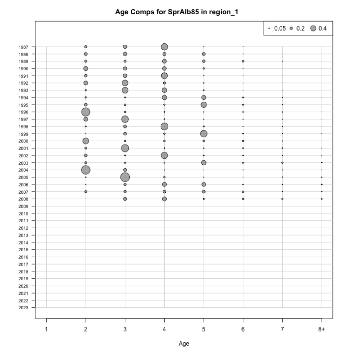
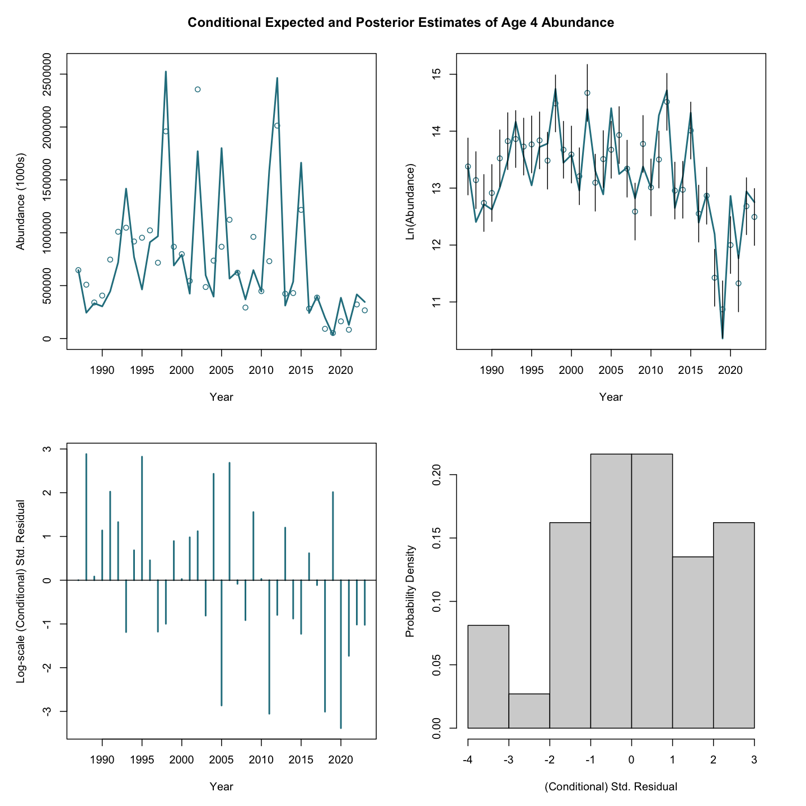
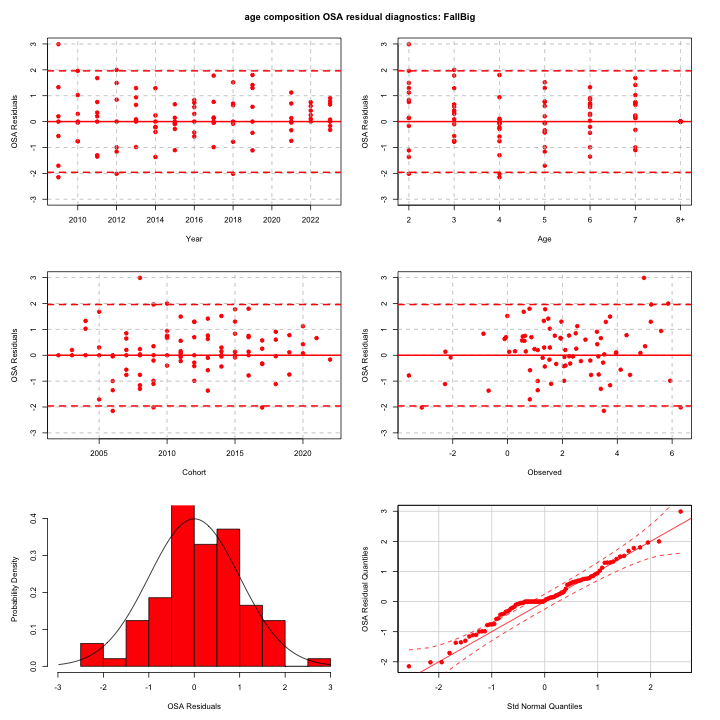
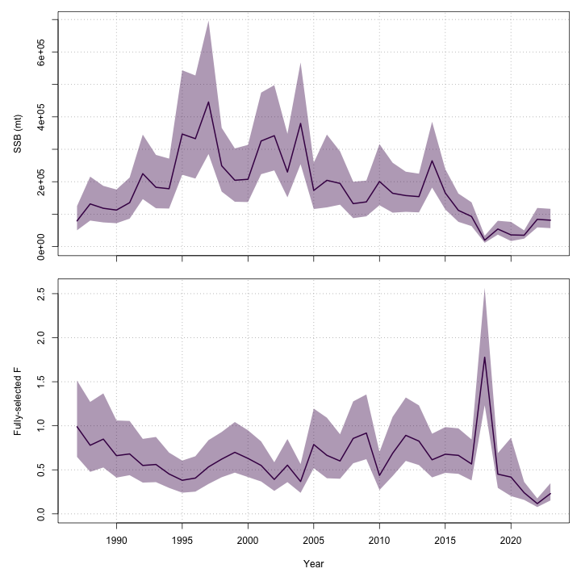
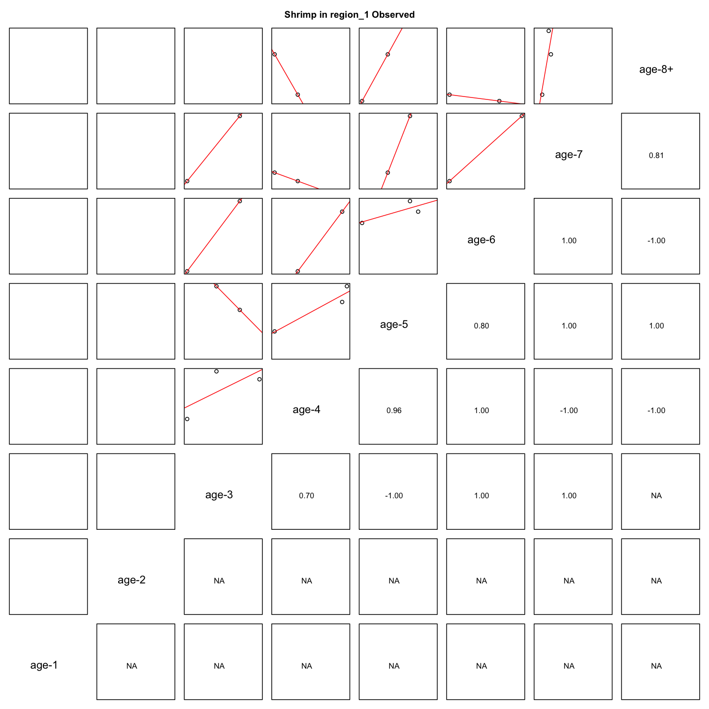

---
output:
  html_document:
    df_print: paged
    keep_md: yes
  word_document: default
  pdf_document:
    fig_caption: yes
    includes:
    keep_tex: yes
    number_sections: no
title: "WHAM figures and tables"
header-includes:
  - \usepackage{longtable}
  - \usepackage{booktabs}
  - \usepackage{caption,graphics}
  - \usepackage{makecell}
  - \usepackage{lscape}
  - \renewcommand\figurename{Fig.}
  - \captionsetup{labelsep=period, singlelinecheck=false}
  - \newcommand{\changesize}[1]{\fontsize{#1pt}{#1pt}\selectfont}
  - \renewcommand{\arraystretch}{1.5}
  - \renewcommand\theadfont{}
---

# {.tabset}

## Figures {.tabset}

### Input

### Diagnostics

### Results

### Retro

### Reference points

### Miscellaneous

## Tables {.tabset}

### Parameter estimates

<table class="table" style="margin-left: auto; margin-right: auto;">
<caption>Parameter estimates, standard errors, and confidence intervals. Rounded to 3 decimal places.</caption>
 <thead>
  <tr>
   <th style="text-align:left;">   </th>
   <th style="text-align:right;"> Estimate </th>
   <th style="text-align:right;"> Std. Error </th>
   <th style="text-align:right;"> 95\% CI lower </th>
   <th style="text-align:right;"> 95\% CI upper </th>
  </tr>
 </thead>
<tbody>
  <tr>
   <td style="text-align:left;"> stock 1 mean log(R) intercept </td>
   <td style="text-align:right;"> $5.846$ </td>
   <td style="text-align:right;"> $6.027$ </td>
   <td style="text-align:right;"> $-5.968$ </td>
   <td style="text-align:right;"> $17.660$ </td>
  </tr>
  <tr>
   <td style="text-align:left;"> stock 1 NAA $\sigma$ (age 1) </td>
   <td style="text-align:right;"> $0.790$ </td>
   <td style="text-align:right;"> $0.123$ </td>
   <td style="text-align:right;"> $0.582$ </td>
   <td style="text-align:right;"> $1.073$ </td>
  </tr>
  <tr>
   <td style="text-align:left;"> stock 1 NAA $\sigma$ (ages 2-8+) </td>
   <td style="text-align:right;"> $0.255$ </td>
   <td style="text-align:right;"> $0.044$ </td>
   <td style="text-align:right;"> $0.181$ </td>
   <td style="text-align:right;"> $0.359$ </td>
  </tr>
  <tr>
   <td style="text-align:left;"> stock 1   NAA AR1 $\rho$ age </td>
   <td style="text-align:right;"> $0.832$ </td>
   <td style="text-align:right;"> $0.064$ </td>
   <td style="text-align:right;"> $0.655$ </td>
   <td style="text-align:right;"> $0.922$ </td>
  </tr>
  <tr>
   <td style="text-align:left;"> Shrimp fully selected q </td>
   <td style="text-align:right;"> $1.274\times 10^{-5}$ </td>
   <td style="text-align:right;"> $2.014\times 10^{-6}$ </td>
   <td style="text-align:right;"> $9.341\times 10^{-6}$ </td>
   <td style="text-align:right;"> $1.736\times 10^{-5}$ </td>
  </tr>
  <tr>
   <td style="text-align:left;"> Acoust fully selected q </td>
   <td style="text-align:right;"> $3.511\times 10^{-5}$ </td>
   <td style="text-align:right;"> $6.127\times 10^{-6}$ </td>
   <td style="text-align:right;"> $2.494\times 10^{-5}$ </td>
   <td style="text-align:right;"> $4.943\times 10^{-5}$ </td>
  </tr>
  <tr>
   <td style="text-align:left;"> SprAlb85 fully selected q </td>
   <td style="text-align:right;"> $7.688\times 10^{-6}$ </td>
   <td style="text-align:right;"> $1.190\times 10^{-6}$ </td>
   <td style="text-align:right;"> $5.677\times 10^{-6}$ </td>
   <td style="text-align:right;"> $1.041\times 10^{-5}$ </td>
  </tr>
  <tr>
   <td style="text-align:left;"> FallAlb85 fully selected q </td>
   <td style="text-align:right;"> $1.210\times 10^{-5}$ </td>
   <td style="text-align:right;"> $2.239\times 10^{-6}$ </td>
   <td style="text-align:right;"> $8.419\times 10^{-6}$ </td>
   <td style="text-align:right;"> $1.739\times 10^{-5}$ </td>
  </tr>
  <tr>
   <td style="text-align:left;"> SprBig fully selected q </td>
   <td style="text-align:right;"> $4.479\times 10^{-5}$ </td>
   <td style="text-align:right;"> $7.772\times 10^{-6}$ </td>
   <td style="text-align:right;"> $3.188\times 10^{-5}$ </td>
   <td style="text-align:right;"> $6.293\times 10^{-5}$ </td>
  </tr>
  <tr>
   <td style="text-align:left;"> FallBig fully selected q </td>
   <td style="text-align:right;"> $7.477\times 10^{-5}$ </td>
   <td style="text-align:right;"> $1.999\times 10^{-5}$ </td>
   <td style="text-align:right;"> $4.428\times 10^{-5}$ </td>
   <td style="text-align:right;"> $1.263\times 10^{-4}$ </td>
  </tr>
  <tr>
   <td style="text-align:left;"> Block 1: Mobile Selectivity for age 1 </td>
   <td style="text-align:right;"> $3.547\times 10^{-4}$ </td>
   <td style="text-align:right;"> $9.005\times 10^{-5}$ </td>
   <td style="text-align:right;"> $2.156\times 10^{-4}$ </td>
   <td style="text-align:right;"> $5.834\times 10^{-4}$ </td>
  </tr>
  <tr>
   <td style="text-align:left;"> Block 1: Mobile Selectivity for age 2 </td>
   <td style="text-align:right;"> $0.089$ </td>
   <td style="text-align:right;"> $0.016$ </td>
   <td style="text-align:right;"> $0.062$ </td>
   <td style="text-align:right;"> $0.127$ </td>
  </tr>
  <tr>
   <td style="text-align:left;"> Block 1: Mobile Selectivity for age 3 </td>
   <td style="text-align:right;"> $0.342$ </td>
   <td style="text-align:right;"> $0.056$ </td>
   <td style="text-align:right;"> $0.242$ </td>
   <td style="text-align:right;"> $0.457$ </td>
  </tr>
  <tr>
   <td style="text-align:left;"> Block 1: Mobile Selectivity for age 4 </td>
   <td style="text-align:right;"> $0.446$ </td>
   <td style="text-align:right;"> $0.065$ </td>
   <td style="text-align:right;"> $0.325$ </td>
   <td style="text-align:right;"> $0.574$ </td>
  </tr>
  <tr>
   <td style="text-align:left;"> Block 1: Mobile Selectivity for age 5 </td>
   <td style="text-align:right;"> $0.539$ </td>
   <td style="text-align:right;"> $0.067$ </td>
   <td style="text-align:right;"> $0.409$ </td>
   <td style="text-align:right;"> $0.665$ </td>
  </tr>
  <tr>
   <td style="text-align:left;"> Block 1: Mobile Selectivity for age 6 </td>
   <td style="text-align:right;"> $0.717$ </td>
   <td style="text-align:right;"> $0.066$ </td>
   <td style="text-align:right;"> $0.572$ </td>
   <td style="text-align:right;"> $0.828$ </td>
  </tr>
  <tr>
   <td style="text-align:left;"> Block 1: Mobile Selectivity for age 7 </td>
   <td style="text-align:right;"> $1.000$ </td>
   <td style="text-align:right;"> -- </td>
   <td style="text-align:right;"> -- </td>
   <td style="text-align:right;"> -- </td>
  </tr>
  <tr>
   <td style="text-align:left;"> Block 1: Mobile Selectivity for age 8+ </td>
   <td style="text-align:right;"> $1.000$ </td>
   <td style="text-align:right;"> -- </td>
   <td style="text-align:right;"> -- </td>
   <td style="text-align:right;"> -- </td>
  </tr>
  <tr>
   <td style="text-align:left;"> Block 2: Fixed Selectivity for age 1 </td>
   <td style="text-align:right;"> $0.038$ </td>
   <td style="text-align:right;"> $0.007$ </td>
   <td style="text-align:right;"> $0.026$ </td>
   <td style="text-align:right;"> $0.053$ </td>
  </tr>
  <tr>
   <td style="text-align:left;"> Block 2: Fixed Selectivity for age 2 </td>
   <td style="text-align:right;"> $1.000$ </td>
   <td style="text-align:right;"> -- </td>
   <td style="text-align:right;"> -- </td>
   <td style="text-align:right;"> -- </td>
  </tr>
  <tr>
   <td style="text-align:left;"> Block 2: Fixed Selectivity for age 3 </td>
   <td style="text-align:right;"> $0.237$ </td>
   <td style="text-align:right;"> $0.038$ </td>
   <td style="text-align:right;"> $0.170$ </td>
   <td style="text-align:right;"> $0.320$ </td>
  </tr>
  <tr>
   <td style="text-align:left;"> Block 2: Fixed Selectivity for age 4 </td>
   <td style="text-align:right;"> $0.103$ </td>
   <td style="text-align:right;"> $0.024$ </td>
   <td style="text-align:right;"> $0.064$ </td>
   <td style="text-align:right;"> $0.160$ </td>
  </tr>
  <tr>
   <td style="text-align:left;"> Block 2: Fixed Selectivity for age 5 </td>
   <td style="text-align:right;"> $0.069$ </td>
   <td style="text-align:right;"> $0.019$ </td>
   <td style="text-align:right;"> $0.039$ </td>
   <td style="text-align:right;"> $0.117$ </td>
  </tr>
  <tr>
   <td style="text-align:left;"> Block 2: Fixed Selectivity for age 6 </td>
   <td style="text-align:right;"> $0.062$ </td>
   <td style="text-align:right;"> $0.019$ </td>
   <td style="text-align:right;"> $0.033$ </td>
   <td style="text-align:right;"> $0.112$ </td>
  </tr>
  <tr>
   <td style="text-align:left;"> Block 2: Fixed Selectivity for age 7 </td>
   <td style="text-align:right;"> $0.059$ </td>
   <td style="text-align:right;"> $0.020$ </td>
   <td style="text-align:right;"> $0.030$ </td>
   <td style="text-align:right;"> $0.112$ </td>
  </tr>
  <tr>
   <td style="text-align:left;"> Block 2: Fixed Selectivity for age 8+ </td>
   <td style="text-align:right;"> $0.041$ </td>
   <td style="text-align:right;"> $0.013$ </td>
   <td style="text-align:right;"> $0.021$ </td>
   <td style="text-align:right;"> $0.076$ </td>
  </tr>
  <tr>
   <td style="text-align:left;"> Block 3: Shrimp Selectivity for age 1 </td>
   <td style="text-align:right;"> $0.000$ </td>
   <td style="text-align:right;"> -- </td>
   <td style="text-align:right;"> -- </td>
   <td style="text-align:right;"> -- </td>
  </tr>
  <tr>
   <td style="text-align:left;"> Block 3: Shrimp Selectivity for age 2 </td>
   <td style="text-align:right;"> $0.000$ </td>
   <td style="text-align:right;"> -- </td>
   <td style="text-align:right;"> -- </td>
   <td style="text-align:right;"> -- </td>
  </tr>
  <tr>
   <td style="text-align:left;"> Block 3: Shrimp Selectivity for age 3 </td>
   <td style="text-align:right;"> $0.060$ </td>
   <td style="text-align:right;"> $0.027$ </td>
   <td style="text-align:right;"> $0.025$ </td>
   <td style="text-align:right;"> $0.139$ </td>
  </tr>
  <tr>
   <td style="text-align:left;"> Block 3: Shrimp Selectivity for age 4 </td>
   <td style="text-align:right;"> $1.000$ </td>
   <td style="text-align:right;"> -- </td>
   <td style="text-align:right;"> -- </td>
   <td style="text-align:right;"> -- </td>
  </tr>
  <tr>
   <td style="text-align:left;"> Block 3: Shrimp Selectivity for age 5 </td>
   <td style="text-align:right;"> $1.000$ </td>
   <td style="text-align:right;"> -- </td>
   <td style="text-align:right;"> -- </td>
   <td style="text-align:right;"> -- </td>
  </tr>
  <tr>
   <td style="text-align:left;"> Block 3: Shrimp Selectivity for age 6 </td>
   <td style="text-align:right;"> $1.000$ </td>
   <td style="text-align:right;"> -- </td>
   <td style="text-align:right;"> -- </td>
   <td style="text-align:right;"> -- </td>
  </tr>
  <tr>
   <td style="text-align:left;"> Block 3: Shrimp Selectivity for age 7 </td>
   <td style="text-align:right;"> $1.000$ </td>
   <td style="text-align:right;"> -- </td>
   <td style="text-align:right;"> -- </td>
   <td style="text-align:right;"> -- </td>
  </tr>
  <tr>
   <td style="text-align:left;"> Block 3: Shrimp Selectivity for age 8+ </td>
   <td style="text-align:right;"> $1.000$ </td>
   <td style="text-align:right;"> -- </td>
   <td style="text-align:right;"> -- </td>
   <td style="text-align:right;"> -- </td>
  </tr>
  <tr>
   <td style="text-align:left;"> Block 4: Acoust Selectivity for age 1 </td>
   <td style="text-align:right;"> $0.000$ </td>
   <td style="text-align:right;"> -- </td>
   <td style="text-align:right;"> -- </td>
   <td style="text-align:right;"> -- </td>
  </tr>
  <tr>
   <td style="text-align:left;"> Block 4: Acoust Selectivity for age 2 </td>
   <td style="text-align:right;"> $0.000$ </td>
   <td style="text-align:right;"> -- </td>
   <td style="text-align:right;"> -- </td>
   <td style="text-align:right;"> -- </td>
  </tr>
  <tr>
   <td style="text-align:left;"> Block 4: Acoust Selectivity for age 3 </td>
   <td style="text-align:right;"> $1.000$ </td>
   <td style="text-align:right;"> -- </td>
   <td style="text-align:right;"> -- </td>
   <td style="text-align:right;"> -- </td>
  </tr>
  <tr>
   <td style="text-align:left;"> Block 4: Acoust Selectivity for age 4 </td>
   <td style="text-align:right;"> $1.000$ </td>
   <td style="text-align:right;"> -- </td>
   <td style="text-align:right;"> -- </td>
   <td style="text-align:right;"> -- </td>
  </tr>
  <tr>
   <td style="text-align:left;"> Block 4: Acoust Selectivity for age 5 </td>
   <td style="text-align:right;"> $1.000$ </td>
   <td style="text-align:right;"> -- </td>
   <td style="text-align:right;"> -- </td>
   <td style="text-align:right;"> -- </td>
  </tr>
  <tr>
   <td style="text-align:left;"> Block 4: Acoust Selectivity for age 6 </td>
   <td style="text-align:right;"> $1.000$ </td>
   <td style="text-align:right;"> -- </td>
   <td style="text-align:right;"> -- </td>
   <td style="text-align:right;"> -- </td>
  </tr>
  <tr>
   <td style="text-align:left;"> Block 4: Acoust Selectivity for age 7 </td>
   <td style="text-align:right;"> $1.000$ </td>
   <td style="text-align:right;"> -- </td>
   <td style="text-align:right;"> -- </td>
   <td style="text-align:right;"> -- </td>
  </tr>
  <tr>
   <td style="text-align:left;"> Block 4: Acoust Selectivity for age 8+ </td>
   <td style="text-align:right;"> $1.000$ </td>
   <td style="text-align:right;"> -- </td>
   <td style="text-align:right;"> -- </td>
   <td style="text-align:right;"> -- </td>
  </tr>
  <tr>
   <td style="text-align:left;"> Block 5: SprAlb85 Selectivity for age 1 </td>
   <td style="text-align:right;"> $0.000$ </td>
   <td style="text-align:right;"> -- </td>
   <td style="text-align:right;"> -- </td>
   <td style="text-align:right;"> -- </td>
  </tr>
  <tr>
   <td style="text-align:left;"> Block 5: SprAlb85 Selectivity for age 2 </td>
   <td style="text-align:right;"> $0.338$ </td>
   <td style="text-align:right;"> $0.050$ </td>
   <td style="text-align:right;"> $0.247$ </td>
   <td style="text-align:right;"> $0.443$ </td>
  </tr>
  <tr>
   <td style="text-align:left;"> Block 5: SprAlb85 Selectivity for age 3 </td>
   <td style="text-align:right;"> $1.000$ </td>
   <td style="text-align:right;"> -- </td>
   <td style="text-align:right;"> -- </td>
   <td style="text-align:right;"> -- </td>
  </tr>
  <tr>
   <td style="text-align:left;"> Block 5: SprAlb85 Selectivity for age 4 </td>
   <td style="text-align:right;"> $1.000$ </td>
   <td style="text-align:right;"> -- </td>
   <td style="text-align:right;"> -- </td>
   <td style="text-align:right;"> -- </td>
  </tr>
  <tr>
   <td style="text-align:left;"> Block 5: SprAlb85 Selectivity for age 5 </td>
   <td style="text-align:right;"> $1.000$ </td>
   <td style="text-align:right;"> -- </td>
   <td style="text-align:right;"> -- </td>
   <td style="text-align:right;"> -- </td>
  </tr>
  <tr>
   <td style="text-align:left;"> Block 5: SprAlb85 Selectivity for age 6 </td>
   <td style="text-align:right;"> $1.000$ </td>
   <td style="text-align:right;"> -- </td>
   <td style="text-align:right;"> -- </td>
   <td style="text-align:right;"> -- </td>
  </tr>
  <tr>
   <td style="text-align:left;"> Block 5: SprAlb85 Selectivity for age 7 </td>
   <td style="text-align:right;"> $1.000$ </td>
   <td style="text-align:right;"> -- </td>
   <td style="text-align:right;"> -- </td>
   <td style="text-align:right;"> -- </td>
  </tr>
  <tr>
   <td style="text-align:left;"> Block 5: SprAlb85 Selectivity for age 8+ </td>
   <td style="text-align:right;"> $1.000$ </td>
   <td style="text-align:right;"> -- </td>
   <td style="text-align:right;"> -- </td>
   <td style="text-align:right;"> -- </td>
  </tr>
  <tr>
   <td style="text-align:left;"> Block 6: FallAlb85 $a_{50}$ </td>
   <td style="text-align:right;"> $2.753$ </td>
   <td style="text-align:right;"> $0.140$ </td>
   <td style="text-align:right;"> $2.486$ </td>
   <td style="text-align:right;"> $3.034$ </td>
  </tr>
  <tr>
   <td style="text-align:left;"> Block 6: FallAlb85 1/slope (increasing) </td>
   <td style="text-align:right;"> $0.354$ </td>
   <td style="text-align:right;"> $0.041$ </td>
   <td style="text-align:right;"> $0.281$ </td>
   <td style="text-align:right;"> $0.444$ </td>
  </tr>
  <tr>
   <td style="text-align:left;"> Block 7: SprBig Selectivity for age 1 </td>
   <td style="text-align:right;"> $0.000$ </td>
   <td style="text-align:right;"> -- </td>
   <td style="text-align:right;"> -- </td>
   <td style="text-align:right;"> -- </td>
  </tr>
  <tr>
   <td style="text-align:left;"> Block 7: SprBig Selectivity for age 2 </td>
   <td style="text-align:right;"> $0.147$ </td>
   <td style="text-align:right;"> $0.036$ </td>
   <td style="text-align:right;"> $0.089$ </td>
   <td style="text-align:right;"> $0.231$ </td>
  </tr>
  <tr>
   <td style="text-align:left;"> Block 7: SprBig Selectivity for age 3 </td>
   <td style="text-align:right;"> $0.603$ </td>
   <td style="text-align:right;"> $0.102$ </td>
   <td style="text-align:right;"> $0.397$ </td>
   <td style="text-align:right;"> $0.778$ </td>
  </tr>
  <tr>
   <td style="text-align:left;"> Block 7: SprBig Selectivity for age 4 </td>
   <td style="text-align:right;"> $1.000$ </td>
   <td style="text-align:right;"> -- </td>
   <td style="text-align:right;"> -- </td>
   <td style="text-align:right;"> -- </td>
  </tr>
  <tr>
   <td style="text-align:left;"> Block 7: SprBig Selectivity for age 5 </td>
   <td style="text-align:right;"> $1.000$ </td>
   <td style="text-align:right;"> -- </td>
   <td style="text-align:right;"> -- </td>
   <td style="text-align:right;"> -- </td>
  </tr>
  <tr>
   <td style="text-align:left;"> Block 7: SprBig Selectivity for age 6 </td>
   <td style="text-align:right;"> $1.000$ </td>
   <td style="text-align:right;"> -- </td>
   <td style="text-align:right;"> -- </td>
   <td style="text-align:right;"> -- </td>
  </tr>
  <tr>
   <td style="text-align:left;"> Block 7: SprBig Selectivity for age 7 </td>
   <td style="text-align:right;"> $1.000$ </td>
   <td style="text-align:right;"> -- </td>
   <td style="text-align:right;"> -- </td>
   <td style="text-align:right;"> -- </td>
  </tr>
  <tr>
   <td style="text-align:left;"> Block 7: SprBig Selectivity for age 8+ </td>
   <td style="text-align:right;"> $1.000$ </td>
   <td style="text-align:right;"> -- </td>
   <td style="text-align:right;"> -- </td>
   <td style="text-align:right;"> -- </td>
  </tr>
  <tr>
   <td style="text-align:left;"> Block 8: FallBig $a_{50}$ </td>
   <td style="text-align:right;"> $3.823$ </td>
   <td style="text-align:right;"> $0.300$ </td>
   <td style="text-align:right;"> $3.244$ </td>
   <td style="text-align:right;"> $4.411$ </td>
  </tr>
  <tr>
   <td style="text-align:left;"> Block 8: FallBig 1/slope (increasing) </td>
   <td style="text-align:right;"> $0.484$ </td>
   <td style="text-align:right;"> $0.064$ </td>
   <td style="text-align:right;"> $0.372$ </td>
   <td style="text-align:right;"> $0.627$ </td>
  </tr>
  <tr>
   <td style="text-align:left;"> Mobile in region 1 age comp, logistic-normal: $\sigma$ </td>
   <td style="text-align:right;"> $12.068$ </td>
   <td style="text-align:right;"> $1.349$ </td>
   <td style="text-align:right;"> $9.693$ </td>
   <td style="text-align:right;"> $15.025$ </td>
  </tr>
  <tr>
   <td style="text-align:left;"> Mobile in region 1 age comp, logistic-normal: $\rho$ </td>
   <td style="text-align:right;"> $0.825$ </td>
   <td style="text-align:right;"> $0.041$ </td>
   <td style="text-align:right;"> $0.731$ </td>
   <td style="text-align:right;"> $0.891$ </td>
  </tr>
  <tr>
   <td style="text-align:left;"> Fixed in region 1 age comp, logistic-normal: $\sigma$ </td>
   <td style="text-align:right;"> $25.967$ </td>
   <td style="text-align:right;"> $2.456$ </td>
   <td style="text-align:right;"> $21.573$ </td>
   <td style="text-align:right;"> $31.257$ </td>
  </tr>
  <tr>
   <td style="text-align:left;"> Fixed in region 1 age comp, logistic-normal: $\rho$ </td>
   <td style="text-align:right;"> $0.820$ </td>
   <td style="text-align:right;"> $0.036$ </td>
   <td style="text-align:right;"> $0.739$ </td>
   <td style="text-align:right;"> $0.880$ </td>
  </tr>
  <tr>
   <td style="text-align:left;"> Shrimp in region 1 age comp, logistic-normal: $\sigma$ </td>
   <td style="text-align:right;"> $23.027$ </td>
   <td style="text-align:right;"> $5.963$ </td>
   <td style="text-align:right;"> $13.861$ </td>
   <td style="text-align:right;"> $38.254$ </td>
  </tr>
  <tr>
   <td style="text-align:left;"> Shrimp in region 1 age comp, logistic-normal: $\rho$ </td>
   <td style="text-align:right;"> $0.810$ </td>
   <td style="text-align:right;"> $0.107$ </td>
   <td style="text-align:right;"> $0.523$ </td>
   <td style="text-align:right;"> $0.943$ </td>
  </tr>
  <tr>
   <td style="text-align:left;"> SprAlb85 in region 1 age comp, logistic-normal: $\sigma$ </td>
   <td style="text-align:right;"> $23.140$ </td>
   <td style="text-align:right;"> $3.147$ </td>
   <td style="text-align:right;"> $17.726$ </td>
   <td style="text-align:right;"> $30.208$ </td>
  </tr>
  <tr>
   <td style="text-align:left;"> SprAlb85 in region 1 age comp, logistic-normal: $\rho$ </td>
   <td style="text-align:right;"> $0.883$ </td>
   <td style="text-align:right;"> $0.035$ </td>
   <td style="text-align:right;"> $0.796$ </td>
   <td style="text-align:right;"> $0.936$ </td>
  </tr>
  <tr>
   <td style="text-align:left;"> FallAlb85 in region 1 age comp, logistic-normal: $\sigma$ </td>
   <td style="text-align:right;"> $23.207$ </td>
   <td style="text-align:right;"> $3.340$ </td>
   <td style="text-align:right;"> $17.504$ </td>
   <td style="text-align:right;"> $30.769$ </td>
  </tr>
  <tr>
   <td style="text-align:left;"> FallAlb85 in region 1 age comp, logistic-normal: $\rho$ </td>
   <td style="text-align:right;"> $0.936$ </td>
   <td style="text-align:right;"> $0.020$ </td>
   <td style="text-align:right;"> $0.883$ </td>
   <td style="text-align:right;"> $0.966$ </td>
  </tr>
  <tr>
   <td style="text-align:left;"> SprBig in region 1 age comp, logistic-normal: $\sigma$ </td>
   <td style="text-align:right;"> $15.516$ </td>
   <td style="text-align:right;"> $2.747$ </td>
   <td style="text-align:right;"> $10.967$ </td>
   <td style="text-align:right;"> $21.951$ </td>
  </tr>
  <tr>
   <td style="text-align:left;"> SprBig in region 1 age comp, logistic-normal: $\rho$ </td>
   <td style="text-align:right;"> $0.754$ </td>
   <td style="text-align:right;"> $0.094$ </td>
   <td style="text-align:right;"> $0.533$ </td>
   <td style="text-align:right;"> $0.892$ </td>
  </tr>
  <tr>
   <td style="text-align:left;"> FallBig in region 1 age comp, logistic-normal: $\sigma$ </td>
   <td style="text-align:right;"> $21.925$ </td>
   <td style="text-align:right;"> $3.693$ </td>
   <td style="text-align:right;"> $15.760$ </td>
   <td style="text-align:right;"> $30.501$ </td>
  </tr>
  <tr>
   <td style="text-align:left;"> FallBig in region 1 age comp, logistic-normal: $\rho$ </td>
   <td style="text-align:right;"> $0.848$ </td>
   <td style="text-align:right;"> $0.055$ </td>
   <td style="text-align:right;"> $0.706$ </td>
   <td style="text-align:right;"> $0.928$ </td>
  </tr>
  <tr>
   <td style="text-align:left;"> Ecov LarvalTempDuration: RW Ecov$_1$ </td>
   <td style="text-align:right;"> $4.495$ </td>
   <td style="text-align:right;"> $0.073$ </td>
   <td style="text-align:right;"> $4.352$ </td>
   <td style="text-align:right;"> $4.638$ </td>
  </tr>
  <tr>
   <td style="text-align:left;"> Ecov LarvalTempDuration: RW $\sigma$ </td>
   <td style="text-align:right;"> $0.036$ </td>
   <td style="text-align:right;"> $0.014$ </td>
   <td style="text-align:right;"> $0.018$ </td>
   <td style="text-align:right;"> $0.076$ </td>
  </tr>
  <tr>
   <td style="text-align:left;"> stock 1 Recruitment Ecov: LarvalTempDuration $\beta_1$ </td>
   <td style="text-align:right;"> $2.066$ </td>
   <td style="text-align:right;"> $1.389$ </td>
   <td style="text-align:right;"> $-0.657$ </td>
   <td style="text-align:right;"> $4.789$ </td>
  </tr>
  <tr>
   <td style="text-align:left;"> Ecov: LarvalTempDuration obs. sd. </td>
   <td style="text-align:right;"> $0.156$ </td>
   <td style="text-align:right;"> $0.019$ </td>
   <td style="text-align:right;"> $0.123$ </td>
   <td style="text-align:right;"> $0.197$ </td>
  </tr>
</tbody>
</table>

### Abundance at age

<table class="table" style="margin-left: auto; margin-right: auto;">
<caption>Abundance at age (1000s) for stock 1 in region 1.</caption>
 <thead>
  <tr>
   <th style="text-align:left;">   </th>
   <th style="text-align:right;"> 1 </th>
   <th style="text-align:right;"> 2 </th>
   <th style="text-align:right;"> 3 </th>
   <th style="text-align:right;"> 4 </th>
   <th style="text-align:right;"> 5 </th>
   <th style="text-align:right;"> 6 </th>
   <th style="text-align:right;"> 7 </th>
   <th style="text-align:right;"> 8+ </th>
  </tr>
 </thead>
<tbody>
  <tr>
   <td style="text-align:left;"> 1987 </td>
   <td style="text-align:right;"> 1742654 </td>
   <td style="text-align:right;"> 1152162 </td>
   <td style="text-align:right;"> 559290 </td>
   <td style="text-align:right;"> 646860 </td>
   <td style="text-align:right;"> 106343 </td>
   <td style="text-align:right;"> 50717 </td>
   <td style="text-align:right;"> 11524 </td>
   <td style="text-align:right;"> 5275 </td>
  </tr>
  <tr>
   <td style="text-align:left;"> 1988 </td>
   <td style="text-align:right;"> 3332501 </td>
   <td style="text-align:right;"> 1937122 </td>
   <td style="text-align:right;"> 687343 </td>
   <td style="text-align:right;"> 509061 </td>
   <td style="text-align:right;"> 581515 </td>
   <td style="text-align:right;"> 93720 </td>
   <td style="text-align:right;"> 31339 </td>
   <td style="text-align:right;"> 7437 </td>
  </tr>
  <tr>
   <td style="text-align:left;"> 1989 </td>
   <td style="text-align:right;"> 2840373 </td>
   <td style="text-align:right;"> 2304633 </td>
   <td style="text-align:right;"> 654915 </td>
   <td style="text-align:right;"> 340732 </td>
   <td style="text-align:right;"> 256566 </td>
   <td style="text-align:right;"> 328424 </td>
   <td style="text-align:right;"> 56247 </td>
   <td style="text-align:right;"> 20268 </td>
  </tr>
  <tr>
   <td style="text-align:left;"> 1990 </td>
   <td style="text-align:right;"> 2991027 </td>
   <td style="text-align:right;"> 2187063 </td>
   <td style="text-align:right;"> 871213 </td>
   <td style="text-align:right;"> 406135 </td>
   <td style="text-align:right;"> 198231 </td>
   <td style="text-align:right;"> 145993 </td>
   <td style="text-align:right;"> 195692 </td>
   <td style="text-align:right;"> 41964 </td>
  </tr>
  <tr>
   <td style="text-align:left;"> 1991 </td>
   <td style="text-align:right;"> 3313872 </td>
   <td style="text-align:right;"> 3243373 </td>
   <td style="text-align:right;"> 1358893 </td>
   <td style="text-align:right;"> 746304 </td>
   <td style="text-align:right;"> 279270 </td>
   <td style="text-align:right;"> 115679 </td>
   <td style="text-align:right;"> 80450 </td>
   <td style="text-align:right;"> 130936 </td>
  </tr>
  <tr>
   <td style="text-align:left;"> 1992 </td>
   <td style="text-align:right;"> 2510595 </td>
   <td style="text-align:right;"> 3346035 </td>
   <td style="text-align:right;"> 2561838 </td>
   <td style="text-align:right;"> 1009494 </td>
   <td style="text-align:right;"> 466830 </td>
   <td style="text-align:right;"> 159706 </td>
   <td style="text-align:right;"> 62111 </td>
   <td style="text-align:right;"> 102235 </td>
  </tr>
  <tr>
   <td style="text-align:left;"> 1993 </td>
   <td style="text-align:right;"> 2313752 </td>
   <td style="text-align:right;"> 1759125 </td>
   <td style="text-align:right;"> 1451888 </td>
   <td style="text-align:right;"> 1047708 </td>
   <td style="text-align:right;"> 481576 </td>
   <td style="text-align:right;"> 178377 </td>
   <td style="text-align:right;"> 58071 </td>
   <td style="text-align:right;"> 53239 </td>
  </tr>
  <tr>
   <td style="text-align:left;"> 1994 </td>
   <td style="text-align:right;"> 2191148 </td>
   <td style="text-align:right;"> 1980684 </td>
   <td style="text-align:right;"> 826376 </td>
   <td style="text-align:right;"> 917503 </td>
   <td style="text-align:right;"> 709087 </td>
   <td style="text-align:right;"> 345201 </td>
   <td style="text-align:right;"> 109380 </td>
   <td style="text-align:right;"> 56199 </td>
  </tr>
  <tr>
   <td style="text-align:left;"> 1995 </td>
   <td style="text-align:right;"> 11296642 </td>
   <td style="text-align:right;"> 2323844 </td>
   <td style="text-align:right;"> 1512892 </td>
   <td style="text-align:right;"> 953202 </td>
   <td style="text-align:right;"> 1238889 </td>
   <td style="text-align:right;"> 851616 </td>
   <td style="text-align:right;"> 346521 </td>
   <td style="text-align:right;"> 132498 </td>
  </tr>
  <tr>
   <td style="text-align:left;"> 1996 </td>
   <td style="text-align:right;"> 6502199 </td>
   <td style="text-align:right;"> 9633849 </td>
   <td style="text-align:right;"> 1591589 </td>
   <td style="text-align:right;"> 1022676 </td>
   <td style="text-align:right;"> 644879 </td>
   <td style="text-align:right;"> 739725 </td>
   <td style="text-align:right;"> 394640 </td>
   <td style="text-align:right;"> 179710 </td>
  </tr>
  <tr>
   <td style="text-align:left;"> 1997 </td>
   <td style="text-align:right;"> 3778231 </td>
   <td style="text-align:right;"> 3135082 </td>
   <td style="text-align:right;"> 4394616 </td>
   <td style="text-align:right;"> 716741 </td>
   <td style="text-align:right;"> 409417 </td>
   <td style="text-align:right;"> 274930 </td>
   <td style="text-align:right;"> 221316 </td>
   <td style="text-align:right;"> 138370 </td>
  </tr>
  <tr>
   <td style="text-align:left;"> 1998 </td>
   <td style="text-align:right;"> 1450537 </td>
   <td style="text-align:right;"> 2399006 </td>
   <td style="text-align:right;"> 1276742 </td>
   <td style="text-align:right;"> 1958799 </td>
   <td style="text-align:right;"> 406526 </td>
   <td style="text-align:right;"> 203009 </td>
   <td style="text-align:right;"> 130098 </td>
   <td style="text-align:right;"> 127042 </td>
  </tr>
  <tr>
   <td style="text-align:left;"> 1999 </td>
   <td style="text-align:right;"> 4662641 </td>
   <td style="text-align:right;"> 1263557 </td>
   <td style="text-align:right;"> 1501253 </td>
   <td style="text-align:right;"> 867548 </td>
   <td style="text-align:right;"> 1138465 </td>
   <td style="text-align:right;"> 259884 </td>
   <td style="text-align:right;"> 104035 </td>
   <td style="text-align:right;"> 95161 </td>
  </tr>
  <tr>
   <td style="text-align:left;"> 2000 </td>
   <td style="text-align:right;"> 2209603 </td>
   <td style="text-align:right;"> 4584210 </td>
   <td style="text-align:right;"> 757961 </td>
   <td style="text-align:right;"> 797979 </td>
   <td style="text-align:right;"> 556706 </td>
   <td style="text-align:right;"> 527143 </td>
   <td style="text-align:right;"> 113811 </td>
   <td style="text-align:right;"> 65296 </td>
  </tr>
  <tr>
   <td style="text-align:left;"> 2001 </td>
   <td style="text-align:right;"> 1765563 </td>
   <td style="text-align:right;"> 1551393 </td>
   <td style="text-align:right;"> 3150597 </td>
   <td style="text-align:right;"> 544817 </td>
   <td style="text-align:right;"> 550350 </td>
   <td style="text-align:right;"> 422791 </td>
   <td style="text-align:right;"> 315205 </td>
   <td style="text-align:right;"> 86540 </td>
  </tr>
  <tr>
   <td style="text-align:left;"> 2002 </td>
   <td style="text-align:right;"> 8022725 </td>
   <td style="text-align:right;"> 1603345 </td>
   <td style="text-align:right;"> 993934 </td>
   <td style="text-align:right;"> 2355616 </td>
   <td style="text-align:right;"> 528087 </td>
   <td style="text-align:right;"> 388827 </td>
   <td style="text-align:right;"> 225289 </td>
   <td style="text-align:right;"> 150520 </td>
  </tr>
  <tr>
   <td style="text-align:left;"> 2003 </td>
   <td style="text-align:right;"> 4957231 </td>
   <td style="text-align:right;"> 3196689 </td>
   <td style="text-align:right;"> 689162 </td>
   <td style="text-align:right;"> 486839 </td>
   <td style="text-align:right;"> 1125764 </td>
   <td style="text-align:right;"> 329153 </td>
   <td style="text-align:right;"> 197667 </td>
   <td style="text-align:right;"> 151532 </td>
  </tr>
  <tr>
   <td style="text-align:left;"> 2004 </td>
   <td style="text-align:right;"> 4288312 </td>
   <td style="text-align:right;"> 4858391 </td>
   <td style="text-align:right;"> 2962834 </td>
   <td style="text-align:right;"> 736593 </td>
   <td style="text-align:right;"> 466652 </td>
   <td style="text-align:right;"> 698105 </td>
   <td style="text-align:right;"> 208244 </td>
   <td style="text-align:right;"> 148052 </td>
  </tr>
  <tr>
   <td style="text-align:left;"> 2005 </td>
   <td style="text-align:right;"> 925589 </td>
   <td style="text-align:right;"> 1171406 </td>
   <td style="text-align:right;"> 1106250 </td>
   <td style="text-align:right;"> 867870 </td>
   <td style="text-align:right;"> 290544 </td>
   <td style="text-align:right;"> 186447 </td>
   <td style="text-align:right;"> 202855 </td>
   <td style="text-align:right;"> 89730 </td>
  </tr>
  <tr>
   <td style="text-align:left;"> 2006 </td>
   <td style="text-align:right;"> 4513544 </td>
   <td style="text-align:right;"> 1034359 </td>
   <td style="text-align:right;"> 1176436 </td>
   <td style="text-align:right;"> 1123015 </td>
   <td style="text-align:right;"> 694307 </td>
   <td style="text-align:right;"> 203497 </td>
   <td style="text-align:right;"> 100750 </td>
   <td style="text-align:right;"> 106775 </td>
  </tr>
  <tr>
   <td style="text-align:left;"> 2007 </td>
   <td style="text-align:right;"> 1224887 </td>
   <td style="text-align:right;"> 3366275 </td>
   <td style="text-align:right;"> 675622 </td>
   <td style="text-align:right;"> 622596 </td>
   <td style="text-align:right;"> 619350 </td>
   <td style="text-align:right;"> 381686 </td>
   <td style="text-align:right;"> 99132 </td>
   <td style="text-align:right;"> 76191 </td>
  </tr>
  <tr>
   <td style="text-align:left;"> 2008 </td>
   <td style="text-align:right;"> 2474947 </td>
   <td style="text-align:right;"> 590540 </td>
   <td style="text-align:right;"> 1274043 </td>
   <td style="text-align:right;"> 292966 </td>
   <td style="text-align:right;"> 222098 </td>
   <td style="text-align:right;"> 238246 </td>
   <td style="text-align:right;"> 151434 </td>
   <td style="text-align:right;"> 66086 </td>
  </tr>
  <tr>
   <td style="text-align:left;"> 2009 </td>
   <td style="text-align:right;"> 16400462 </td>
   <td style="text-align:right;"> 3691449 </td>
   <td style="text-align:right;"> 867423 </td>
   <td style="text-align:right;"> 961239 </td>
   <td style="text-align:right;"> 173058 </td>
   <td style="text-align:right;"> 119560 </td>
   <td style="text-align:right;"> 99613 </td>
   <td style="text-align:right;"> 66521 </td>
  </tr>
  <tr>
   <td style="text-align:left;"> 2010 </td>
   <td style="text-align:right;"> 2488931 </td>
   <td style="text-align:right;"> 15981450 </td>
   <td style="text-align:right;"> 2635003 </td>
   <td style="text-align:right;"> 447646 </td>
   <td style="text-align:right;"> 412995 </td>
   <td style="text-align:right;"> 68026 </td>
   <td style="text-align:right;"> 39599 </td>
   <td style="text-align:right;"> 37770 </td>
  </tr>
  <tr>
   <td style="text-align:left;"> 2011 </td>
   <td style="text-align:right;"> 2323156 </td>
   <td style="text-align:right;"> 1102743 </td>
   <td style="text-align:right;"> 4467752 </td>
   <td style="text-align:right;"> 731049 </td>
   <td style="text-align:right;"> 128810 </td>
   <td style="text-align:right;"> 94178 </td>
   <td style="text-align:right;"> 16540 </td>
   <td style="text-align:right;"> 16069 </td>
  </tr>
  <tr>
   <td style="text-align:left;"> 2012 </td>
   <td style="text-align:right;"> 7399741 </td>
   <td style="text-align:right;"> 1343511 </td>
   <td style="text-align:right;"> 601089 </td>
   <td style="text-align:right;"> 2012969 </td>
   <td style="text-align:right;"> 304462 </td>
   <td style="text-align:right;"> 55878 </td>
   <td style="text-align:right;"> 31370 </td>
   <td style="text-align:right;"> 9286 </td>
  </tr>
  <tr>
   <td style="text-align:left;"> 2013 </td>
   <td style="text-align:right;"> 2754845 </td>
   <td style="text-align:right;"> 6699656 </td>
   <td style="text-align:right;"> 1015329 </td>
   <td style="text-align:right;"> 423573 </td>
   <td style="text-align:right;"> 1025599 </td>
   <td style="text-align:right;"> 134452 </td>
   <td style="text-align:right;"> 21977 </td>
   <td style="text-align:right;"> 10322 </td>
  </tr>
  <tr>
   <td style="text-align:left;"> 2014 </td>
   <td style="text-align:right;"> 3069171 </td>
   <td style="text-align:right;"> 1183631 </td>
   <td style="text-align:right;"> 2923299 </td>
   <td style="text-align:right;"> 429743 </td>
   <td style="text-align:right;"> 228093 </td>
   <td style="text-align:right;"> 496919 </td>
   <td style="text-align:right;"> 60430 </td>
   <td style="text-align:right;"> 11453 </td>
  </tr>
  <tr>
   <td style="text-align:left;"> 2015 </td>
   <td style="text-align:right;"> 910445 </td>
   <td style="text-align:right;"> 1303670 </td>
   <td style="text-align:right;"> 433232 </td>
   <td style="text-align:right;"> 1216399 </td>
   <td style="text-align:right;"> 219939 </td>
   <td style="text-align:right;"> 150631 </td>
   <td style="text-align:right;"> 281050 </td>
   <td style="text-align:right;"> 34056 </td>
  </tr>
  <tr>
   <td style="text-align:left;"> 2016 </td>
   <td style="text-align:right;"> 362986 </td>
   <td style="text-align:right;"> 534616 </td>
   <td style="text-align:right;"> 729045 </td>
   <td style="text-align:right;"> 282551 </td>
   <td style="text-align:right;"> 620153 </td>
   <td style="text-align:right;"> 123736 </td>
   <td style="text-align:right;"> 83098 </td>
   <td style="text-align:right;"> 145974 </td>
  </tr>
  <tr>
   <td style="text-align:left;"> 2017 </td>
   <td style="text-align:right;"> 1697382 </td>
   <td style="text-align:right;"> 245452 </td>
   <td style="text-align:right;"> 347548 </td>
   <td style="text-align:right;"> 386929 </td>
   <td style="text-align:right;"> 171743 </td>
   <td style="text-align:right;"> 305431 </td>
   <td style="text-align:right;"> 57920 </td>
   <td style="text-align:right;"> 91379 </td>
  </tr>
  <tr>
   <td style="text-align:left;"> 2018 </td>
   <td style="text-align:right;"> 557723 </td>
   <td style="text-align:right;"> 834998 </td>
   <td style="text-align:right;"> 89517 </td>
   <td style="text-align:right;"> 91625 </td>
   <td style="text-align:right;"> 97291 </td>
   <td style="text-align:right;"> 52720 </td>
   <td style="text-align:right;"> 87324 </td>
   <td style="text-align:right;"> 43130 </td>
  </tr>
  <tr>
   <td style="text-align:left;"> 2019 </td>
   <td style="text-align:right;"> 5500383 </td>
   <td style="text-align:right;"> 674710 </td>
   <td style="text-align:right;"> 676581 </td>
   <td style="text-align:right;"> 52609 </td>
   <td style="text-align:right;"> 51003 </td>
   <td style="text-align:right;"> 47968 </td>
   <td style="text-align:right;"> 21898 </td>
   <td style="text-align:right;"> 31355 </td>
  </tr>
  <tr>
   <td style="text-align:left;"> 2020 </td>
   <td style="text-align:right;"> 2044288 </td>
   <td style="text-align:right;"> 1712680 </td>
   <td style="text-align:right;"> 214746 </td>
   <td style="text-align:right;"> 162771 </td>
   <td style="text-align:right;"> 11238 </td>
   <td style="text-align:right;"> 12649 </td>
   <td style="text-align:right;"> 12132 </td>
   <td style="text-align:right;"> 12444 </td>
  </tr>
  <tr>
   <td style="text-align:left;"> 2021 </td>
   <td style="text-align:right;"> 1173828 </td>
   <td style="text-align:right;"> 969308 </td>
   <td style="text-align:right;"> 662763 </td>
   <td style="text-align:right;"> 83021 </td>
   <td style="text-align:right;"> 46677 </td>
   <td style="text-align:right;"> 3813 </td>
   <td style="text-align:right;"> 3549 </td>
   <td style="text-align:right;"> 5548 </td>
  </tr>
  <tr>
   <td style="text-align:left;"> 2022 </td>
   <td style="text-align:right;"> 1379868 </td>
   <td style="text-align:right;"> 726295 </td>
   <td style="text-align:right;"> 519625 </td>
   <td style="text-align:right;"> 322017 </td>
   <td style="text-align:right;"> 50179 </td>
   <td style="text-align:right;"> 27412 </td>
   <td style="text-align:right;"> 2114 </td>
   <td style="text-align:right;"> 4475 </td>
  </tr>
  <tr>
   <td style="text-align:left;"> 2023 </td>
   <td style="text-align:right;"> 1806133 </td>
   <td style="text-align:right;"> 1044053 </td>
   <td style="text-align:right;"> 528979 </td>
   <td style="text-align:right;"> 266532 </td>
   <td style="text-align:right;"> 158158 </td>
   <td style="text-align:right;"> 26634 </td>
   <td style="text-align:right;"> 13457 </td>
   <td style="text-align:right;"> 3035 </td>
  </tr>
</tbody>
</table>

### Fishing mortality at age by region

<table class="table" style="margin-left: auto; margin-right: auto;">
<caption>Total fishing mortality at age in region 1.</caption>
 <thead>
  <tr>
   <th style="text-align:left;">   </th>
   <th style="text-align:right;"> 1 </th>
   <th style="text-align:right;"> 2 </th>
   <th style="text-align:right;"> 3 </th>
   <th style="text-align:right;"> 4 </th>
   <th style="text-align:right;"> 5 </th>
   <th style="text-align:right;"> 6 </th>
   <th style="text-align:right;"> 7 </th>
   <th style="text-align:right;"> 8+ </th>
  </tr>
 </thead>
<tbody>
  <tr>
   <td style="text-align:left;"> 1987 </td>
   <td style="text-align:right;"> 0.025 </td>
   <td style="text-align:right;"> 0.733 </td>
   <td style="text-align:right;"> 0.479 </td>
   <td style="text-align:right;"> 0.491 </td>
   <td style="text-align:right;"> 0.557 </td>
   <td style="text-align:right;"> 0.723 </td>
   <td style="text-align:right;"> 0.989 </td>
   <td style="text-align:right;"> 0.977 </td>
  </tr>
  <tr>
   <td style="text-align:left;"> 1988 </td>
   <td style="text-align:right;"> 0.028 </td>
   <td style="text-align:right;"> 0.779 </td>
   <td style="text-align:right;"> 0.373 </td>
   <td style="text-align:right;"> 0.337 </td>
   <td style="text-align:right;"> 0.367 </td>
   <td style="text-align:right;"> 0.467 </td>
   <td style="text-align:right;"> 0.630 </td>
   <td style="text-align:right;"> 0.617 </td>
  </tr>
  <tr>
   <td style="text-align:left;"> 1989 </td>
   <td style="text-align:right;"> 0.030 </td>
   <td style="text-align:right;"> 0.849 </td>
   <td style="text-align:right;"> 0.418 </td>
   <td style="text-align:right;"> 0.382 </td>
   <td style="text-align:right;"> 0.418 </td>
   <td style="text-align:right;"> 0.533 </td>
   <td style="text-align:right;"> 0.721 </td>
   <td style="text-align:right;"> 0.707 </td>
  </tr>
  <tr>
   <td style="text-align:left;"> 1990 </td>
   <td style="text-align:right;"> 0.023 </td>
   <td style="text-align:right;"> 0.661 </td>
   <td style="text-align:right;"> 0.320 </td>
   <td style="text-align:right;"> 0.291 </td>
   <td style="text-align:right;"> 0.317 </td>
   <td style="text-align:right;"> 0.404 </td>
   <td style="text-align:right;"> 0.547 </td>
   <td style="text-align:right;"> 0.535 </td>
  </tr>
  <tr>
   <td style="text-align:left;"> 1991 </td>
   <td style="text-align:right;"> 0.009 </td>
   <td style="text-align:right;"> 0.303 </td>
   <td style="text-align:right;"> 0.285 </td>
   <td style="text-align:right;"> 0.322 </td>
   <td style="text-align:right;"> 0.376 </td>
   <td style="text-align:right;"> 0.493 </td>
   <td style="text-align:right;"> 0.680 </td>
   <td style="text-align:right;"> 0.676 </td>
  </tr>
  <tr>
   <td style="text-align:left;"> 1992 </td>
   <td style="text-align:right;"> 0.010 </td>
   <td style="text-align:right;"> 0.298 </td>
   <td style="text-align:right;"> 0.242 </td>
   <td style="text-align:right;"> 0.264 </td>
   <td style="text-align:right;"> 0.306 </td>
   <td style="text-align:right;"> 0.399 </td>
   <td style="text-align:right;"> 0.550 </td>
   <td style="text-align:right;"> 0.545 </td>
  </tr>
  <tr>
   <td style="text-align:left;"> 1993 </td>
   <td style="text-align:right;"> 0.016 </td>
   <td style="text-align:right;"> 0.470 </td>
   <td style="text-align:right;"> 0.283 </td>
   <td style="text-align:right;"> 0.282 </td>
   <td style="text-align:right;"> 0.318 </td>
   <td style="text-align:right;"> 0.411 </td>
   <td style="text-align:right;"> 0.561 </td>
   <td style="text-align:right;"> 0.553 </td>
  </tr>
  <tr>
   <td style="text-align:left;"> 1994 </td>
   <td style="text-align:right;"> 0.013 </td>
   <td style="text-align:right;"> 0.370 </td>
   <td style="text-align:right;"> 0.227 </td>
   <td style="text-align:right;"> 0.227 </td>
   <td style="text-align:right;"> 0.256 </td>
   <td style="text-align:right;"> 0.331 </td>
   <td style="text-align:right;"> 0.453 </td>
   <td style="text-align:right;"> 0.447 </td>
  </tr>
  <tr>
   <td style="text-align:left;"> 1995 </td>
   <td style="text-align:right;"> 0.005 </td>
   <td style="text-align:right;"> 0.158 </td>
   <td style="text-align:right;"> 0.157 </td>
   <td style="text-align:right;"> 0.180 </td>
   <td style="text-align:right;"> 0.210 </td>
   <td style="text-align:right;"> 0.276 </td>
   <td style="text-align:right;"> 0.381 </td>
   <td style="text-align:right;"> 0.379 </td>
  </tr>
  <tr>
   <td style="text-align:left;"> 1996 </td>
   <td style="text-align:right;"> 0.002 </td>
   <td style="text-align:right;"> 0.078 </td>
   <td style="text-align:right;"> 0.148 </td>
   <td style="text-align:right;"> 0.184 </td>
   <td style="text-align:right;"> 0.221 </td>
   <td style="text-align:right;"> 0.292 </td>
   <td style="text-align:right;"> 0.406 </td>
   <td style="text-align:right;"> 0.406 </td>
  </tr>
  <tr>
   <td style="text-align:left;"> 1997 </td>
   <td style="text-align:right;"> 0.004 </td>
   <td style="text-align:right;"> 0.149 </td>
   <td style="text-align:right;"> 0.204 </td>
   <td style="text-align:right;"> 0.246 </td>
   <td style="text-align:right;"> 0.291 </td>
   <td style="text-align:right;"> 0.385 </td>
   <td style="text-align:right;"> 0.533 </td>
   <td style="text-align:right;"> 0.531 </td>
  </tr>
  <tr>
   <td style="text-align:left;"> 1998 </td>
   <td style="text-align:right;"> 0.009 </td>
   <td style="text-align:right;"> 0.292 </td>
   <td style="text-align:right;"> 0.264 </td>
   <td style="text-align:right;"> 0.295 </td>
   <td style="text-align:right;"> 0.344 </td>
   <td style="text-align:right;"> 0.451 </td>
   <td style="text-align:right;"> 0.622 </td>
   <td style="text-align:right;"> 0.617 </td>
  </tr>
  <tr>
   <td style="text-align:left;"> 1999 </td>
   <td style="text-align:right;"> 0.009 </td>
   <td style="text-align:right;"> 0.290 </td>
   <td style="text-align:right;"> 0.289 </td>
   <td style="text-align:right;"> 0.329 </td>
   <td style="text-align:right;"> 0.385 </td>
   <td style="text-align:right;"> 0.506 </td>
   <td style="text-align:right;"> 0.699 </td>
   <td style="text-align:right;"> 0.694 </td>
  </tr>
  <tr>
   <td style="text-align:left;"> 2000 </td>
   <td style="text-align:right;"> 0.003 </td>
   <td style="text-align:right;"> 0.124 </td>
   <td style="text-align:right;"> 0.230 </td>
   <td style="text-align:right;"> 0.286 </td>
   <td style="text-align:right;"> 0.342 </td>
   <td style="text-align:right;"> 0.453 </td>
   <td style="text-align:right;"> 0.630 </td>
   <td style="text-align:right;"> 0.628 </td>
  </tr>
  <tr>
   <td style="text-align:left;"> 2001 </td>
   <td style="text-align:right;"> 0.007 </td>
   <td style="text-align:right;"> 0.224 </td>
   <td style="text-align:right;"> 0.226 </td>
   <td style="text-align:right;"> 0.259 </td>
   <td style="text-align:right;"> 0.303 </td>
   <td style="text-align:right;"> 0.398 </td>
   <td style="text-align:right;"> 0.550 </td>
   <td style="text-align:right;"> 0.547 </td>
  </tr>
  <tr>
   <td style="text-align:left;"> 2002 </td>
   <td style="text-align:right;"> 0.004 </td>
   <td style="text-align:right;"> 0.145 </td>
   <td style="text-align:right;"> 0.158 </td>
   <td style="text-align:right;"> 0.183 </td>
   <td style="text-align:right;"> 0.215 </td>
   <td style="text-align:right;"> 0.283 </td>
   <td style="text-align:right;"> 0.391 </td>
   <td style="text-align:right;"> 0.389 </td>
  </tr>
  <tr>
   <td style="text-align:left;"> 2003 </td>
   <td style="text-align:right;"> 0.003 </td>
   <td style="text-align:right;"> 0.114 </td>
   <td style="text-align:right;"> 0.203 </td>
   <td style="text-align:right;"> 0.251 </td>
   <td style="text-align:right;"> 0.301 </td>
   <td style="text-align:right;"> 0.398 </td>
   <td style="text-align:right;"> 0.553 </td>
   <td style="text-align:right;"> 0.552 </td>
  </tr>
  <tr>
   <td style="text-align:left;"> 2004 </td>
   <td style="text-align:right;"> 0.004 </td>
   <td style="text-align:right;"> 0.136 </td>
   <td style="text-align:right;"> 0.148 </td>
   <td style="text-align:right;"> 0.172 </td>
   <td style="text-align:right;"> 0.202 </td>
   <td style="text-align:right;"> 0.266 </td>
   <td style="text-align:right;"> 0.367 </td>
   <td style="text-align:right;"> 0.366 </td>
  </tr>
  <tr>
   <td style="text-align:left;"> 2005 </td>
   <td style="text-align:right;"> 0.009 </td>
   <td style="text-align:right;"> 0.298 </td>
   <td style="text-align:right;"> 0.319 </td>
   <td style="text-align:right;"> 0.369 </td>
   <td style="text-align:right;"> 0.433 </td>
   <td style="text-align:right;"> 0.569 </td>
   <td style="text-align:right;"> 0.787 </td>
   <td style="text-align:right;"> 0.783 </td>
  </tr>
  <tr>
   <td style="text-align:left;"> 2006 </td>
   <td style="text-align:right;"> 0.007 </td>
   <td style="text-align:right;"> 0.234 </td>
   <td style="text-align:right;"> 0.265 </td>
   <td style="text-align:right;"> 0.310 </td>
   <td style="text-align:right;"> 0.365 </td>
   <td style="text-align:right;"> 0.480 </td>
   <td style="text-align:right;"> 0.664 </td>
   <td style="text-align:right;"> 0.661 </td>
  </tr>
  <tr>
   <td style="text-align:left;"> 2007 </td>
   <td style="text-align:right;"> 0.009 </td>
   <td style="text-align:right;"> 0.273 </td>
   <td style="text-align:right;"> 0.253 </td>
   <td style="text-align:right;"> 0.284 </td>
   <td style="text-align:right;"> 0.332 </td>
   <td style="text-align:right;"> 0.435 </td>
   <td style="text-align:right;"> 0.600 </td>
   <td style="text-align:right;"> 0.596 </td>
  </tr>
  <tr>
   <td style="text-align:left;"> 2008 </td>
   <td style="text-align:right;"> 0.007 </td>
   <td style="text-align:right;"> 0.241 </td>
   <td style="text-align:right;"> 0.328 </td>
   <td style="text-align:right;"> 0.394 </td>
   <td style="text-align:right;"> 0.468 </td>
   <td style="text-align:right;"> 0.618 </td>
   <td style="text-align:right;"> 0.856 </td>
   <td style="text-align:right;"> 0.853 </td>
  </tr>
  <tr>
   <td style="text-align:left;"> 2009 </td>
   <td style="text-align:right;"> 0.001 </td>
   <td style="text-align:right;"> 0.105 </td>
   <td style="text-align:right;"> 0.319 </td>
   <td style="text-align:right;"> 0.411 </td>
   <td style="text-align:right;"> 0.496 </td>
   <td style="text-align:right;"> 0.659 </td>
   <td style="text-align:right;"> 0.917 </td>
   <td style="text-align:right;"> 0.917 </td>
  </tr>
  <tr>
   <td style="text-align:left;"> 2010 </td>
   <td style="text-align:right;"> 0.001 </td>
   <td style="text-align:right;"> 0.063 </td>
   <td style="text-align:right;"> 0.154 </td>
   <td style="text-align:right;"> 0.196 </td>
   <td style="text-align:right;"> 0.236 </td>
   <td style="text-align:right;"> 0.314 </td>
   <td style="text-align:right;"> 0.436 </td>
   <td style="text-align:right;"> 0.436 </td>
  </tr>
  <tr>
   <td style="text-align:left;"> 2011 </td>
   <td style="text-align:right;"> 0.002 </td>
   <td style="text-align:right;"> 0.107 </td>
   <td style="text-align:right;"> 0.245 </td>
   <td style="text-align:right;"> 0.310 </td>
   <td style="text-align:right;"> 0.373 </td>
   <td style="text-align:right;"> 0.495 </td>
   <td style="text-align:right;"> 0.688 </td>
   <td style="text-align:right;"> 0.687 </td>
  </tr>
  <tr>
   <td style="text-align:left;"> 2012 </td>
   <td style="text-align:right;"> 0.001 </td>
   <td style="text-align:right;"> 0.086 </td>
   <td style="text-align:right;"> 0.306 </td>
   <td style="text-align:right;"> 0.398 </td>
   <td style="text-align:right;"> 0.481 </td>
   <td style="text-align:right;"> 0.640 </td>
   <td style="text-align:right;"> 0.891 </td>
   <td style="text-align:right;"> 0.891 </td>
  </tr>
  <tr>
   <td style="text-align:left;"> 2013 </td>
   <td style="text-align:right;"> 0.001 </td>
   <td style="text-align:right;"> 0.093 </td>
   <td style="text-align:right;"> 0.286 </td>
   <td style="text-align:right;"> 0.370 </td>
   <td style="text-align:right;"> 0.446 </td>
   <td style="text-align:right;"> 0.593 </td>
   <td style="text-align:right;"> 0.826 </td>
   <td style="text-align:right;"> 0.826 </td>
  </tr>
  <tr>
   <td style="text-align:left;"> 2014 </td>
   <td style="text-align:right;"> 0.001 </td>
   <td style="text-align:right;"> 0.077 </td>
   <td style="text-align:right;"> 0.215 </td>
   <td style="text-align:right;"> 0.275 </td>
   <td style="text-align:right;"> 0.332 </td>
   <td style="text-align:right;"> 0.441 </td>
   <td style="text-align:right;"> 0.614 </td>
   <td style="text-align:right;"> 0.613 </td>
  </tr>
  <tr>
   <td style="text-align:left;"> 2015 </td>
   <td style="text-align:right;"> 0.001 </td>
   <td style="text-align:right;"> 0.074 </td>
   <td style="text-align:right;"> 0.234 </td>
   <td style="text-align:right;"> 0.303 </td>
   <td style="text-align:right;"> 0.366 </td>
   <td style="text-align:right;"> 0.486 </td>
   <td style="text-align:right;"> 0.677 </td>
   <td style="text-align:right;"> 0.677 </td>
  </tr>
  <tr>
   <td style="text-align:left;"> 2016 </td>
   <td style="text-align:right;"> 0.005 </td>
   <td style="text-align:right;"> 0.188 </td>
   <td style="text-align:right;"> 0.255 </td>
   <td style="text-align:right;"> 0.306 </td>
   <td style="text-align:right;"> 0.363 </td>
   <td style="text-align:right;"> 0.479 </td>
   <td style="text-align:right;"> 0.664 </td>
   <td style="text-align:right;"> 0.662 </td>
  </tr>
  <tr>
   <td style="text-align:left;"> 2017 </td>
   <td style="text-align:right;"> 0.004 </td>
   <td style="text-align:right;"> 0.160 </td>
   <td style="text-align:right;"> 0.217 </td>
   <td style="text-align:right;"> 0.261 </td>
   <td style="text-align:right;"> 0.309 </td>
   <td style="text-align:right;"> 0.408 </td>
   <td style="text-align:right;"> 0.566 </td>
   <td style="text-align:right;"> 0.564 </td>
  </tr>
  <tr>
   <td style="text-align:left;"> 2018 </td>
   <td style="text-align:right;"> 0.016 </td>
   <td style="text-align:right;"> 0.557 </td>
   <td style="text-align:right;"> 0.694 </td>
   <td style="text-align:right;"> 0.823 </td>
   <td style="text-align:right;"> 0.973 </td>
   <td style="text-align:right;"> 1.283 </td>
   <td style="text-align:right;"> 1.778 </td>
   <td style="text-align:right;"> 1.771 </td>
  </tr>
  <tr>
   <td style="text-align:left;"> 2019 </td>
   <td style="text-align:right;"> 0.010 </td>
   <td style="text-align:right;"> 0.310 </td>
   <td style="text-align:right;"> 0.213 </td>
   <td style="text-align:right;"> 0.222 </td>
   <td style="text-align:right;"> 0.253 </td>
   <td style="text-align:right;"> 0.329 </td>
   <td style="text-align:right;"> 0.451 </td>
   <td style="text-align:right;"> 0.446 </td>
  </tr>
  <tr>
   <td style="text-align:left;"> 2020 </td>
   <td style="text-align:right;"> 0.003 </td>
   <td style="text-align:right;"> 0.116 </td>
   <td style="text-align:right;"> 0.160 </td>
   <td style="text-align:right;"> 0.192 </td>
   <td style="text-align:right;"> 0.228 </td>
   <td style="text-align:right;"> 0.301 </td>
   <td style="text-align:right;"> 0.417 </td>
   <td style="text-align:right;"> 0.416 </td>
  </tr>
  <tr>
   <td style="text-align:left;"> 2021 </td>
   <td style="text-align:right;"> 0.006 </td>
   <td style="text-align:right;"> 0.165 </td>
   <td style="text-align:right;"> 0.113 </td>
   <td style="text-align:right;"> 0.118 </td>
   <td style="text-align:right;"> 0.135 </td>
   <td style="text-align:right;"> 0.175 </td>
   <td style="text-align:right;"> 0.240 </td>
   <td style="text-align:right;"> 0.238 </td>
  </tr>
  <tr>
   <td style="text-align:left;"> 2022 </td>
   <td style="text-align:right;"> 0.003 </td>
   <td style="text-align:right;"> 0.093 </td>
   <td style="text-align:right;"> 0.058 </td>
   <td style="text-align:right;"> 0.058 </td>
   <td style="text-align:right;"> 0.066 </td>
   <td style="text-align:right;"> 0.085 </td>
   <td style="text-align:right;"> 0.117 </td>
   <td style="text-align:right;"> 0.115 </td>
  </tr>
  <tr>
   <td style="text-align:left;"> 2023 </td>
   <td style="text-align:right;"> 0.001 </td>
   <td style="text-align:right;"> 0.039 </td>
   <td style="text-align:right;"> 0.083 </td>
   <td style="text-align:right;"> 0.104 </td>
   <td style="text-align:right;"> 0.125 </td>
   <td style="text-align:right;"> 0.165 </td>
   <td style="text-align:right;"> 0.230 </td>
   <td style="text-align:right;"> 0.230 </td>
  </tr>
</tbody>
</table>

### Fishing mortality at age by fleet

<table class="table" style="margin-left: auto; margin-right: auto;">
<caption>Total fishing mortality at age in Mobile.</caption>
 <thead>
  <tr>
   <th style="text-align:left;">   </th>
   <th style="text-align:right;"> 1 </th>
   <th style="text-align:right;"> 2 </th>
   <th style="text-align:right;"> 3 </th>
   <th style="text-align:right;"> 4 </th>
   <th style="text-align:right;"> 5 </th>
   <th style="text-align:right;"> 6 </th>
   <th style="text-align:right;"> 7 </th>
   <th style="text-align:right;"> 8+ </th>
  </tr>
 </thead>
<tbody>
  <tr>
   <td style="text-align:left;"> 1987 </td>
   <td style="text-align:right;"> 0.000 </td>
   <td style="text-align:right;"> 0.085 </td>
   <td style="text-align:right;"> 0.325 </td>
   <td style="text-align:right;"> 0.424 </td>
   <td style="text-align:right;"> 0.513 </td>
   <td style="text-align:right;"> 0.682 </td>
   <td style="text-align:right;"> 0.951 </td>
   <td style="text-align:right;"> 0.951 </td>
  </tr>
  <tr>
   <td style="text-align:left;"> 1988 </td>
   <td style="text-align:right;"> 0.000 </td>
   <td style="text-align:right;"> 0.053 </td>
   <td style="text-align:right;"> 0.201 </td>
   <td style="text-align:right;"> 0.262 </td>
   <td style="text-align:right;"> 0.317 </td>
   <td style="text-align:right;"> 0.422 </td>
   <td style="text-align:right;"> 0.588 </td>
   <td style="text-align:right;"> 0.588 </td>
  </tr>
  <tr>
   <td style="text-align:left;"> 1989 </td>
   <td style="text-align:right;"> 0.000 </td>
   <td style="text-align:right;"> 0.060 </td>
   <td style="text-align:right;"> 0.231 </td>
   <td style="text-align:right;"> 0.301 </td>
   <td style="text-align:right;"> 0.364 </td>
   <td style="text-align:right;"> 0.484 </td>
   <td style="text-align:right;"> 0.675 </td>
   <td style="text-align:right;"> 0.675 </td>
  </tr>
  <tr>
   <td style="text-align:left;"> 1990 </td>
   <td style="text-align:right;"> 0.000 </td>
   <td style="text-align:right;"> 0.046 </td>
   <td style="text-align:right;"> 0.174 </td>
   <td style="text-align:right;"> 0.228 </td>
   <td style="text-align:right;"> 0.275 </td>
   <td style="text-align:right;"> 0.366 </td>
   <td style="text-align:right;"> 0.510 </td>
   <td style="text-align:right;"> 0.510 </td>
  </tr>
  <tr>
   <td style="text-align:left;"> 1991 </td>
   <td style="text-align:right;"> 0.000 </td>
   <td style="text-align:right;"> 0.060 </td>
   <td style="text-align:right;"> 0.228 </td>
   <td style="text-align:right;"> 0.297 </td>
   <td style="text-align:right;"> 0.359 </td>
   <td style="text-align:right;"> 0.478 </td>
   <td style="text-align:right;"> 0.666 </td>
   <td style="text-align:right;"> 0.666 </td>
  </tr>
  <tr>
   <td style="text-align:left;"> 1992 </td>
   <td style="text-align:right;"> 0.000 </td>
   <td style="text-align:right;"> 0.048 </td>
   <td style="text-align:right;"> 0.183 </td>
   <td style="text-align:right;"> 0.239 </td>
   <td style="text-align:right;"> 0.288 </td>
   <td style="text-align:right;"> 0.384 </td>
   <td style="text-align:right;"> 0.535 </td>
   <td style="text-align:right;"> 0.535 </td>
  </tr>
  <tr>
   <td style="text-align:left;"> 1993 </td>
   <td style="text-align:right;"> 0.000 </td>
   <td style="text-align:right;"> 0.048 </td>
   <td style="text-align:right;"> 0.183 </td>
   <td style="text-align:right;"> 0.239 </td>
   <td style="text-align:right;"> 0.289 </td>
   <td style="text-align:right;"> 0.384 </td>
   <td style="text-align:right;"> 0.536 </td>
   <td style="text-align:right;"> 0.536 </td>
  </tr>
  <tr>
   <td style="text-align:left;"> 1994 </td>
   <td style="text-align:right;"> 0.000 </td>
   <td style="text-align:right;"> 0.039 </td>
   <td style="text-align:right;"> 0.148 </td>
   <td style="text-align:right;"> 0.193 </td>
   <td style="text-align:right;"> 0.234 </td>
   <td style="text-align:right;"> 0.311 </td>
   <td style="text-align:right;"> 0.433 </td>
   <td style="text-align:right;"> 0.433 </td>
  </tr>
  <tr>
   <td style="text-align:left;"> 1995 </td>
   <td style="text-align:right;"> 0.000 </td>
   <td style="text-align:right;"> 0.033 </td>
   <td style="text-align:right;"> 0.128 </td>
   <td style="text-align:right;"> 0.167 </td>
   <td style="text-align:right;"> 0.202 </td>
   <td style="text-align:right;"> 0.268 </td>
   <td style="text-align:right;"> 0.374 </td>
   <td style="text-align:right;"> 0.374 </td>
  </tr>
  <tr>
   <td style="text-align:left;"> 1996 </td>
   <td style="text-align:right;"> 0.000 </td>
   <td style="text-align:right;"> 0.036 </td>
   <td style="text-align:right;"> 0.138 </td>
   <td style="text-align:right;"> 0.180 </td>
   <td style="text-align:right;"> 0.218 </td>
   <td style="text-align:right;"> 0.290 </td>
   <td style="text-align:right;"> 0.404 </td>
   <td style="text-align:right;"> 0.404 </td>
  </tr>
  <tr>
   <td style="text-align:left;"> 1997 </td>
   <td style="text-align:right;"> 0.000 </td>
   <td style="text-align:right;"> 0.047 </td>
   <td style="text-align:right;"> 0.180 </td>
   <td style="text-align:right;"> 0.235 </td>
   <td style="text-align:right;"> 0.284 </td>
   <td style="text-align:right;"> 0.378 </td>
   <td style="text-align:right;"> 0.527 </td>
   <td style="text-align:right;"> 0.527 </td>
  </tr>
  <tr>
   <td style="text-align:left;"> 1998 </td>
   <td style="text-align:right;"> 0.000 </td>
   <td style="text-align:right;"> 0.054 </td>
   <td style="text-align:right;"> 0.208 </td>
   <td style="text-align:right;"> 0.271 </td>
   <td style="text-align:right;"> 0.328 </td>
   <td style="text-align:right;"> 0.436 </td>
   <td style="text-align:right;"> 0.608 </td>
   <td style="text-align:right;"> 0.608 </td>
  </tr>
  <tr>
   <td style="text-align:left;"> 1999 </td>
   <td style="text-align:right;"> 0.000 </td>
   <td style="text-align:right;"> 0.061 </td>
   <td style="text-align:right;"> 0.234 </td>
   <td style="text-align:right;"> 0.305 </td>
   <td style="text-align:right;"> 0.369 </td>
   <td style="text-align:right;"> 0.492 </td>
   <td style="text-align:right;"> 0.685 </td>
   <td style="text-align:right;"> 0.685 </td>
  </tr>
  <tr>
   <td style="text-align:left;"> 2000 </td>
   <td style="text-align:right;"> 0.000 </td>
   <td style="text-align:right;"> 0.056 </td>
   <td style="text-align:right;"> 0.214 </td>
   <td style="text-align:right;"> 0.279 </td>
   <td style="text-align:right;"> 0.337 </td>
   <td style="text-align:right;"> 0.449 </td>
   <td style="text-align:right;"> 0.626 </td>
   <td style="text-align:right;"> 0.626 </td>
  </tr>
  <tr>
   <td style="text-align:left;"> 2001 </td>
   <td style="text-align:right;"> 0.000 </td>
   <td style="text-align:right;"> 0.048 </td>
   <td style="text-align:right;"> 0.184 </td>
   <td style="text-align:right;"> 0.241 </td>
   <td style="text-align:right;"> 0.291 </td>
   <td style="text-align:right;"> 0.387 </td>
   <td style="text-align:right;"> 0.539 </td>
   <td style="text-align:right;"> 0.539 </td>
  </tr>
  <tr>
   <td style="text-align:left;"> 2002 </td>
   <td style="text-align:right;"> 0.000 </td>
   <td style="text-align:right;"> 0.034 </td>
   <td style="text-align:right;"> 0.131 </td>
   <td style="text-align:right;"> 0.171 </td>
   <td style="text-align:right;"> 0.207 </td>
   <td style="text-align:right;"> 0.276 </td>
   <td style="text-align:right;"> 0.384 </td>
   <td style="text-align:right;"> 0.384 </td>
  </tr>
  <tr>
   <td style="text-align:left;"> 2003 </td>
   <td style="text-align:right;"> 0.000 </td>
   <td style="text-align:right;"> 0.049 </td>
   <td style="text-align:right;"> 0.188 </td>
   <td style="text-align:right;"> 0.245 </td>
   <td style="text-align:right;"> 0.296 </td>
   <td style="text-align:right;"> 0.394 </td>
   <td style="text-align:right;"> 0.549 </td>
   <td style="text-align:right;"> 0.549 </td>
  </tr>
  <tr>
   <td style="text-align:left;"> 2004 </td>
   <td style="text-align:right;"> 0.000 </td>
   <td style="text-align:right;"> 0.032 </td>
   <td style="text-align:right;"> 0.123 </td>
   <td style="text-align:right;"> 0.161 </td>
   <td style="text-align:right;"> 0.195 </td>
   <td style="text-align:right;"> 0.259 </td>
   <td style="text-align:right;"> 0.361 </td>
   <td style="text-align:right;"> 0.361 </td>
  </tr>
  <tr>
   <td style="text-align:left;"> 2005 </td>
   <td style="text-align:right;"> 0.000 </td>
   <td style="text-align:right;"> 0.069 </td>
   <td style="text-align:right;"> 0.265 </td>
   <td style="text-align:right;"> 0.345 </td>
   <td style="text-align:right;"> 0.417 </td>
   <td style="text-align:right;"> 0.555 </td>
   <td style="text-align:right;"> 0.774 </td>
   <td style="text-align:right;"> 0.774 </td>
  </tr>
  <tr>
   <td style="text-align:left;"> 2006 </td>
   <td style="text-align:right;"> 0.000 </td>
   <td style="text-align:right;"> 0.058 </td>
   <td style="text-align:right;"> 0.224 </td>
   <td style="text-align:right;"> 0.292 </td>
   <td style="text-align:right;"> 0.353 </td>
   <td style="text-align:right;"> 0.469 </td>
   <td style="text-align:right;"> 0.654 </td>
   <td style="text-align:right;"> 0.654 </td>
  </tr>
  <tr>
   <td style="text-align:left;"> 2007 </td>
   <td style="text-align:right;"> 0.000 </td>
   <td style="text-align:right;"> 0.052 </td>
   <td style="text-align:right;"> 0.201 </td>
   <td style="text-align:right;"> 0.262 </td>
   <td style="text-align:right;"> 0.317 </td>
   <td style="text-align:right;"> 0.421 </td>
   <td style="text-align:right;"> 0.587 </td>
   <td style="text-align:right;"> 0.587 </td>
  </tr>
  <tr>
   <td style="text-align:left;"> 2008 </td>
   <td style="text-align:right;"> 0.000 </td>
   <td style="text-align:right;"> 0.076 </td>
   <td style="text-align:right;"> 0.289 </td>
   <td style="text-align:right;"> 0.377 </td>
   <td style="text-align:right;"> 0.456 </td>
   <td style="text-align:right;"> 0.607 </td>
   <td style="text-align:right;"> 0.847 </td>
   <td style="text-align:right;"> 0.847 </td>
  </tr>
  <tr>
   <td style="text-align:left;"> 2009 </td>
   <td style="text-align:right;"> 0.000 </td>
   <td style="text-align:right;"> 0.082 </td>
   <td style="text-align:right;"> 0.313 </td>
   <td style="text-align:right;"> 0.408 </td>
   <td style="text-align:right;"> 0.494 </td>
   <td style="text-align:right;"> 0.657 </td>
   <td style="text-align:right;"> 0.916 </td>
   <td style="text-align:right;"> 0.916 </td>
  </tr>
  <tr>
   <td style="text-align:left;"> 2010 </td>
   <td style="text-align:right;"> 0.000 </td>
   <td style="text-align:right;"> 0.039 </td>
   <td style="text-align:right;"> 0.149 </td>
   <td style="text-align:right;"> 0.194 </td>
   <td style="text-align:right;"> 0.235 </td>
   <td style="text-align:right;"> 0.312 </td>
   <td style="text-align:right;"> 0.435 </td>
   <td style="text-align:right;"> 0.435 </td>
  </tr>
  <tr>
   <td style="text-align:left;"> 2011 </td>
   <td style="text-align:right;"> 0.000 </td>
   <td style="text-align:right;"> 0.061 </td>
   <td style="text-align:right;"> 0.234 </td>
   <td style="text-align:right;"> 0.306 </td>
   <td style="text-align:right;"> 0.369 </td>
   <td style="text-align:right;"> 0.492 </td>
   <td style="text-align:right;"> 0.685 </td>
   <td style="text-align:right;"> 0.685 </td>
  </tr>
  <tr>
   <td style="text-align:left;"> 2012 </td>
   <td style="text-align:right;"> 0.000 </td>
   <td style="text-align:right;"> 0.080 </td>
   <td style="text-align:right;"> 0.305 </td>
   <td style="text-align:right;"> 0.397 </td>
   <td style="text-align:right;"> 0.480 </td>
   <td style="text-align:right;"> 0.639 </td>
   <td style="text-align:right;"> 0.891 </td>
   <td style="text-align:right;"> 0.891 </td>
  </tr>
  <tr>
   <td style="text-align:left;"> 2013 </td>
   <td style="text-align:right;"> 0.000 </td>
   <td style="text-align:right;"> 0.074 </td>
   <td style="text-align:right;"> 0.282 </td>
   <td style="text-align:right;"> 0.368 </td>
   <td style="text-align:right;"> 0.445 </td>
   <td style="text-align:right;"> 0.592 </td>
   <td style="text-align:right;"> 0.825 </td>
   <td style="text-align:right;"> 0.825 </td>
  </tr>
  <tr>
   <td style="text-align:left;"> 2014 </td>
   <td style="text-align:right;"> 0.000 </td>
   <td style="text-align:right;"> 0.055 </td>
   <td style="text-align:right;"> 0.209 </td>
   <td style="text-align:right;"> 0.273 </td>
   <td style="text-align:right;"> 0.330 </td>
   <td style="text-align:right;"> 0.439 </td>
   <td style="text-align:right;"> 0.613 </td>
   <td style="text-align:right;"> 0.613 </td>
  </tr>
  <tr>
   <td style="text-align:left;"> 2015 </td>
   <td style="text-align:right;"> 0.000 </td>
   <td style="text-align:right;"> 0.060 </td>
   <td style="text-align:right;"> 0.231 </td>
   <td style="text-align:right;"> 0.302 </td>
   <td style="text-align:right;"> 0.365 </td>
   <td style="text-align:right;"> 0.485 </td>
   <td style="text-align:right;"> 0.676 </td>
   <td style="text-align:right;"> 0.676 </td>
  </tr>
  <tr>
   <td style="text-align:left;"> 2016 </td>
   <td style="text-align:right;"> 0.000 </td>
   <td style="text-align:right;"> 0.059 </td>
   <td style="text-align:right;"> 0.224 </td>
   <td style="text-align:right;"> 0.293 </td>
   <td style="text-align:right;"> 0.354 </td>
   <td style="text-align:right;"> 0.471 </td>
   <td style="text-align:right;"> 0.657 </td>
   <td style="text-align:right;"> 0.657 </td>
  </tr>
  <tr>
   <td style="text-align:left;"> 2017 </td>
   <td style="text-align:right;"> 0.000 </td>
   <td style="text-align:right;"> 0.050 </td>
   <td style="text-align:right;"> 0.191 </td>
   <td style="text-align:right;"> 0.250 </td>
   <td style="text-align:right;"> 0.302 </td>
   <td style="text-align:right;"> 0.402 </td>
   <td style="text-align:right;"> 0.560 </td>
   <td style="text-align:right;"> 0.560 </td>
  </tr>
  <tr>
   <td style="text-align:left;"> 2018 </td>
   <td style="text-align:right;"> 0.001 </td>
   <td style="text-align:right;"> 0.157 </td>
   <td style="text-align:right;"> 0.600 </td>
   <td style="text-align:right;"> 0.782 </td>
   <td style="text-align:right;"> 0.946 </td>
   <td style="text-align:right;"> 1.259 </td>
   <td style="text-align:right;"> 1.754 </td>
   <td style="text-align:right;"> 1.754 </td>
  </tr>
  <tr>
   <td style="text-align:left;"> 2019 </td>
   <td style="text-align:right;"> 0.000 </td>
   <td style="text-align:right;"> 0.039 </td>
   <td style="text-align:right;"> 0.149 </td>
   <td style="text-align:right;"> 0.194 </td>
   <td style="text-align:right;"> 0.234 </td>
   <td style="text-align:right;"> 0.312 </td>
   <td style="text-align:right;"> 0.435 </td>
   <td style="text-align:right;"> 0.435 </td>
  </tr>
  <tr>
   <td style="text-align:left;"> 2020 </td>
   <td style="text-align:right;"> 0.000 </td>
   <td style="text-align:right;"> 0.037 </td>
   <td style="text-align:right;"> 0.141 </td>
   <td style="text-align:right;"> 0.184 </td>
   <td style="text-align:right;"> 0.223 </td>
   <td style="text-align:right;"> 0.296 </td>
   <td style="text-align:right;"> 0.413 </td>
   <td style="text-align:right;"> 0.413 </td>
  </tr>
  <tr>
   <td style="text-align:left;"> 2021 </td>
   <td style="text-align:right;"> 0.000 </td>
   <td style="text-align:right;"> 0.021 </td>
   <td style="text-align:right;"> 0.079 </td>
   <td style="text-align:right;"> 0.103 </td>
   <td style="text-align:right;"> 0.125 </td>
   <td style="text-align:right;"> 0.166 </td>
   <td style="text-align:right;"> 0.232 </td>
   <td style="text-align:right;"> 0.232 </td>
  </tr>
  <tr>
   <td style="text-align:left;"> 2022 </td>
   <td style="text-align:right;"> 0.000 </td>
   <td style="text-align:right;"> 0.010 </td>
   <td style="text-align:right;"> 0.038 </td>
   <td style="text-align:right;"> 0.050 </td>
   <td style="text-align:right;"> 0.060 </td>
   <td style="text-align:right;"> 0.080 </td>
   <td style="text-align:right;"> 0.112 </td>
   <td style="text-align:right;"> 0.112 </td>
  </tr>
  <tr>
   <td style="text-align:left;"> 2023 </td>
   <td style="text-align:right;"> 0.000 </td>
   <td style="text-align:right;"> 0.020 </td>
   <td style="text-align:right;"> 0.078 </td>
   <td style="text-align:right;"> 0.102 </td>
   <td style="text-align:right;"> 0.123 </td>
   <td style="text-align:right;"> 0.164 </td>
   <td style="text-align:right;"> 0.229 </td>
   <td style="text-align:right;"> 0.229 </td>
  </tr>
</tbody>
</table>

<table class="table" style="margin-left: auto; margin-right: auto;">
<caption>Total fishing mortality at age in Fixed.</caption>
 <thead>
  <tr>
   <th style="text-align:left;">   </th>
   <th style="text-align:right;"> 1 </th>
   <th style="text-align:right;"> 2 </th>
   <th style="text-align:right;"> 3 </th>
   <th style="text-align:right;"> 4 </th>
   <th style="text-align:right;"> 5 </th>
   <th style="text-align:right;"> 6 </th>
   <th style="text-align:right;"> 7 </th>
   <th style="text-align:right;"> 8+ </th>
  </tr>
 </thead>
<tbody>
  <tr>
   <td style="text-align:left;"> 1987 </td>
   <td style="text-align:right;"> 0.024 </td>
   <td style="text-align:right;"> 0.648 </td>
   <td style="text-align:right;"> 0.154 </td>
   <td style="text-align:right;"> 0.066 </td>
   <td style="text-align:right;"> 0.044 </td>
   <td style="text-align:right;"> 0.040 </td>
   <td style="text-align:right;"> 0.038 </td>
   <td style="text-align:right;"> 0.026 </td>
  </tr>
  <tr>
   <td style="text-align:left;"> 1988 </td>
   <td style="text-align:right;"> 0.027 </td>
   <td style="text-align:right;"> 0.726 </td>
   <td style="text-align:right;"> 0.172 </td>
   <td style="text-align:right;"> 0.075 </td>
   <td style="text-align:right;"> 0.050 </td>
   <td style="text-align:right;"> 0.045 </td>
   <td style="text-align:right;"> 0.043 </td>
   <td style="text-align:right;"> 0.029 </td>
  </tr>
  <tr>
   <td style="text-align:left;"> 1989 </td>
   <td style="text-align:right;"> 0.030 </td>
   <td style="text-align:right;"> 0.788 </td>
   <td style="text-align:right;"> 0.187 </td>
   <td style="text-align:right;"> 0.081 </td>
   <td style="text-align:right;"> 0.054 </td>
   <td style="text-align:right;"> 0.049 </td>
   <td style="text-align:right;"> 0.046 </td>
   <td style="text-align:right;"> 0.032 </td>
  </tr>
  <tr>
   <td style="text-align:left;"> 1990 </td>
   <td style="text-align:right;"> 0.023 </td>
   <td style="text-align:right;"> 0.615 </td>
   <td style="text-align:right;"> 0.146 </td>
   <td style="text-align:right;"> 0.063 </td>
   <td style="text-align:right;"> 0.042 </td>
   <td style="text-align:right;"> 0.038 </td>
   <td style="text-align:right;"> 0.036 </td>
   <td style="text-align:right;"> 0.025 </td>
  </tr>
  <tr>
   <td style="text-align:left;"> 1991 </td>
   <td style="text-align:right;"> 0.009 </td>
   <td style="text-align:right;"> 0.244 </td>
   <td style="text-align:right;"> 0.058 </td>
   <td style="text-align:right;"> 0.025 </td>
   <td style="text-align:right;"> 0.017 </td>
   <td style="text-align:right;"> 0.015 </td>
   <td style="text-align:right;"> 0.014 </td>
   <td style="text-align:right;"> 0.010 </td>
  </tr>
  <tr>
   <td style="text-align:left;"> 1992 </td>
   <td style="text-align:right;"> 0.009 </td>
   <td style="text-align:right;"> 0.250 </td>
   <td style="text-align:right;"> 0.059 </td>
   <td style="text-align:right;"> 0.026 </td>
   <td style="text-align:right;"> 0.017 </td>
   <td style="text-align:right;"> 0.015 </td>
   <td style="text-align:right;"> 0.015 </td>
   <td style="text-align:right;"> 0.010 </td>
  </tr>
  <tr>
   <td style="text-align:left;"> 1993 </td>
   <td style="text-align:right;"> 0.016 </td>
   <td style="text-align:right;"> 0.422 </td>
   <td style="text-align:right;"> 0.100 </td>
   <td style="text-align:right;"> 0.043 </td>
   <td style="text-align:right;"> 0.029 </td>
   <td style="text-align:right;"> 0.026 </td>
   <td style="text-align:right;"> 0.025 </td>
   <td style="text-align:right;"> 0.017 </td>
  </tr>
  <tr>
   <td style="text-align:left;"> 1994 </td>
   <td style="text-align:right;"> 0.012 </td>
   <td style="text-align:right;"> 0.331 </td>
   <td style="text-align:right;"> 0.079 </td>
   <td style="text-align:right;"> 0.034 </td>
   <td style="text-align:right;"> 0.023 </td>
   <td style="text-align:right;"> 0.021 </td>
   <td style="text-align:right;"> 0.020 </td>
   <td style="text-align:right;"> 0.013 </td>
  </tr>
  <tr>
   <td style="text-align:left;"> 1995 </td>
   <td style="text-align:right;"> 0.005 </td>
   <td style="text-align:right;"> 0.125 </td>
   <td style="text-align:right;"> 0.030 </td>
   <td style="text-align:right;"> 0.013 </td>
   <td style="text-align:right;"> 0.009 </td>
   <td style="text-align:right;"> 0.008 </td>
   <td style="text-align:right;"> 0.007 </td>
   <td style="text-align:right;"> 0.005 </td>
  </tr>
  <tr>
   <td style="text-align:left;"> 1996 </td>
   <td style="text-align:right;"> 0.002 </td>
   <td style="text-align:right;"> 0.042 </td>
   <td style="text-align:right;"> 0.010 </td>
   <td style="text-align:right;"> 0.004 </td>
   <td style="text-align:right;"> 0.003 </td>
   <td style="text-align:right;"> 0.003 </td>
   <td style="text-align:right;"> 0.002 </td>
   <td style="text-align:right;"> 0.002 </td>
  </tr>
  <tr>
   <td style="text-align:left;"> 1997 </td>
   <td style="text-align:right;"> 0.004 </td>
   <td style="text-align:right;"> 0.102 </td>
   <td style="text-align:right;"> 0.024 </td>
   <td style="text-align:right;"> 0.010 </td>
   <td style="text-align:right;"> 0.007 </td>
   <td style="text-align:right;"> 0.006 </td>
   <td style="text-align:right;"> 0.006 </td>
   <td style="text-align:right;"> 0.004 </td>
  </tr>
  <tr>
   <td style="text-align:left;"> 1998 </td>
   <td style="text-align:right;"> 0.009 </td>
   <td style="text-align:right;"> 0.238 </td>
   <td style="text-align:right;"> 0.056 </td>
   <td style="text-align:right;"> 0.024 </td>
   <td style="text-align:right;"> 0.016 </td>
   <td style="text-align:right;"> 0.015 </td>
   <td style="text-align:right;"> 0.014 </td>
   <td style="text-align:right;"> 0.010 </td>
  </tr>
  <tr>
   <td style="text-align:left;"> 1999 </td>
   <td style="text-align:right;"> 0.009 </td>
   <td style="text-align:right;"> 0.229 </td>
   <td style="text-align:right;"> 0.054 </td>
   <td style="text-align:right;"> 0.024 </td>
   <td style="text-align:right;"> 0.016 </td>
   <td style="text-align:right;"> 0.014 </td>
   <td style="text-align:right;"> 0.014 </td>
   <td style="text-align:right;"> 0.009 </td>
  </tr>
  <tr>
   <td style="text-align:left;"> 2000 </td>
   <td style="text-align:right;"> 0.003 </td>
   <td style="text-align:right;"> 0.068 </td>
   <td style="text-align:right;"> 0.016 </td>
   <td style="text-align:right;"> 0.007 </td>
   <td style="text-align:right;"> 0.005 </td>
   <td style="text-align:right;"> 0.004 </td>
   <td style="text-align:right;"> 0.004 </td>
   <td style="text-align:right;"> 0.003 </td>
  </tr>
  <tr>
   <td style="text-align:left;"> 2001 </td>
   <td style="text-align:right;"> 0.007 </td>
   <td style="text-align:right;"> 0.176 </td>
   <td style="text-align:right;"> 0.042 </td>
   <td style="text-align:right;"> 0.018 </td>
   <td style="text-align:right;"> 0.012 </td>
   <td style="text-align:right;"> 0.011 </td>
   <td style="text-align:right;"> 0.010 </td>
   <td style="text-align:right;"> 0.007 </td>
  </tr>
  <tr>
   <td style="text-align:left;"> 2002 </td>
   <td style="text-align:right;"> 0.004 </td>
   <td style="text-align:right;"> 0.111 </td>
   <td style="text-align:right;"> 0.026 </td>
   <td style="text-align:right;"> 0.011 </td>
   <td style="text-align:right;"> 0.008 </td>
   <td style="text-align:right;"> 0.007 </td>
   <td style="text-align:right;"> 0.007 </td>
   <td style="text-align:right;"> 0.004 </td>
  </tr>
  <tr>
   <td style="text-align:left;"> 2003 </td>
   <td style="text-align:right;"> 0.002 </td>
   <td style="text-align:right;"> 0.065 </td>
   <td style="text-align:right;"> 0.015 </td>
   <td style="text-align:right;"> 0.007 </td>
   <td style="text-align:right;"> 0.004 </td>
   <td style="text-align:right;"> 0.004 </td>
   <td style="text-align:right;"> 0.004 </td>
   <td style="text-align:right;"> 0.003 </td>
  </tr>
  <tr>
   <td style="text-align:left;"> 2004 </td>
   <td style="text-align:right;"> 0.004 </td>
   <td style="text-align:right;"> 0.104 </td>
   <td style="text-align:right;"> 0.025 </td>
   <td style="text-align:right;"> 0.011 </td>
   <td style="text-align:right;"> 0.007 </td>
   <td style="text-align:right;"> 0.006 </td>
   <td style="text-align:right;"> 0.006 </td>
   <td style="text-align:right;"> 0.004 </td>
  </tr>
  <tr>
   <td style="text-align:left;"> 2005 </td>
   <td style="text-align:right;"> 0.009 </td>
   <td style="text-align:right;"> 0.228 </td>
   <td style="text-align:right;"> 0.054 </td>
   <td style="text-align:right;"> 0.023 </td>
   <td style="text-align:right;"> 0.016 </td>
   <td style="text-align:right;"> 0.014 </td>
   <td style="text-align:right;"> 0.013 </td>
   <td style="text-align:right;"> 0.009 </td>
  </tr>
  <tr>
   <td style="text-align:left;"> 2006 </td>
   <td style="text-align:right;"> 0.007 </td>
   <td style="text-align:right;"> 0.176 </td>
   <td style="text-align:right;"> 0.042 </td>
   <td style="text-align:right;"> 0.018 </td>
   <td style="text-align:right;"> 0.012 </td>
   <td style="text-align:right;"> 0.011 </td>
   <td style="text-align:right;"> 0.010 </td>
   <td style="text-align:right;"> 0.007 </td>
  </tr>
  <tr>
   <td style="text-align:left;"> 2007 </td>
   <td style="text-align:right;"> 0.008 </td>
   <td style="text-align:right;"> 0.220 </td>
   <td style="text-align:right;"> 0.052 </td>
   <td style="text-align:right;"> 0.023 </td>
   <td style="text-align:right;"> 0.015 </td>
   <td style="text-align:right;"> 0.014 </td>
   <td style="text-align:right;"> 0.013 </td>
   <td style="text-align:right;"> 0.009 </td>
  </tr>
  <tr>
   <td style="text-align:left;"> 2008 </td>
   <td style="text-align:right;"> 0.006 </td>
   <td style="text-align:right;"> 0.165 </td>
   <td style="text-align:right;"> 0.039 </td>
   <td style="text-align:right;"> 0.017 </td>
   <td style="text-align:right;"> 0.011 </td>
   <td style="text-align:right;"> 0.010 </td>
   <td style="text-align:right;"> 0.010 </td>
   <td style="text-align:right;"> 0.007 </td>
  </tr>
  <tr>
   <td style="text-align:left;"> 2009 </td>
   <td style="text-align:right;"> 0.001 </td>
   <td style="text-align:right;"> 0.023 </td>
   <td style="text-align:right;"> 0.006 </td>
   <td style="text-align:right;"> 0.002 </td>
   <td style="text-align:right;"> 0.002 </td>
   <td style="text-align:right;"> 0.001 </td>
   <td style="text-align:right;"> 0.001 </td>
   <td style="text-align:right;"> 0.001 </td>
  </tr>
  <tr>
   <td style="text-align:left;"> 2010 </td>
   <td style="text-align:right;"> 0.001 </td>
   <td style="text-align:right;"> 0.024 </td>
   <td style="text-align:right;"> 0.006 </td>
   <td style="text-align:right;"> 0.002 </td>
   <td style="text-align:right;"> 0.002 </td>
   <td style="text-align:right;"> 0.001 </td>
   <td style="text-align:right;"> 0.001 </td>
   <td style="text-align:right;"> 0.001 </td>
  </tr>
  <tr>
   <td style="text-align:left;"> 2011 </td>
   <td style="text-align:right;"> 0.002 </td>
   <td style="text-align:right;"> 0.046 </td>
   <td style="text-align:right;"> 0.011 </td>
   <td style="text-align:right;"> 0.005 </td>
   <td style="text-align:right;"> 0.003 </td>
   <td style="text-align:right;"> 0.003 </td>
   <td style="text-align:right;"> 0.003 </td>
   <td style="text-align:right;"> 0.002 </td>
  </tr>
  <tr>
   <td style="text-align:left;"> 2012 </td>
   <td style="text-align:right;"> 0.000 </td>
   <td style="text-align:right;"> 0.007 </td>
   <td style="text-align:right;"> 0.002 </td>
   <td style="text-align:right;"> 0.001 </td>
   <td style="text-align:right;"> 0.000 </td>
   <td style="text-align:right;"> 0.000 </td>
   <td style="text-align:right;"> 0.000 </td>
   <td style="text-align:right;"> 0.000 </td>
  </tr>
  <tr>
   <td style="text-align:left;"> 2013 </td>
   <td style="text-align:right;"> 0.001 </td>
   <td style="text-align:right;"> 0.019 </td>
   <td style="text-align:right;"> 0.004 </td>
   <td style="text-align:right;"> 0.002 </td>
   <td style="text-align:right;"> 0.001 </td>
   <td style="text-align:right;"> 0.001 </td>
   <td style="text-align:right;"> 0.001 </td>
   <td style="text-align:right;"> 0.001 </td>
  </tr>
  <tr>
   <td style="text-align:left;"> 2014 </td>
   <td style="text-align:right;"> 0.001 </td>
   <td style="text-align:right;"> 0.022 </td>
   <td style="text-align:right;"> 0.005 </td>
   <td style="text-align:right;"> 0.002 </td>
   <td style="text-align:right;"> 0.001 </td>
   <td style="text-align:right;"> 0.001 </td>
   <td style="text-align:right;"> 0.001 </td>
   <td style="text-align:right;"> 0.001 </td>
  </tr>
  <tr>
   <td style="text-align:left;"> 2015 </td>
   <td style="text-align:right;"> 0.001 </td>
   <td style="text-align:right;"> 0.013 </td>
   <td style="text-align:right;"> 0.003 </td>
   <td style="text-align:right;"> 0.001 </td>
   <td style="text-align:right;"> 0.001 </td>
   <td style="text-align:right;"> 0.001 </td>
   <td style="text-align:right;"> 0.001 </td>
   <td style="text-align:right;"> 0.001 </td>
  </tr>
  <tr>
   <td style="text-align:left;"> 2016 </td>
   <td style="text-align:right;"> 0.005 </td>
   <td style="text-align:right;"> 0.129 </td>
   <td style="text-align:right;"> 0.031 </td>
   <td style="text-align:right;"> 0.013 </td>
   <td style="text-align:right;"> 0.009 </td>
   <td style="text-align:right;"> 0.008 </td>
   <td style="text-align:right;"> 0.008 </td>
   <td style="text-align:right;"> 0.005 </td>
  </tr>
  <tr>
   <td style="text-align:left;"> 2017 </td>
   <td style="text-align:right;"> 0.004 </td>
   <td style="text-align:right;"> 0.110 </td>
   <td style="text-align:right;"> 0.026 </td>
   <td style="text-align:right;"> 0.011 </td>
   <td style="text-align:right;"> 0.008 </td>
   <td style="text-align:right;"> 0.007 </td>
   <td style="text-align:right;"> 0.006 </td>
   <td style="text-align:right;"> 0.004 </td>
  </tr>
  <tr>
   <td style="text-align:left;"> 2018 </td>
   <td style="text-align:right;"> 0.015 </td>
   <td style="text-align:right;"> 0.400 </td>
   <td style="text-align:right;"> 0.095 </td>
   <td style="text-align:right;"> 0.041 </td>
   <td style="text-align:right;"> 0.027 </td>
   <td style="text-align:right;"> 0.025 </td>
   <td style="text-align:right;"> 0.024 </td>
   <td style="text-align:right;"> 0.016 </td>
  </tr>
  <tr>
   <td style="text-align:left;"> 2019 </td>
   <td style="text-align:right;"> 0.010 </td>
   <td style="text-align:right;"> 0.271 </td>
   <td style="text-align:right;"> 0.064 </td>
   <td style="text-align:right;"> 0.028 </td>
   <td style="text-align:right;"> 0.019 </td>
   <td style="text-align:right;"> 0.017 </td>
   <td style="text-align:right;"> 0.016 </td>
   <td style="text-align:right;"> 0.011 </td>
  </tr>
  <tr>
   <td style="text-align:left;"> 2020 </td>
   <td style="text-align:right;"> 0.003 </td>
   <td style="text-align:right;"> 0.079 </td>
   <td style="text-align:right;"> 0.019 </td>
   <td style="text-align:right;"> 0.008 </td>
   <td style="text-align:right;"> 0.005 </td>
   <td style="text-align:right;"> 0.005 </td>
   <td style="text-align:right;"> 0.005 </td>
   <td style="text-align:right;"> 0.003 </td>
  </tr>
  <tr>
   <td style="text-align:left;"> 2021 </td>
   <td style="text-align:right;"> 0.005 </td>
   <td style="text-align:right;"> 0.144 </td>
   <td style="text-align:right;"> 0.034 </td>
   <td style="text-align:right;"> 0.015 </td>
   <td style="text-align:right;"> 0.010 </td>
   <td style="text-align:right;"> 0.009 </td>
   <td style="text-align:right;"> 0.008 </td>
   <td style="text-align:right;"> 0.006 </td>
  </tr>
  <tr>
   <td style="text-align:left;"> 2022 </td>
   <td style="text-align:right;"> 0.003 </td>
   <td style="text-align:right;"> 0.083 </td>
   <td style="text-align:right;"> 0.020 </td>
   <td style="text-align:right;"> 0.008 </td>
   <td style="text-align:right;"> 0.006 </td>
   <td style="text-align:right;"> 0.005 </td>
   <td style="text-align:right;"> 0.005 </td>
   <td style="text-align:right;"> 0.003 </td>
  </tr>
  <tr>
   <td style="text-align:left;"> 2023 </td>
   <td style="text-align:right;"> 0.001 </td>
   <td style="text-align:right;"> 0.019 </td>
   <td style="text-align:right;"> 0.004 </td>
   <td style="text-align:right;"> 0.002 </td>
   <td style="text-align:right;"> 0.001 </td>
   <td style="text-align:right;"> 0.001 </td>
   <td style="text-align:right;"> 0.001 </td>
   <td style="text-align:right;"> 0.001 </td>
  </tr>
</tbody>
</table>
