---
output:
  html_document:
    df_print: paged
    keep_md: yes
  word_document: default
  pdf_document:
    fig_caption: yes
    includes:
    keep_tex: yes
    number_sections: no
title: "WHAM figures and tables"
header-includes:
  - \usepackage{longtable}
  - \usepackage{booktabs}
  - \usepackage{caption,graphics}
  - \usepackage{makecell}
  - \usepackage{lscape}
  - \renewcommand\figurename{Fig.}
  - \captionsetup{labelsep=period, singlelinecheck=false}
  - \newcommand{\changesize}[1]{\fontsize{#1pt}{#1pt}\selectfont}
  - \renewcommand{\arraystretch}{1.5}
  - \renewcommand\theadfont{}
---

# {.tabset}

## Figures {.tabset}

### Input

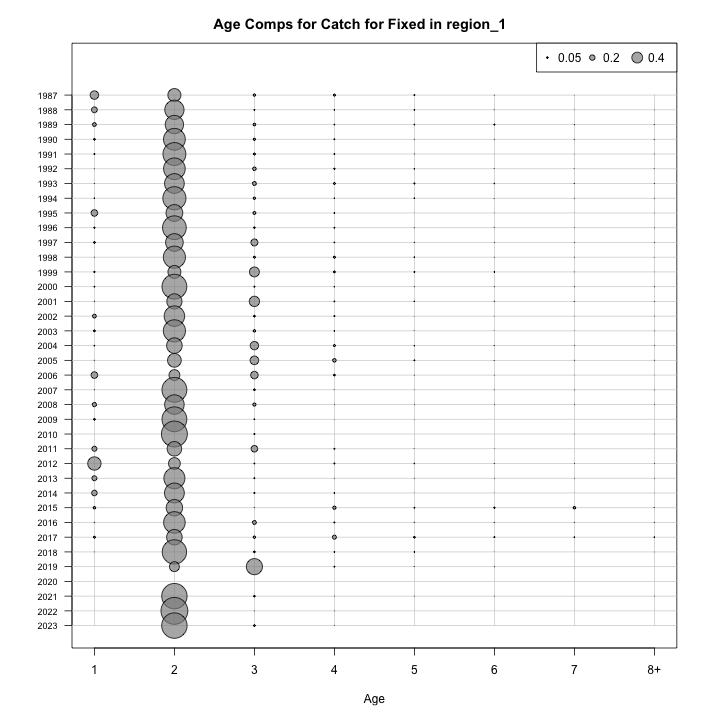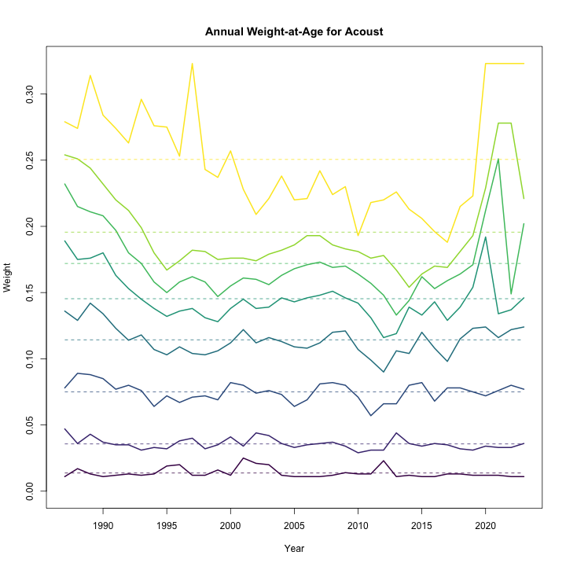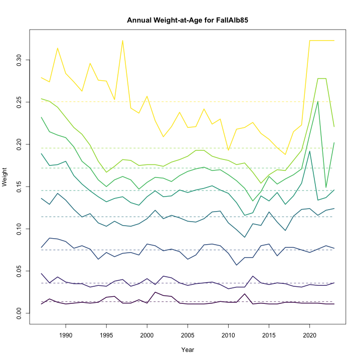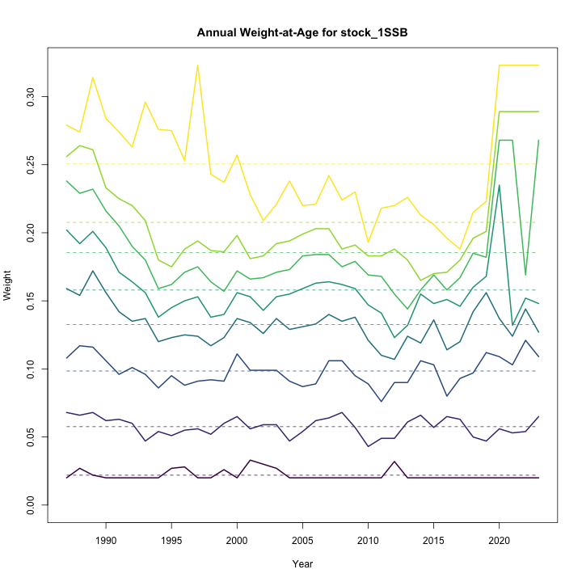

### Diagnostics

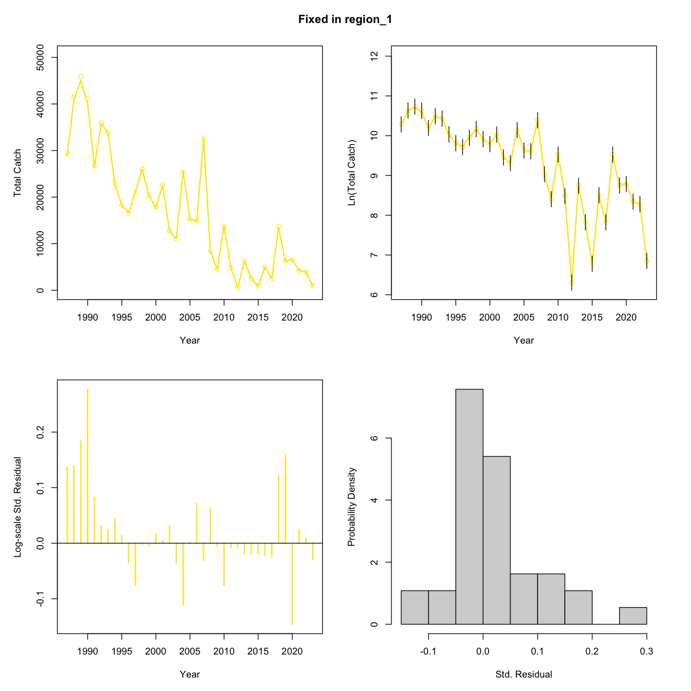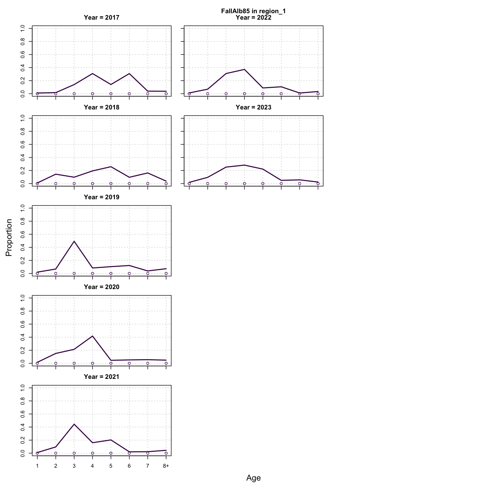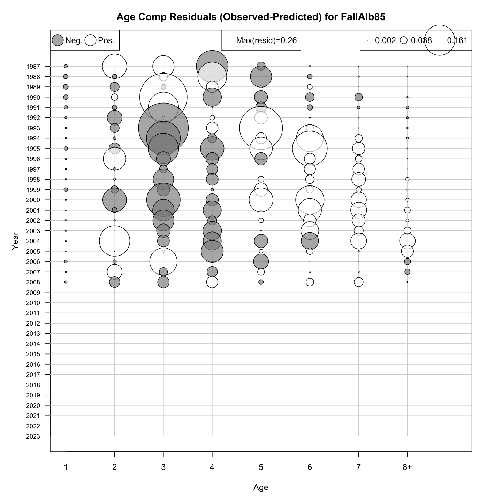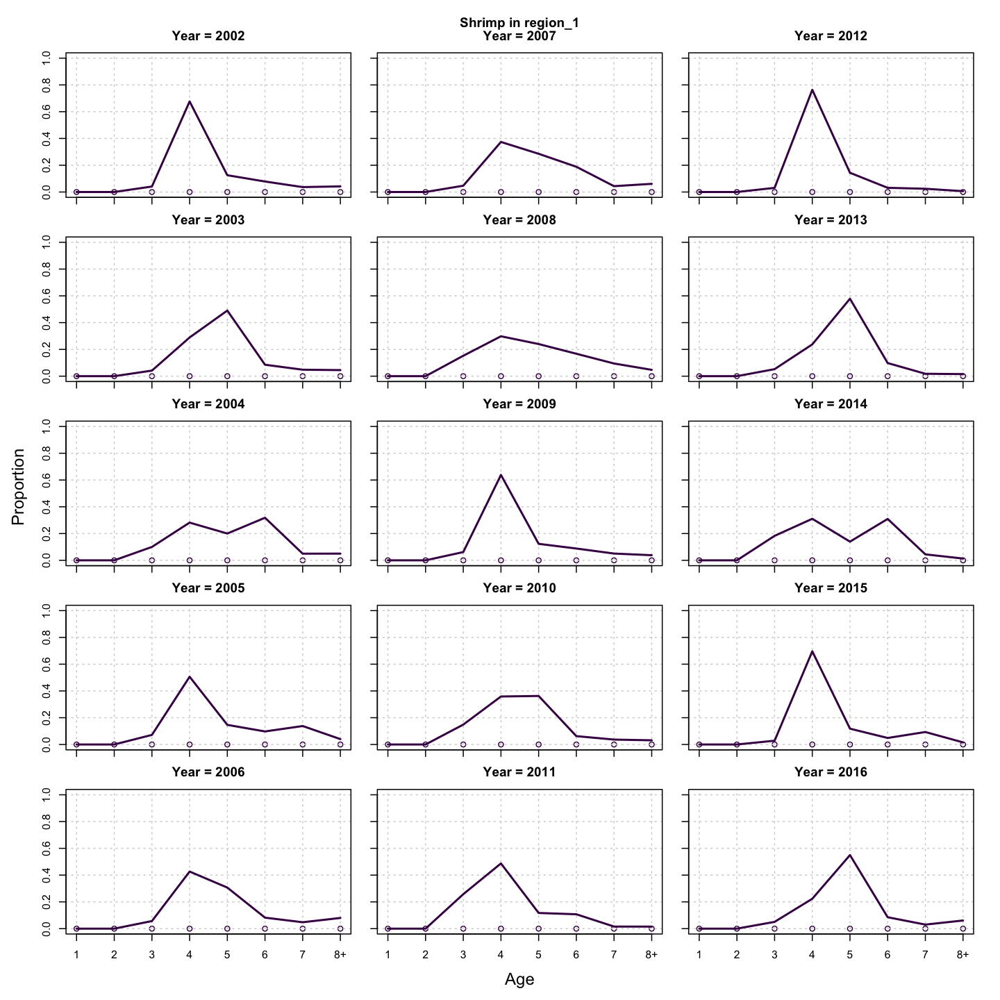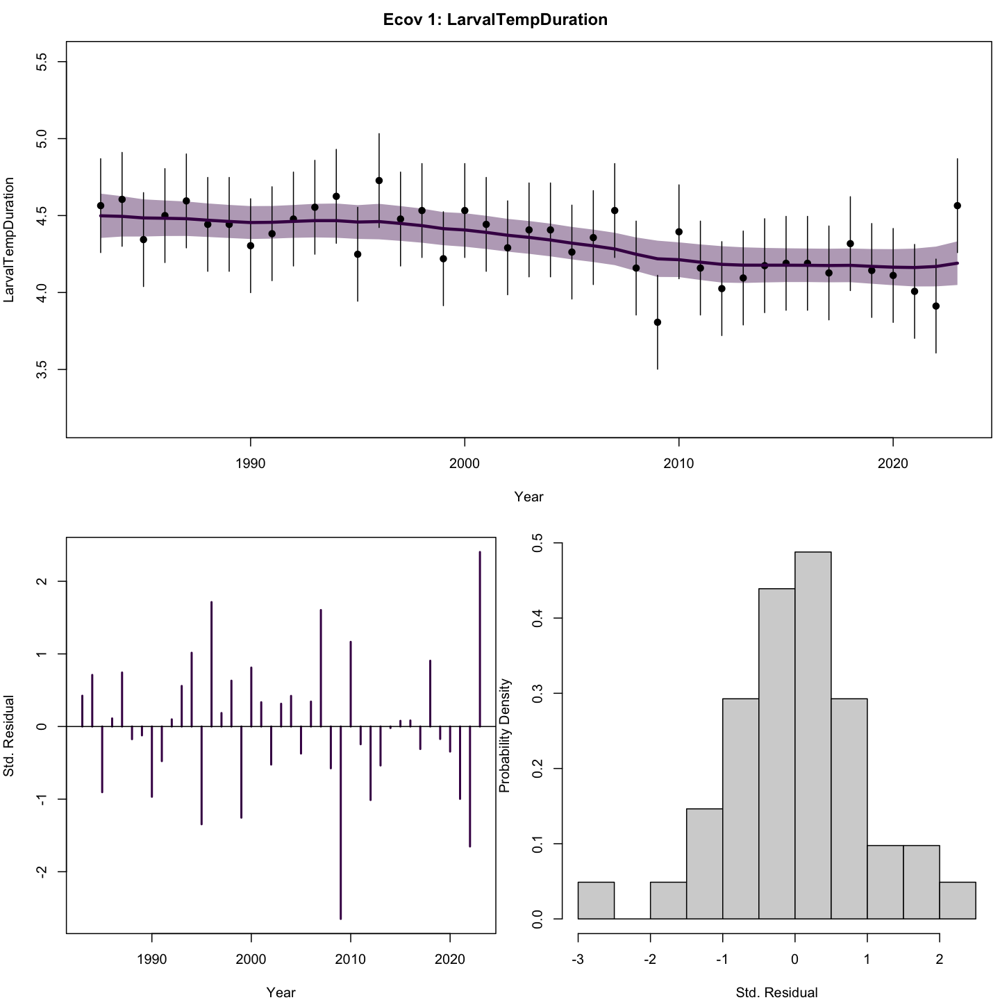

### Results

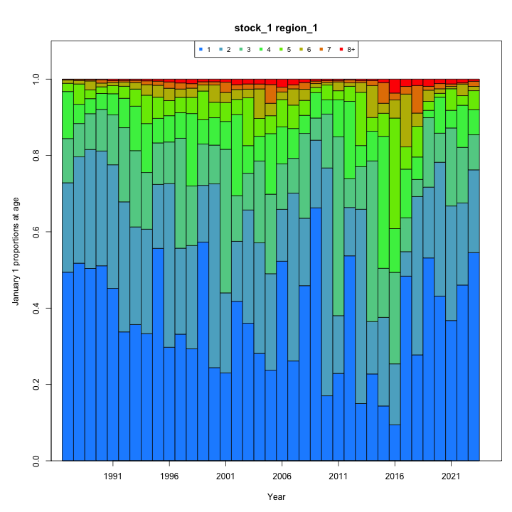

### Retro

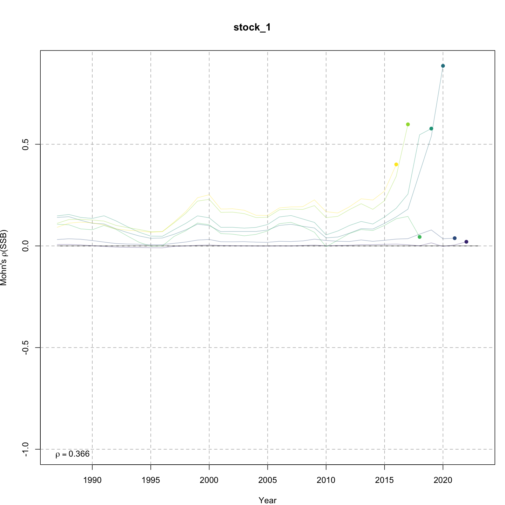

### Reference points

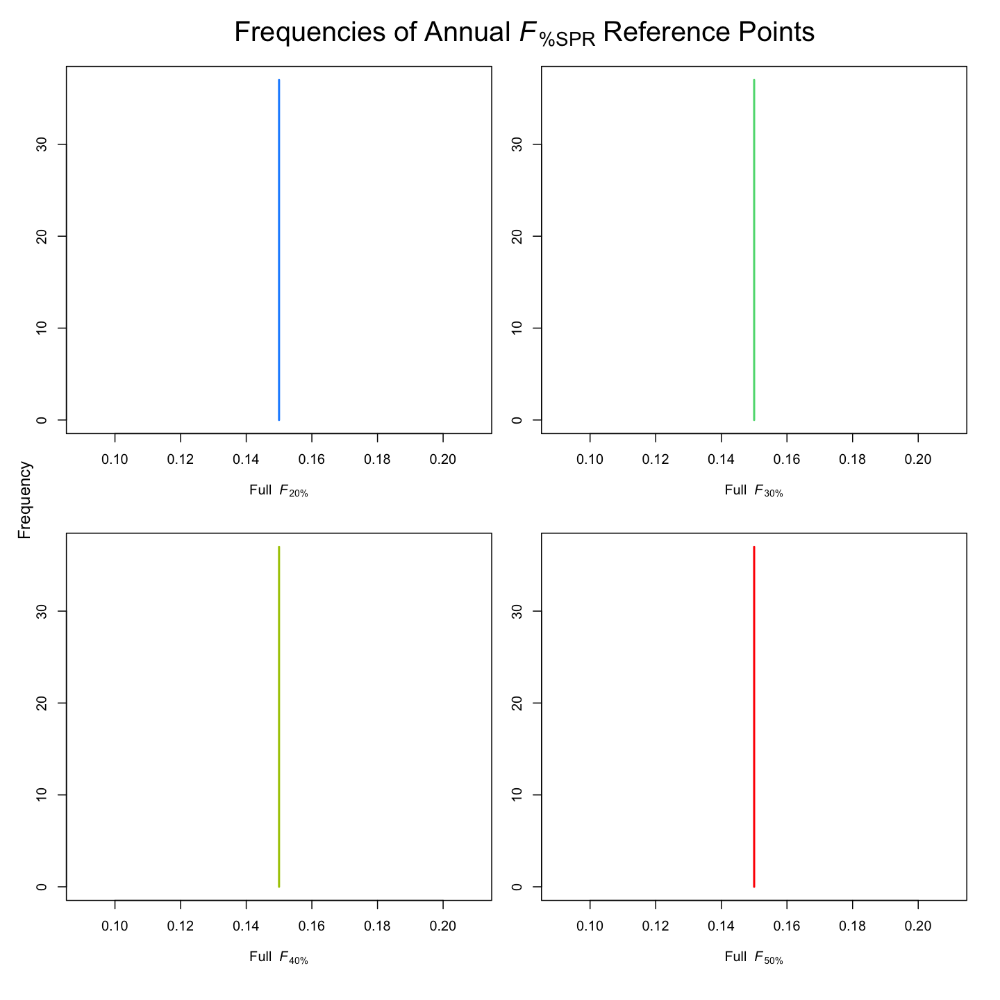

### Miscellaneous

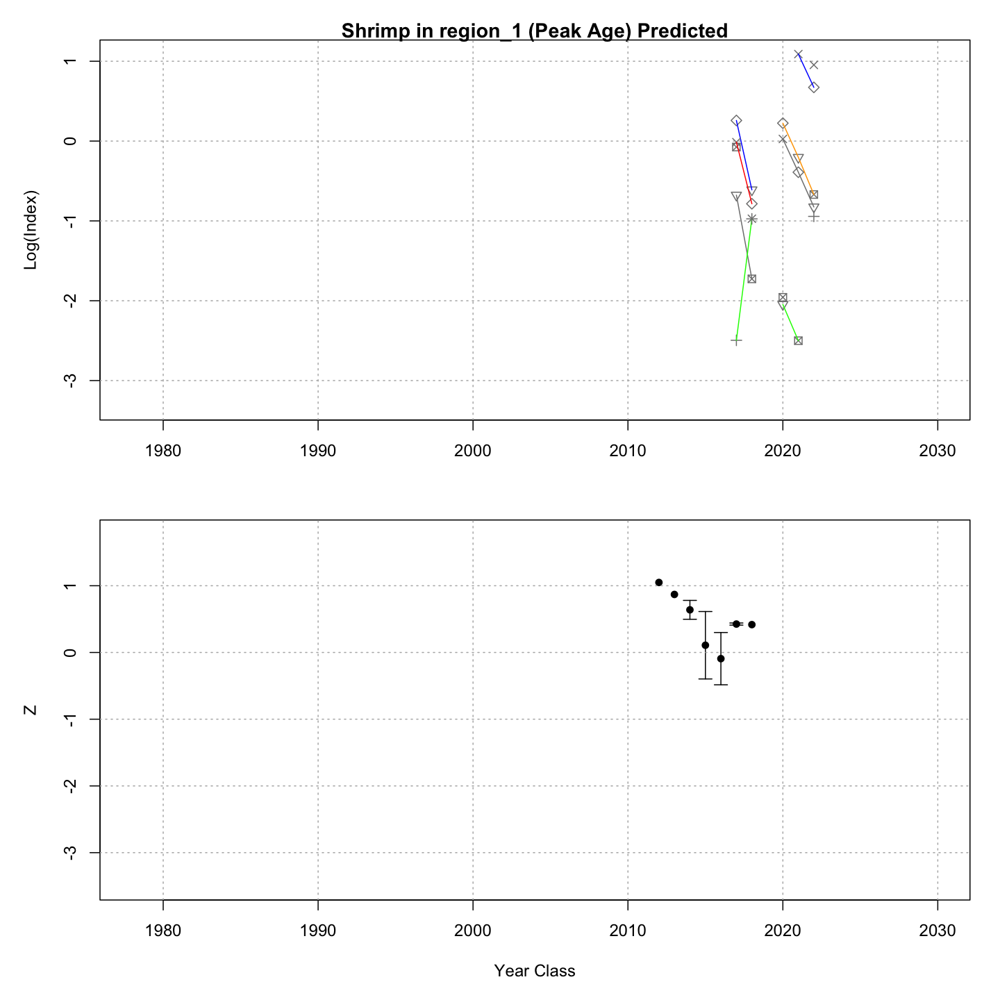

## Tables {.tabset}

### Parameter estimates

<table class="table" style="margin-left: auto; margin-right: auto;">
<caption>Parameter estimates, standard errors, and confidence intervals. Rounded to 3 decimal places.</caption>
 <thead>
  <tr>
   <th style="text-align:left;">   </th>
   <th style="text-align:right;"> Estimate </th>
   <th style="text-align:right;"> Std. Error </th>
   <th style="text-align:right;"> 95\% CI lower </th>
   <th style="text-align:right;"> 95\% CI upper </th>
  </tr>
 </thead>
<tbody>
  <tr>
   <td style="text-align:left;"> stock 1 Mean Recruitment </td>
   <td style="text-align:right;"> $2595775.654$ </td>
   <td style="text-align:right;"> $371126.082$ </td>
   <td style="text-align:right;"> $1961409.321$ </td>
   <td style="text-align:right;"> $3435311.118$ </td>
  </tr>
  <tr>
   <td style="text-align:left;"> stock 1 NAA $\sigma$ (age 1) </td>
   <td style="text-align:right;"> $0.833$ </td>
   <td style="text-align:right;"> $0.102$ </td>
   <td style="text-align:right;"> $0.655$ </td>
   <td style="text-align:right;"> $1.059$ </td>
  </tr>
  <tr>
   <td style="text-align:left;"> Shrimp fully selected q </td>
   <td style="text-align:right;"> $1.070\times 10^{-5}$ </td>
   <td style="text-align:right;"> $8.673\times 10^{-7}$ </td>
   <td style="text-align:right;"> $9.127\times 10^{-6}$ </td>
   <td style="text-align:right;"> $1.254\times 10^{-5}$ </td>
  </tr>
  <tr>
   <td style="text-align:left;"> Acoust fully selected q </td>
   <td style="text-align:right;"> $3.323\times 10^{-5}$ </td>
   <td style="text-align:right;"> $2.010\times 10^{-6}$ </td>
   <td style="text-align:right;"> $2.951\times 10^{-5}$ </td>
   <td style="text-align:right;"> $3.741\times 10^{-5}$ </td>
  </tr>
  <tr>
   <td style="text-align:left;"> SprAlb85 fully selected q </td>
   <td style="text-align:right;"> $6.668\times 10^{-6}$ </td>
   <td style="text-align:right;"> $5.045\times 10^{-7}$ </td>
   <td style="text-align:right;"> $5.749\times 10^{-6}$ </td>
   <td style="text-align:right;"> $7.734\times 10^{-6}$ </td>
  </tr>
  <tr>
   <td style="text-align:left;"> FallAlb85 fully selected q </td>
   <td style="text-align:right;"> $1.128\times 10^{-5}$ </td>
   <td style="text-align:right;"> $1.312\times 10^{-6}$ </td>
   <td style="text-align:right;"> $8.983\times 10^{-6}$ </td>
   <td style="text-align:right;"> $1.417\times 10^{-5}$ </td>
  </tr>
  <tr>
   <td style="text-align:left;"> SprBig fully selected q </td>
   <td style="text-align:right;"> $3.653\times 10^{-5}$ </td>
   <td style="text-align:right;"> $4.732\times 10^{-6}$ </td>
   <td style="text-align:right;"> $2.834\times 10^{-5}$ </td>
   <td style="text-align:right;"> $4.709\times 10^{-5}$ </td>
  </tr>
  <tr>
   <td style="text-align:left;"> FallBig fully selected q </td>
   <td style="text-align:right;"> $4.584\times 10^{-5}$ </td>
   <td style="text-align:right;"> $6.843\times 10^{-6}$ </td>
   <td style="text-align:right;"> $3.421\times 10^{-5}$ </td>
   <td style="text-align:right;"> $6.142\times 10^{-5}$ </td>
  </tr>
  <tr>
   <td style="text-align:left;"> Block 1: Mobile Selectivity for age 1 </td>
   <td style="text-align:right;"> $4.242\times 10^{-4}$ </td>
   <td style="text-align:right;"> $9.786\times 10^{-5}$ </td>
   <td style="text-align:right;"> $2.699\times 10^{-4}$ </td>
   <td style="text-align:right;"> $6.666\times 10^{-4}$ </td>
  </tr>
  <tr>
   <td style="text-align:left;"> Block 1: Mobile Selectivity for age 2 </td>
   <td style="text-align:right;"> $0.091$ </td>
   <td style="text-align:right;"> $0.015$ </td>
   <td style="text-align:right;"> $0.065$ </td>
   <td style="text-align:right;"> $0.126$ </td>
  </tr>
  <tr>
   <td style="text-align:left;"> Block 1: Mobile Selectivity for age 3 </td>
   <td style="text-align:right;"> $0.334$ </td>
   <td style="text-align:right;"> $0.051$ </td>
   <td style="text-align:right;"> $0.242$ </td>
   <td style="text-align:right;"> $0.440$ </td>
  </tr>
  <tr>
   <td style="text-align:left;"> Block 1: Mobile Selectivity for age 4 </td>
   <td style="text-align:right;"> $0.431$ </td>
   <td style="text-align:right;"> $0.062$ </td>
   <td style="text-align:right;"> $0.316$ </td>
   <td style="text-align:right;"> $0.554$ </td>
  </tr>
  <tr>
   <td style="text-align:left;"> Block 1: Mobile Selectivity for age 5 </td>
   <td style="text-align:right;"> $0.531$ </td>
   <td style="text-align:right;"> $0.068$ </td>
   <td style="text-align:right;"> $0.399$ </td>
   <td style="text-align:right;"> $0.659$ </td>
  </tr>
  <tr>
   <td style="text-align:left;"> Block 1: Mobile Selectivity for age 6 </td>
   <td style="text-align:right;"> $0.717$ </td>
   <td style="text-align:right;"> $0.072$ </td>
   <td style="text-align:right;"> $0.560$ </td>
   <td style="text-align:right;"> $0.835$ </td>
  </tr>
  <tr>
   <td style="text-align:left;"> Block 1: Mobile Selectivity for age 7 </td>
   <td style="text-align:right;"> $1.000$ </td>
   <td style="text-align:right;"> -- </td>
   <td style="text-align:right;"> -- </td>
   <td style="text-align:right;"> -- </td>
  </tr>
  <tr>
   <td style="text-align:left;"> Block 1: Mobile Selectivity for age 8+ </td>
   <td style="text-align:right;"> $1.000$ </td>
   <td style="text-align:right;"> -- </td>
   <td style="text-align:right;"> -- </td>
   <td style="text-align:right;"> -- </td>
  </tr>
  <tr>
   <td style="text-align:left;"> Block 2: Fixed Selectivity for age 1 </td>
   <td style="text-align:right;"> $0.038$ </td>
   <td style="text-align:right;"> $0.007$ </td>
   <td style="text-align:right;"> $0.027$ </td>
   <td style="text-align:right;"> $0.053$ </td>
  </tr>
  <tr>
   <td style="text-align:left;"> Block 2: Fixed Selectivity for age 2 </td>
   <td style="text-align:right;"> $1.000$ </td>
   <td style="text-align:right;"> -- </td>
   <td style="text-align:right;"> -- </td>
   <td style="text-align:right;"> -- </td>
  </tr>
  <tr>
   <td style="text-align:left;"> Block 2: Fixed Selectivity for age 3 </td>
   <td style="text-align:right;"> $0.219$ </td>
   <td style="text-align:right;"> $0.036$ </td>
   <td style="text-align:right;"> $0.156$ </td>
   <td style="text-align:right;"> $0.298$ </td>
  </tr>
  <tr>
   <td style="text-align:left;"> Block 2: Fixed Selectivity for age 4 </td>
   <td style="text-align:right;"> $0.090$ </td>
   <td style="text-align:right;"> $0.021$ </td>
   <td style="text-align:right;"> $0.057$ </td>
   <td style="text-align:right;"> $0.140$ </td>
  </tr>
  <tr>
   <td style="text-align:left;"> Block 2: Fixed Selectivity for age 5 </td>
   <td style="text-align:right;"> $0.061$ </td>
   <td style="text-align:right;"> $0.017$ </td>
   <td style="text-align:right;"> $0.035$ </td>
   <td style="text-align:right;"> $0.103$ </td>
  </tr>
  <tr>
   <td style="text-align:left;"> Block 2: Fixed Selectivity for age 6 </td>
   <td style="text-align:right;"> $0.058$ </td>
   <td style="text-align:right;"> $0.018$ </td>
   <td style="text-align:right;"> $0.031$ </td>
   <td style="text-align:right;"> $0.105$ </td>
  </tr>
  <tr>
   <td style="text-align:left;"> Block 2: Fixed Selectivity for age 7 </td>
   <td style="text-align:right;"> $0.056$ </td>
   <td style="text-align:right;"> $0.019$ </td>
   <td style="text-align:right;"> $0.028$ </td>
   <td style="text-align:right;"> $0.108$ </td>
  </tr>
  <tr>
   <td style="text-align:left;"> Block 2: Fixed Selectivity for age 8+ </td>
   <td style="text-align:right;"> $0.040$ </td>
   <td style="text-align:right;"> $0.014$ </td>
   <td style="text-align:right;"> $0.020$ </td>
   <td style="text-align:right;"> $0.080$ </td>
  </tr>
  <tr>
   <td style="text-align:left;"> Block 3: Shrimp Selectivity for age 1 </td>
   <td style="text-align:right;"> $0.000$ </td>
   <td style="text-align:right;"> -- </td>
   <td style="text-align:right;"> -- </td>
   <td style="text-align:right;"> -- </td>
  </tr>
  <tr>
   <td style="text-align:left;"> Block 3: Shrimp Selectivity for age 2 </td>
   <td style="text-align:right;"> $0.000$ </td>
   <td style="text-align:right;"> -- </td>
   <td style="text-align:right;"> -- </td>
   <td style="text-align:right;"> -- </td>
  </tr>
  <tr>
   <td style="text-align:left;"> Block 3: Shrimp Selectivity for age 3 </td>
   <td style="text-align:right;"> $0.106$ </td>
   <td style="text-align:right;"> $0.039$ </td>
   <td style="text-align:right;"> $0.051$ </td>
   <td style="text-align:right;"> $0.209$ </td>
  </tr>
  <tr>
   <td style="text-align:left;"> Block 3: Shrimp Selectivity for age 4 </td>
   <td style="text-align:right;"> $1.000$ </td>
   <td style="text-align:right;"> -- </td>
   <td style="text-align:right;"> -- </td>
   <td style="text-align:right;"> -- </td>
  </tr>
  <tr>
   <td style="text-align:left;"> Block 3: Shrimp Selectivity for age 5 </td>
   <td style="text-align:right;"> $1.000$ </td>
   <td style="text-align:right;"> -- </td>
   <td style="text-align:right;"> -- </td>
   <td style="text-align:right;"> -- </td>
  </tr>
  <tr>
   <td style="text-align:left;"> Block 3: Shrimp Selectivity for age 6 </td>
   <td style="text-align:right;"> $1.000$ </td>
   <td style="text-align:right;"> -- </td>
   <td style="text-align:right;"> -- </td>
   <td style="text-align:right;"> -- </td>
  </tr>
  <tr>
   <td style="text-align:left;"> Block 3: Shrimp Selectivity for age 7 </td>
   <td style="text-align:right;"> $1.000$ </td>
   <td style="text-align:right;"> -- </td>
   <td style="text-align:right;"> -- </td>
   <td style="text-align:right;"> -- </td>
  </tr>
  <tr>
   <td style="text-align:left;"> Block 3: Shrimp Selectivity for age 8+ </td>
   <td style="text-align:right;"> $1.000$ </td>
   <td style="text-align:right;"> -- </td>
   <td style="text-align:right;"> -- </td>
   <td style="text-align:right;"> -- </td>
  </tr>
  <tr>
   <td style="text-align:left;"> Block 4: Acoust Selectivity for age 1 </td>
   <td style="text-align:right;"> $0.000$ </td>
   <td style="text-align:right;"> -- </td>
   <td style="text-align:right;"> -- </td>
   <td style="text-align:right;"> -- </td>
  </tr>
  <tr>
   <td style="text-align:left;"> Block 4: Acoust Selectivity for age 2 </td>
   <td style="text-align:right;"> $0.000$ </td>
   <td style="text-align:right;"> -- </td>
   <td style="text-align:right;"> -- </td>
   <td style="text-align:right;"> -- </td>
  </tr>
  <tr>
   <td style="text-align:left;"> Block 4: Acoust Selectivity for age 3 </td>
   <td style="text-align:right;"> $1.000$ </td>
   <td style="text-align:right;"> -- </td>
   <td style="text-align:right;"> -- </td>
   <td style="text-align:right;"> -- </td>
  </tr>
  <tr>
   <td style="text-align:left;"> Block 4: Acoust Selectivity for age 4 </td>
   <td style="text-align:right;"> $1.000$ </td>
   <td style="text-align:right;"> -- </td>
   <td style="text-align:right;"> -- </td>
   <td style="text-align:right;"> -- </td>
  </tr>
  <tr>
   <td style="text-align:left;"> Block 4: Acoust Selectivity for age 5 </td>
   <td style="text-align:right;"> $1.000$ </td>
   <td style="text-align:right;"> -- </td>
   <td style="text-align:right;"> -- </td>
   <td style="text-align:right;"> -- </td>
  </tr>
  <tr>
   <td style="text-align:left;"> Block 4: Acoust Selectivity for age 6 </td>
   <td style="text-align:right;"> $1.000$ </td>
   <td style="text-align:right;"> -- </td>
   <td style="text-align:right;"> -- </td>
   <td style="text-align:right;"> -- </td>
  </tr>
  <tr>
   <td style="text-align:left;"> Block 4: Acoust Selectivity for age 7 </td>
   <td style="text-align:right;"> $1.000$ </td>
   <td style="text-align:right;"> -- </td>
   <td style="text-align:right;"> -- </td>
   <td style="text-align:right;"> -- </td>
  </tr>
  <tr>
   <td style="text-align:left;"> Block 4: Acoust Selectivity for age 8+ </td>
   <td style="text-align:right;"> $1.000$ </td>
   <td style="text-align:right;"> -- </td>
   <td style="text-align:right;"> -- </td>
   <td style="text-align:right;"> -- </td>
  </tr>
  <tr>
   <td style="text-align:left;"> Block 5: SprAlb85 Selectivity for age 1 </td>
   <td style="text-align:right;"> $0.000$ </td>
   <td style="text-align:right;"> -- </td>
   <td style="text-align:right;"> -- </td>
   <td style="text-align:right;"> -- </td>
  </tr>
  <tr>
   <td style="text-align:left;"> Block 5: SprAlb85 Selectivity for age 2 </td>
   <td style="text-align:right;"> $0.314$ </td>
   <td style="text-align:right;"> $0.049$ </td>
   <td style="text-align:right;"> $0.227$ </td>
   <td style="text-align:right;"> $0.416$ </td>
  </tr>
  <tr>
   <td style="text-align:left;"> Block 5: SprAlb85 Selectivity for age 3 </td>
   <td style="text-align:right;"> $1.000$ </td>
   <td style="text-align:right;"> -- </td>
   <td style="text-align:right;"> -- </td>
   <td style="text-align:right;"> -- </td>
  </tr>
  <tr>
   <td style="text-align:left;"> Block 5: SprAlb85 Selectivity for age 4 </td>
   <td style="text-align:right;"> $1.000$ </td>
   <td style="text-align:right;"> -- </td>
   <td style="text-align:right;"> -- </td>
   <td style="text-align:right;"> -- </td>
  </tr>
  <tr>
   <td style="text-align:left;"> Block 5: SprAlb85 Selectivity for age 5 </td>
   <td style="text-align:right;"> $1.000$ </td>
   <td style="text-align:right;"> -- </td>
   <td style="text-align:right;"> -- </td>
   <td style="text-align:right;"> -- </td>
  </tr>
  <tr>
   <td style="text-align:left;"> Block 5: SprAlb85 Selectivity for age 6 </td>
   <td style="text-align:right;"> $1.000$ </td>
   <td style="text-align:right;"> -- </td>
   <td style="text-align:right;"> -- </td>
   <td style="text-align:right;"> -- </td>
  </tr>
  <tr>
   <td style="text-align:left;"> Block 5: SprAlb85 Selectivity for age 7 </td>
   <td style="text-align:right;"> $1.000$ </td>
   <td style="text-align:right;"> -- </td>
   <td style="text-align:right;"> -- </td>
   <td style="text-align:right;"> -- </td>
  </tr>
  <tr>
   <td style="text-align:left;"> Block 5: SprAlb85 Selectivity for age 8+ </td>
   <td style="text-align:right;"> $1.000$ </td>
   <td style="text-align:right;"> -- </td>
   <td style="text-align:right;"> -- </td>
   <td style="text-align:right;"> -- </td>
  </tr>
  <tr>
   <td style="text-align:left;"> Block 6: FallAlb85 $a_{50}$ </td>
   <td style="text-align:right;"> $2.844$ </td>
   <td style="text-align:right;"> $0.154$ </td>
   <td style="text-align:right;"> $2.549$ </td>
   <td style="text-align:right;"> $3.153$ </td>
  </tr>
  <tr>
   <td style="text-align:left;"> Block 6: FallAlb85 1/slope (increasing) </td>
   <td style="text-align:right;"> $0.374$ </td>
   <td style="text-align:right;"> $0.045$ </td>
   <td style="text-align:right;"> $0.295$ </td>
   <td style="text-align:right;"> $0.473$ </td>
  </tr>
  <tr>
   <td style="text-align:left;"> Block 7: SprBig Selectivity for age 1 </td>
   <td style="text-align:right;"> $0.000$ </td>
   <td style="text-align:right;"> -- </td>
   <td style="text-align:right;"> -- </td>
   <td style="text-align:right;"> -- </td>
  </tr>
  <tr>
   <td style="text-align:left;"> Block 7: SprBig Selectivity for age 2 </td>
   <td style="text-align:right;"> $0.299$ </td>
   <td style="text-align:right;"> $0.072$ </td>
   <td style="text-align:right;"> $0.179$ </td>
   <td style="text-align:right;"> $0.455$ </td>
  </tr>
  <tr>
   <td style="text-align:left;"> Block 7: SprBig Selectivity for age 3 </td>
   <td style="text-align:right;"> $0.938$ </td>
   <td style="text-align:right;"> $0.167$ </td>
   <td style="text-align:right;"> $0.051$ </td>
   <td style="text-align:right;"> $1.000$ </td>
  </tr>
  <tr>
   <td style="text-align:left;"> Block 7: SprBig Selectivity for age 4 </td>
   <td style="text-align:right;"> $1.000$ </td>
   <td style="text-align:right;"> -- </td>
   <td style="text-align:right;"> -- </td>
   <td style="text-align:right;"> -- </td>
  </tr>
  <tr>
   <td style="text-align:left;"> Block 7: SprBig Selectivity for age 5 </td>
   <td style="text-align:right;"> $1.000$ </td>
   <td style="text-align:right;"> -- </td>
   <td style="text-align:right;"> -- </td>
   <td style="text-align:right;"> -- </td>
  </tr>
  <tr>
   <td style="text-align:left;"> Block 7: SprBig Selectivity for age 6 </td>
   <td style="text-align:right;"> $1.000$ </td>
   <td style="text-align:right;"> -- </td>
   <td style="text-align:right;"> -- </td>
   <td style="text-align:right;"> -- </td>
  </tr>
  <tr>
   <td style="text-align:left;"> Block 7: SprBig Selectivity for age 7 </td>
   <td style="text-align:right;"> $1.000$ </td>
   <td style="text-align:right;"> -- </td>
   <td style="text-align:right;"> -- </td>
   <td style="text-align:right;"> -- </td>
  </tr>
  <tr>
   <td style="text-align:left;"> Block 7: SprBig Selectivity for age 8+ </td>
   <td style="text-align:right;"> $1.000$ </td>
   <td style="text-align:right;"> -- </td>
   <td style="text-align:right;"> -- </td>
   <td style="text-align:right;"> -- </td>
  </tr>
  <tr>
   <td style="text-align:left;"> Block 8: FallBig $a_{50}$ </td>
   <td style="text-align:right;"> $3.208$ </td>
   <td style="text-align:right;"> $0.209$ </td>
   <td style="text-align:right;"> $2.809$ </td>
   <td style="text-align:right;"> $3.624$ </td>
  </tr>
  <tr>
   <td style="text-align:left;"> Block 8: FallBig 1/slope (increasing) </td>
   <td style="text-align:right;"> $0.432$ </td>
   <td style="text-align:right;"> $0.059$ </td>
   <td style="text-align:right;"> $0.331$ </td>
   <td style="text-align:right;"> $0.563$ </td>
  </tr>
  <tr>
   <td style="text-align:left;"> Mobile in region 1 age comp, logistic-normal: $\sigma$ </td>
   <td style="text-align:right;"> $16.794$ </td>
   <td style="text-align:right;"> $1.647$ </td>
   <td style="text-align:right;"> $13.858$ </td>
   <td style="text-align:right;"> $20.353$ </td>
  </tr>
  <tr>
   <td style="text-align:left;"> Mobile in region 1 age comp, logistic-normal: $\rho$ </td>
   <td style="text-align:right;"> $0.882$ </td>
   <td style="text-align:right;"> $0.025$ </td>
   <td style="text-align:right;"> $0.824$ </td>
   <td style="text-align:right;"> $0.922$ </td>
  </tr>
  <tr>
   <td style="text-align:left;"> Fixed in region 1 age comp, logistic-normal: $\sigma$ </td>
   <td style="text-align:right;"> $29.608$ </td>
   <td style="text-align:right;"> $2.732$ </td>
   <td style="text-align:right;"> $24.710$ </td>
   <td style="text-align:right;"> $35.476$ </td>
  </tr>
  <tr>
   <td style="text-align:left;"> Fixed in region 1 age comp, logistic-normal: $\rho$ </td>
   <td style="text-align:right;"> $0.847$ </td>
   <td style="text-align:right;"> $0.031$ </td>
   <td style="text-align:right;"> $0.776$ </td>
   <td style="text-align:right;"> $0.898$ </td>
  </tr>
  <tr>
   <td style="text-align:left;"> Shrimp in region 1 age comp, logistic-normal: $\sigma$ </td>
   <td style="text-align:right;"> $15.927$ </td>
   <td style="text-align:right;"> $3.591$ </td>
   <td style="text-align:right;"> $10.237$ </td>
   <td style="text-align:right;"> $24.777$ </td>
  </tr>
  <tr>
   <td style="text-align:left;"> Shrimp in region 1 age comp, logistic-normal: $\rho$ </td>
   <td style="text-align:right;"> $0.737$ </td>
   <td style="text-align:right;"> $0.129$ </td>
   <td style="text-align:right;"> $0.432$ </td>
   <td style="text-align:right;"> $0.912$ </td>
  </tr>
  <tr>
   <td style="text-align:left;"> SprAlb85 in region 1 age comp, logistic-normal: $\sigma$ </td>
   <td style="text-align:right;"> $21.782$ </td>
   <td style="text-align:right;"> $2.555$ </td>
   <td style="text-align:right;"> $17.307$ </td>
   <td style="text-align:right;"> $27.413$ </td>
  </tr>
  <tr>
   <td style="text-align:left;"> SprAlb85 in region 1 age comp, logistic-normal: $\rho$ </td>
   <td style="text-align:right;"> $0.829$ </td>
   <td style="text-align:right;"> $0.044$ </td>
   <td style="text-align:right;"> $0.724$ </td>
   <td style="text-align:right;"> $0.900$ </td>
  </tr>
  <tr>
   <td style="text-align:left;"> FallAlb85 in region 1 age comp, logistic-normal: $\sigma$ </td>
   <td style="text-align:right;"> $21.592$ </td>
   <td style="text-align:right;"> $2.802$ </td>
   <td style="text-align:right;"> $16.744$ </td>
   <td style="text-align:right;"> $27.844$ </td>
  </tr>
  <tr>
   <td style="text-align:left;"> FallAlb85 in region 1 age comp, logistic-normal: $\rho$ </td>
   <td style="text-align:right;"> $0.899$ </td>
   <td style="text-align:right;"> $0.028$ </td>
   <td style="text-align:right;"> $0.828$ </td>
   <td style="text-align:right;"> $0.942$ </td>
  </tr>
  <tr>
   <td style="text-align:left;"> SprBig in region 1 age comp, logistic-normal: $\sigma$ </td>
   <td style="text-align:right;"> $17.913$ </td>
   <td style="text-align:right;"> $2.691$ </td>
   <td style="text-align:right;"> $13.345$ </td>
   <td style="text-align:right;"> $24.045$ </td>
  </tr>
  <tr>
   <td style="text-align:left;"> SprBig in region 1 age comp, logistic-normal: $\rho$ </td>
   <td style="text-align:right;"> $0.767$ </td>
   <td style="text-align:right;"> $0.079$ </td>
   <td style="text-align:right;"> $0.582$ </td>
   <td style="text-align:right;"> $0.887$ </td>
  </tr>
  <tr>
   <td style="text-align:left;"> FallBig in region 1 age comp, logistic-normal: $\sigma$ </td>
   <td style="text-align:right;"> $24.014$ </td>
   <td style="text-align:right;"> $3.866$ </td>
   <td style="text-align:right;"> $17.516$ </td>
   <td style="text-align:right;"> $32.923$ </td>
  </tr>
  <tr>
   <td style="text-align:left;"> FallBig in region 1 age comp, logistic-normal: $\rho$ </td>
   <td style="text-align:right;"> $0.874$ </td>
   <td style="text-align:right;"> $0.045$ </td>
   <td style="text-align:right;"> $0.757$ </td>
   <td style="text-align:right;"> $0.939$ </td>
  </tr>
  <tr>
   <td style="text-align:left;"> Ecov LarvalTempDuration: RW Ecov$_1$ </td>
   <td style="text-align:right;"> $4.498$ </td>
   <td style="text-align:right;"> $0.073$ </td>
   <td style="text-align:right;"> $4.354$ </td>
   <td style="text-align:right;"> $4.642$ </td>
  </tr>
  <tr>
   <td style="text-align:left;"> Ecov LarvalTempDuration: RW $\sigma$ </td>
   <td style="text-align:right;"> $0.037$ </td>
   <td style="text-align:right;"> $0.014$ </td>
   <td style="text-align:right;"> $0.018$ </td>
   <td style="text-align:right;"> $0.079$ </td>
  </tr>
  <tr>
   <td style="text-align:left;"> Ecov: LarvalTempDuration obs. sd. </td>
   <td style="text-align:right;"> $0.156$ </td>
   <td style="text-align:right;"> $0.019$ </td>
   <td style="text-align:right;"> $0.123$ </td>
   <td style="text-align:right;"> $0.197$ </td>
  </tr>
</tbody>
</table>

### Abundance at age

<table class="table" style="margin-left: auto; margin-right: auto;">
<caption>Abundance at age (1000s) for stock 1 in region 1.</caption>
 <thead>
  <tr>
   <th style="text-align:left;">   </th>
   <th style="text-align:right;"> 1 </th>
   <th style="text-align:right;"> 2 </th>
   <th style="text-align:right;"> 3 </th>
   <th style="text-align:right;"> 4 </th>
   <th style="text-align:right;"> 5 </th>
   <th style="text-align:right;"> 6 </th>
   <th style="text-align:right;"> 7 </th>
   <th style="text-align:right;"> 8+ </th>
  </tr>
 </thead>
<tbody>
  <tr>
   <td style="text-align:left;"> 1987 </td>
   <td style="text-align:right;"> 3856670 </td>
   <td style="text-align:right;"> 1828534 </td>
   <td style="text-align:right;"> 904774 </td>
   <td style="text-align:right;"> 961130 </td>
   <td style="text-align:right;"> 167613 </td>
   <td style="text-align:right;"> 66479 </td>
   <td style="text-align:right;"> 13394 </td>
   <td style="text-align:right;"> 6204 </td>
  </tr>
  <tr>
   <td style="text-align:left;"> 1988 </td>
   <td style="text-align:right;"> 4979728 </td>
   <td style="text-align:right;"> 2679014 </td>
   <td style="text-align:right;"> 840621 </td>
   <td style="text-align:right;"> 484614 </td>
   <td style="text-align:right;"> 510688 </td>
   <td style="text-align:right;"> 84983 </td>
   <td style="text-align:right;"> 30309 </td>
   <td style="text-align:right;"> 7611 </td>
  </tr>
  <tr>
   <td style="text-align:left;"> 1989 </td>
   <td style="text-align:right;"> 5557085 </td>
   <td style="text-align:right;"> 3436500 </td>
   <td style="text-align:right;"> 1034995 </td>
   <td style="text-align:right;"> 434048 </td>
   <td style="text-align:right;"> 253966 </td>
   <td style="text-align:right;"> 256820 </td>
   <td style="text-align:right;"> 38481 </td>
   <td style="text-align:right;"> 14646 </td>
  </tr>
  <tr>
   <td style="text-align:left;"> 1990 </td>
   <td style="text-align:right;"> 6528947 </td>
   <td style="text-align:right;"> 3842282 </td>
   <td style="text-align:right;"> 1391965 </td>
   <td style="text-align:right;"> 532620 </td>
   <td style="text-align:right;"> 224256 </td>
   <td style="text-align:right;"> 125172 </td>
   <td style="text-align:right;"> 113034 </td>
   <td style="text-align:right;"> 19707 </td>
  </tr>
  <tr>
   <td style="text-align:left;"> 1991 </td>
   <td style="text-align:right;"> 6329260 </td>
   <td style="text-align:right;"> 4539857 </td>
   <td style="text-align:right;"> 1829996 </td>
   <td style="text-align:right;"> 777421 </td>
   <td style="text-align:right;"> 297263 </td>
   <td style="text-align:right;"> 120653 </td>
   <td style="text-align:right;"> 61791 </td>
   <td style="text-align:right;"> 57491 </td>
  </tr>
  <tr>
   <td style="text-align:left;"> 1992 </td>
   <td style="text-align:right;"> 4389789 </td>
   <td style="text-align:right;"> 4429121 </td>
   <td style="text-align:right;"> 2524990 </td>
   <td style="text-align:right;"> 1001171 </td>
   <td style="text-align:right;"> 408787 </td>
   <td style="text-align:right;"> 147317 </td>
   <td style="text-align:right;"> 53089 </td>
   <td style="text-align:right;"> 43847 </td>
  </tr>
  <tr>
   <td style="text-align:left;"> 1993 </td>
   <td style="text-align:right;"> 4282377 </td>
   <td style="text-align:right;"> 3068306 </td>
   <td style="text-align:right;"> 2398326 </td>
   <td style="text-align:right;"> 1397052 </td>
   <td style="text-align:right;"> 537437 </td>
   <td style="text-align:right;"> 208152 </td>
   <td style="text-align:right;"> 67289 </td>
   <td style="text-align:right;"> 37573 </td>
  </tr>
  <tr>
   <td style="text-align:left;"> 1994 </td>
   <td style="text-align:right;"> 3641785 </td>
   <td style="text-align:right;"> 2988878 </td>
   <td style="text-align:right;"> 1623254 </td>
   <td style="text-align:right;"> 1402103 </td>
   <td style="text-align:right;"> 811604 </td>
   <td style="text-align:right;"> 302289 </td>
   <td style="text-align:right;"> 108849 </td>
   <td style="text-align:right;"> 49126 </td>
  </tr>
  <tr>
   <td style="text-align:left;"> 1995 </td>
   <td style="text-align:right;"> 8455025 </td>
   <td style="text-align:right;"> 2545487 </td>
   <td style="text-align:right;"> 1652360 </td>
   <td style="text-align:right;"> 978326 </td>
   <td style="text-align:right;"> 841061 </td>
   <td style="text-align:right;"> 473983 </td>
   <td style="text-align:right;"> 166153 </td>
   <td style="text-align:right;"> 79229 </td>
  </tr>
  <tr>
   <td style="text-align:left;"> 1996 </td>
   <td style="text-align:right;"> 4115140 </td>
   <td style="text-align:right;"> 5928484 </td>
   <td style="text-align:right;"> 1507704 </td>
   <td style="text-align:right;"> 953595 </td>
   <td style="text-align:right;"> 545764 </td>
   <td style="text-align:right;"> 447174 </td>
   <td style="text-align:right;"> 229044 </td>
   <td style="text-align:right;"> 102582 </td>
  </tr>
  <tr>
   <td style="text-align:left;"> 1997 </td>
   <td style="text-align:right;"> 4258163 </td>
   <td style="text-align:right;"> 2891730 </td>
   <td style="text-align:right;"> 3697121 </td>
   <td style="text-align:right;"> 858838 </td>
   <td style="text-align:right;"> 517212 </td>
   <td style="text-align:right;"> 279446 </td>
   <td style="text-align:right;"> 205090 </td>
   <td style="text-align:right;"> 128673 </td>
  </tr>
  <tr>
   <td style="text-align:left;"> 1998 </td>
   <td style="text-align:right;"> 3234991 </td>
   <td style="text-align:right;"> 2986769 </td>
   <td style="text-align:right;"> 1720268 </td>
   <td style="text-align:right;"> 2095437 </td>
   <td style="text-align:right;"> 467159 </td>
   <td style="text-align:right;"> 266425 </td>
   <td style="text-align:right;"> 129360 </td>
   <td style="text-align:right;"> 131397 </td>
  </tr>
  <tr>
   <td style="text-align:left;"> 1999 </td>
   <td style="text-align:right;"> 8727123 </td>
   <td style="text-align:right;"> 2262416 </td>
   <td style="text-align:right;"> 1647317 </td>
   <td style="text-align:right;"> 968676 </td>
   <td style="text-align:right;"> 1147478 </td>
   <td style="text-align:right;"> 243611 </td>
   <td style="text-align:right;"> 125627 </td>
   <td style="text-align:right;"> 105623 </td>
  </tr>
  <tr>
   <td style="text-align:left;"> 2000 </td>
   <td style="text-align:right;"> 3098657 </td>
   <td style="text-align:right;"> 6112566 </td>
   <td style="text-align:right;"> 1290238 </td>
   <td style="text-align:right;"> 910971 </td>
   <td style="text-align:right;"> 514146 </td>
   <td style="text-align:right;"> 574584 </td>
   <td style="text-align:right;"> 108641 </td>
   <td style="text-align:right;"> 86540 </td>
  </tr>
  <tr>
   <td style="text-align:left;"> 2001 </td>
   <td style="text-align:right;"> 2393368 </td>
   <td style="text-align:right;"> 2178962 </td>
   <td style="text-align:right;"> 3909609 </td>
   <td style="text-align:right;"> 759000 </td>
   <td style="text-align:right;"> 513334 </td>
   <td style="text-align:right;"> 275710 </td>
   <td style="text-align:right;"> 280373 </td>
   <td style="text-align:right;"> 82531 </td>
  </tr>
  <tr>
   <td style="text-align:left;"> 2002 </td>
   <td style="text-align:right;"> 4466602 </td>
   <td style="text-align:right;"> 1677448 </td>
   <td style="text-align:right;"> 1278258 </td>
   <td style="text-align:right;"> 2268740 </td>
   <td style="text-align:right;"> 427408 </td>
   <td style="text-align:right;"> 276274 </td>
   <td style="text-align:right;"> 135480 </td>
   <td style="text-align:right;"> 155315 </td>
  </tr>
  <tr>
   <td style="text-align:left;"> 2003 </td>
   <td style="text-align:right;"> 3808760 </td>
   <td style="text-align:right;"> 3133650 </td>
   <td style="text-align:right;"> 1016574 </td>
   <td style="text-align:right;"> 764915 </td>
   <td style="text-align:right;"> 1322760 </td>
   <td style="text-align:right;"> 239791 </td>
   <td style="text-align:right;"> 143503 </td>
   <td style="text-align:right;"> 134440 </td>
  </tr>
  <tr>
   <td style="text-align:left;"> 2004 </td>
   <td style="text-align:right;"> 2599886 </td>
   <td style="text-align:right;"> 2676972 </td>
   <td style="text-align:right;"> 1980085 </td>
   <td style="text-align:right;"> 598879 </td>
   <td style="text-align:right;"> 432947 </td>
   <td style="text-align:right;"> 713702 </td>
   <td style="text-align:right;"> 118021 </td>
   <td style="text-align:right;"> 119002 </td>
  </tr>
  <tr>
   <td style="text-align:left;"> 2005 </td>
   <td style="text-align:right;"> 1707697 </td>
   <td style="text-align:right;"> 1818902 </td>
   <td style="text-align:right;"> 1498414 </td>
   <td style="text-align:right;"> 1141862 </td>
   <td style="text-align:right;"> 337632 </td>
   <td style="text-align:right;"> 233914 </td>
   <td style="text-align:right;"> 352946 </td>
   <td style="text-align:right;"> 102569 </td>
  </tr>
  <tr>
   <td style="text-align:left;"> 2006 </td>
   <td style="text-align:right;"> 4600354 </td>
   <td style="text-align:right;"> 1196166 </td>
   <td style="text-align:right;"> 1046212 </td>
   <td style="text-align:right;"> 852664 </td>
   <td style="text-align:right;"> 628784 </td>
   <td style="text-align:right;"> 176906 </td>
   <td style="text-align:right;"> 110897 </td>
   <td style="text-align:right;"> 185533 </td>
  </tr>
  <tr>
   <td style="text-align:left;"> 2007 </td>
   <td style="text-align:right;"> 1915218 </td>
   <td style="text-align:right;"> 3219789 </td>
   <td style="text-align:right;"> 668206 </td>
   <td style="text-align:right;"> 572925 </td>
   <td style="text-align:right;"> 448534 </td>
   <td style="text-align:right;"> 311699 </td>
   <td style="text-align:right;"> 77863 </td>
   <td style="text-align:right;"> 109036 </td>
  </tr>
  <tr>
   <td style="text-align:left;"> 2008 </td>
   <td style="text-align:right;"> 3471197 </td>
   <td style="text-align:right;"> 1337135 </td>
   <td style="text-align:right;"> 1681127 </td>
   <td style="text-align:right;"> 358250 </td>
   <td style="text-align:right;"> 296974 </td>
   <td style="text-align:right;"> 219073 </td>
   <td style="text-align:right;"> 134682 </td>
   <td style="text-align:right;"> 67143 </td>
  </tr>
  <tr>
   <td style="text-align:left;"> 2009 </td>
   <td style="text-align:right;"> 9104230 </td>
   <td style="text-align:right;"> 2436087 </td>
   <td style="text-align:right;"> 797979 </td>
   <td style="text-align:right;"> 912745 </td>
   <td style="text-align:right;"> 183781 </td>
   <td style="text-align:right;"> 142202 </td>
   <td style="text-align:right;"> 91856 </td>
   <td style="text-align:right;"> 69175 </td>
  </tr>
  <tr>
   <td style="text-align:left;"> 2010 </td>
   <td style="text-align:right;"> 1826627 </td>
   <td style="text-align:right;"> 6404647 </td>
   <td style="text-align:right;"> 1514214 </td>
   <td style="text-align:right;"> 399791 </td>
   <td style="text-align:right;"> 416666 </td>
   <td style="text-align:right;"> 75950 </td>
   <td style="text-align:right;"> 48796 </td>
   <td style="text-align:right;"> 41659 </td>
  </tr>
  <tr>
   <td style="text-align:left;"> 2011 </td>
   <td style="text-align:right;"> 1941380 </td>
   <td style="text-align:right;"> 1283889 </td>
   <td style="text-align:right;"> 3971229 </td>
   <td style="text-align:right;"> 821488 </td>
   <td style="text-align:right;"> 203280 </td>
   <td style="text-align:right;"> 196934 </td>
   <td style="text-align:right;"> 31260 </td>
   <td style="text-align:right;"> 30179 </td>
  </tr>
  <tr>
   <td style="text-align:left;"> 2012 </td>
   <td style="text-align:right;"> 5788374 </td>
   <td style="text-align:right;"> 1365218 </td>
   <td style="text-align:right;"> 808970 </td>
   <td style="text-align:right;"> 2187615 </td>
   <td style="text-align:right;"> 424986 </td>
   <td style="text-align:right;"> 98087 </td>
   <td style="text-align:right;"> 83326 </td>
   <td style="text-align:right;"> 21294 </td>
  </tr>
  <tr>
   <td style="text-align:left;"> 2013 </td>
   <td style="text-align:right;"> 1201616 </td>
   <td style="text-align:right;"> 4076747 </td>
   <td style="text-align:right;"> 893205 </td>
   <td style="text-align:right;"> 443966 </td>
   <td style="text-align:right;"> 1117383 </td>
   <td style="text-align:right;"> 201443 </td>
   <td style="text-align:right;"> 40476 </td>
   <td style="text-align:right;"> 34969 </td>
  </tr>
  <tr>
   <td style="text-align:left;"> 2014 </td>
   <td style="text-align:right;"> 1401936 </td>
   <td style="text-align:right;"> 845519 </td>
   <td style="text-align:right;"> 2592726 </td>
   <td style="text-align:right;"> 479745 </td>
   <td style="text-align:right;"> 221557 </td>
   <td style="text-align:right;"> 515296 </td>
   <td style="text-align:right;"> 80147 </td>
   <td style="text-align:right;"> 23986 </td>
  </tr>
  <tr>
   <td style="text-align:left;"> 2015 </td>
   <td style="text-align:right;"> 610823 </td>
   <td style="text-align:right;"> 986619 </td>
   <td style="text-align:right;"> 546826 </td>
   <td style="text-align:right;"> 1470171 </td>
   <td style="text-align:right;"> 256687 </td>
   <td style="text-align:right;"> 111329 </td>
   <td style="text-align:right;"> 230186 </td>
   <td style="text-align:right;"> 38899 </td>
  </tr>
  <tr>
   <td style="text-align:left;"> 2016 </td>
   <td style="text-align:right;"> 252995 </td>
   <td style="text-align:right;"> 430068 </td>
   <td style="text-align:right;"> 644661 </td>
   <td style="text-align:right;"> 308338 </td>
   <td style="text-align:right;"> 779054 </td>
   <td style="text-align:right;"> 127373 </td>
   <td style="text-align:right;"> 48882 </td>
   <td style="text-align:right;"> 98094 </td>
  </tr>
  <tr>
   <td style="text-align:left;"> 2017 </td>
   <td style="text-align:right;"> 1335654 </td>
   <td style="text-align:right;"> 177205 </td>
   <td style="text-align:right;"> 244674 </td>
   <td style="text-align:right;"> 351968 </td>
   <td style="text-align:right;"> 160938 </td>
   <td style="text-align:right;"> 382102 </td>
   <td style="text-align:right;"> 55235 </td>
   <td style="text-align:right;"> 52922 </td>
  </tr>
  <tr>
   <td style="text-align:left;"> 2018 </td>
   <td style="text-align:right;"> 626184 </td>
   <td style="text-align:right;"> 935723 </td>
   <td style="text-align:right;"> 101157 </td>
   <td style="text-align:right;"> 132614 </td>
   <td style="text-align:right;"> 181786 </td>
   <td style="text-align:right;"> 77894 </td>
   <td style="text-align:right;"> 162731 </td>
   <td style="text-align:right;"> 37953 </td>
  </tr>
  <tr>
   <td style="text-align:left;"> 2019 </td>
   <td style="text-align:right;"> 1247843 </td>
   <td style="text-align:right;"> 435593 </td>
   <td style="text-align:right;"> 426983 </td>
   <td style="text-align:right;"> 45317 </td>
   <td style="text-align:right;"> 55466 </td>
   <td style="text-align:right;"> 68461 </td>
   <td style="text-align:right;"> 23747 </td>
   <td style="text-align:right;"> 44380 </td>
  </tr>
  <tr>
   <td style="text-align:left;"> 2020 </td>
   <td style="text-align:right;"> 1063913 </td>
   <td style="text-align:right;"> 864441 </td>
   <td style="text-align:right;"> 187696 </td>
   <td style="text-align:right;"> 232483 </td>
   <td style="text-align:right;"> 24946 </td>
   <td style="text-align:right;"> 29486 </td>
   <td style="text-align:right;"> 33332 </td>
   <td style="text-align:right;"> 29126 </td>
  </tr>
  <tr>
   <td style="text-align:left;"> 2021 </td>
   <td style="text-align:right;"> 912726 </td>
   <td style="text-align:right;"> 745323 </td>
   <td style="text-align:right;"> 507592 </td>
   <td style="text-align:right;"> 114749 </td>
   <td style="text-align:right;"> 140421 </td>
   <td style="text-align:right;"> 14648 </td>
   <td style="text-align:right;"> 16303 </td>
   <td style="text-align:right;"> 31541 </td>
  </tr>
  <tr>
   <td style="text-align:left;"> 2022 </td>
   <td style="text-align:right;"> 1367527 </td>
   <td style="text-align:right;"> 638776 </td>
   <td style="text-align:right;"> 432490 </td>
   <td style="text-align:right;"> 327575 </td>
   <td style="text-align:right;"> 74735 </td>
   <td style="text-align:right;"> 90618 </td>
   <td style="text-align:right;"> 9206 </td>
   <td style="text-align:right;"> 28927 </td>
  </tr>
  <tr>
   <td style="text-align:left;"> 2023 </td>
   <td style="text-align:right;"> 2414668 </td>
   <td style="text-align:right;"> 960237 </td>
   <td style="text-align:right;"> 406621 </td>
   <td style="text-align:right;"> 290386 </td>
   <td style="text-align:right;"> 220823 </td>
   <td style="text-align:right;"> 50100 </td>
   <td style="text-align:right;"> 59830 </td>
   <td style="text-align:right;"> 24624 </td>
  </tr>
</tbody>
</table>

### Fishing mortality at age by region

<table class="table" style="margin-left: auto; margin-right: auto;">
<caption>Total fishing mortality at age in region 1.</caption>
 <thead>
  <tr>
   <th style="text-align:left;">   </th>
   <th style="text-align:right;"> 1 </th>
   <th style="text-align:right;"> 2 </th>
   <th style="text-align:right;"> 3 </th>
   <th style="text-align:right;"> 4 </th>
   <th style="text-align:right;"> 5 </th>
   <th style="text-align:right;"> 6 </th>
   <th style="text-align:right;"> 7 </th>
   <th style="text-align:right;"> 8+ </th>
  </tr>
 </thead>
<tbody>
  <tr>
   <td style="text-align:left;"> 1987 </td>
   <td style="text-align:right;"> 0.014 </td>
   <td style="text-align:right;"> 0.427 </td>
   <td style="text-align:right;"> 0.274 </td>
   <td style="text-align:right;"> 0.282 </td>
   <td style="text-align:right;"> 0.329 </td>
   <td style="text-align:right;"> 0.435 </td>
   <td style="text-align:right;"> 0.598 </td>
   <td style="text-align:right;"> 0.592 </td>
  </tr>
  <tr>
   <td style="text-align:left;"> 1988 </td>
   <td style="text-align:right;"> 0.021 </td>
   <td style="text-align:right;"> 0.601 </td>
   <td style="text-align:right;"> 0.311 </td>
   <td style="text-align:right;"> 0.296 </td>
   <td style="text-align:right;"> 0.337 </td>
   <td style="text-align:right;"> 0.442 </td>
   <td style="text-align:right;"> 0.603 </td>
   <td style="text-align:right;"> 0.594 </td>
  </tr>
  <tr>
   <td style="text-align:left;"> 1989 </td>
   <td style="text-align:right;"> 0.019 </td>
   <td style="text-align:right;"> 0.554 </td>
   <td style="text-align:right;"> 0.314 </td>
   <td style="text-align:right;"> 0.310 </td>
   <td style="text-align:right;"> 0.358 </td>
   <td style="text-align:right;"> 0.471 </td>
   <td style="text-align:right;"> 0.644 </td>
   <td style="text-align:right;"> 0.636 </td>
  </tr>
  <tr>
   <td style="text-align:left;"> 1990 </td>
   <td style="text-align:right;"> 0.013 </td>
   <td style="text-align:right;"> 0.392 </td>
   <td style="text-align:right;"> 0.232 </td>
   <td style="text-align:right;"> 0.233 </td>
   <td style="text-align:right;"> 0.270 </td>
   <td style="text-align:right;"> 0.356 </td>
   <td style="text-align:right;"> 0.488 </td>
   <td style="text-align:right;"> 0.482 </td>
  </tr>
  <tr>
   <td style="text-align:left;"> 1991 </td>
   <td style="text-align:right;"> 0.007 </td>
   <td style="text-align:right;"> 0.237 </td>
   <td style="text-align:right;"> 0.253 </td>
   <td style="text-align:right;"> 0.293 </td>
   <td style="text-align:right;"> 0.352 </td>
   <td style="text-align:right;"> 0.471 </td>
   <td style="text-align:right;"> 0.652 </td>
   <td style="text-align:right;"> 0.649 </td>
  </tr>
  <tr>
   <td style="text-align:left;"> 1992 </td>
   <td style="text-align:right;"> 0.008 </td>
   <td style="text-align:right;"> 0.263 </td>
   <td style="text-align:right;"> 0.242 </td>
   <td style="text-align:right;"> 0.272 </td>
   <td style="text-align:right;"> 0.325 </td>
   <td style="text-align:right;"> 0.434 </td>
   <td style="text-align:right;"> 0.599 </td>
   <td style="text-align:right;"> 0.596 </td>
  </tr>
  <tr>
   <td style="text-align:left;"> 1993 </td>
   <td style="text-align:right;"> 0.010 </td>
   <td style="text-align:right;"> 0.287 </td>
   <td style="text-align:right;"> 0.187 </td>
   <td style="text-align:right;"> 0.193 </td>
   <td style="text-align:right;"> 0.225 </td>
   <td style="text-align:right;"> 0.298 </td>
   <td style="text-align:right;"> 0.410 </td>
   <td style="text-align:right;"> 0.406 </td>
  </tr>
  <tr>
   <td style="text-align:left;"> 1994 </td>
   <td style="text-align:right;"> 0.008 </td>
   <td style="text-align:right;"> 0.243 </td>
   <td style="text-align:right;"> 0.156 </td>
   <td style="text-align:right;"> 0.161 </td>
   <td style="text-align:right;"> 0.188 </td>
   <td style="text-align:right;"> 0.248 </td>
   <td style="text-align:right;"> 0.341 </td>
   <td style="text-align:right;"> 0.338 </td>
  </tr>
  <tr>
   <td style="text-align:left;"> 1995 </td>
   <td style="text-align:right;"> 0.005 </td>
   <td style="text-align:right;"> 0.174 </td>
   <td style="text-align:right;"> 0.200 </td>
   <td style="text-align:right;"> 0.234 </td>
   <td style="text-align:right;"> 0.282 </td>
   <td style="text-align:right;"> 0.377 </td>
   <td style="text-align:right;"> 0.523 </td>
   <td style="text-align:right;"> 0.521 </td>
  </tr>
  <tr>
   <td style="text-align:left;"> 1996 </td>
   <td style="text-align:right;"> 0.003 </td>
   <td style="text-align:right;"> 0.122 </td>
   <td style="text-align:right;"> 0.213 </td>
   <td style="text-align:right;"> 0.262 </td>
   <td style="text-align:right;"> 0.319 </td>
   <td style="text-align:right;"> 0.429 </td>
   <td style="text-align:right;"> 0.597 </td>
   <td style="text-align:right;"> 0.596 </td>
  </tr>
  <tr>
   <td style="text-align:left;"> 1997 </td>
   <td style="text-align:right;"> 0.005 </td>
   <td style="text-align:right;"> 0.169 </td>
   <td style="text-align:right;"> 0.218 </td>
   <td style="text-align:right;"> 0.259 </td>
   <td style="text-align:right;"> 0.313 </td>
   <td style="text-align:right;"> 0.420 </td>
   <td style="text-align:right;"> 0.583 </td>
   <td style="text-align:right;"> 0.581 </td>
  </tr>
  <tr>
   <td style="text-align:left;"> 1998 </td>
   <td style="text-align:right;"> 0.008 </td>
   <td style="text-align:right;"> 0.245 </td>
   <td style="text-align:right;"> 0.224 </td>
   <td style="text-align:right;"> 0.252 </td>
   <td style="text-align:right;"> 0.301 </td>
   <td style="text-align:right;"> 0.402 </td>
   <td style="text-align:right;"> 0.555 </td>
   <td style="text-align:right;"> 0.552 </td>
  </tr>
  <tr>
   <td style="text-align:left;"> 1999 </td>
   <td style="text-align:right;"> 0.006 </td>
   <td style="text-align:right;"> 0.212 </td>
   <td style="text-align:right;"> 0.242 </td>
   <td style="text-align:right;"> 0.283 </td>
   <td style="text-align:right;"> 0.342 </td>
   <td style="text-align:right;"> 0.458 </td>
   <td style="text-align:right;"> 0.634 </td>
   <td style="text-align:right;"> 0.632 </td>
  </tr>
  <tr>
   <td style="text-align:left;"> 2000 </td>
   <td style="text-align:right;"> 0.002 </td>
   <td style="text-align:right;"> 0.097 </td>
   <td style="text-align:right;"> 0.181 </td>
   <td style="text-align:right;"> 0.224 </td>
   <td style="text-align:right;"> 0.273 </td>
   <td style="text-align:right;"> 0.368 </td>
   <td style="text-align:right;"> 0.511 </td>
   <td style="text-align:right;"> 0.510 </td>
  </tr>
  <tr>
   <td style="text-align:left;"> 2001 </td>
   <td style="text-align:right;"> 0.005 </td>
   <td style="text-align:right;"> 0.183 </td>
   <td style="text-align:right;"> 0.194 </td>
   <td style="text-align:right;"> 0.224 </td>
   <td style="text-align:right;"> 0.270 </td>
   <td style="text-align:right;"> 0.361 </td>
   <td style="text-align:right;"> 0.499 </td>
   <td style="text-align:right;"> 0.497 </td>
  </tr>
  <tr>
   <td style="text-align:left;"> 2002 </td>
   <td style="text-align:right;"> 0.004 </td>
   <td style="text-align:right;"> 0.151 </td>
   <td style="text-align:right;"> 0.163 </td>
   <td style="text-align:right;"> 0.190 </td>
   <td style="text-align:right;"> 0.228 </td>
   <td style="text-align:right;"> 0.305 </td>
   <td style="text-align:right;"> 0.422 </td>
   <td style="text-align:right;"> 0.421 </td>
  </tr>
  <tr>
   <td style="text-align:left;"> 2003 </td>
   <td style="text-align:right;"> 0.003 </td>
   <td style="text-align:right;"> 0.109 </td>
   <td style="text-align:right;"> 0.179 </td>
   <td style="text-align:right;"> 0.219 </td>
   <td style="text-align:right;"> 0.267 </td>
   <td style="text-align:right;"> 0.359 </td>
   <td style="text-align:right;"> 0.499 </td>
   <td style="text-align:right;"> 0.498 </td>
  </tr>
  <tr>
   <td style="text-align:left;"> 2004 </td>
   <td style="text-align:right;"> 0.007 </td>
   <td style="text-align:right;"> 0.230 </td>
   <td style="text-align:right;"> 0.200 </td>
   <td style="text-align:right;"> 0.223 </td>
   <td style="text-align:right;"> 0.266 </td>
   <td style="text-align:right;"> 0.354 </td>
   <td style="text-align:right;"> 0.489 </td>
   <td style="text-align:right;"> 0.486 </td>
  </tr>
  <tr>
   <td style="text-align:left;"> 2005 </td>
   <td style="text-align:right;"> 0.006 </td>
   <td style="text-align:right;"> 0.203 </td>
   <td style="text-align:right;"> 0.214 </td>
   <td style="text-align:right;"> 0.247 </td>
   <td style="text-align:right;"> 0.296 </td>
   <td style="text-align:right;"> 0.396 </td>
   <td style="text-align:right;"> 0.549 </td>
   <td style="text-align:right;"> 0.546 </td>
  </tr>
  <tr>
   <td style="text-align:left;"> 2006 </td>
   <td style="text-align:right;"> 0.007 </td>
   <td style="text-align:right;"> 0.232 </td>
   <td style="text-align:right;"> 0.252 </td>
   <td style="text-align:right;"> 0.292 </td>
   <td style="text-align:right;"> 0.352 </td>
   <td style="text-align:right;"> 0.471 </td>
   <td style="text-align:right;"> 0.652 </td>
   <td style="text-align:right;"> 0.649 </td>
  </tr>
  <tr>
   <td style="text-align:left;"> 2007 </td>
   <td style="text-align:right;"> 0.009 </td>
   <td style="text-align:right;"> 0.300 </td>
   <td style="text-align:right;"> 0.273 </td>
   <td style="text-align:right;"> 0.307 </td>
   <td style="text-align:right;"> 0.367 </td>
   <td style="text-align:right;"> 0.489 </td>
   <td style="text-align:right;"> 0.676 </td>
   <td style="text-align:right;"> 0.672 </td>
  </tr>
  <tr>
   <td style="text-align:left;"> 2008 </td>
   <td style="text-align:right;"> 0.004 </td>
   <td style="text-align:right;"> 0.166 </td>
   <td style="text-align:right;"> 0.261 </td>
   <td style="text-align:right;"> 0.317 </td>
   <td style="text-align:right;"> 0.386 </td>
   <td style="text-align:right;"> 0.519 </td>
   <td style="text-align:right;"> 0.721 </td>
   <td style="text-align:right;"> 0.720 </td>
  </tr>
  <tr>
   <td style="text-align:left;"> 2009 </td>
   <td style="text-align:right;"> 0.002 </td>
   <td style="text-align:right;"> 0.125 </td>
   <td style="text-align:right;"> 0.341 </td>
   <td style="text-align:right;"> 0.434 </td>
   <td style="text-align:right;"> 0.534 </td>
   <td style="text-align:right;"> 0.720 </td>
   <td style="text-align:right;"> 1.002 </td>
   <td style="text-align:right;"> 1.002 </td>
  </tr>
  <tr>
   <td style="text-align:left;"> 2010 </td>
   <td style="text-align:right;"> 0.003 </td>
   <td style="text-align:right;"> 0.128 </td>
   <td style="text-align:right;"> 0.262 </td>
   <td style="text-align:right;"> 0.326 </td>
   <td style="text-align:right;"> 0.399 </td>
   <td style="text-align:right;"> 0.538 </td>
   <td style="text-align:right;"> 0.748 </td>
   <td style="text-align:right;"> 0.747 </td>
  </tr>
  <tr>
   <td style="text-align:left;"> 2011 </td>
   <td style="text-align:right;"> 0.002 </td>
   <td style="text-align:right;"> 0.112 </td>
   <td style="text-align:right;"> 0.246 </td>
   <td style="text-align:right;"> 0.309 </td>
   <td style="text-align:right;"> 0.379 </td>
   <td style="text-align:right;"> 0.510 </td>
   <td style="text-align:right;"> 0.710 </td>
   <td style="text-align:right;"> 0.709 </td>
  </tr>
  <tr>
   <td style="text-align:left;"> 2012 </td>
   <td style="text-align:right;"> 0.001 </td>
   <td style="text-align:right;"> 0.074 </td>
   <td style="text-align:right;"> 0.250 </td>
   <td style="text-align:right;"> 0.322 </td>
   <td style="text-align:right;"> 0.397 </td>
   <td style="text-align:right;"> 0.535 </td>
   <td style="text-align:right;"> 0.746 </td>
   <td style="text-align:right;"> 0.746 </td>
  </tr>
  <tr>
   <td style="text-align:left;"> 2013 </td>
   <td style="text-align:right;"> 0.001 </td>
   <td style="text-align:right;"> 0.103 </td>
   <td style="text-align:right;"> 0.272 </td>
   <td style="text-align:right;"> 0.345 </td>
   <td style="text-align:right;"> 0.424 </td>
   <td style="text-align:right;"> 0.572 </td>
   <td style="text-align:right;"> 0.796 </td>
   <td style="text-align:right;"> 0.796 </td>
  </tr>
  <tr>
   <td style="text-align:left;"> 2014 </td>
   <td style="text-align:right;"> 0.001 </td>
   <td style="text-align:right;"> 0.086 </td>
   <td style="text-align:right;"> 0.217 </td>
   <td style="text-align:right;"> 0.275 </td>
   <td style="text-align:right;"> 0.338 </td>
   <td style="text-align:right;"> 0.456 </td>
   <td style="text-align:right;"> 0.635 </td>
   <td style="text-align:right;"> 0.634 </td>
  </tr>
  <tr>
   <td style="text-align:left;"> 2015 </td>
   <td style="text-align:right;"> 0.001 </td>
   <td style="text-align:right;"> 0.076 </td>
   <td style="text-align:right;"> 0.223 </td>
   <td style="text-align:right;"> 0.285 </td>
   <td style="text-align:right;"> 0.351 </td>
   <td style="text-align:right;"> 0.473 </td>
   <td style="text-align:right;"> 0.659 </td>
   <td style="text-align:right;"> 0.659 </td>
  </tr>
  <tr>
   <td style="text-align:left;"> 2016 </td>
   <td style="text-align:right;"> 0.006 </td>
   <td style="text-align:right;"> 0.214 </td>
   <td style="text-align:right;"> 0.255 </td>
   <td style="text-align:right;"> 0.300 </td>
   <td style="text-align:right;"> 0.362 </td>
   <td style="text-align:right;"> 0.486 </td>
   <td style="text-align:right;"> 0.673 </td>
   <td style="text-align:right;"> 0.671 </td>
  </tr>
  <tr>
   <td style="text-align:left;"> 2017 </td>
   <td style="text-align:right;"> 0.006 </td>
   <td style="text-align:right;"> 0.211 </td>
   <td style="text-align:right;"> 0.262 </td>
   <td style="text-align:right;"> 0.311 </td>
   <td style="text-align:right;"> 0.376 </td>
   <td style="text-align:right;"> 0.504 </td>
   <td style="text-align:right;"> 0.698 </td>
   <td style="text-align:right;"> 0.696 </td>
  </tr>
  <tr>
   <td style="text-align:left;"> 2018 </td>
   <td style="text-align:right;"> 0.013 </td>
   <td style="text-align:right;"> 0.435 </td>
   <td style="text-align:right;"> 0.453 </td>
   <td style="text-align:right;"> 0.522 </td>
   <td style="text-align:right;"> 0.627 </td>
   <td style="text-align:right;"> 0.838 </td>
   <td style="text-align:right;"> 1.160 </td>
   <td style="text-align:right;"> 1.155 </td>
  </tr>
  <tr>
   <td style="text-align:left;"> 2019 </td>
   <td style="text-align:right;"> 0.017 </td>
   <td style="text-align:right;"> 0.492 </td>
   <td style="text-align:right;"> 0.258 </td>
   <td style="text-align:right;"> 0.247 </td>
   <td style="text-align:right;"> 0.282 </td>
   <td style="text-align:right;"> 0.370 </td>
   <td style="text-align:right;"> 0.504 </td>
   <td style="text-align:right;"> 0.497 </td>
  </tr>
  <tr>
   <td style="text-align:left;"> 2020 </td>
   <td style="text-align:right;"> 0.006 </td>
   <td style="text-align:right;"> 0.182 </td>
   <td style="text-align:right;"> 0.142 </td>
   <td style="text-align:right;"> 0.154 </td>
   <td style="text-align:right;"> 0.182 </td>
   <td style="text-align:right;"> 0.243 </td>
   <td style="text-align:right;"> 0.334 </td>
   <td style="text-align:right;"> 0.332 </td>
  </tr>
  <tr>
   <td style="text-align:left;"> 2021 </td>
   <td style="text-align:right;"> 0.007 </td>
   <td style="text-align:right;"> 0.194 </td>
   <td style="text-align:right;"> 0.088 </td>
   <td style="text-align:right;"> 0.079 </td>
   <td style="text-align:right;"> 0.088 </td>
   <td style="text-align:right;"> 0.114 </td>
   <td style="text-align:right;"> 0.155 </td>
   <td style="text-align:right;"> 0.152 </td>
  </tr>
  <tr>
   <td style="text-align:left;"> 2022 </td>
   <td style="text-align:right;"> 0.004 </td>
   <td style="text-align:right;"> 0.102 </td>
   <td style="text-align:right;"> 0.048 </td>
   <td style="text-align:right;"> 0.044 </td>
   <td style="text-align:right;"> 0.050 </td>
   <td style="text-align:right;"> 0.065 </td>
   <td style="text-align:right;"> 0.089 </td>
   <td style="text-align:right;"> 0.087 </td>
  </tr>
  <tr>
   <td style="text-align:left;"> 2023 </td>
   <td style="text-align:right;"> 0.001 </td>
   <td style="text-align:right;"> 0.037 </td>
   <td style="text-align:right;"> 0.066 </td>
   <td style="text-align:right;"> 0.081 </td>
   <td style="text-align:right;"> 0.099 </td>
   <td style="text-align:right;"> 0.133 </td>
   <td style="text-align:right;"> 0.186 </td>
   <td style="text-align:right;"> 0.185 </td>
  </tr>
</tbody>
</table>

### Fishing mortality at age by fleet

<table class="table" style="margin-left: auto; margin-right: auto;">
<caption>Total fishing mortality at age in Mobile.</caption>
 <thead>
  <tr>
   <th style="text-align:left;">   </th>
   <th style="text-align:right;"> 1 </th>
   <th style="text-align:right;"> 2 </th>
   <th style="text-align:right;"> 3 </th>
   <th style="text-align:right;"> 4 </th>
   <th style="text-align:right;"> 5 </th>
   <th style="text-align:right;"> 6 </th>
   <th style="text-align:right;"> 7 </th>
   <th style="text-align:right;"> 8+ </th>
  </tr>
 </thead>
<tbody>
  <tr>
   <td style="text-align:left;"> 1987 </td>
   <td style="text-align:right;"> 0 </td>
   <td style="text-align:right;"> 0.053 </td>
   <td style="text-align:right;"> 0.192 </td>
   <td style="text-align:right;"> 0.249 </td>
   <td style="text-align:right;"> 0.306 </td>
   <td style="text-align:right;"> 0.414 </td>
   <td style="text-align:right;"> 0.577 </td>
   <td style="text-align:right;"> 0.577 </td>
  </tr>
  <tr>
   <td style="text-align:left;"> 1988 </td>
   <td style="text-align:right;"> 0 </td>
   <td style="text-align:right;"> 0.052 </td>
   <td style="text-align:right;"> 0.191 </td>
   <td style="text-align:right;"> 0.247 </td>
   <td style="text-align:right;"> 0.304 </td>
   <td style="text-align:right;"> 0.410 </td>
   <td style="text-align:right;"> 0.572 </td>
   <td style="text-align:right;"> 0.572 </td>
  </tr>
  <tr>
   <td style="text-align:left;"> 1989 </td>
   <td style="text-align:right;"> 0 </td>
   <td style="text-align:right;"> 0.056 </td>
   <td style="text-align:right;"> 0.205 </td>
   <td style="text-align:right;"> 0.265 </td>
   <td style="text-align:right;"> 0.327 </td>
   <td style="text-align:right;"> 0.442 </td>
   <td style="text-align:right;"> 0.616 </td>
   <td style="text-align:right;"> 0.616 </td>
  </tr>
  <tr>
   <td style="text-align:left;"> 1990 </td>
   <td style="text-align:right;"> 0 </td>
   <td style="text-align:right;"> 0.043 </td>
   <td style="text-align:right;"> 0.156 </td>
   <td style="text-align:right;"> 0.202 </td>
   <td style="text-align:right;"> 0.249 </td>
   <td style="text-align:right;"> 0.336 </td>
   <td style="text-align:right;"> 0.468 </td>
   <td style="text-align:right;"> 0.468 </td>
  </tr>
  <tr>
   <td style="text-align:left;"> 1991 </td>
   <td style="text-align:right;"> 0 </td>
   <td style="text-align:right;"> 0.059 </td>
   <td style="text-align:right;"> 0.214 </td>
   <td style="text-align:right;"> 0.277 </td>
   <td style="text-align:right;"> 0.341 </td>
   <td style="text-align:right;"> 0.461 </td>
   <td style="text-align:right;"> 0.642 </td>
   <td style="text-align:right;"> 0.642 </td>
  </tr>
  <tr>
   <td style="text-align:left;"> 1992 </td>
   <td style="text-align:right;"> 0 </td>
   <td style="text-align:right;"> 0.054 </td>
   <td style="text-align:right;"> 0.196 </td>
   <td style="text-align:right;"> 0.253 </td>
   <td style="text-align:right;"> 0.312 </td>
   <td style="text-align:right;"> 0.421 </td>
   <td style="text-align:right;"> 0.588 </td>
   <td style="text-align:right;"> 0.588 </td>
  </tr>
  <tr>
   <td style="text-align:left;"> 1993 </td>
   <td style="text-align:right;"> 0 </td>
   <td style="text-align:right;"> 0.036 </td>
   <td style="text-align:right;"> 0.132 </td>
   <td style="text-align:right;"> 0.170 </td>
   <td style="text-align:right;"> 0.210 </td>
   <td style="text-align:right;"> 0.284 </td>
   <td style="text-align:right;"> 0.396 </td>
   <td style="text-align:right;"> 0.396 </td>
  </tr>
  <tr>
   <td style="text-align:left;"> 1994 </td>
   <td style="text-align:right;"> 0 </td>
   <td style="text-align:right;"> 0.030 </td>
   <td style="text-align:right;"> 0.110 </td>
   <td style="text-align:right;"> 0.142 </td>
   <td style="text-align:right;"> 0.175 </td>
   <td style="text-align:right;"> 0.236 </td>
   <td style="text-align:right;"> 0.329 </td>
   <td style="text-align:right;"> 0.329 </td>
  </tr>
  <tr>
   <td style="text-align:left;"> 1995 </td>
   <td style="text-align:right;"> 0 </td>
   <td style="text-align:right;"> 0.047 </td>
   <td style="text-align:right;"> 0.172 </td>
   <td style="text-align:right;"> 0.222 </td>
   <td style="text-align:right;"> 0.274 </td>
   <td style="text-align:right;"> 0.370 </td>
   <td style="text-align:right;"> 0.516 </td>
   <td style="text-align:right;"> 0.516 </td>
  </tr>
  <tr>
   <td style="text-align:left;"> 1996 </td>
   <td style="text-align:right;"> 0 </td>
   <td style="text-align:right;"> 0.054 </td>
   <td style="text-align:right;"> 0.198 </td>
   <td style="text-align:right;"> 0.256 </td>
   <td style="text-align:right;"> 0.315 </td>
   <td style="text-align:right;"> 0.426 </td>
   <td style="text-align:right;"> 0.593 </td>
   <td style="text-align:right;"> 0.593 </td>
  </tr>
  <tr>
   <td style="text-align:left;"> 1997 </td>
   <td style="text-align:right;"> 0 </td>
   <td style="text-align:right;"> 0.053 </td>
   <td style="text-align:right;"> 0.192 </td>
   <td style="text-align:right;"> 0.248 </td>
   <td style="text-align:right;"> 0.306 </td>
   <td style="text-align:right;"> 0.413 </td>
   <td style="text-align:right;"> 0.576 </td>
   <td style="text-align:right;"> 0.576 </td>
  </tr>
  <tr>
   <td style="text-align:left;"> 1998 </td>
   <td style="text-align:right;"> 0 </td>
   <td style="text-align:right;"> 0.050 </td>
   <td style="text-align:right;"> 0.182 </td>
   <td style="text-align:right;"> 0.235 </td>
   <td style="text-align:right;"> 0.289 </td>
   <td style="text-align:right;"> 0.390 </td>
   <td style="text-align:right;"> 0.544 </td>
   <td style="text-align:right;"> 0.544 </td>
  </tr>
  <tr>
   <td style="text-align:left;"> 1999 </td>
   <td style="text-align:right;"> 0 </td>
   <td style="text-align:right;"> 0.057 </td>
   <td style="text-align:right;"> 0.209 </td>
   <td style="text-align:right;"> 0.269 </td>
   <td style="text-align:right;"> 0.332 </td>
   <td style="text-align:right;"> 0.449 </td>
   <td style="text-align:right;"> 0.625 </td>
   <td style="text-align:right;"> 0.625 </td>
  </tr>
  <tr>
   <td style="text-align:left;"> 2000 </td>
   <td style="text-align:right;"> 0 </td>
   <td style="text-align:right;"> 0.046 </td>
   <td style="text-align:right;"> 0.170 </td>
   <td style="text-align:right;"> 0.219 </td>
   <td style="text-align:right;"> 0.270 </td>
   <td style="text-align:right;"> 0.365 </td>
   <td style="text-align:right;"> 0.508 </td>
   <td style="text-align:right;"> 0.508 </td>
  </tr>
  <tr>
   <td style="text-align:left;"> 2001 </td>
   <td style="text-align:right;"> 0 </td>
   <td style="text-align:right;"> 0.045 </td>
   <td style="text-align:right;"> 0.164 </td>
   <td style="text-align:right;"> 0.212 </td>
   <td style="text-align:right;"> 0.261 </td>
   <td style="text-align:right;"> 0.352 </td>
   <td style="text-align:right;"> 0.491 </td>
   <td style="text-align:right;"> 0.491 </td>
  </tr>
  <tr>
   <td style="text-align:left;"> 2002 </td>
   <td style="text-align:right;"> 0 </td>
   <td style="text-align:right;"> 0.038 </td>
   <td style="text-align:right;"> 0.139 </td>
   <td style="text-align:right;"> 0.179 </td>
   <td style="text-align:right;"> 0.221 </td>
   <td style="text-align:right;"> 0.298 </td>
   <td style="text-align:right;"> 0.416 </td>
   <td style="text-align:right;"> 0.416 </td>
  </tr>
  <tr>
   <td style="text-align:left;"> 2003 </td>
   <td style="text-align:right;"> 0 </td>
   <td style="text-align:right;"> 0.045 </td>
   <td style="text-align:right;"> 0.165 </td>
   <td style="text-align:right;"> 0.213 </td>
   <td style="text-align:right;"> 0.263 </td>
   <td style="text-align:right;"> 0.355 </td>
   <td style="text-align:right;"> 0.495 </td>
   <td style="text-align:right;"> 0.495 </td>
  </tr>
  <tr>
   <td style="text-align:left;"> 2004 </td>
   <td style="text-align:right;"> 0 </td>
   <td style="text-align:right;"> 0.044 </td>
   <td style="text-align:right;"> 0.160 </td>
   <td style="text-align:right;"> 0.206 </td>
   <td style="text-align:right;"> 0.254 </td>
   <td style="text-align:right;"> 0.343 </td>
   <td style="text-align:right;"> 0.479 </td>
   <td style="text-align:right;"> 0.479 </td>
  </tr>
  <tr>
   <td style="text-align:left;"> 2005 </td>
   <td style="text-align:right;"> 0 </td>
   <td style="text-align:right;"> 0.049 </td>
   <td style="text-align:right;"> 0.180 </td>
   <td style="text-align:right;"> 0.233 </td>
   <td style="text-align:right;"> 0.287 </td>
   <td style="text-align:right;"> 0.387 </td>
   <td style="text-align:right;"> 0.540 </td>
   <td style="text-align:right;"> 0.540 </td>
  </tr>
  <tr>
   <td style="text-align:left;"> 2006 </td>
   <td style="text-align:right;"> 0 </td>
   <td style="text-align:right;"> 0.059 </td>
   <td style="text-align:right;"> 0.214 </td>
   <td style="text-align:right;"> 0.277 </td>
   <td style="text-align:right;"> 0.341 </td>
   <td style="text-align:right;"> 0.461 </td>
   <td style="text-align:right;"> 0.642 </td>
   <td style="text-align:right;"> 0.642 </td>
  </tr>
  <tr>
   <td style="text-align:left;"> 2007 </td>
   <td style="text-align:right;"> 0 </td>
   <td style="text-align:right;"> 0.060 </td>
   <td style="text-align:right;"> 0.221 </td>
   <td style="text-align:right;"> 0.285 </td>
   <td style="text-align:right;"> 0.352 </td>
   <td style="text-align:right;"> 0.475 </td>
   <td style="text-align:right;"> 0.663 </td>
   <td style="text-align:right;"> 0.663 </td>
  </tr>
  <tr>
   <td style="text-align:left;"> 2008 </td>
   <td style="text-align:right;"> 0 </td>
   <td style="text-align:right;"> 0.065 </td>
   <td style="text-align:right;"> 0.239 </td>
   <td style="text-align:right;"> 0.308 </td>
   <td style="text-align:right;"> 0.380 </td>
   <td style="text-align:right;"> 0.513 </td>
   <td style="text-align:right;"> 0.716 </td>
   <td style="text-align:right;"> 0.716 </td>
  </tr>
  <tr>
   <td style="text-align:left;"> 2009 </td>
   <td style="text-align:right;"> 0 </td>
   <td style="text-align:right;"> 0.091 </td>
   <td style="text-align:right;"> 0.334 </td>
   <td style="text-align:right;"> 0.431 </td>
   <td style="text-align:right;"> 0.532 </td>
   <td style="text-align:right;"> 0.718 </td>
   <td style="text-align:right;"> 1.000 </td>
   <td style="text-align:right;"> 1.000 </td>
  </tr>
  <tr>
   <td style="text-align:left;"> 2010 </td>
   <td style="text-align:right;"> 0 </td>
   <td style="text-align:right;"> 0.068 </td>
   <td style="text-align:right;"> 0.248 </td>
   <td style="text-align:right;"> 0.321 </td>
   <td style="text-align:right;"> 0.396 </td>
   <td style="text-align:right;"> 0.534 </td>
   <td style="text-align:right;"> 0.745 </td>
   <td style="text-align:right;"> 0.745 </td>
  </tr>
  <tr>
   <td style="text-align:left;"> 2011 </td>
   <td style="text-align:right;"> 0 </td>
   <td style="text-align:right;"> 0.065 </td>
   <td style="text-align:right;"> 0.236 </td>
   <td style="text-align:right;"> 0.305 </td>
   <td style="text-align:right;"> 0.376 </td>
   <td style="text-align:right;"> 0.507 </td>
   <td style="text-align:right;"> 0.707 </td>
   <td style="text-align:right;"> 0.707 </td>
  </tr>
  <tr>
   <td style="text-align:left;"> 2012 </td>
   <td style="text-align:right;"> 0 </td>
   <td style="text-align:right;"> 0.068 </td>
   <td style="text-align:right;"> 0.249 </td>
   <td style="text-align:right;"> 0.321 </td>
   <td style="text-align:right;"> 0.396 </td>
   <td style="text-align:right;"> 0.535 </td>
   <td style="text-align:right;"> 0.746 </td>
   <td style="text-align:right;"> 0.746 </td>
  </tr>
  <tr>
   <td style="text-align:left;"> 2013 </td>
   <td style="text-align:right;"> 0 </td>
   <td style="text-align:right;"> 0.072 </td>
   <td style="text-align:right;"> 0.265 </td>
   <td style="text-align:right;"> 0.342 </td>
   <td style="text-align:right;"> 0.422 </td>
   <td style="text-align:right;"> 0.570 </td>
   <td style="text-align:right;"> 0.794 </td>
   <td style="text-align:right;"> 0.794 </td>
  </tr>
  <tr>
   <td style="text-align:left;"> 2014 </td>
   <td style="text-align:right;"> 0 </td>
   <td style="text-align:right;"> 0.058 </td>
   <td style="text-align:right;"> 0.211 </td>
   <td style="text-align:right;"> 0.273 </td>
   <td style="text-align:right;"> 0.336 </td>
   <td style="text-align:right;"> 0.454 </td>
   <td style="text-align:right;"> 0.633 </td>
   <td style="text-align:right;"> 0.633 </td>
  </tr>
  <tr>
   <td style="text-align:left;"> 2015 </td>
   <td style="text-align:right;"> 0 </td>
   <td style="text-align:right;"> 0.060 </td>
   <td style="text-align:right;"> 0.220 </td>
   <td style="text-align:right;"> 0.284 </td>
   <td style="text-align:right;"> 0.350 </td>
   <td style="text-align:right;"> 0.472 </td>
   <td style="text-align:right;"> 0.658 </td>
   <td style="text-align:right;"> 0.658 </td>
  </tr>
  <tr>
   <td style="text-align:left;"> 2016 </td>
   <td style="text-align:right;"> 0 </td>
   <td style="text-align:right;"> 0.061 </td>
   <td style="text-align:right;"> 0.222 </td>
   <td style="text-align:right;"> 0.286 </td>
   <td style="text-align:right;"> 0.353 </td>
   <td style="text-align:right;"> 0.477 </td>
   <td style="text-align:right;"> 0.664 </td>
   <td style="text-align:right;"> 0.664 </td>
  </tr>
  <tr>
   <td style="text-align:left;"> 2017 </td>
   <td style="text-align:right;"> 0 </td>
   <td style="text-align:right;"> 0.063 </td>
   <td style="text-align:right;"> 0.230 </td>
   <td style="text-align:right;"> 0.297 </td>
   <td style="text-align:right;"> 0.367 </td>
   <td style="text-align:right;"> 0.495 </td>
   <td style="text-align:right;"> 0.690 </td>
   <td style="text-align:right;"> 0.690 </td>
  </tr>
  <tr>
   <td style="text-align:left;"> 2018 </td>
   <td style="text-align:right;"> 0 </td>
   <td style="text-align:right;"> 0.104 </td>
   <td style="text-align:right;"> 0.381 </td>
   <td style="text-align:right;"> 0.492 </td>
   <td style="text-align:right;"> 0.607 </td>
   <td style="text-align:right;"> 0.819 </td>
   <td style="text-align:right;"> 1.141 </td>
   <td style="text-align:right;"> 1.141 </td>
  </tr>
  <tr>
   <td style="text-align:left;"> 2019 </td>
   <td style="text-align:right;"> 0 </td>
   <td style="text-align:right;"> 0.044 </td>
   <td style="text-align:right;"> 0.160 </td>
   <td style="text-align:right;"> 0.206 </td>
   <td style="text-align:right;"> 0.255 </td>
   <td style="text-align:right;"> 0.344 </td>
   <td style="text-align:right;"> 0.479 </td>
   <td style="text-align:right;"> 0.479 </td>
  </tr>
  <tr>
   <td style="text-align:left;"> 2020 </td>
   <td style="text-align:right;"> 0 </td>
   <td style="text-align:right;"> 0.030 </td>
   <td style="text-align:right;"> 0.109 </td>
   <td style="text-align:right;"> 0.140 </td>
   <td style="text-align:right;"> 0.173 </td>
   <td style="text-align:right;"> 0.234 </td>
   <td style="text-align:right;"> 0.326 </td>
   <td style="text-align:right;"> 0.326 </td>
  </tr>
  <tr>
   <td style="text-align:left;"> 2021 </td>
   <td style="text-align:right;"> 0 </td>
   <td style="text-align:right;"> 0.013 </td>
   <td style="text-align:right;"> 0.048 </td>
   <td style="text-align:right;"> 0.062 </td>
   <td style="text-align:right;"> 0.077 </td>
   <td style="text-align:right;"> 0.104 </td>
   <td style="text-align:right;"> 0.145 </td>
   <td style="text-align:right;"> 0.145 </td>
  </tr>
  <tr>
   <td style="text-align:left;"> 2022 </td>
   <td style="text-align:right;"> 0 </td>
   <td style="text-align:right;"> 0.008 </td>
   <td style="text-align:right;"> 0.028 </td>
   <td style="text-align:right;"> 0.036 </td>
   <td style="text-align:right;"> 0.044 </td>
   <td style="text-align:right;"> 0.060 </td>
   <td style="text-align:right;"> 0.083 </td>
   <td style="text-align:right;"> 0.083 </td>
  </tr>
  <tr>
   <td style="text-align:left;"> 2023 </td>
   <td style="text-align:right;"> 0 </td>
   <td style="text-align:right;"> 0.017 </td>
   <td style="text-align:right;"> 0.062 </td>
   <td style="text-align:right;"> 0.079 </td>
   <td style="text-align:right;"> 0.098 </td>
   <td style="text-align:right;"> 0.132 </td>
   <td style="text-align:right;"> 0.184 </td>
   <td style="text-align:right;"> 0.184 </td>
  </tr>
</tbody>
</table>

<table class="table" style="margin-left: auto; margin-right: auto;">
<caption>Total fishing mortality at age in Fixed.</caption>
 <thead>
  <tr>
   <th style="text-align:left;">   </th>
   <th style="text-align:right;"> 1 </th>
   <th style="text-align:right;"> 2 </th>
   <th style="text-align:right;"> 3 </th>
   <th style="text-align:right;"> 4 </th>
   <th style="text-align:right;"> 5 </th>
   <th style="text-align:right;"> 6 </th>
   <th style="text-align:right;"> 7 </th>
   <th style="text-align:right;"> 8+ </th>
  </tr>
 </thead>
<tbody>
  <tr>
   <td style="text-align:left;"> 1987 </td>
   <td style="text-align:right;"> 0.014 </td>
   <td style="text-align:right;"> 0.375 </td>
   <td style="text-align:right;"> 0.082 </td>
   <td style="text-align:right;"> 0.034 </td>
   <td style="text-align:right;"> 0.023 </td>
   <td style="text-align:right;"> 0.022 </td>
   <td style="text-align:right;"> 0.021 </td>
   <td style="text-align:right;"> 0.015 </td>
  </tr>
  <tr>
   <td style="text-align:left;"> 1988 </td>
   <td style="text-align:right;"> 0.021 </td>
   <td style="text-align:right;"> 0.549 </td>
   <td style="text-align:right;"> 0.120 </td>
   <td style="text-align:right;"> 0.050 </td>
   <td style="text-align:right;"> 0.033 </td>
   <td style="text-align:right;"> 0.032 </td>
   <td style="text-align:right;"> 0.031 </td>
   <td style="text-align:right;"> 0.022 </td>
  </tr>
  <tr>
   <td style="text-align:left;"> 1989 </td>
   <td style="text-align:right;"> 0.019 </td>
   <td style="text-align:right;"> 0.498 </td>
   <td style="text-align:right;"> 0.109 </td>
   <td style="text-align:right;"> 0.045 </td>
   <td style="text-align:right;"> 0.030 </td>
   <td style="text-align:right;"> 0.029 </td>
   <td style="text-align:right;"> 0.028 </td>
   <td style="text-align:right;"> 0.020 </td>
  </tr>
  <tr>
   <td style="text-align:left;"> 1990 </td>
   <td style="text-align:right;"> 0.013 </td>
   <td style="text-align:right;"> 0.349 </td>
   <td style="text-align:right;"> 0.076 </td>
   <td style="text-align:right;"> 0.032 </td>
   <td style="text-align:right;"> 0.021 </td>
   <td style="text-align:right;"> 0.020 </td>
   <td style="text-align:right;"> 0.020 </td>
   <td style="text-align:right;"> 0.014 </td>
  </tr>
  <tr>
   <td style="text-align:left;"> 1991 </td>
   <td style="text-align:right;"> 0.007 </td>
   <td style="text-align:right;"> 0.178 </td>
   <td style="text-align:right;"> 0.039 </td>
   <td style="text-align:right;"> 0.016 </td>
   <td style="text-align:right;"> 0.011 </td>
   <td style="text-align:right;"> 0.010 </td>
   <td style="text-align:right;"> 0.010 </td>
   <td style="text-align:right;"> 0.007 </td>
  </tr>
  <tr>
   <td style="text-align:left;"> 1992 </td>
   <td style="text-align:right;"> 0.008 </td>
   <td style="text-align:right;"> 0.210 </td>
   <td style="text-align:right;"> 0.046 </td>
   <td style="text-align:right;"> 0.019 </td>
   <td style="text-align:right;"> 0.013 </td>
   <td style="text-align:right;"> 0.012 </td>
   <td style="text-align:right;"> 0.012 </td>
   <td style="text-align:right;"> 0.008 </td>
  </tr>
  <tr>
   <td style="text-align:left;"> 1993 </td>
   <td style="text-align:right;"> 0.009 </td>
   <td style="text-align:right;"> 0.251 </td>
   <td style="text-align:right;"> 0.055 </td>
   <td style="text-align:right;"> 0.023 </td>
   <td style="text-align:right;"> 0.015 </td>
   <td style="text-align:right;"> 0.015 </td>
   <td style="text-align:right;"> 0.014 </td>
   <td style="text-align:right;"> 0.010 </td>
  </tr>
  <tr>
   <td style="text-align:left;"> 1994 </td>
   <td style="text-align:right;"> 0.008 </td>
   <td style="text-align:right;"> 0.213 </td>
   <td style="text-align:right;"> 0.047 </td>
   <td style="text-align:right;"> 0.019 </td>
   <td style="text-align:right;"> 0.013 </td>
   <td style="text-align:right;"> 0.012 </td>
   <td style="text-align:right;"> 0.012 </td>
   <td style="text-align:right;"> 0.009 </td>
  </tr>
  <tr>
   <td style="text-align:left;"> 1995 </td>
   <td style="text-align:right;"> 0.005 </td>
   <td style="text-align:right;"> 0.127 </td>
   <td style="text-align:right;"> 0.028 </td>
   <td style="text-align:right;"> 0.011 </td>
   <td style="text-align:right;"> 0.008 </td>
   <td style="text-align:right;"> 0.007 </td>
   <td style="text-align:right;"> 0.007 </td>
   <td style="text-align:right;"> 0.005 </td>
  </tr>
  <tr>
   <td style="text-align:left;"> 1996 </td>
   <td style="text-align:right;"> 0.003 </td>
   <td style="text-align:right;"> 0.068 </td>
   <td style="text-align:right;"> 0.015 </td>
   <td style="text-align:right;"> 0.006 </td>
   <td style="text-align:right;"> 0.004 </td>
   <td style="text-align:right;"> 0.004 </td>
   <td style="text-align:right;"> 0.004 </td>
   <td style="text-align:right;"> 0.003 </td>
  </tr>
  <tr>
   <td style="text-align:left;"> 1997 </td>
   <td style="text-align:right;"> 0.004 </td>
   <td style="text-align:right;"> 0.117 </td>
   <td style="text-align:right;"> 0.026 </td>
   <td style="text-align:right;"> 0.011 </td>
   <td style="text-align:right;"> 0.007 </td>
   <td style="text-align:right;"> 0.007 </td>
   <td style="text-align:right;"> 0.007 </td>
   <td style="text-align:right;"> 0.005 </td>
  </tr>
  <tr>
   <td style="text-align:left;"> 1998 </td>
   <td style="text-align:right;"> 0.007 </td>
   <td style="text-align:right;"> 0.195 </td>
   <td style="text-align:right;"> 0.043 </td>
   <td style="text-align:right;"> 0.018 </td>
   <td style="text-align:right;"> 0.012 </td>
   <td style="text-align:right;"> 0.011 </td>
   <td style="text-align:right;"> 0.011 </td>
   <td style="text-align:right;"> 0.008 </td>
  </tr>
  <tr>
   <td style="text-align:left;"> 1999 </td>
   <td style="text-align:right;"> 0.006 </td>
   <td style="text-align:right;"> 0.155 </td>
   <td style="text-align:right;"> 0.034 </td>
   <td style="text-align:right;"> 0.014 </td>
   <td style="text-align:right;"> 0.009 </td>
   <td style="text-align:right;"> 0.009 </td>
   <td style="text-align:right;"> 0.009 </td>
   <td style="text-align:right;"> 0.006 </td>
  </tr>
  <tr>
   <td style="text-align:left;"> 2000 </td>
   <td style="text-align:right;"> 0.002 </td>
   <td style="text-align:right;"> 0.051 </td>
   <td style="text-align:right;"> 0.011 </td>
   <td style="text-align:right;"> 0.005 </td>
   <td style="text-align:right;"> 0.003 </td>
   <td style="text-align:right;"> 0.003 </td>
   <td style="text-align:right;"> 0.003 </td>
   <td style="text-align:right;"> 0.002 </td>
  </tr>
  <tr>
   <td style="text-align:left;"> 2001 </td>
   <td style="text-align:right;"> 0.005 </td>
   <td style="text-align:right;"> 0.139 </td>
   <td style="text-align:right;"> 0.030 </td>
   <td style="text-align:right;"> 0.013 </td>
   <td style="text-align:right;"> 0.008 </td>
   <td style="text-align:right;"> 0.008 </td>
   <td style="text-align:right;"> 0.008 </td>
   <td style="text-align:right;"> 0.006 </td>
  </tr>
  <tr>
   <td style="text-align:left;"> 2002 </td>
   <td style="text-align:right;"> 0.004 </td>
   <td style="text-align:right;"> 0.113 </td>
   <td style="text-align:right;"> 0.025 </td>
   <td style="text-align:right;"> 0.010 </td>
   <td style="text-align:right;"> 0.007 </td>
   <td style="text-align:right;"> 0.007 </td>
   <td style="text-align:right;"> 0.006 </td>
   <td style="text-align:right;"> 0.005 </td>
  </tr>
  <tr>
   <td style="text-align:left;"> 2003 </td>
   <td style="text-align:right;"> 0.002 </td>
   <td style="text-align:right;"> 0.064 </td>
   <td style="text-align:right;"> 0.014 </td>
   <td style="text-align:right;"> 0.006 </td>
   <td style="text-align:right;"> 0.004 </td>
   <td style="text-align:right;"> 0.004 </td>
   <td style="text-align:right;"> 0.004 </td>
   <td style="text-align:right;"> 0.003 </td>
  </tr>
  <tr>
   <td style="text-align:left;"> 2004 </td>
   <td style="text-align:right;"> 0.007 </td>
   <td style="text-align:right;"> 0.187 </td>
   <td style="text-align:right;"> 0.041 </td>
   <td style="text-align:right;"> 0.017 </td>
   <td style="text-align:right;"> 0.011 </td>
   <td style="text-align:right;"> 0.011 </td>
   <td style="text-align:right;"> 0.010 </td>
   <td style="text-align:right;"> 0.008 </td>
  </tr>
  <tr>
   <td style="text-align:left;"> 2005 </td>
   <td style="text-align:right;"> 0.006 </td>
   <td style="text-align:right;"> 0.154 </td>
   <td style="text-align:right;"> 0.034 </td>
   <td style="text-align:right;"> 0.014 </td>
   <td style="text-align:right;"> 0.009 </td>
   <td style="text-align:right;"> 0.009 </td>
   <td style="text-align:right;"> 0.009 </td>
   <td style="text-align:right;"> 0.006 </td>
  </tr>
  <tr>
   <td style="text-align:left;"> 2006 </td>
   <td style="text-align:right;"> 0.007 </td>
   <td style="text-align:right;"> 0.174 </td>
   <td style="text-align:right;"> 0.038 </td>
   <td style="text-align:right;"> 0.016 </td>
   <td style="text-align:right;"> 0.011 </td>
   <td style="text-align:right;"> 0.010 </td>
   <td style="text-align:right;"> 0.010 </td>
   <td style="text-align:right;"> 0.007 </td>
  </tr>
  <tr>
   <td style="text-align:left;"> 2007 </td>
   <td style="text-align:right;"> 0.009 </td>
   <td style="text-align:right;"> 0.239 </td>
   <td style="text-align:right;"> 0.052 </td>
   <td style="text-align:right;"> 0.022 </td>
   <td style="text-align:right;"> 0.015 </td>
   <td style="text-align:right;"> 0.014 </td>
   <td style="text-align:right;"> 0.013 </td>
   <td style="text-align:right;"> 0.010 </td>
  </tr>
  <tr>
   <td style="text-align:left;"> 2008 </td>
   <td style="text-align:right;"> 0.004 </td>
   <td style="text-align:right;"> 0.101 </td>
   <td style="text-align:right;"> 0.022 </td>
   <td style="text-align:right;"> 0.009 </td>
   <td style="text-align:right;"> 0.006 </td>
   <td style="text-align:right;"> 0.006 </td>
   <td style="text-align:right;"> 0.006 </td>
   <td style="text-align:right;"> 0.004 </td>
  </tr>
  <tr>
   <td style="text-align:left;"> 2009 </td>
   <td style="text-align:right;"> 0.001 </td>
   <td style="text-align:right;"> 0.034 </td>
   <td style="text-align:right;"> 0.008 </td>
   <td style="text-align:right;"> 0.003 </td>
   <td style="text-align:right;"> 0.002 </td>
   <td style="text-align:right;"> 0.002 </td>
   <td style="text-align:right;"> 0.002 </td>
   <td style="text-align:right;"> 0.001 </td>
  </tr>
  <tr>
   <td style="text-align:left;"> 2010 </td>
   <td style="text-align:right;"> 0.002 </td>
   <td style="text-align:right;"> 0.060 </td>
   <td style="text-align:right;"> 0.013 </td>
   <td style="text-align:right;"> 0.005 </td>
   <td style="text-align:right;"> 0.004 </td>
   <td style="text-align:right;"> 0.003 </td>
   <td style="text-align:right;"> 0.003 </td>
   <td style="text-align:right;"> 0.002 </td>
  </tr>
  <tr>
   <td style="text-align:left;"> 2011 </td>
   <td style="text-align:right;"> 0.002 </td>
   <td style="text-align:right;"> 0.047 </td>
   <td style="text-align:right;"> 0.010 </td>
   <td style="text-align:right;"> 0.004 </td>
   <td style="text-align:right;"> 0.003 </td>
   <td style="text-align:right;"> 0.003 </td>
   <td style="text-align:right;"> 0.003 </td>
   <td style="text-align:right;"> 0.002 </td>
  </tr>
  <tr>
   <td style="text-align:left;"> 2012 </td>
   <td style="text-align:right;"> 0.000 </td>
   <td style="text-align:right;"> 0.006 </td>
   <td style="text-align:right;"> 0.001 </td>
   <td style="text-align:right;"> 0.001 </td>
   <td style="text-align:right;"> 0.000 </td>
   <td style="text-align:right;"> 0.000 </td>
   <td style="text-align:right;"> 0.000 </td>
   <td style="text-align:right;"> 0.000 </td>
  </tr>
  <tr>
   <td style="text-align:left;"> 2013 </td>
   <td style="text-align:right;"> 0.001 </td>
   <td style="text-align:right;"> 0.030 </td>
   <td style="text-align:right;"> 0.007 </td>
   <td style="text-align:right;"> 0.003 </td>
   <td style="text-align:right;"> 0.002 </td>
   <td style="text-align:right;"> 0.002 </td>
   <td style="text-align:right;"> 0.002 </td>
   <td style="text-align:right;"> 0.001 </td>
  </tr>
  <tr>
   <td style="text-align:left;"> 2014 </td>
   <td style="text-align:right;"> 0.001 </td>
   <td style="text-align:right;"> 0.028 </td>
   <td style="text-align:right;"> 0.006 </td>
   <td style="text-align:right;"> 0.003 </td>
   <td style="text-align:right;"> 0.002 </td>
   <td style="text-align:right;"> 0.002 </td>
   <td style="text-align:right;"> 0.002 </td>
   <td style="text-align:right;"> 0.001 </td>
  </tr>
  <tr>
   <td style="text-align:left;"> 2015 </td>
   <td style="text-align:right;"> 0.001 </td>
   <td style="text-align:right;"> 0.016 </td>
   <td style="text-align:right;"> 0.003 </td>
   <td style="text-align:right;"> 0.001 </td>
   <td style="text-align:right;"> 0.001 </td>
   <td style="text-align:right;"> 0.001 </td>
   <td style="text-align:right;"> 0.001 </td>
   <td style="text-align:right;"> 0.001 </td>
  </tr>
  <tr>
   <td style="text-align:left;"> 2016 </td>
   <td style="text-align:right;"> 0.006 </td>
   <td style="text-align:right;"> 0.153 </td>
   <td style="text-align:right;"> 0.034 </td>
   <td style="text-align:right;"> 0.014 </td>
   <td style="text-align:right;"> 0.009 </td>
   <td style="text-align:right;"> 0.009 </td>
   <td style="text-align:right;"> 0.009 </td>
   <td style="text-align:right;"> 0.006 </td>
  </tr>
  <tr>
   <td style="text-align:left;"> 2017 </td>
   <td style="text-align:right;"> 0.006 </td>
   <td style="text-align:right;"> 0.148 </td>
   <td style="text-align:right;"> 0.032 </td>
   <td style="text-align:right;"> 0.013 </td>
   <td style="text-align:right;"> 0.009 </td>
   <td style="text-align:right;"> 0.009 </td>
   <td style="text-align:right;"> 0.008 </td>
   <td style="text-align:right;"> 0.006 </td>
  </tr>
  <tr>
   <td style="text-align:left;"> 2018 </td>
   <td style="text-align:right;"> 0.012 </td>
   <td style="text-align:right;"> 0.330 </td>
   <td style="text-align:right;"> 0.072 </td>
   <td style="text-align:right;"> 0.030 </td>
   <td style="text-align:right;"> 0.020 </td>
   <td style="text-align:right;"> 0.019 </td>
   <td style="text-align:right;"> 0.019 </td>
   <td style="text-align:right;"> 0.013 </td>
  </tr>
  <tr>
   <td style="text-align:left;"> 2019 </td>
   <td style="text-align:right;"> 0.017 </td>
   <td style="text-align:right;"> 0.448 </td>
   <td style="text-align:right;"> 0.098 </td>
   <td style="text-align:right;"> 0.040 </td>
   <td style="text-align:right;"> 0.027 </td>
   <td style="text-align:right;"> 0.026 </td>
   <td style="text-align:right;"> 0.025 </td>
   <td style="text-align:right;"> 0.018 </td>
  </tr>
  <tr>
   <td style="text-align:left;"> 2020 </td>
   <td style="text-align:right;"> 0.006 </td>
   <td style="text-align:right;"> 0.153 </td>
   <td style="text-align:right;"> 0.033 </td>
   <td style="text-align:right;"> 0.014 </td>
   <td style="text-align:right;"> 0.009 </td>
   <td style="text-align:right;"> 0.009 </td>
   <td style="text-align:right;"> 0.009 </td>
   <td style="text-align:right;"> 0.006 </td>
  </tr>
  <tr>
   <td style="text-align:left;"> 2021 </td>
   <td style="text-align:right;"> 0.007 </td>
   <td style="text-align:right;"> 0.181 </td>
   <td style="text-align:right;"> 0.040 </td>
   <td style="text-align:right;"> 0.016 </td>
   <td style="text-align:right;"> 0.011 </td>
   <td style="text-align:right;"> 0.010 </td>
   <td style="text-align:right;"> 0.010 </td>
   <td style="text-align:right;"> 0.007 </td>
  </tr>
  <tr>
   <td style="text-align:left;"> 2022 </td>
   <td style="text-align:right;"> 0.004 </td>
   <td style="text-align:right;"> 0.094 </td>
   <td style="text-align:right;"> 0.021 </td>
   <td style="text-align:right;"> 0.008 </td>
   <td style="text-align:right;"> 0.006 </td>
   <td style="text-align:right;"> 0.005 </td>
   <td style="text-align:right;"> 0.005 </td>
   <td style="text-align:right;"> 0.004 </td>
  </tr>
  <tr>
   <td style="text-align:left;"> 2023 </td>
   <td style="text-align:right;"> 0.001 </td>
   <td style="text-align:right;"> 0.021 </td>
   <td style="text-align:right;"> 0.005 </td>
   <td style="text-align:right;"> 0.002 </td>
   <td style="text-align:right;"> 0.001 </td>
   <td style="text-align:right;"> 0.001 </td>
   <td style="text-align:right;"> 0.001 </td>
   <td style="text-align:right;"> 0.001 </td>
  </tr>
</tbody>
</table>
