---
output:
  html_document:
    df_print: paged
    keep_md: yes
  word_document: default
  pdf_document:
    fig_caption: yes
    includes:
    keep_tex: yes
    number_sections: no
title: "WHAM figures and tables"
header-includes:
  - \usepackage{longtable}
  - \usepackage{booktabs}
  - \usepackage{caption,graphics}
  - \usepackage{makecell}
  - \usepackage{lscape}
  - \renewcommand\figurename{Fig.}
  - \captionsetup{labelsep=period, singlelinecheck=false}
  - \newcommand{\changesize}[1]{\fontsize{#1pt}{#1pt}\selectfont}
  - \renewcommand{\arraystretch}{1.5}
  - \renewcommand\theadfont{}
---

# {.tabset}

## Figures {.tabset}

### Input

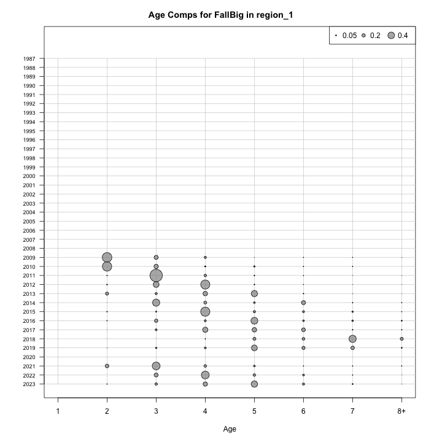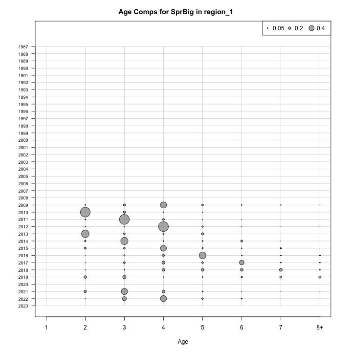

### Diagnostics

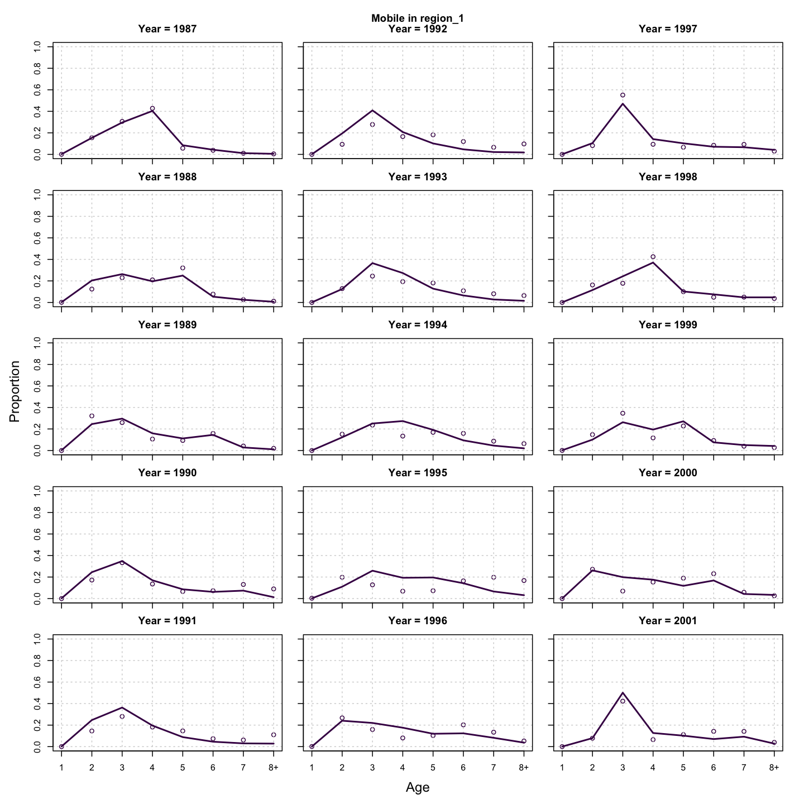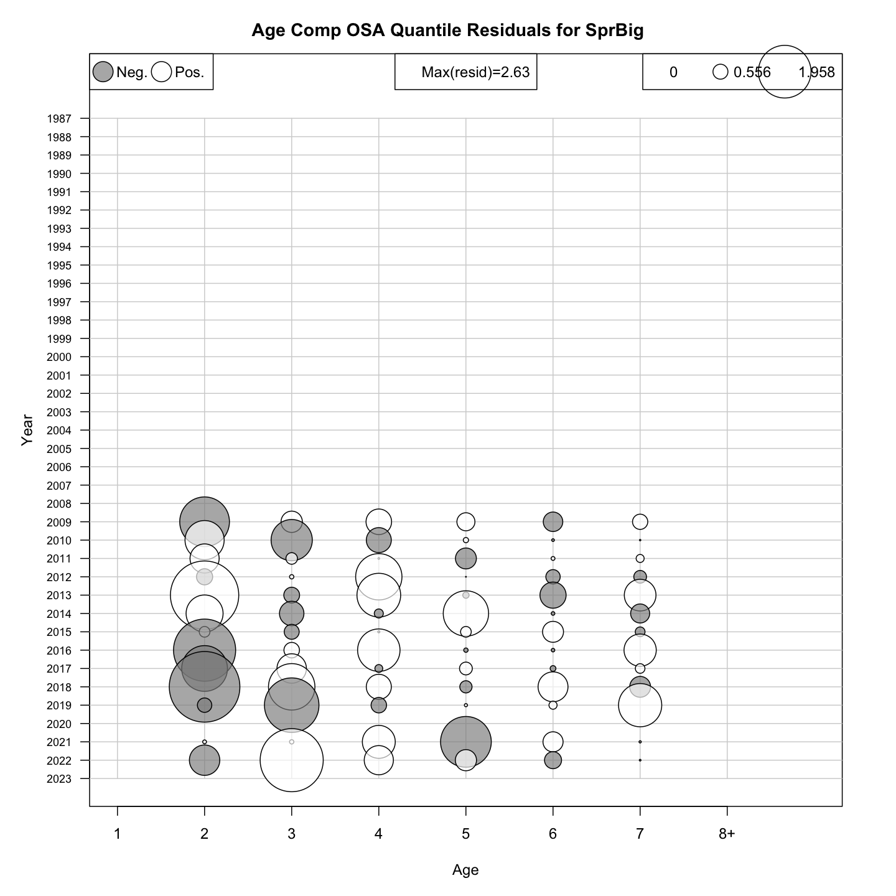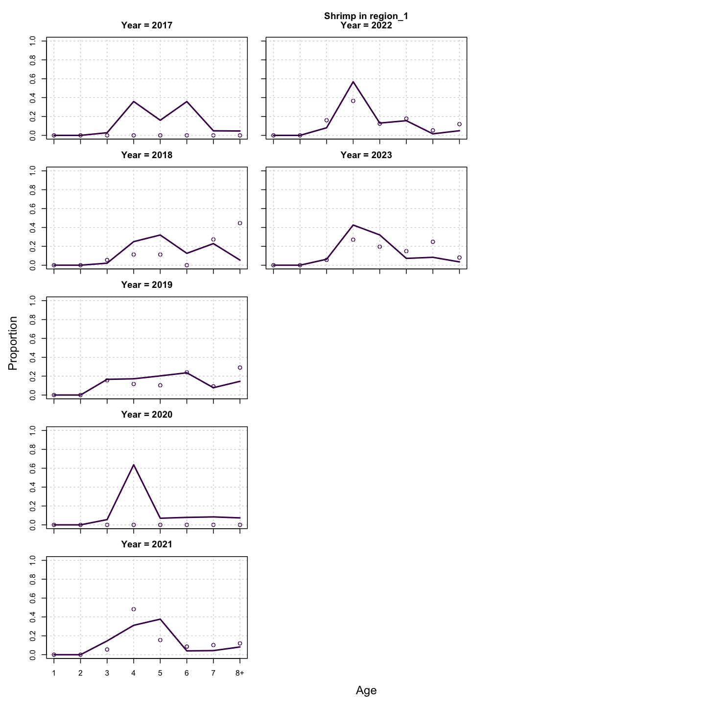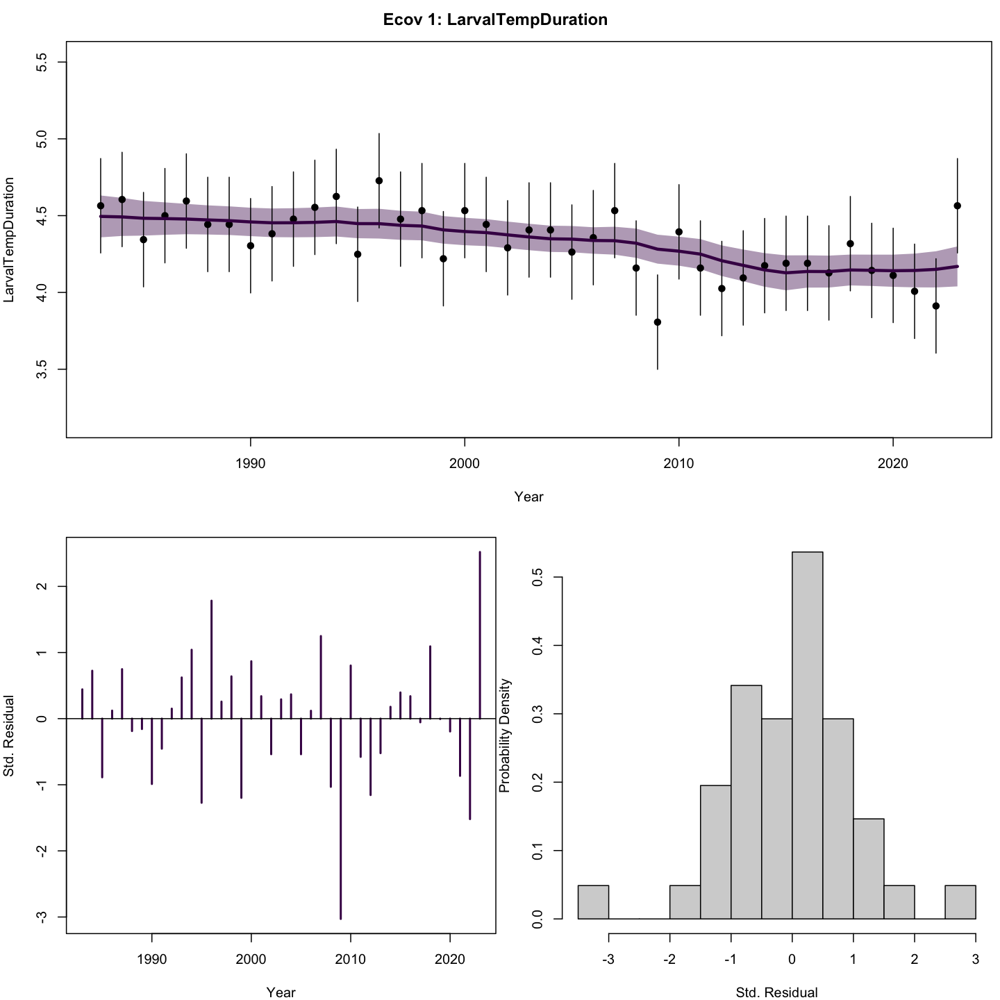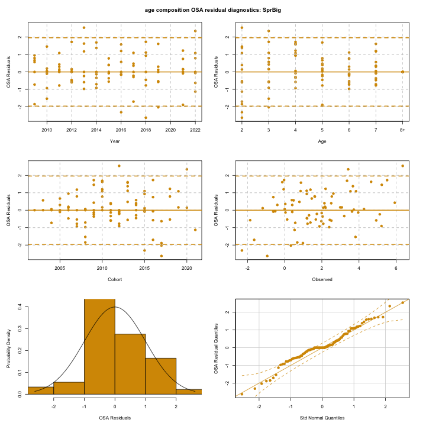

### Results

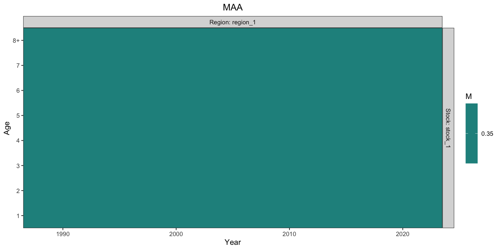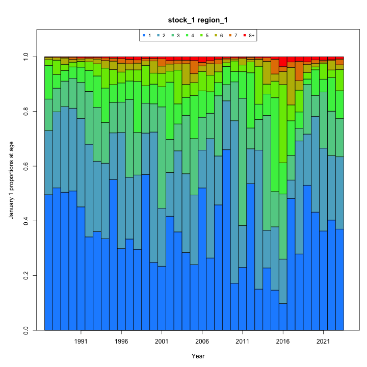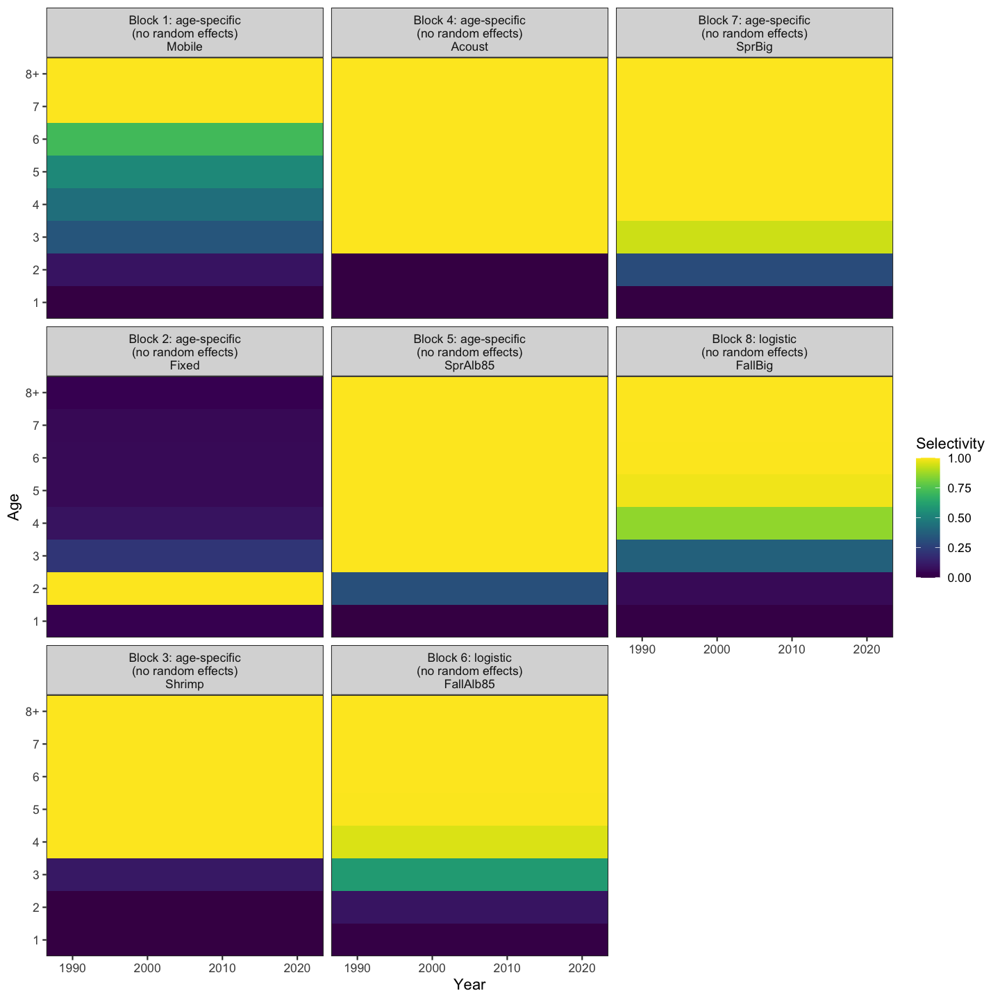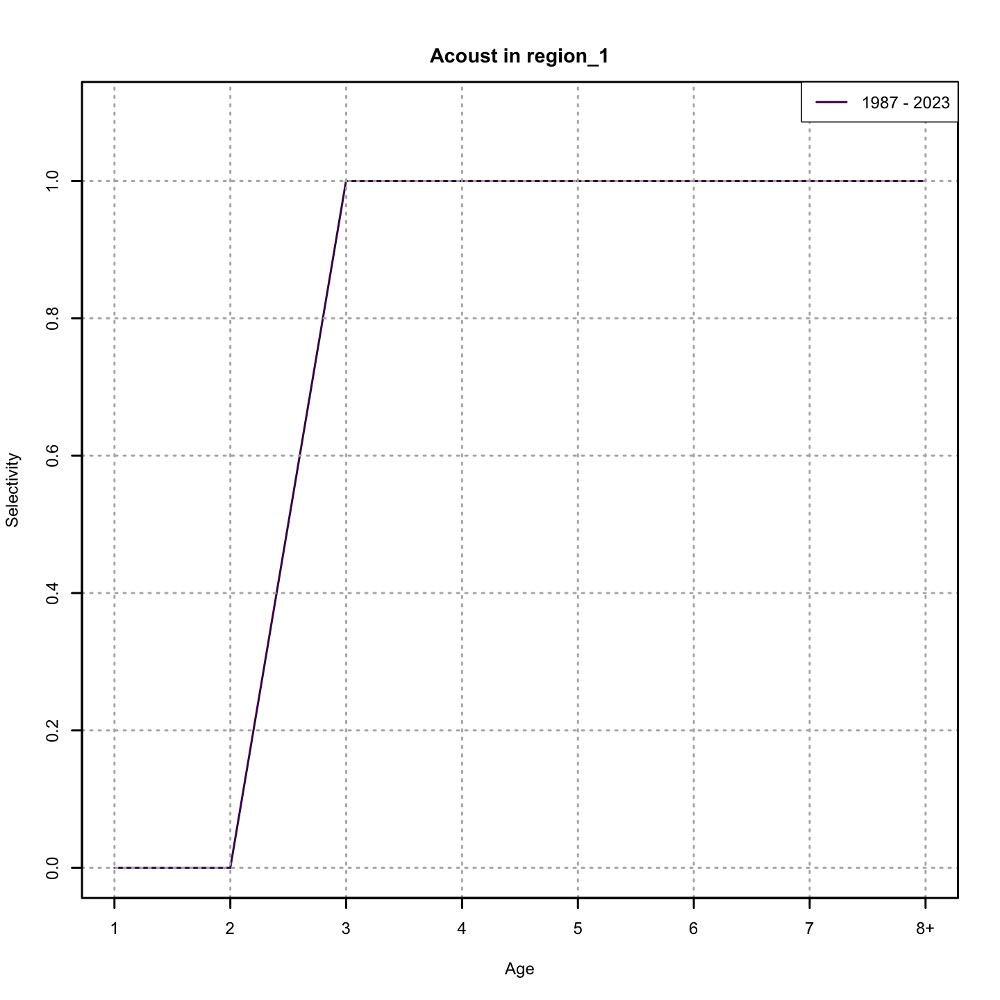

### Retro

### Reference points

### Miscellaneous

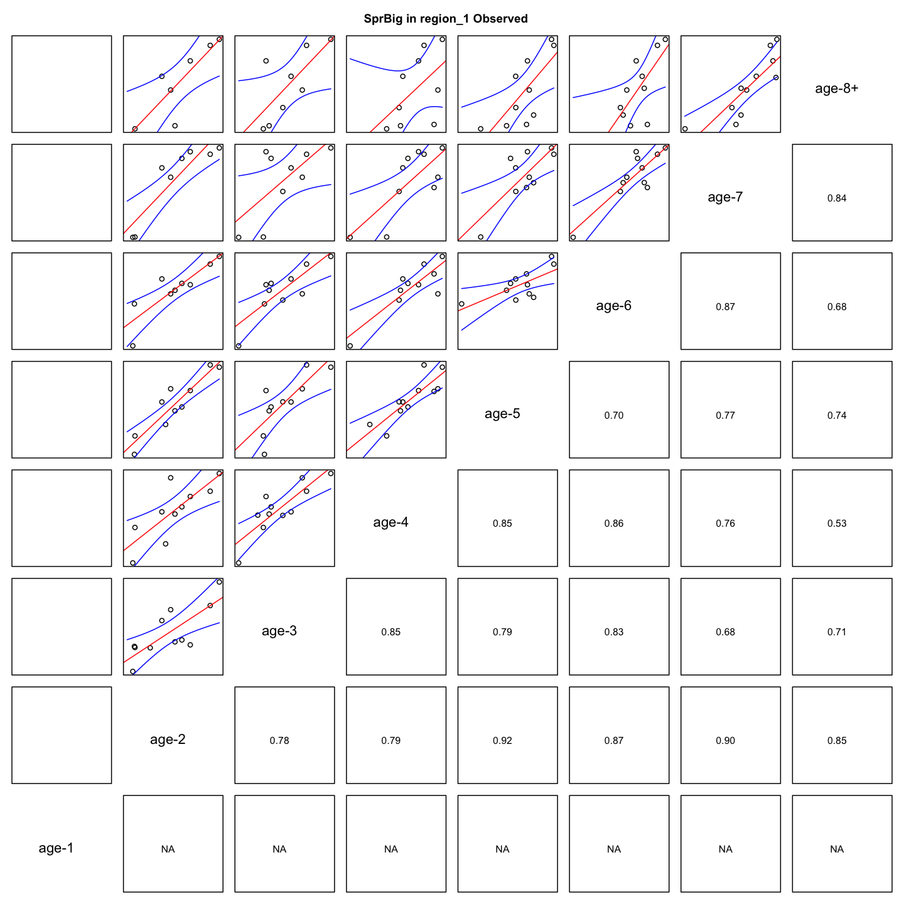

## Tables {.tabset}

### Parameter estimates

<table class="table" style="margin-left: auto; margin-right: auto;">
<caption>Parameter estimates, standard errors, and confidence intervals. Rounded to 3 decimal places.</caption>
 <thead>
  <tr>
   <th style="text-align:left;">   </th>
   <th style="text-align:right;"> Estimate </th>
   <th style="text-align:right;"> Std. Error </th>
   <th style="text-align:right;"> 95\% CI lower </th>
   <th style="text-align:right;"> 95\% CI upper </th>
  </tr>
 </thead>
<tbody>
  <tr>
   <td style="text-align:left;"> stock 1 mean log(R) intercept </td>
   <td style="text-align:right;"> $-7.387$ </td>
   <td style="text-align:right;"> $5.334$ </td>
   <td style="text-align:right;"> $-17.842$ </td>
   <td style="text-align:right;"> $3.068$ </td>
  </tr>
  <tr>
   <td style="text-align:left;"> stock 1 NAA $\sigma$ (age 1) </td>
   <td style="text-align:right;"> $0.503$ </td>
   <td style="text-align:right;"> $0.074$ </td>
   <td style="text-align:right;"> $0.377$ </td>
   <td style="text-align:right;"> $0.671$ </td>
  </tr>
  <tr>
   <td style="text-align:left;"> Shrimp fully selected q </td>
   <td style="text-align:right;"> $1.076\times 10^{-5}$ </td>
   <td style="text-align:right;"> $8.758\times 10^{-7}$ </td>
   <td style="text-align:right;"> $9.169\times 10^{-6}$ </td>
   <td style="text-align:right;"> $1.262\times 10^{-5}$ </td>
  </tr>
  <tr>
   <td style="text-align:left;"> Acoust fully selected q </td>
   <td style="text-align:right;"> $3.360\times 10^{-5}$ </td>
   <td style="text-align:right;"> $2.041\times 10^{-6}$ </td>
   <td style="text-align:right;"> $2.982\times 10^{-5}$ </td>
   <td style="text-align:right;"> $3.784\times 10^{-5}$ </td>
  </tr>
  <tr>
   <td style="text-align:left;"> SprAlb85 fully selected q </td>
   <td style="text-align:right;"> $6.685\times 10^{-6}$ </td>
   <td style="text-align:right;"> $5.076\times 10^{-7}$ </td>
   <td style="text-align:right;"> $5.761\times 10^{-6}$ </td>
   <td style="text-align:right;"> $7.758\times 10^{-6}$ </td>
  </tr>
  <tr>
   <td style="text-align:left;"> FallAlb85 fully selected q </td>
   <td style="text-align:right;"> $1.136\times 10^{-5}$ </td>
   <td style="text-align:right;"> $1.326\times 10^{-6}$ </td>
   <td style="text-align:right;"> $9.033\times 10^{-6}$ </td>
   <td style="text-align:right;"> $1.428\times 10^{-5}$ </td>
  </tr>
  <tr>
   <td style="text-align:left;"> SprBig fully selected q </td>
   <td style="text-align:right;"> $3.690\times 10^{-5}$ </td>
   <td style="text-align:right;"> $4.789\times 10^{-6}$ </td>
   <td style="text-align:right;"> $2.861\times 10^{-5}$ </td>
   <td style="text-align:right;"> $4.759\times 10^{-5}$ </td>
  </tr>
  <tr>
   <td style="text-align:left;"> FallBig fully selected q </td>
   <td style="text-align:right;"> $4.642\times 10^{-5}$ </td>
   <td style="text-align:right;"> $6.985\times 10^{-6}$ </td>
   <td style="text-align:right;"> $3.457\times 10^{-5}$ </td>
   <td style="text-align:right;"> $6.235\times 10^{-5}$ </td>
  </tr>
  <tr>
   <td style="text-align:left;"> Block 1: Mobile Selectivity for age 1 </td>
   <td style="text-align:right;"> $4.292\times 10^{-4}$ </td>
   <td style="text-align:right;"> $9.928\times 10^{-5}$ </td>
   <td style="text-align:right;"> $2.728\times 10^{-4}$ </td>
   <td style="text-align:right;"> $6.754\times 10^{-4}$ </td>
  </tr>
  <tr>
   <td style="text-align:left;"> Block 1: Mobile Selectivity for age 2 </td>
   <td style="text-align:right;"> $0.092$ </td>
   <td style="text-align:right;"> $0.016$ </td>
   <td style="text-align:right;"> $0.066$ </td>
   <td style="text-align:right;"> $0.128$ </td>
  </tr>
  <tr>
   <td style="text-align:left;"> Block 1: Mobile Selectivity for age 3 </td>
   <td style="text-align:right;"> $0.337$ </td>
   <td style="text-align:right;"> $0.052$ </td>
   <td style="text-align:right;"> $0.244$ </td>
   <td style="text-align:right;"> $0.445$ </td>
  </tr>
  <tr>
   <td style="text-align:left;"> Block 1: Mobile Selectivity for age 4 </td>
   <td style="text-align:right;"> $0.435$ </td>
   <td style="text-align:right;"> $0.063$ </td>
   <td style="text-align:right;"> $0.318$ </td>
   <td style="text-align:right;"> $0.559$ </td>
  </tr>
  <tr>
   <td style="text-align:left;"> Block 1: Mobile Selectivity for age 5 </td>
   <td style="text-align:right;"> $0.534$ </td>
   <td style="text-align:right;"> $0.069$ </td>
   <td style="text-align:right;"> $0.400$ </td>
   <td style="text-align:right;"> $0.663$ </td>
  </tr>
  <tr>
   <td style="text-align:left;"> Block 1: Mobile Selectivity for age 6 </td>
   <td style="text-align:right;"> $0.718$ </td>
   <td style="text-align:right;"> $0.072$ </td>
   <td style="text-align:right;"> $0.560$ </td>
   <td style="text-align:right;"> $0.837$ </td>
  </tr>
  <tr>
   <td style="text-align:left;"> Block 1: Mobile Selectivity for age 7 </td>
   <td style="text-align:right;"> $1.000$ </td>
   <td style="text-align:right;"> -- </td>
   <td style="text-align:right;"> -- </td>
   <td style="text-align:right;"> -- </td>
  </tr>
  <tr>
   <td style="text-align:left;"> Block 1: Mobile Selectivity for age 8+ </td>
   <td style="text-align:right;"> $1.000$ </td>
   <td style="text-align:right;"> -- </td>
   <td style="text-align:right;"> -- </td>
   <td style="text-align:right;"> -- </td>
  </tr>
  <tr>
   <td style="text-align:left;"> Block 2: Fixed Selectivity for age 1 </td>
   <td style="text-align:right;"> $0.038$ </td>
   <td style="text-align:right;"> $0.007$ </td>
   <td style="text-align:right;"> $0.027$ </td>
   <td style="text-align:right;"> $0.053$ </td>
  </tr>
  <tr>
   <td style="text-align:left;"> Block 2: Fixed Selectivity for age 2 </td>
   <td style="text-align:right;"> $1.000$ </td>
   <td style="text-align:right;"> -- </td>
   <td style="text-align:right;"> -- </td>
   <td style="text-align:right;"> -- </td>
  </tr>
  <tr>
   <td style="text-align:left;"> Block 2: Fixed Selectivity for age 3 </td>
   <td style="text-align:right;"> $0.215$ </td>
   <td style="text-align:right;"> $0.035$ </td>
   <td style="text-align:right;"> $0.154$ </td>
   <td style="text-align:right;"> $0.293$ </td>
  </tr>
  <tr>
   <td style="text-align:left;"> Block 2: Fixed Selectivity for age 4 </td>
   <td style="text-align:right;"> $0.088$ </td>
   <td style="text-align:right;"> $0.020$ </td>
   <td style="text-align:right;"> $0.056$ </td>
   <td style="text-align:right;"> $0.137$ </td>
  </tr>
  <tr>
   <td style="text-align:left;"> Block 2: Fixed Selectivity for age 5 </td>
   <td style="text-align:right;"> $0.060$ </td>
   <td style="text-align:right;"> $0.016$ </td>
   <td style="text-align:right;"> $0.034$ </td>
   <td style="text-align:right;"> $0.101$ </td>
  </tr>
  <tr>
   <td style="text-align:left;"> Block 2: Fixed Selectivity for age 6 </td>
   <td style="text-align:right;"> $0.057$ </td>
   <td style="text-align:right;"> $0.018$ </td>
   <td style="text-align:right;"> $0.031$ </td>
   <td style="text-align:right;"> $0.103$ </td>
  </tr>
  <tr>
   <td style="text-align:left;"> Block 2: Fixed Selectivity for age 7 </td>
   <td style="text-align:right;"> $0.055$ </td>
   <td style="text-align:right;"> $0.019$ </td>
   <td style="text-align:right;"> $0.028$ </td>
   <td style="text-align:right;"> $0.106$ </td>
  </tr>
  <tr>
   <td style="text-align:left;"> Block 2: Fixed Selectivity for age 8+ </td>
   <td style="text-align:right;"> $0.040$ </td>
   <td style="text-align:right;"> $0.014$ </td>
   <td style="text-align:right;"> $0.020$ </td>
   <td style="text-align:right;"> $0.079$ </td>
  </tr>
  <tr>
   <td style="text-align:left;"> Block 3: Shrimp Selectivity for age 1 </td>
   <td style="text-align:right;"> $0.000$ </td>
   <td style="text-align:right;"> -- </td>
   <td style="text-align:right;"> -- </td>
   <td style="text-align:right;"> -- </td>
  </tr>
  <tr>
   <td style="text-align:left;"> Block 3: Shrimp Selectivity for age 2 </td>
   <td style="text-align:right;"> $0.000$ </td>
   <td style="text-align:right;"> -- </td>
   <td style="text-align:right;"> -- </td>
   <td style="text-align:right;"> -- </td>
  </tr>
  <tr>
   <td style="text-align:left;"> Block 3: Shrimp Selectivity for age 3 </td>
   <td style="text-align:right;"> $0.107$ </td>
   <td style="text-align:right;"> $0.039$ </td>
   <td style="text-align:right;"> $0.051$ </td>
   <td style="text-align:right;"> $0.210$ </td>
  </tr>
  <tr>
   <td style="text-align:left;"> Block 3: Shrimp Selectivity for age 4 </td>
   <td style="text-align:right;"> $1.000$ </td>
   <td style="text-align:right;"> -- </td>
   <td style="text-align:right;"> -- </td>
   <td style="text-align:right;"> -- </td>
  </tr>
  <tr>
   <td style="text-align:left;"> Block 3: Shrimp Selectivity for age 5 </td>
   <td style="text-align:right;"> $1.000$ </td>
   <td style="text-align:right;"> -- </td>
   <td style="text-align:right;"> -- </td>
   <td style="text-align:right;"> -- </td>
  </tr>
  <tr>
   <td style="text-align:left;"> Block 3: Shrimp Selectivity for age 6 </td>
   <td style="text-align:right;"> $1.000$ </td>
   <td style="text-align:right;"> -- </td>
   <td style="text-align:right;"> -- </td>
   <td style="text-align:right;"> -- </td>
  </tr>
  <tr>
   <td style="text-align:left;"> Block 3: Shrimp Selectivity for age 7 </td>
   <td style="text-align:right;"> $1.000$ </td>
   <td style="text-align:right;"> -- </td>
   <td style="text-align:right;"> -- </td>
   <td style="text-align:right;"> -- </td>
  </tr>
  <tr>
   <td style="text-align:left;"> Block 3: Shrimp Selectivity for age 8+ </td>
   <td style="text-align:right;"> $1.000$ </td>
   <td style="text-align:right;"> -- </td>
   <td style="text-align:right;"> -- </td>
   <td style="text-align:right;"> -- </td>
  </tr>
  <tr>
   <td style="text-align:left;"> Block 4: Acoust Selectivity for age 1 </td>
   <td style="text-align:right;"> $0.000$ </td>
   <td style="text-align:right;"> -- </td>
   <td style="text-align:right;"> -- </td>
   <td style="text-align:right;"> -- </td>
  </tr>
  <tr>
   <td style="text-align:left;"> Block 4: Acoust Selectivity for age 2 </td>
   <td style="text-align:right;"> $0.000$ </td>
   <td style="text-align:right;"> -- </td>
   <td style="text-align:right;"> -- </td>
   <td style="text-align:right;"> -- </td>
  </tr>
  <tr>
   <td style="text-align:left;"> Block 4: Acoust Selectivity for age 3 </td>
   <td style="text-align:right;"> $1.000$ </td>
   <td style="text-align:right;"> -- </td>
   <td style="text-align:right;"> -- </td>
   <td style="text-align:right;"> -- </td>
  </tr>
  <tr>
   <td style="text-align:left;"> Block 4: Acoust Selectivity for age 4 </td>
   <td style="text-align:right;"> $1.000$ </td>
   <td style="text-align:right;"> -- </td>
   <td style="text-align:right;"> -- </td>
   <td style="text-align:right;"> -- </td>
  </tr>
  <tr>
   <td style="text-align:left;"> Block 4: Acoust Selectivity for age 5 </td>
   <td style="text-align:right;"> $1.000$ </td>
   <td style="text-align:right;"> -- </td>
   <td style="text-align:right;"> -- </td>
   <td style="text-align:right;"> -- </td>
  </tr>
  <tr>
   <td style="text-align:left;"> Block 4: Acoust Selectivity for age 6 </td>
   <td style="text-align:right;"> $1.000$ </td>
   <td style="text-align:right;"> -- </td>
   <td style="text-align:right;"> -- </td>
   <td style="text-align:right;"> -- </td>
  </tr>
  <tr>
   <td style="text-align:left;"> Block 4: Acoust Selectivity for age 7 </td>
   <td style="text-align:right;"> $1.000$ </td>
   <td style="text-align:right;"> -- </td>
   <td style="text-align:right;"> -- </td>
   <td style="text-align:right;"> -- </td>
  </tr>
  <tr>
   <td style="text-align:left;"> Block 4: Acoust Selectivity for age 8+ </td>
   <td style="text-align:right;"> $1.000$ </td>
   <td style="text-align:right;"> -- </td>
   <td style="text-align:right;"> -- </td>
   <td style="text-align:right;"> -- </td>
  </tr>
  <tr>
   <td style="text-align:left;"> Block 5: SprAlb85 Selectivity for age 1 </td>
   <td style="text-align:right;"> $0.000$ </td>
   <td style="text-align:right;"> -- </td>
   <td style="text-align:right;"> -- </td>
   <td style="text-align:right;"> -- </td>
  </tr>
  <tr>
   <td style="text-align:left;"> Block 5: SprAlb85 Selectivity for age 2 </td>
   <td style="text-align:right;"> $0.312$ </td>
   <td style="text-align:right;"> $0.049$ </td>
   <td style="text-align:right;"> $0.225$ </td>
   <td style="text-align:right;"> $0.415$ </td>
  </tr>
  <tr>
   <td style="text-align:left;"> Block 5: SprAlb85 Selectivity for age 3 </td>
   <td style="text-align:right;"> $1.000$ </td>
   <td style="text-align:right;"> -- </td>
   <td style="text-align:right;"> -- </td>
   <td style="text-align:right;"> -- </td>
  </tr>
  <tr>
   <td style="text-align:left;"> Block 5: SprAlb85 Selectivity for age 4 </td>
   <td style="text-align:right;"> $1.000$ </td>
   <td style="text-align:right;"> -- </td>
   <td style="text-align:right;"> -- </td>
   <td style="text-align:right;"> -- </td>
  </tr>
  <tr>
   <td style="text-align:left;"> Block 5: SprAlb85 Selectivity for age 5 </td>
   <td style="text-align:right;"> $1.000$ </td>
   <td style="text-align:right;"> -- </td>
   <td style="text-align:right;"> -- </td>
   <td style="text-align:right;"> -- </td>
  </tr>
  <tr>
   <td style="text-align:left;"> Block 5: SprAlb85 Selectivity for age 6 </td>
   <td style="text-align:right;"> $1.000$ </td>
   <td style="text-align:right;"> -- </td>
   <td style="text-align:right;"> -- </td>
   <td style="text-align:right;"> -- </td>
  </tr>
  <tr>
   <td style="text-align:left;"> Block 5: SprAlb85 Selectivity for age 7 </td>
   <td style="text-align:right;"> $1.000$ </td>
   <td style="text-align:right;"> -- </td>
   <td style="text-align:right;"> -- </td>
   <td style="text-align:right;"> -- </td>
  </tr>
  <tr>
   <td style="text-align:left;"> Block 5: SprAlb85 Selectivity for age 8+ </td>
   <td style="text-align:right;"> $1.000$ </td>
   <td style="text-align:right;"> -- </td>
   <td style="text-align:right;"> -- </td>
   <td style="text-align:right;"> -- </td>
  </tr>
  <tr>
   <td style="text-align:left;"> Block 6: FallAlb85 $a_{50}$ </td>
   <td style="text-align:right;"> $2.848$ </td>
   <td style="text-align:right;"> $0.154$ </td>
   <td style="text-align:right;"> $2.554$ </td>
   <td style="text-align:right;"> $3.157$ </td>
  </tr>
  <tr>
   <td style="text-align:left;"> Block 6: FallAlb85 1/slope (increasing) </td>
   <td style="text-align:right;"> $0.374$ </td>
   <td style="text-align:right;"> $0.045$ </td>
   <td style="text-align:right;"> $0.295$ </td>
   <td style="text-align:right;"> $0.473$ </td>
  </tr>
  <tr>
   <td style="text-align:left;"> Block 7: SprBig Selectivity for age 1 </td>
   <td style="text-align:right;"> $0.000$ </td>
   <td style="text-align:right;"> -- </td>
   <td style="text-align:right;"> -- </td>
   <td style="text-align:right;"> -- </td>
  </tr>
  <tr>
   <td style="text-align:left;"> Block 7: SprBig Selectivity for age 2 </td>
   <td style="text-align:right;"> $0.299$ </td>
   <td style="text-align:right;"> $0.072$ </td>
   <td style="text-align:right;"> $0.179$ </td>
   <td style="text-align:right;"> $0.454$ </td>
  </tr>
  <tr>
   <td style="text-align:left;"> Block 7: SprBig Selectivity for age 3 </td>
   <td style="text-align:right;"> $0.937$ </td>
   <td style="text-align:right;"> $0.167$ </td>
   <td style="text-align:right;"> $0.055$ </td>
   <td style="text-align:right;"> $1.000$ </td>
  </tr>
  <tr>
   <td style="text-align:left;"> Block 7: SprBig Selectivity for age 4 </td>
   <td style="text-align:right;"> $1.000$ </td>
   <td style="text-align:right;"> -- </td>
   <td style="text-align:right;"> -- </td>
   <td style="text-align:right;"> -- </td>
  </tr>
  <tr>
   <td style="text-align:left;"> Block 7: SprBig Selectivity for age 5 </td>
   <td style="text-align:right;"> $1.000$ </td>
   <td style="text-align:right;"> -- </td>
   <td style="text-align:right;"> -- </td>
   <td style="text-align:right;"> -- </td>
  </tr>
  <tr>
   <td style="text-align:left;"> Block 7: SprBig Selectivity for age 6 </td>
   <td style="text-align:right;"> $1.000$ </td>
   <td style="text-align:right;"> -- </td>
   <td style="text-align:right;"> -- </td>
   <td style="text-align:right;"> -- </td>
  </tr>
  <tr>
   <td style="text-align:left;"> Block 7: SprBig Selectivity for age 7 </td>
   <td style="text-align:right;"> $1.000$ </td>
   <td style="text-align:right;"> -- </td>
   <td style="text-align:right;"> -- </td>
   <td style="text-align:right;"> -- </td>
  </tr>
  <tr>
   <td style="text-align:left;"> Block 7: SprBig Selectivity for age 8+ </td>
   <td style="text-align:right;"> $1.000$ </td>
   <td style="text-align:right;"> -- </td>
   <td style="text-align:right;"> -- </td>
   <td style="text-align:right;"> -- </td>
  </tr>
  <tr>
   <td style="text-align:left;"> Block 8: FallBig $a_{50}$ </td>
   <td style="text-align:right;"> $3.213$ </td>
   <td style="text-align:right;"> $0.212$ </td>
   <td style="text-align:right;"> $2.808$ </td>
   <td style="text-align:right;"> $3.635$ </td>
  </tr>
  <tr>
   <td style="text-align:left;"> Block 8: FallBig 1/slope (increasing) </td>
   <td style="text-align:right;"> $0.438$ </td>
   <td style="text-align:right;"> $0.060$ </td>
   <td style="text-align:right;"> $0.333$ </td>
   <td style="text-align:right;"> $0.572$ </td>
  </tr>
  <tr>
   <td style="text-align:left;"> Mobile in region 1 age comp, logistic-normal: $\sigma$ </td>
   <td style="text-align:right;"> $16.844$ </td>
   <td style="text-align:right;"> $1.650$ </td>
   <td style="text-align:right;"> $13.902$ </td>
   <td style="text-align:right;"> $20.409$ </td>
  </tr>
  <tr>
   <td style="text-align:left;"> Mobile in region 1 age comp, logistic-normal: $\rho$ </td>
   <td style="text-align:right;"> $0.882$ </td>
   <td style="text-align:right;"> $0.025$ </td>
   <td style="text-align:right;"> $0.824$ </td>
   <td style="text-align:right;"> $0.922$ </td>
  </tr>
  <tr>
   <td style="text-align:left;"> Fixed in region 1 age comp, logistic-normal: $\sigma$ </td>
   <td style="text-align:right;"> $29.665$ </td>
   <td style="text-align:right;"> $2.742$ </td>
   <td style="text-align:right;"> $24.750$ </td>
   <td style="text-align:right;"> $35.556$ </td>
  </tr>
  <tr>
   <td style="text-align:left;"> Fixed in region 1 age comp, logistic-normal: $\rho$ </td>
   <td style="text-align:right;"> $0.848$ </td>
   <td style="text-align:right;"> $0.031$ </td>
   <td style="text-align:right;"> $0.778$ </td>
   <td style="text-align:right;"> $0.898$ </td>
  </tr>
  <tr>
   <td style="text-align:left;"> Shrimp in region 1 age comp, logistic-normal: $\sigma$ </td>
   <td style="text-align:right;"> $15.907$ </td>
   <td style="text-align:right;"> $3.603$ </td>
   <td style="text-align:right;"> $10.205$ </td>
   <td style="text-align:right;"> $24.797$ </td>
  </tr>
  <tr>
   <td style="text-align:left;"> Shrimp in region 1 age comp, logistic-normal: $\rho$ </td>
   <td style="text-align:right;"> $0.742$ </td>
   <td style="text-align:right;"> $0.127$ </td>
   <td style="text-align:right;"> $0.439$ </td>
   <td style="text-align:right;"> $0.914$ </td>
  </tr>
  <tr>
   <td style="text-align:left;"> SprAlb85 in region 1 age comp, logistic-normal: $\sigma$ </td>
   <td style="text-align:right;"> $21.773$ </td>
   <td style="text-align:right;"> $2.546$ </td>
   <td style="text-align:right;"> $17.314$ </td>
   <td style="text-align:right;"> $27.380$ </td>
  </tr>
  <tr>
   <td style="text-align:left;"> SprAlb85 in region 1 age comp, logistic-normal: $\rho$ </td>
   <td style="text-align:right;"> $0.827$ </td>
   <td style="text-align:right;"> $0.045$ </td>
   <td style="text-align:right;"> $0.721$ </td>
   <td style="text-align:right;"> $0.898$ </td>
  </tr>
  <tr>
   <td style="text-align:left;"> FallAlb85 in region 1 age comp, logistic-normal: $\sigma$ </td>
   <td style="text-align:right;"> $21.584$ </td>
   <td style="text-align:right;"> $2.799$ </td>
   <td style="text-align:right;"> $16.740$ </td>
   <td style="text-align:right;"> $27.830$ </td>
  </tr>
  <tr>
   <td style="text-align:left;"> FallAlb85 in region 1 age comp, logistic-normal: $\rho$ </td>
   <td style="text-align:right;"> $0.898$ </td>
   <td style="text-align:right;"> $0.029$ </td>
   <td style="text-align:right;"> $0.827$ </td>
   <td style="text-align:right;"> $0.942$ </td>
  </tr>
  <tr>
   <td style="text-align:left;"> SprBig in region 1 age comp, logistic-normal: $\sigma$ </td>
   <td style="text-align:right;"> $17.996$ </td>
   <td style="text-align:right;"> $2.707$ </td>
   <td style="text-align:right;"> $13.401$ </td>
   <td style="text-align:right;"> $24.166$ </td>
  </tr>
  <tr>
   <td style="text-align:left;"> SprBig in region 1 age comp, logistic-normal: $\rho$ </td>
   <td style="text-align:right;"> $0.770$ </td>
   <td style="text-align:right;"> $0.078$ </td>
   <td style="text-align:right;"> $0.586$ </td>
   <td style="text-align:right;"> $0.888$ </td>
  </tr>
  <tr>
   <td style="text-align:left;"> FallBig in region 1 age comp, logistic-normal: $\sigma$ </td>
   <td style="text-align:right;"> $24.025$ </td>
   <td style="text-align:right;"> $3.873$ </td>
   <td style="text-align:right;"> $17.517$ </td>
   <td style="text-align:right;"> $32.951$ </td>
  </tr>
  <tr>
   <td style="text-align:left;"> FallBig in region 1 age comp, logistic-normal: $\rho$ </td>
   <td style="text-align:right;"> $0.876$ </td>
   <td style="text-align:right;"> $0.045$ </td>
   <td style="text-align:right;"> $0.760$ </td>
   <td style="text-align:right;"> $0.940$ </td>
  </tr>
  <tr>
   <td style="text-align:left;"> Ecov LarvalTempDuration: RW Ecov$_1$ </td>
   <td style="text-align:right;"> $4.495$ </td>
   <td style="text-align:right;"> $0.070$ </td>
   <td style="text-align:right;"> $4.359$ </td>
   <td style="text-align:right;"> $4.631$ </td>
  </tr>
  <tr>
   <td style="text-align:left;"> Ecov LarvalTempDuration: RW $\sigma$ </td>
   <td style="text-align:right;"> $0.034$ </td>
   <td style="text-align:right;"> $0.012$ </td>
   <td style="text-align:right;"> $0.018$ </td>
   <td style="text-align:right;"> $0.067$ </td>
  </tr>
  <tr>
   <td style="text-align:left;"> stock 1 Recruitment Ecov: LarvalTempDuration $\beta_1$ </td>
   <td style="text-align:right;"> $5.122$ </td>
   <td style="text-align:right;"> $1.231$ </td>
   <td style="text-align:right;"> $2.709$ </td>
   <td style="text-align:right;"> $7.535$ </td>
  </tr>
  <tr>
   <td style="text-align:left;"> Ecov: LarvalTempDuration obs. sd. </td>
   <td style="text-align:right;"> $0.157$ </td>
   <td style="text-align:right;"> $0.018$ </td>
   <td style="text-align:right;"> $0.125$ </td>
   <td style="text-align:right;"> $0.197$ </td>
  </tr>
</tbody>
</table>

### Abundance at age

<table class="table" style="margin-left: auto; margin-right: auto;">
<caption>Abundance at age (1000s) for stock 1 in region 1.</caption>
 <thead>
  <tr>
   <th style="text-align:left;">   </th>
   <th style="text-align:right;"> 1 </th>
   <th style="text-align:right;"> 2 </th>
   <th style="text-align:right;"> 3 </th>
   <th style="text-align:right;"> 4 </th>
   <th style="text-align:right;"> 5 </th>
   <th style="text-align:right;"> 6 </th>
   <th style="text-align:right;"> 7 </th>
   <th style="text-align:right;"> 8+ </th>
  </tr>
 </thead>
<tbody>
  <tr>
   <td style="text-align:left;"> 1987 </td>
   <td style="text-align:right;"> 3862594 </td>
   <td style="text-align:right;"> 1825258 </td>
   <td style="text-align:right;"> 899066 </td>
   <td style="text-align:right;"> 954373 </td>
   <td style="text-align:right;"> 166668 </td>
   <td style="text-align:right;"> 66041 </td>
   <td style="text-align:right;"> 13312 </td>
   <td style="text-align:right;"> 6166 </td>
  </tr>
  <tr>
   <td style="text-align:left;"> 1988 </td>
   <td style="text-align:right;"> 5023003 </td>
   <td style="text-align:right;"> 2682819 </td>
   <td style="text-align:right;"> 835335 </td>
   <td style="text-align:right;"> 480903 </td>
   <td style="text-align:right;"> 506378 </td>
   <td style="text-align:right;"> 84432 </td>
   <td style="text-align:right;"> 30112 </td>
   <td style="text-align:right;"> 7570 </td>
  </tr>
  <tr>
   <td style="text-align:left;"> 1989 </td>
   <td style="text-align:right;"> 5585612 </td>
   <td style="text-align:right;"> 3465956 </td>
   <td style="text-align:right;"> 1031198 </td>
   <td style="text-align:right;"> 430780 </td>
   <td style="text-align:right;"> 251593 </td>
   <td style="text-align:right;"> 254300 </td>
   <td style="text-align:right;"> 38204 </td>
   <td style="text-align:right;"> 14549 </td>
  </tr>
  <tr>
   <td style="text-align:left;"> 1990 </td>
   <td style="text-align:right;"> 6505032 </td>
   <td style="text-align:right;"> 3861804 </td>
   <td style="text-align:right;"> 1399229 </td>
   <td style="text-align:right;"> 529916 </td>
   <td style="text-align:right;"> 222108 </td>
   <td style="text-align:right;"> 123782 </td>
   <td style="text-align:right;"> 111793 </td>
   <td style="text-align:right;"> 19549 </td>
  </tr>
  <tr>
   <td style="text-align:left;"> 1991 </td>
   <td style="text-align:right;"> 6306232 </td>
   <td style="text-align:right;"> 4523065 </td>
   <td style="text-align:right;"> 1835158 </td>
   <td style="text-align:right;"> 780938 </td>
   <td style="text-align:right;"> 295451 </td>
   <td style="text-align:right;"> 119419 </td>
   <td style="text-align:right;"> 61108 </td>
   <td style="text-align:right;"> 56921 </td>
  </tr>
  <tr>
   <td style="text-align:left;"> 1992 </td>
   <td style="text-align:right;"> 4446004 </td>
   <td style="text-align:right;"> 4412814 </td>
   <td style="text-align:right;"> 2510258 </td>
   <td style="text-align:right;"> 1002395 </td>
   <td style="text-align:right;"> 410007 </td>
   <td style="text-align:right;"> 146310 </td>
   <td style="text-align:right;"> 52567 </td>
   <td style="text-align:right;"> 43450 </td>
  </tr>
  <tr>
   <td style="text-align:left;"> 1993 </td>
   <td style="text-align:right;"> 4360115 </td>
   <td style="text-align:right;"> 3107383 </td>
   <td style="text-align:right;"> 2382580 </td>
   <td style="text-align:right;"> 1386623 </td>
   <td style="text-align:right;"> 537232 </td>
   <td style="text-align:right;"> 208577 </td>
   <td style="text-align:right;"> 66830 </td>
   <td style="text-align:right;"> 37248 </td>
  </tr>
  <tr>
   <td style="text-align:left;"> 1994 </td>
   <td style="text-align:right;"> 3693937 </td>
   <td style="text-align:right;"> 3043030 </td>
   <td style="text-align:right;"> 1640731 </td>
   <td style="text-align:right;"> 1391677 </td>
   <td style="text-align:right;"> 804650 </td>
   <td style="text-align:right;"> 301930 </td>
   <td style="text-align:right;"> 109042 </td>
   <td style="text-align:right;"> 48763 </td>
  </tr>
  <tr>
   <td style="text-align:left;"> 1995 </td>
   <td style="text-align:right;"> 8358441 </td>
   <td style="text-align:right;"> 2582026 </td>
   <td style="text-align:right;"> 1682403 </td>
   <td style="text-align:right;"> 988603 </td>
   <td style="text-align:right;"> 834270 </td>
   <td style="text-align:right;"> 469731 </td>
   <td style="text-align:right;"> 165970 </td>
   <td style="text-align:right;"> 79180 </td>
  </tr>
  <tr>
   <td style="text-align:left;"> 1996 </td>
   <td style="text-align:right;"> 4123145 </td>
   <td style="text-align:right;"> 5860962 </td>
   <td style="text-align:right;"> 1529618 </td>
   <td style="text-align:right;"> 970114 </td>
   <td style="text-align:right;"> 550959 </td>
   <td style="text-align:right;"> 443404 </td>
   <td style="text-align:right;"> 227127 </td>
   <td style="text-align:right;"> 102644 </td>
  </tr>
  <tr>
   <td style="text-align:left;"> 1997 </td>
   <td style="text-align:right;"> 4284677 </td>
   <td style="text-align:right;"> 2897281 </td>
   <td style="text-align:right;"> 3650110 </td>
   <td style="text-align:right;"> 869910 </td>
   <td style="text-align:right;"> 525412 </td>
   <td style="text-align:right;"> 281926 </td>
   <td style="text-align:right;"> 203455 </td>
   <td style="text-align:right;"> 128151 </td>
  </tr>
  <tr>
   <td style="text-align:left;"> 1998 </td>
   <td style="text-align:right;"> 3279901 </td>
   <td style="text-align:right;"> 3005249 </td>
   <td style="text-align:right;"> 1720233 </td>
   <td style="text-align:right;"> 2064595 </td>
   <td style="text-align:right;"> 472215 </td>
   <td style="text-align:right;"> 270257 </td>
   <td style="text-align:right;"> 130420 </td>
   <td style="text-align:right;"> 130537 </td>
  </tr>
  <tr>
   <td style="text-align:left;"> 1999 </td>
   <td style="text-align:right;"> 8621839 </td>
   <td style="text-align:right;"> 2293738 </td>
   <td style="text-align:right;"> 1653910 </td>
   <td style="text-align:right;"> 966566 </td>
   <td style="text-align:right;"> 1127820 </td>
   <td style="text-align:right;"> 245732 </td>
   <td style="text-align:right;"> 127224 </td>
   <td style="text-align:right;"> 105537 </td>
  </tr>
  <tr>
   <td style="text-align:left;"> 2000 </td>
   <td style="text-align:right;"> 3144156 </td>
   <td style="text-align:right;"> 6038862 </td>
   <td style="text-align:right;"> 1306647 </td>
   <td style="text-align:right;"> 912035 </td>
   <td style="text-align:right;"> 511314 </td>
   <td style="text-align:right;"> 563024 </td>
   <td style="text-align:right;"> 109285 </td>
   <td style="text-align:right;"> 86845 </td>
  </tr>
  <tr>
   <td style="text-align:left;"> 2001 </td>
   <td style="text-align:right;"> 2438317 </td>
   <td style="text-align:right;"> 2210908 </td>
   <td style="text-align:right;"> 3857578 </td>
   <td style="text-align:right;"> 767151 </td>
   <td style="text-align:right;"> 512931 </td>
   <td style="text-align:right;"> 273802 </td>
   <td style="text-align:right;"> 274519 </td>
   <td style="text-align:right;"> 82907 </td>
  </tr>
  <tr>
   <td style="text-align:left;"> 2002 </td>
   <td style="text-align:right;"> 4451996 </td>
   <td style="text-align:right;"> 1708901 </td>
   <td style="text-align:right;"> 1294743 </td>
   <td style="text-align:right;"> 2234151 </td>
   <td style="text-align:right;"> 431066 </td>
   <td style="text-align:right;"> 275563 </td>
   <td style="text-align:right;"> 134362 </td>
   <td style="text-align:right;"> 152794 </td>
  </tr>
  <tr>
   <td style="text-align:left;"> 2003 </td>
   <td style="text-align:right;"> 3792120 </td>
   <td style="text-align:right;"> 3123429 </td>
   <td style="text-align:right;"> 1035049 </td>
   <td style="text-align:right;"> 773613 </td>
   <td style="text-align:right;"> 1300269 </td>
   <td style="text-align:right;"> 241480 </td>
   <td style="text-align:right;"> 142971 </td>
   <td style="text-align:right;"> 132620 </td>
  </tr>
  <tr>
   <td style="text-align:left;"> 2004 </td>
   <td style="text-align:right;"> 2626656 </td>
   <td style="text-align:right;"> 2665246 </td>
   <td style="text-align:right;"> 1971494 </td>
   <td style="text-align:right;"> 608469 </td>
   <td style="text-align:right;"> 436877 </td>
   <td style="text-align:right;"> 700260 </td>
   <td style="text-align:right;"> 118684 </td>
   <td style="text-align:right;"> 117849 </td>
  </tr>
  <tr>
   <td style="text-align:left;"> 2005 </td>
   <td style="text-align:right;"> 1731985 </td>
   <td style="text-align:right;"> 1837515 </td>
   <td style="text-align:right;"> 1487820 </td>
   <td style="text-align:right;"> 1134775 </td>
   <td style="text-align:right;"> 342349 </td>
   <td style="text-align:right;"> 235650 </td>
   <td style="text-align:right;"> 345893 </td>
   <td style="text-align:right;"> 102256 </td>
  </tr>
  <tr>
   <td style="text-align:left;"> 2006 </td>
   <td style="text-align:right;"> 4565638 </td>
   <td style="text-align:right;"> 1213161 </td>
   <td style="text-align:right;"> 1055350 </td>
   <td style="text-align:right;"> 844736 </td>
   <td style="text-align:right;"> 623271 </td>
   <td style="text-align:right;"> 178975 </td>
   <td style="text-align:right;"> 111512 </td>
   <td style="text-align:right;"> 182201 </td>
  </tr>
  <tr>
   <td style="text-align:left;"> 2007 </td>
   <td style="text-align:right;"> 1934580 </td>
   <td style="text-align:right;"> 3195545 </td>
   <td style="text-align:right;"> 677219 </td>
   <td style="text-align:right;"> 576768 </td>
   <td style="text-align:right;"> 443313 </td>
   <td style="text-align:right;"> 308396 </td>
   <td style="text-align:right;"> 78685 </td>
   <td style="text-align:right;"> 107957 </td>
  </tr>
  <tr>
   <td style="text-align:left;"> 2008 </td>
   <td style="text-align:right;"> 3462688 </td>
   <td style="text-align:right;"> 1350577 </td>
   <td style="text-align:right;"> 1663741 </td>
   <td style="text-align:right;"> 362258 </td>
   <td style="text-align:right;"> 298229 </td>
   <td style="text-align:right;"> 216111 </td>
   <td style="text-align:right;"> 133104 </td>
   <td style="text-align:right;"> 67003 </td>
  </tr>
  <tr>
   <td style="text-align:left;"> 2009 </td>
   <td style="text-align:right;"> 8980292 </td>
   <td style="text-align:right;"> 2430059 </td>
   <td style="text-align:right;"> 804668 </td>
   <td style="text-align:right;"> 900913 </td>
   <td style="text-align:right;"> 185331 </td>
   <td style="text-align:right;"> 142515 </td>
   <td style="text-align:right;"> 90511 </td>
   <td style="text-align:right;"> 68552 </td>
  </tr>
  <tr>
   <td style="text-align:left;"> 2010 </td>
   <td style="text-align:right;"> 1828935 </td>
   <td style="text-align:right;"> 6317403 </td>
   <td style="text-align:right;"> 1508579 </td>
   <td style="text-align:right;"> 401869 </td>
   <td style="text-align:right;"> 410046 </td>
   <td style="text-align:right;"> 76460 </td>
   <td style="text-align:right;"> 48902 </td>
   <td style="text-align:right;"> 41211 </td>
  </tr>
  <tr>
   <td style="text-align:left;"> 2011 </td>
   <td style="text-align:right;"> 1933086 </td>
   <td style="text-align:right;"> 1285477 </td>
   <td style="text-align:right;"> 3912080 </td>
   <td style="text-align:right;"> 817361 </td>
   <td style="text-align:right;"> 204165 </td>
   <td style="text-align:right;"> 193886 </td>
   <td style="text-align:right;"> 31540 </td>
   <td style="text-align:right;"> 30192 </td>
  </tr>
  <tr>
   <td style="text-align:left;"> 2012 </td>
   <td style="text-align:right;"> 5714762 </td>
   <td style="text-align:right;"> 1359350 </td>
   <td style="text-align:right;"> 809026 </td>
   <td style="text-align:right;"> 2152666 </td>
   <td style="text-align:right;"> 422604 </td>
   <td style="text-align:right;"> 98580 </td>
   <td style="text-align:right;"> 82240 </td>
   <td style="text-align:right;"> 21494 </td>
  </tr>
  <tr>
   <td style="text-align:left;"> 2013 </td>
   <td style="text-align:right;"> 1192566 </td>
   <td style="text-align:right;"> 4024884 </td>
   <td style="text-align:right;"> 888838 </td>
   <td style="text-align:right;"> 443359 </td>
   <td style="text-align:right;"> 1098449 </td>
   <td style="text-align:right;"> 200367 </td>
   <td style="text-align:right;"> 40762 </td>
   <td style="text-align:right;"> 34812 </td>
  </tr>
  <tr>
   <td style="text-align:left;"> 2014 </td>
   <td style="text-align:right;"> 1388543 </td>
   <td style="text-align:right;"> 839138 </td>
   <td style="text-align:right;"> 2557363 </td>
   <td style="text-align:right;"> 476723 </td>
   <td style="text-align:right;"> 221053 </td>
   <td style="text-align:right;"> 506789 </td>
   <td style="text-align:right;"> 79909 </td>
   <td style="text-align:right;"> 24136 </td>
  </tr>
  <tr>
   <td style="text-align:left;"> 2015 </td>
   <td style="text-align:right;"> 619083 </td>
   <td style="text-align:right;"> 977173 </td>
   <td style="text-align:right;"> 542201 </td>
   <td style="text-align:right;"> 1448793 </td>
   <td style="text-align:right;"> 254965 </td>
   <td style="text-align:right;"> 111158 </td>
   <td style="text-align:right;"> 226935 </td>
   <td style="text-align:right;"> 39036 </td>
  </tr>
  <tr>
   <td style="text-align:left;"> 2016 </td>
   <td style="text-align:right;"> 261606 </td>
   <td style="text-align:right;"> 435879 </td>
   <td style="text-align:right;"> 638019 </td>
   <td style="text-align:right;"> 305347 </td>
   <td style="text-align:right;"> 767086 </td>
   <td style="text-align:right;"> 126554 </td>
   <td style="text-align:right;"> 48897 </td>
   <td style="text-align:right;"> 97310 </td>
  </tr>
  <tr>
   <td style="text-align:left;"> 2017 </td>
   <td style="text-align:right;"> 1324575 </td>
   <td style="text-align:right;"> 183230 </td>
   <td style="text-align:right;"> 247545 </td>
   <td style="text-align:right;"> 347805 </td>
   <td style="text-align:right;"> 159148 </td>
   <td style="text-align:right;"> 376016 </td>
   <td style="text-align:right;"> 54917 </td>
   <td style="text-align:right;"> 52744 </td>
  </tr>
  <tr>
   <td style="text-align:left;"> 2018 </td>
   <td style="text-align:right;"> 626518 </td>
   <td style="text-align:right;"> 927948 </td>
   <td style="text-align:right;"> 104437 </td>
   <td style="text-align:right;"> 133841 </td>
   <td style="text-align:right;"> 179158 </td>
   <td style="text-align:right;"> 76870 </td>
   <td style="text-align:right;"> 159939 </td>
   <td style="text-align:right;"> 37750 </td>
  </tr>
  <tr>
   <td style="text-align:left;"> 2019 </td>
   <td style="text-align:right;"> 1235344 </td>
   <td style="text-align:right;"> 435808 </td>
   <td style="text-align:right;"> 422140 </td>
   <td style="text-align:right;"> 46622 </td>
   <td style="text-align:right;"> 55764 </td>
   <td style="text-align:right;"> 67286 </td>
   <td style="text-align:right;"> 23405 </td>
   <td style="text-align:right;"> 43713 </td>
  </tr>
  <tr>
   <td style="text-align:left;"> 2020 </td>
   <td style="text-align:right;"> 1055371 </td>
   <td style="text-align:right;"> 855657 </td>
   <td style="text-align:right;"> 186744 </td>
   <td style="text-align:right;"> 229477 </td>
   <td style="text-align:right;"> 25616 </td>
   <td style="text-align:right;"> 29596 </td>
   <td style="text-align:right;"> 32720 </td>
   <td style="text-align:right;"> 28660 </td>
  </tr>
  <tr>
   <td style="text-align:left;"> 2021 </td>
   <td style="text-align:right;"> 886525 </td>
   <td style="text-align:right;"> 739304 </td>
   <td style="text-align:right;"> 501403 </td>
   <td style="text-align:right;"> 114013 </td>
   <td style="text-align:right;"> 138397 </td>
   <td style="text-align:right;"> 15022 </td>
   <td style="text-align:right;"> 16347 </td>
   <td style="text-align:right;"> 30965 </td>
  </tr>
  <tr>
   <td style="text-align:left;"> 2022 </td>
   <td style="text-align:right;"> 1061686 </td>
   <td style="text-align:right;"> 620391 </td>
   <td style="text-align:right;"> 427863 </td>
   <td style="text-align:right;"> 323406 </td>
   <td style="text-align:right;"> 74212 </td>
   <td style="text-align:right;"> 89264 </td>
   <td style="text-align:right;"> 9437 </td>
   <td style="text-align:right;"> 28592 </td>
  </tr>
  <tr>
   <td style="text-align:left;"> 2023 </td>
   <td style="text-align:right;"> 1043716 </td>
   <td style="text-align:right;"> 745411 </td>
   <td style="text-align:right;"> 393756 </td>
   <td style="text-align:right;"> 287081 </td>
   <td style="text-align:right;"> 217896 </td>
   <td style="text-align:right;"> 49726 </td>
   <td style="text-align:right;"> 58912 </td>
   <td style="text-align:right;"> 24546 </td>
  </tr>
</tbody>
</table>

### Fishing mortality at age by region

<table class="table" style="margin-left: auto; margin-right: auto;">
<caption>Total fishing mortality at age in region 1.</caption>
 <thead>
  <tr>
   <th style="text-align:left;">   </th>
   <th style="text-align:right;"> 1 </th>
   <th style="text-align:right;"> 2 </th>
   <th style="text-align:right;"> 3 </th>
   <th style="text-align:right;"> 4 </th>
   <th style="text-align:right;"> 5 </th>
   <th style="text-align:right;"> 6 </th>
   <th style="text-align:right;"> 7 </th>
   <th style="text-align:right;"> 8+ </th>
  </tr>
 </thead>
<tbody>
  <tr>
   <td style="text-align:left;"> 1987 </td>
   <td style="text-align:right;"> 0.014 </td>
   <td style="text-align:right;"> 0.432 </td>
   <td style="text-align:right;"> 0.276 </td>
   <td style="text-align:right;"> 0.284 </td>
   <td style="text-align:right;"> 0.330 </td>
   <td style="text-align:right;"> 0.435 </td>
   <td style="text-align:right;"> 0.597 </td>
   <td style="text-align:right;"> 0.591 </td>
  </tr>
  <tr>
   <td style="text-align:left;"> 1988 </td>
   <td style="text-align:right;"> 0.021 </td>
   <td style="text-align:right;"> 0.606 </td>
   <td style="text-align:right;"> 0.312 </td>
   <td style="text-align:right;"> 0.298 </td>
   <td style="text-align:right;"> 0.339 </td>
   <td style="text-align:right;"> 0.443 </td>
   <td style="text-align:right;"> 0.603 </td>
   <td style="text-align:right;"> 0.595 </td>
  </tr>
  <tr>
   <td style="text-align:left;"> 1989 </td>
   <td style="text-align:right;"> 0.019 </td>
   <td style="text-align:right;"> 0.557 </td>
   <td style="text-align:right;"> 0.316 </td>
   <td style="text-align:right;"> 0.312 </td>
   <td style="text-align:right;"> 0.359 </td>
   <td style="text-align:right;"> 0.472 </td>
   <td style="text-align:right;"> 0.645 </td>
   <td style="text-align:right;"> 0.637 </td>
  </tr>
  <tr>
   <td style="text-align:left;"> 1990 </td>
   <td style="text-align:right;"> 0.013 </td>
   <td style="text-align:right;"> 0.394 </td>
   <td style="text-align:right;"> 0.233 </td>
   <td style="text-align:right;"> 0.234 </td>
   <td style="text-align:right;"> 0.271 </td>
   <td style="text-align:right;"> 0.356 </td>
   <td style="text-align:right;"> 0.487 </td>
   <td style="text-align:right;"> 0.482 </td>
  </tr>
  <tr>
   <td style="text-align:left;"> 1991 </td>
   <td style="text-align:right;"> 0.007 </td>
   <td style="text-align:right;"> 0.239 </td>
   <td style="text-align:right;"> 0.255 </td>
   <td style="text-align:right;"> 0.294 </td>
   <td style="text-align:right;"> 0.353 </td>
   <td style="text-align:right;"> 0.471 </td>
   <td style="text-align:right;"> 0.651 </td>
   <td style="text-align:right;"> 0.648 </td>
  </tr>
  <tr>
   <td style="text-align:left;"> 1992 </td>
   <td style="text-align:right;"> 0.008 </td>
   <td style="text-align:right;"> 0.266 </td>
   <td style="text-align:right;"> 0.244 </td>
   <td style="text-align:right;"> 0.274 </td>
   <td style="text-align:right;"> 0.326 </td>
   <td style="text-align:right;"> 0.434 </td>
   <td style="text-align:right;"> 0.598 </td>
   <td style="text-align:right;"> 0.595 </td>
  </tr>
  <tr>
   <td style="text-align:left;"> 1993 </td>
   <td style="text-align:right;"> 0.010 </td>
   <td style="text-align:right;"> 0.289 </td>
   <td style="text-align:right;"> 0.188 </td>
   <td style="text-align:right;"> 0.194 </td>
   <td style="text-align:right;"> 0.226 </td>
   <td style="text-align:right;"> 0.299 </td>
   <td style="text-align:right;"> 0.410 </td>
   <td style="text-align:right;"> 0.406 </td>
  </tr>
  <tr>
   <td style="text-align:left;"> 1994 </td>
   <td style="text-align:right;"> 0.008 </td>
   <td style="text-align:right;"> 0.243 </td>
   <td style="text-align:right;"> 0.157 </td>
   <td style="text-align:right;"> 0.162 </td>
   <td style="text-align:right;"> 0.188 </td>
   <td style="text-align:right;"> 0.248 </td>
   <td style="text-align:right;"> 0.341 </td>
   <td style="text-align:right;"> 0.337 </td>
  </tr>
  <tr>
   <td style="text-align:left;"> 1995 </td>
   <td style="text-align:right;"> 0.005 </td>
   <td style="text-align:right;"> 0.174 </td>
   <td style="text-align:right;"> 0.201 </td>
   <td style="text-align:right;"> 0.235 </td>
   <td style="text-align:right;"> 0.282 </td>
   <td style="text-align:right;"> 0.377 </td>
   <td style="text-align:right;"> 0.521 </td>
   <td style="text-align:right;"> 0.519 </td>
  </tr>
  <tr>
   <td style="text-align:left;"> 1996 </td>
   <td style="text-align:right;"> 0.003 </td>
   <td style="text-align:right;"> 0.124 </td>
   <td style="text-align:right;"> 0.214 </td>
   <td style="text-align:right;"> 0.263 </td>
   <td style="text-align:right;"> 0.320 </td>
   <td style="text-align:right;"> 0.429 </td>
   <td style="text-align:right;"> 0.596 </td>
   <td style="text-align:right;"> 0.594 </td>
  </tr>
  <tr>
   <td style="text-align:left;"> 1997 </td>
   <td style="text-align:right;"> 0.005 </td>
   <td style="text-align:right;"> 0.171 </td>
   <td style="text-align:right;"> 0.220 </td>
   <td style="text-align:right;"> 0.261 </td>
   <td style="text-align:right;"> 0.315 </td>
   <td style="text-align:right;"> 0.421 </td>
   <td style="text-align:right;"> 0.583 </td>
   <td style="text-align:right;"> 0.581 </td>
  </tr>
  <tr>
   <td style="text-align:left;"> 1998 </td>
   <td style="text-align:right;"> 0.008 </td>
   <td style="text-align:right;"> 0.247 </td>
   <td style="text-align:right;"> 0.226 </td>
   <td style="text-align:right;"> 0.255 </td>
   <td style="text-align:right;"> 0.303 </td>
   <td style="text-align:right;"> 0.403 </td>
   <td style="text-align:right;"> 0.557 </td>
   <td style="text-align:right;"> 0.554 </td>
  </tr>
  <tr>
   <td style="text-align:left;"> 1999 </td>
   <td style="text-align:right;"> 0.006 </td>
   <td style="text-align:right;"> 0.213 </td>
   <td style="text-align:right;"> 0.245 </td>
   <td style="text-align:right;"> 0.287 </td>
   <td style="text-align:right;"> 0.345 </td>
   <td style="text-align:right;"> 0.460 </td>
   <td style="text-align:right;"> 0.637 </td>
   <td style="text-align:right;"> 0.635 </td>
  </tr>
  <tr>
   <td style="text-align:left;"> 2000 </td>
   <td style="text-align:right;"> 0.002 </td>
   <td style="text-align:right;"> 0.098 </td>
   <td style="text-align:right;"> 0.183 </td>
   <td style="text-align:right;"> 0.226 </td>
   <td style="text-align:right;"> 0.275 </td>
   <td style="text-align:right;"> 0.368 </td>
   <td style="text-align:right;"> 0.511 </td>
   <td style="text-align:right;"> 0.511 </td>
  </tr>
  <tr>
   <td style="text-align:left;"> 2001 </td>
   <td style="text-align:right;"> 0.005 </td>
   <td style="text-align:right;"> 0.185 </td>
   <td style="text-align:right;"> 0.196 </td>
   <td style="text-align:right;"> 0.226 </td>
   <td style="text-align:right;"> 0.271 </td>
   <td style="text-align:right;"> 0.362 </td>
   <td style="text-align:right;"> 0.500 </td>
   <td style="text-align:right;"> 0.498 </td>
  </tr>
  <tr>
   <td style="text-align:left;"> 2002 </td>
   <td style="text-align:right;"> 0.004 </td>
   <td style="text-align:right;"> 0.151 </td>
   <td style="text-align:right;"> 0.165 </td>
   <td style="text-align:right;"> 0.191 </td>
   <td style="text-align:right;"> 0.229 </td>
   <td style="text-align:right;"> 0.306 </td>
   <td style="text-align:right;"> 0.423 </td>
   <td style="text-align:right;"> 0.422 </td>
  </tr>
  <tr>
   <td style="text-align:left;"> 2003 </td>
   <td style="text-align:right;"> 0.003 </td>
   <td style="text-align:right;"> 0.110 </td>
   <td style="text-align:right;"> 0.181 </td>
   <td style="text-align:right;"> 0.221 </td>
   <td style="text-align:right;"> 0.269 </td>
   <td style="text-align:right;"> 0.360 </td>
   <td style="text-align:right;"> 0.500 </td>
   <td style="text-align:right;"> 0.499 </td>
  </tr>
  <tr>
   <td style="text-align:left;"> 2004 </td>
   <td style="text-align:right;"> 0.007 </td>
   <td style="text-align:right;"> 0.233 </td>
   <td style="text-align:right;"> 0.202 </td>
   <td style="text-align:right;"> 0.225 </td>
   <td style="text-align:right;"> 0.267 </td>
   <td style="text-align:right;"> 0.355 </td>
   <td style="text-align:right;"> 0.490 </td>
   <td style="text-align:right;"> 0.487 </td>
  </tr>
  <tr>
   <td style="text-align:left;"> 2005 </td>
   <td style="text-align:right;"> 0.006 </td>
   <td style="text-align:right;"> 0.205 </td>
   <td style="text-align:right;"> 0.216 </td>
   <td style="text-align:right;"> 0.249 </td>
   <td style="text-align:right;"> 0.299 </td>
   <td style="text-align:right;"> 0.398 </td>
   <td style="text-align:right;"> 0.551 </td>
   <td style="text-align:right;"> 0.548 </td>
  </tr>
  <tr>
   <td style="text-align:left;"> 2006 </td>
   <td style="text-align:right;"> 0.007 </td>
   <td style="text-align:right;"> 0.233 </td>
   <td style="text-align:right;"> 0.254 </td>
   <td style="text-align:right;"> 0.295 </td>
   <td style="text-align:right;"> 0.354 </td>
   <td style="text-align:right;"> 0.472 </td>
   <td style="text-align:right;"> 0.653 </td>
   <td style="text-align:right;"> 0.650 </td>
  </tr>
  <tr>
   <td style="text-align:left;"> 2007 </td>
   <td style="text-align:right;"> 0.009 </td>
   <td style="text-align:right;"> 0.303 </td>
   <td style="text-align:right;"> 0.276 </td>
   <td style="text-align:right;"> 0.310 </td>
   <td style="text-align:right;"> 0.368 </td>
   <td style="text-align:right;"> 0.490 </td>
   <td style="text-align:right;"> 0.677 </td>
   <td style="text-align:right;"> 0.673 </td>
  </tr>
  <tr>
   <td style="text-align:left;"> 2008 </td>
   <td style="text-align:right;"> 0.004 </td>
   <td style="text-align:right;"> 0.168 </td>
   <td style="text-align:right;"> 0.263 </td>
   <td style="text-align:right;"> 0.320 </td>
   <td style="text-align:right;"> 0.388 </td>
   <td style="text-align:right;"> 0.520 </td>
   <td style="text-align:right;"> 0.722 </td>
   <td style="text-align:right;"> 0.720 </td>
  </tr>
  <tr>
   <td style="text-align:left;"> 2009 </td>
   <td style="text-align:right;"> 0.002 </td>
   <td style="text-align:right;"> 0.127 </td>
   <td style="text-align:right;"> 0.344 </td>
   <td style="text-align:right;"> 0.437 </td>
   <td style="text-align:right;"> 0.535 </td>
   <td style="text-align:right;"> 0.720 </td>
   <td style="text-align:right;"> 1.001 </td>
   <td style="text-align:right;"> 1.000 </td>
  </tr>
  <tr>
   <td style="text-align:left;"> 2010 </td>
   <td style="text-align:right;"> 0.003 </td>
   <td style="text-align:right;"> 0.129 </td>
   <td style="text-align:right;"> 0.263 </td>
   <td style="text-align:right;"> 0.327 </td>
   <td style="text-align:right;"> 0.399 </td>
   <td style="text-align:right;"> 0.536 </td>
   <td style="text-align:right;"> 0.744 </td>
   <td style="text-align:right;"> 0.743 </td>
  </tr>
  <tr>
   <td style="text-align:left;"> 2011 </td>
   <td style="text-align:right;"> 0.002 </td>
   <td style="text-align:right;"> 0.113 </td>
   <td style="text-align:right;"> 0.247 </td>
   <td style="text-align:right;"> 0.310 </td>
   <td style="text-align:right;"> 0.378 </td>
   <td style="text-align:right;"> 0.508 </td>
   <td style="text-align:right;"> 0.705 </td>
   <td style="text-align:right;"> 0.705 </td>
  </tr>
  <tr>
   <td style="text-align:left;"> 2012 </td>
   <td style="text-align:right;"> 0.001 </td>
   <td style="text-align:right;"> 0.075 </td>
   <td style="text-align:right;"> 0.251 </td>
   <td style="text-align:right;"> 0.323 </td>
   <td style="text-align:right;"> 0.396 </td>
   <td style="text-align:right;"> 0.533 </td>
   <td style="text-align:right;"> 0.742 </td>
   <td style="text-align:right;"> 0.742 </td>
  </tr>
  <tr>
   <td style="text-align:left;"> 2013 </td>
   <td style="text-align:right;"> 0.001 </td>
   <td style="text-align:right;"> 0.104 </td>
   <td style="text-align:right;"> 0.273 </td>
   <td style="text-align:right;"> 0.346 </td>
   <td style="text-align:right;"> 0.424 </td>
   <td style="text-align:right;"> 0.569 </td>
   <td style="text-align:right;"> 0.792 </td>
   <td style="text-align:right;"> 0.791 </td>
  </tr>
  <tr>
   <td style="text-align:left;"> 2014 </td>
   <td style="text-align:right;"> 0.001 </td>
   <td style="text-align:right;"> 0.087 </td>
   <td style="text-align:right;"> 0.218 </td>
   <td style="text-align:right;"> 0.276 </td>
   <td style="text-align:right;"> 0.337 </td>
   <td style="text-align:right;"> 0.453 </td>
   <td style="text-align:right;"> 0.630 </td>
   <td style="text-align:right;"> 0.630 </td>
  </tr>
  <tr>
   <td style="text-align:left;"> 2015 </td>
   <td style="text-align:right;"> 0.001 </td>
   <td style="text-align:right;"> 0.076 </td>
   <td style="text-align:right;"> 0.224 </td>
   <td style="text-align:right;"> 0.286 </td>
   <td style="text-align:right;"> 0.350 </td>
   <td style="text-align:right;"> 0.471 </td>
   <td style="text-align:right;"> 0.656 </td>
   <td style="text-align:right;"> 0.655 </td>
  </tr>
  <tr>
   <td style="text-align:left;"> 2016 </td>
   <td style="text-align:right;"> 0.006 </td>
   <td style="text-align:right;"> 0.216 </td>
   <td style="text-align:right;"> 0.257 </td>
   <td style="text-align:right;"> 0.302 </td>
   <td style="text-align:right;"> 0.363 </td>
   <td style="text-align:right;"> 0.485 </td>
   <td style="text-align:right;"> 0.671 </td>
   <td style="text-align:right;"> 0.669 </td>
  </tr>
  <tr>
   <td style="text-align:left;"> 2017 </td>
   <td style="text-align:right;"> 0.006 </td>
   <td style="text-align:right;"> 0.212 </td>
   <td style="text-align:right;"> 0.265 </td>
   <td style="text-align:right;"> 0.313 </td>
   <td style="text-align:right;"> 0.378 </td>
   <td style="text-align:right;"> 0.505 </td>
   <td style="text-align:right;"> 0.699 </td>
   <td style="text-align:right;"> 0.697 </td>
  </tr>
  <tr>
   <td style="text-align:left;"> 2018 </td>
   <td style="text-align:right;"> 0.013 </td>
   <td style="text-align:right;"> 0.438 </td>
   <td style="text-align:right;"> 0.457 </td>
   <td style="text-align:right;"> 0.526 </td>
   <td style="text-align:right;"> 0.629 </td>
   <td style="text-align:right;"> 0.839 </td>
   <td style="text-align:right;"> 1.160 </td>
   <td style="text-align:right;"> 1.155 </td>
  </tr>
  <tr>
   <td style="text-align:left;"> 2019 </td>
   <td style="text-align:right;"> 0.017 </td>
   <td style="text-align:right;"> 0.497 </td>
   <td style="text-align:right;"> 0.260 </td>
   <td style="text-align:right;"> 0.249 </td>
   <td style="text-align:right;"> 0.283 </td>
   <td style="text-align:right;"> 0.371 </td>
   <td style="text-align:right;"> 0.505 </td>
   <td style="text-align:right;"> 0.499 </td>
  </tr>
  <tr>
   <td style="text-align:left;"> 2020 </td>
   <td style="text-align:right;"> 0.006 </td>
   <td style="text-align:right;"> 0.184 </td>
   <td style="text-align:right;"> 0.143 </td>
   <td style="text-align:right;"> 0.156 </td>
   <td style="text-align:right;"> 0.184 </td>
   <td style="text-align:right;"> 0.244 </td>
   <td style="text-align:right;"> 0.335 </td>
   <td style="text-align:right;"> 0.333 </td>
  </tr>
  <tr>
   <td style="text-align:left;"> 2021 </td>
   <td style="text-align:right;"> 0.007 </td>
   <td style="text-align:right;"> 0.197 </td>
   <td style="text-align:right;"> 0.089 </td>
   <td style="text-align:right;"> 0.079 </td>
   <td style="text-align:right;"> 0.089 </td>
   <td style="text-align:right;"> 0.115 </td>
   <td style="text-align:right;"> 0.155 </td>
   <td style="text-align:right;"> 0.153 </td>
  </tr>
  <tr>
   <td style="text-align:left;"> 2022 </td>
   <td style="text-align:right;"> 0.004 </td>
   <td style="text-align:right;"> 0.105 </td>
   <td style="text-align:right;"> 0.049 </td>
   <td style="text-align:right;"> 0.045 </td>
   <td style="text-align:right;"> 0.050 </td>
   <td style="text-align:right;"> 0.066 </td>
   <td style="text-align:right;"> 0.089 </td>
   <td style="text-align:right;"> 0.087 </td>
  </tr>
  <tr>
   <td style="text-align:left;"> 2023 </td>
   <td style="text-align:right;"> 0.001 </td>
   <td style="text-align:right;"> 0.042 </td>
   <td style="text-align:right;"> 0.069 </td>
   <td style="text-align:right;"> 0.084 </td>
   <td style="text-align:right;"> 0.102 </td>
   <td style="text-align:right;"> 0.137 </td>
   <td style="text-align:right;"> 0.190 </td>
   <td style="text-align:right;"> 0.189 </td>
  </tr>
</tbody>
</table>

### Fishing mortality at age by fleet

<table class="table" style="margin-left: auto; margin-right: auto;">
<caption>Total fishing mortality at age in Mobile.</caption>
 <thead>
  <tr>
   <th style="text-align:left;">   </th>
   <th style="text-align:right;"> 1 </th>
   <th style="text-align:right;"> 2 </th>
   <th style="text-align:right;"> 3 </th>
   <th style="text-align:right;"> 4 </th>
   <th style="text-align:right;"> 5 </th>
   <th style="text-align:right;"> 6 </th>
   <th style="text-align:right;"> 7 </th>
   <th style="text-align:right;"> 8+ </th>
  </tr>
 </thead>
<tbody>
  <tr>
   <td style="text-align:left;"> 1987 </td>
   <td style="text-align:right;"> 0 </td>
   <td style="text-align:right;"> 0.053 </td>
   <td style="text-align:right;"> 0.194 </td>
   <td style="text-align:right;"> 0.250 </td>
   <td style="text-align:right;"> 0.308 </td>
   <td style="text-align:right;"> 0.414 </td>
   <td style="text-align:right;"> 0.576 </td>
   <td style="text-align:right;"> 0.576 </td>
  </tr>
  <tr>
   <td style="text-align:left;"> 1988 </td>
   <td style="text-align:right;"> 0 </td>
   <td style="text-align:right;"> 0.053 </td>
   <td style="text-align:right;"> 0.193 </td>
   <td style="text-align:right;"> 0.249 </td>
   <td style="text-align:right;"> 0.306 </td>
   <td style="text-align:right;"> 0.412 </td>
   <td style="text-align:right;"> 0.573 </td>
   <td style="text-align:right;"> 0.573 </td>
  </tr>
  <tr>
   <td style="text-align:left;"> 1989 </td>
   <td style="text-align:right;"> 0 </td>
   <td style="text-align:right;"> 0.057 </td>
   <td style="text-align:right;"> 0.208 </td>
   <td style="text-align:right;"> 0.268 </td>
   <td style="text-align:right;"> 0.330 </td>
   <td style="text-align:right;"> 0.443 </td>
   <td style="text-align:right;"> 0.617 </td>
   <td style="text-align:right;"> 0.617 </td>
  </tr>
  <tr>
   <td style="text-align:left;"> 1990 </td>
   <td style="text-align:right;"> 0 </td>
   <td style="text-align:right;"> 0.043 </td>
   <td style="text-align:right;"> 0.158 </td>
   <td style="text-align:right;"> 0.203 </td>
   <td style="text-align:right;"> 0.250 </td>
   <td style="text-align:right;"> 0.336 </td>
   <td style="text-align:right;"> 0.468 </td>
   <td style="text-align:right;"> 0.468 </td>
  </tr>
  <tr>
   <td style="text-align:left;"> 1991 </td>
   <td style="text-align:right;"> 0 </td>
   <td style="text-align:right;"> 0.059 </td>
   <td style="text-align:right;"> 0.216 </td>
   <td style="text-align:right;"> 0.278 </td>
   <td style="text-align:right;"> 0.342 </td>
   <td style="text-align:right;"> 0.460 </td>
   <td style="text-align:right;"> 0.641 </td>
   <td style="text-align:right;"> 0.641 </td>
  </tr>
  <tr>
   <td style="text-align:left;"> 1992 </td>
   <td style="text-align:right;"> 0 </td>
   <td style="text-align:right;"> 0.054 </td>
   <td style="text-align:right;"> 0.198 </td>
   <td style="text-align:right;"> 0.255 </td>
   <td style="text-align:right;"> 0.313 </td>
   <td style="text-align:right;"> 0.422 </td>
   <td style="text-align:right;"> 0.587 </td>
   <td style="text-align:right;"> 0.587 </td>
  </tr>
  <tr>
   <td style="text-align:left;"> 1993 </td>
   <td style="text-align:right;"> 0 </td>
   <td style="text-align:right;"> 0.037 </td>
   <td style="text-align:right;"> 0.133 </td>
   <td style="text-align:right;"> 0.172 </td>
   <td style="text-align:right;"> 0.211 </td>
   <td style="text-align:right;"> 0.284 </td>
   <td style="text-align:right;"> 0.396 </td>
   <td style="text-align:right;"> 0.396 </td>
  </tr>
  <tr>
   <td style="text-align:left;"> 1994 </td>
   <td style="text-align:right;"> 0 </td>
   <td style="text-align:right;"> 0.030 </td>
   <td style="text-align:right;"> 0.111 </td>
   <td style="text-align:right;"> 0.143 </td>
   <td style="text-align:right;"> 0.176 </td>
   <td style="text-align:right;"> 0.236 </td>
   <td style="text-align:right;"> 0.329 </td>
   <td style="text-align:right;"> 0.329 </td>
  </tr>
  <tr>
   <td style="text-align:left;"> 1995 </td>
   <td style="text-align:right;"> 0 </td>
   <td style="text-align:right;"> 0.048 </td>
   <td style="text-align:right;"> 0.173 </td>
   <td style="text-align:right;"> 0.223 </td>
   <td style="text-align:right;"> 0.275 </td>
   <td style="text-align:right;"> 0.369 </td>
   <td style="text-align:right;"> 0.514 </td>
   <td style="text-align:right;"> 0.514 </td>
  </tr>
  <tr>
   <td style="text-align:left;"> 1996 </td>
   <td style="text-align:right;"> 0 </td>
   <td style="text-align:right;"> 0.055 </td>
   <td style="text-align:right;"> 0.200 </td>
   <td style="text-align:right;"> 0.257 </td>
   <td style="text-align:right;"> 0.316 </td>
   <td style="text-align:right;"> 0.425 </td>
   <td style="text-align:right;"> 0.592 </td>
   <td style="text-align:right;"> 0.592 </td>
  </tr>
  <tr>
   <td style="text-align:left;"> 1997 </td>
   <td style="text-align:right;"> 0 </td>
   <td style="text-align:right;"> 0.053 </td>
   <td style="text-align:right;"> 0.194 </td>
   <td style="text-align:right;"> 0.251 </td>
   <td style="text-align:right;"> 0.308 </td>
   <td style="text-align:right;"> 0.414 </td>
   <td style="text-align:right;"> 0.576 </td>
   <td style="text-align:right;"> 0.576 </td>
  </tr>
  <tr>
   <td style="text-align:left;"> 1998 </td>
   <td style="text-align:right;"> 0 </td>
   <td style="text-align:right;"> 0.050 </td>
   <td style="text-align:right;"> 0.184 </td>
   <td style="text-align:right;"> 0.237 </td>
   <td style="text-align:right;"> 0.291 </td>
   <td style="text-align:right;"> 0.392 </td>
   <td style="text-align:right;"> 0.546 </td>
   <td style="text-align:right;"> 0.546 </td>
  </tr>
  <tr>
   <td style="text-align:left;"> 1999 </td>
   <td style="text-align:right;"> 0 </td>
   <td style="text-align:right;"> 0.058 </td>
   <td style="text-align:right;"> 0.212 </td>
   <td style="text-align:right;"> 0.273 </td>
   <td style="text-align:right;"> 0.336 </td>
   <td style="text-align:right;"> 0.451 </td>
   <td style="text-align:right;"> 0.628 </td>
   <td style="text-align:right;"> 0.628 </td>
  </tr>
  <tr>
   <td style="text-align:left;"> 2000 </td>
   <td style="text-align:right;"> 0 </td>
   <td style="text-align:right;"> 0.047 </td>
   <td style="text-align:right;"> 0.172 </td>
   <td style="text-align:right;"> 0.221 </td>
   <td style="text-align:right;"> 0.272 </td>
   <td style="text-align:right;"> 0.365 </td>
   <td style="text-align:right;"> 0.509 </td>
   <td style="text-align:right;"> 0.509 </td>
  </tr>
  <tr>
   <td style="text-align:left;"> 2001 </td>
   <td style="text-align:right;"> 0 </td>
   <td style="text-align:right;"> 0.046 </td>
   <td style="text-align:right;"> 0.166 </td>
   <td style="text-align:right;"> 0.214 </td>
   <td style="text-align:right;"> 0.263 </td>
   <td style="text-align:right;"> 0.354 </td>
   <td style="text-align:right;"> 0.493 </td>
   <td style="text-align:right;"> 0.493 </td>
  </tr>
  <tr>
   <td style="text-align:left;"> 2002 </td>
   <td style="text-align:right;"> 0 </td>
   <td style="text-align:right;"> 0.039 </td>
   <td style="text-align:right;"> 0.141 </td>
   <td style="text-align:right;"> 0.181 </td>
   <td style="text-align:right;"> 0.223 </td>
   <td style="text-align:right;"> 0.300 </td>
   <td style="text-align:right;"> 0.417 </td>
   <td style="text-align:right;"> 0.417 </td>
  </tr>
  <tr>
   <td style="text-align:left;"> 2003 </td>
   <td style="text-align:right;"> 0 </td>
   <td style="text-align:right;"> 0.046 </td>
   <td style="text-align:right;"> 0.167 </td>
   <td style="text-align:right;"> 0.216 </td>
   <td style="text-align:right;"> 0.265 </td>
   <td style="text-align:right;"> 0.357 </td>
   <td style="text-align:right;"> 0.496 </td>
   <td style="text-align:right;"> 0.496 </td>
  </tr>
  <tr>
   <td style="text-align:left;"> 2004 </td>
   <td style="text-align:right;"> 0 </td>
   <td style="text-align:right;"> 0.044 </td>
   <td style="text-align:right;"> 0.162 </td>
   <td style="text-align:right;"> 0.208 </td>
   <td style="text-align:right;"> 0.256 </td>
   <td style="text-align:right;"> 0.345 </td>
   <td style="text-align:right;"> 0.480 </td>
   <td style="text-align:right;"> 0.480 </td>
  </tr>
  <tr>
   <td style="text-align:left;"> 2005 </td>
   <td style="text-align:right;"> 0 </td>
   <td style="text-align:right;"> 0.050 </td>
   <td style="text-align:right;"> 0.183 </td>
   <td style="text-align:right;"> 0.236 </td>
   <td style="text-align:right;"> 0.289 </td>
   <td style="text-align:right;"> 0.389 </td>
   <td style="text-align:right;"> 0.542 </td>
   <td style="text-align:right;"> 0.542 </td>
  </tr>
  <tr>
   <td style="text-align:left;"> 2006 </td>
   <td style="text-align:right;"> 0 </td>
   <td style="text-align:right;"> 0.059 </td>
   <td style="text-align:right;"> 0.217 </td>
   <td style="text-align:right;"> 0.279 </td>
   <td style="text-align:right;"> 0.343 </td>
   <td style="text-align:right;"> 0.462 </td>
   <td style="text-align:right;"> 0.643 </td>
   <td style="text-align:right;"> 0.643 </td>
  </tr>
  <tr>
   <td style="text-align:left;"> 2007 </td>
   <td style="text-align:right;"> 0 </td>
   <td style="text-align:right;"> 0.061 </td>
   <td style="text-align:right;"> 0.224 </td>
   <td style="text-align:right;"> 0.288 </td>
   <td style="text-align:right;"> 0.354 </td>
   <td style="text-align:right;"> 0.477 </td>
   <td style="text-align:right;"> 0.663 </td>
   <td style="text-align:right;"> 0.663 </td>
  </tr>
  <tr>
   <td style="text-align:left;"> 2008 </td>
   <td style="text-align:right;"> 0 </td>
   <td style="text-align:right;"> 0.066 </td>
   <td style="text-align:right;"> 0.242 </td>
   <td style="text-align:right;"> 0.311 </td>
   <td style="text-align:right;"> 0.382 </td>
   <td style="text-align:right;"> 0.515 </td>
   <td style="text-align:right;"> 0.716 </td>
   <td style="text-align:right;"> 0.716 </td>
  </tr>
  <tr>
   <td style="text-align:left;"> 2009 </td>
   <td style="text-align:right;"> 0 </td>
   <td style="text-align:right;"> 0.092 </td>
   <td style="text-align:right;"> 0.337 </td>
   <td style="text-align:right;"> 0.434 </td>
   <td style="text-align:right;"> 0.533 </td>
   <td style="text-align:right;"> 0.718 </td>
   <td style="text-align:right;"> 0.999 </td>
   <td style="text-align:right;"> 0.999 </td>
  </tr>
  <tr>
   <td style="text-align:left;"> 2010 </td>
   <td style="text-align:right;"> 0 </td>
   <td style="text-align:right;"> 0.068 </td>
   <td style="text-align:right;"> 0.250 </td>
   <td style="text-align:right;"> 0.322 </td>
   <td style="text-align:right;"> 0.395 </td>
   <td style="text-align:right;"> 0.532 </td>
   <td style="text-align:right;"> 0.741 </td>
   <td style="text-align:right;"> 0.741 </td>
  </tr>
  <tr>
   <td style="text-align:left;"> 2011 </td>
   <td style="text-align:right;"> 0 </td>
   <td style="text-align:right;"> 0.065 </td>
   <td style="text-align:right;"> 0.237 </td>
   <td style="text-align:right;"> 0.305 </td>
   <td style="text-align:right;"> 0.375 </td>
   <td style="text-align:right;"> 0.505 </td>
   <td style="text-align:right;"> 0.703 </td>
   <td style="text-align:right;"> 0.703 </td>
  </tr>
  <tr>
   <td style="text-align:left;"> 2012 </td>
   <td style="text-align:right;"> 0 </td>
   <td style="text-align:right;"> 0.069 </td>
   <td style="text-align:right;"> 0.250 </td>
   <td style="text-align:right;"> 0.322 </td>
   <td style="text-align:right;"> 0.396 </td>
   <td style="text-align:right;"> 0.533 </td>
   <td style="text-align:right;"> 0.742 </td>
   <td style="text-align:right;"> 0.742 </td>
  </tr>
  <tr>
   <td style="text-align:left;"> 2013 </td>
   <td style="text-align:right;"> 0 </td>
   <td style="text-align:right;"> 0.073 </td>
   <td style="text-align:right;"> 0.266 </td>
   <td style="text-align:right;"> 0.343 </td>
   <td style="text-align:right;"> 0.422 </td>
   <td style="text-align:right;"> 0.568 </td>
   <td style="text-align:right;"> 0.790 </td>
   <td style="text-align:right;"> 0.790 </td>
  </tr>
  <tr>
   <td style="text-align:left;"> 2014 </td>
   <td style="text-align:right;"> 0 </td>
   <td style="text-align:right;"> 0.058 </td>
   <td style="text-align:right;"> 0.212 </td>
   <td style="text-align:right;"> 0.273 </td>
   <td style="text-align:right;"> 0.336 </td>
   <td style="text-align:right;"> 0.452 </td>
   <td style="text-align:right;"> 0.629 </td>
   <td style="text-align:right;"> 0.629 </td>
  </tr>
  <tr>
   <td style="text-align:left;"> 2015 </td>
   <td style="text-align:right;"> 0 </td>
   <td style="text-align:right;"> 0.060 </td>
   <td style="text-align:right;"> 0.221 </td>
   <td style="text-align:right;"> 0.284 </td>
   <td style="text-align:right;"> 0.350 </td>
   <td style="text-align:right;"> 0.470 </td>
   <td style="text-align:right;"> 0.655 </td>
   <td style="text-align:right;"> 0.655 </td>
  </tr>
  <tr>
   <td style="text-align:left;"> 2016 </td>
   <td style="text-align:right;"> 0 </td>
   <td style="text-align:right;"> 0.061 </td>
   <td style="text-align:right;"> 0.223 </td>
   <td style="text-align:right;"> 0.288 </td>
   <td style="text-align:right;"> 0.354 </td>
   <td style="text-align:right;"> 0.476 </td>
   <td style="text-align:right;"> 0.663 </td>
   <td style="text-align:right;"> 0.663 </td>
  </tr>
  <tr>
   <td style="text-align:left;"> 2017 </td>
   <td style="text-align:right;"> 0 </td>
   <td style="text-align:right;"> 0.064 </td>
   <td style="text-align:right;"> 0.233 </td>
   <td style="text-align:right;"> 0.300 </td>
   <td style="text-align:right;"> 0.369 </td>
   <td style="text-align:right;"> 0.496 </td>
   <td style="text-align:right;"> 0.691 </td>
   <td style="text-align:right;"> 0.691 </td>
  </tr>
  <tr>
   <td style="text-align:left;"> 2018 </td>
   <td style="text-align:right;"> 0 </td>
   <td style="text-align:right;"> 0.105 </td>
   <td style="text-align:right;"> 0.385 </td>
   <td style="text-align:right;"> 0.496 </td>
   <td style="text-align:right;"> 0.610 </td>
   <td style="text-align:right;"> 0.820 </td>
   <td style="text-align:right;"> 1.142 </td>
   <td style="text-align:right;"> 1.142 </td>
  </tr>
  <tr>
   <td style="text-align:left;"> 2019 </td>
   <td style="text-align:right;"> 0 </td>
   <td style="text-align:right;"> 0.044 </td>
   <td style="text-align:right;"> 0.162 </td>
   <td style="text-align:right;"> 0.209 </td>
   <td style="text-align:right;"> 0.257 </td>
   <td style="text-align:right;"> 0.345 </td>
   <td style="text-align:right;"> 0.480 </td>
   <td style="text-align:right;"> 0.480 </td>
  </tr>
  <tr>
   <td style="text-align:left;"> 2020 </td>
   <td style="text-align:right;"> 0 </td>
   <td style="text-align:right;"> 0.030 </td>
   <td style="text-align:right;"> 0.110 </td>
   <td style="text-align:right;"> 0.142 </td>
   <td style="text-align:right;"> 0.174 </td>
   <td style="text-align:right;"> 0.235 </td>
   <td style="text-align:right;"> 0.327 </td>
   <td style="text-align:right;"> 0.327 </td>
  </tr>
  <tr>
   <td style="text-align:left;"> 2021 </td>
   <td style="text-align:right;"> 0 </td>
   <td style="text-align:right;"> 0.013 </td>
   <td style="text-align:right;"> 0.049 </td>
   <td style="text-align:right;"> 0.063 </td>
   <td style="text-align:right;"> 0.078 </td>
   <td style="text-align:right;"> 0.104 </td>
   <td style="text-align:right;"> 0.145 </td>
   <td style="text-align:right;"> 0.145 </td>
  </tr>
  <tr>
   <td style="text-align:left;"> 2022 </td>
   <td style="text-align:right;"> 0 </td>
   <td style="text-align:right;"> 0.008 </td>
   <td style="text-align:right;"> 0.028 </td>
   <td style="text-align:right;"> 0.036 </td>
   <td style="text-align:right;"> 0.045 </td>
   <td style="text-align:right;"> 0.060 </td>
   <td style="text-align:right;"> 0.084 </td>
   <td style="text-align:right;"> 0.084 </td>
  </tr>
  <tr>
   <td style="text-align:left;"> 2023 </td>
   <td style="text-align:right;"> 0 </td>
   <td style="text-align:right;"> 0.017 </td>
   <td style="text-align:right;"> 0.063 </td>
   <td style="text-align:right;"> 0.082 </td>
   <td style="text-align:right;"> 0.101 </td>
   <td style="text-align:right;"> 0.135 </td>
   <td style="text-align:right;"> 0.188 </td>
   <td style="text-align:right;"> 0.188 </td>
  </tr>
</tbody>
</table>

<table class="table" style="margin-left: auto; margin-right: auto;">
<caption>Total fishing mortality at age in Fixed.</caption>
 <thead>
  <tr>
   <th style="text-align:left;">   </th>
   <th style="text-align:right;"> 1 </th>
   <th style="text-align:right;"> 2 </th>
   <th style="text-align:right;"> 3 </th>
   <th style="text-align:right;"> 4 </th>
   <th style="text-align:right;"> 5 </th>
   <th style="text-align:right;"> 6 </th>
   <th style="text-align:right;"> 7 </th>
   <th style="text-align:right;"> 8+ </th>
  </tr>
 </thead>
<tbody>
  <tr>
   <td style="text-align:left;"> 1987 </td>
   <td style="text-align:right;"> 0.014 </td>
   <td style="text-align:right;"> 0.378 </td>
   <td style="text-align:right;"> 0.081 </td>
   <td style="text-align:right;"> 0.033 </td>
   <td style="text-align:right;"> 0.023 </td>
   <td style="text-align:right;"> 0.022 </td>
   <td style="text-align:right;"> 0.021 </td>
   <td style="text-align:right;"> 0.015 </td>
  </tr>
  <tr>
   <td style="text-align:left;"> 1988 </td>
   <td style="text-align:right;"> 0.021 </td>
   <td style="text-align:right;"> 0.553 </td>
   <td style="text-align:right;"> 0.119 </td>
   <td style="text-align:right;"> 0.049 </td>
   <td style="text-align:right;"> 0.033 </td>
   <td style="text-align:right;"> 0.031 </td>
   <td style="text-align:right;"> 0.031 </td>
   <td style="text-align:right;"> 0.022 </td>
  </tr>
  <tr>
   <td style="text-align:left;"> 1989 </td>
   <td style="text-align:right;"> 0.019 </td>
   <td style="text-align:right;"> 0.500 </td>
   <td style="text-align:right;"> 0.108 </td>
   <td style="text-align:right;"> 0.044 </td>
   <td style="text-align:right;"> 0.030 </td>
   <td style="text-align:right;"> 0.028 </td>
   <td style="text-align:right;"> 0.028 </td>
   <td style="text-align:right;"> 0.020 </td>
  </tr>
  <tr>
   <td style="text-align:left;"> 1990 </td>
   <td style="text-align:right;"> 0.013 </td>
   <td style="text-align:right;"> 0.351 </td>
   <td style="text-align:right;"> 0.075 </td>
   <td style="text-align:right;"> 0.031 </td>
   <td style="text-align:right;"> 0.021 </td>
   <td style="text-align:right;"> 0.020 </td>
   <td style="text-align:right;"> 0.019 </td>
   <td style="text-align:right;"> 0.014 </td>
  </tr>
  <tr>
   <td style="text-align:left;"> 1991 </td>
   <td style="text-align:right;"> 0.007 </td>
   <td style="text-align:right;"> 0.180 </td>
   <td style="text-align:right;"> 0.039 </td>
   <td style="text-align:right;"> 0.016 </td>
   <td style="text-align:right;"> 0.011 </td>
   <td style="text-align:right;"> 0.010 </td>
   <td style="text-align:right;"> 0.010 </td>
   <td style="text-align:right;"> 0.007 </td>
  </tr>
  <tr>
   <td style="text-align:left;"> 1992 </td>
   <td style="text-align:right;"> 0.008 </td>
   <td style="text-align:right;"> 0.212 </td>
   <td style="text-align:right;"> 0.046 </td>
   <td style="text-align:right;"> 0.019 </td>
   <td style="text-align:right;"> 0.013 </td>
   <td style="text-align:right;"> 0.012 </td>
   <td style="text-align:right;"> 0.012 </td>
   <td style="text-align:right;"> 0.008 </td>
  </tr>
  <tr>
   <td style="text-align:left;"> 1993 </td>
   <td style="text-align:right;"> 0.009 </td>
   <td style="text-align:right;"> 0.252 </td>
   <td style="text-align:right;"> 0.054 </td>
   <td style="text-align:right;"> 0.022 </td>
   <td style="text-align:right;"> 0.015 </td>
   <td style="text-align:right;"> 0.014 </td>
   <td style="text-align:right;"> 0.014 </td>
   <td style="text-align:right;"> 0.010 </td>
  </tr>
  <tr>
   <td style="text-align:left;"> 1994 </td>
   <td style="text-align:right;"> 0.008 </td>
   <td style="text-align:right;"> 0.212 </td>
   <td style="text-align:right;"> 0.046 </td>
   <td style="text-align:right;"> 0.019 </td>
   <td style="text-align:right;"> 0.013 </td>
   <td style="text-align:right;"> 0.012 </td>
   <td style="text-align:right;"> 0.012 </td>
   <td style="text-align:right;"> 0.008 </td>
  </tr>
  <tr>
   <td style="text-align:left;"> 1995 </td>
   <td style="text-align:right;"> 0.005 </td>
   <td style="text-align:right;"> 0.126 </td>
   <td style="text-align:right;"> 0.027 </td>
   <td style="text-align:right;"> 0.011 </td>
   <td style="text-align:right;"> 0.008 </td>
   <td style="text-align:right;"> 0.007 </td>
   <td style="text-align:right;"> 0.007 </td>
   <td style="text-align:right;"> 0.005 </td>
  </tr>
  <tr>
   <td style="text-align:left;"> 1996 </td>
   <td style="text-align:right;"> 0.003 </td>
   <td style="text-align:right;"> 0.069 </td>
   <td style="text-align:right;"> 0.015 </td>
   <td style="text-align:right;"> 0.006 </td>
   <td style="text-align:right;"> 0.004 </td>
   <td style="text-align:right;"> 0.004 </td>
   <td style="text-align:right;"> 0.004 </td>
   <td style="text-align:right;"> 0.003 </td>
  </tr>
  <tr>
   <td style="text-align:left;"> 1997 </td>
   <td style="text-align:right;"> 0.004 </td>
   <td style="text-align:right;"> 0.118 </td>
   <td style="text-align:right;"> 0.025 </td>
   <td style="text-align:right;"> 0.010 </td>
   <td style="text-align:right;"> 0.007 </td>
   <td style="text-align:right;"> 0.007 </td>
   <td style="text-align:right;"> 0.007 </td>
   <td style="text-align:right;"> 0.005 </td>
  </tr>
  <tr>
   <td style="text-align:left;"> 1998 </td>
   <td style="text-align:right;"> 0.007 </td>
   <td style="text-align:right;"> 0.197 </td>
   <td style="text-align:right;"> 0.042 </td>
   <td style="text-align:right;"> 0.017 </td>
   <td style="text-align:right;"> 0.012 </td>
   <td style="text-align:right;"> 0.011 </td>
   <td style="text-align:right;"> 0.011 </td>
   <td style="text-align:right;"> 0.008 </td>
  </tr>
  <tr>
   <td style="text-align:left;"> 1999 </td>
   <td style="text-align:right;"> 0.006 </td>
   <td style="text-align:right;"> 0.155 </td>
   <td style="text-align:right;"> 0.033 </td>
   <td style="text-align:right;"> 0.014 </td>
   <td style="text-align:right;"> 0.009 </td>
   <td style="text-align:right;"> 0.009 </td>
   <td style="text-align:right;"> 0.009 </td>
   <td style="text-align:right;"> 0.006 </td>
  </tr>
  <tr>
   <td style="text-align:left;"> 2000 </td>
   <td style="text-align:right;"> 0.002 </td>
   <td style="text-align:right;"> 0.051 </td>
   <td style="text-align:right;"> 0.011 </td>
   <td style="text-align:right;"> 0.005 </td>
   <td style="text-align:right;"> 0.003 </td>
   <td style="text-align:right;"> 0.003 </td>
   <td style="text-align:right;"> 0.003 </td>
   <td style="text-align:right;"> 0.002 </td>
  </tr>
  <tr>
   <td style="text-align:left;"> 2001 </td>
   <td style="text-align:right;"> 0.005 </td>
   <td style="text-align:right;"> 0.140 </td>
   <td style="text-align:right;"> 0.030 </td>
   <td style="text-align:right;"> 0.012 </td>
   <td style="text-align:right;"> 0.008 </td>
   <td style="text-align:right;"> 0.008 </td>
   <td style="text-align:right;"> 0.008 </td>
   <td style="text-align:right;"> 0.006 </td>
  </tr>
  <tr>
   <td style="text-align:left;"> 2002 </td>
   <td style="text-align:right;"> 0.004 </td>
   <td style="text-align:right;"> 0.113 </td>
   <td style="text-align:right;"> 0.024 </td>
   <td style="text-align:right;"> 0.010 </td>
   <td style="text-align:right;"> 0.007 </td>
   <td style="text-align:right;"> 0.006 </td>
   <td style="text-align:right;"> 0.006 </td>
   <td style="text-align:right;"> 0.005 </td>
  </tr>
  <tr>
   <td style="text-align:left;"> 2003 </td>
   <td style="text-align:right;"> 0.002 </td>
   <td style="text-align:right;"> 0.064 </td>
   <td style="text-align:right;"> 0.014 </td>
   <td style="text-align:right;"> 0.006 </td>
   <td style="text-align:right;"> 0.004 </td>
   <td style="text-align:right;"> 0.004 </td>
   <td style="text-align:right;"> 0.004 </td>
   <td style="text-align:right;"> 0.003 </td>
  </tr>
  <tr>
   <td style="text-align:left;"> 2004 </td>
   <td style="text-align:right;"> 0.007 </td>
   <td style="text-align:right;"> 0.189 </td>
   <td style="text-align:right;"> 0.041 </td>
   <td style="text-align:right;"> 0.017 </td>
   <td style="text-align:right;"> 0.011 </td>
   <td style="text-align:right;"> 0.011 </td>
   <td style="text-align:right;"> 0.010 </td>
   <td style="text-align:right;"> 0.008 </td>
  </tr>
  <tr>
   <td style="text-align:left;"> 2005 </td>
   <td style="text-align:right;"> 0.006 </td>
   <td style="text-align:right;"> 0.154 </td>
   <td style="text-align:right;"> 0.033 </td>
   <td style="text-align:right;"> 0.014 </td>
   <td style="text-align:right;"> 0.009 </td>
   <td style="text-align:right;"> 0.009 </td>
   <td style="text-align:right;"> 0.009 </td>
   <td style="text-align:right;"> 0.006 </td>
  </tr>
  <tr>
   <td style="text-align:left;"> 2006 </td>
   <td style="text-align:right;"> 0.007 </td>
   <td style="text-align:right;"> 0.174 </td>
   <td style="text-align:right;"> 0.037 </td>
   <td style="text-align:right;"> 0.015 </td>
   <td style="text-align:right;"> 0.010 </td>
   <td style="text-align:right;"> 0.010 </td>
   <td style="text-align:right;"> 0.010 </td>
   <td style="text-align:right;"> 0.007 </td>
  </tr>
  <tr>
   <td style="text-align:left;"> 2007 </td>
   <td style="text-align:right;"> 0.009 </td>
   <td style="text-align:right;"> 0.241 </td>
   <td style="text-align:right;"> 0.052 </td>
   <td style="text-align:right;"> 0.021 </td>
   <td style="text-align:right;"> 0.014 </td>
   <td style="text-align:right;"> 0.014 </td>
   <td style="text-align:right;"> 0.013 </td>
   <td style="text-align:right;"> 0.010 </td>
  </tr>
  <tr>
   <td style="text-align:left;"> 2008 </td>
   <td style="text-align:right;"> 0.004 </td>
   <td style="text-align:right;"> 0.102 </td>
   <td style="text-align:right;"> 0.022 </td>
   <td style="text-align:right;"> 0.009 </td>
   <td style="text-align:right;"> 0.006 </td>
   <td style="text-align:right;"> 0.006 </td>
   <td style="text-align:right;"> 0.006 </td>
   <td style="text-align:right;"> 0.004 </td>
  </tr>
  <tr>
   <td style="text-align:left;"> 2009 </td>
   <td style="text-align:right;"> 0.001 </td>
   <td style="text-align:right;"> 0.034 </td>
   <td style="text-align:right;"> 0.007 </td>
   <td style="text-align:right;"> 0.003 </td>
   <td style="text-align:right;"> 0.002 </td>
   <td style="text-align:right;"> 0.002 </td>
   <td style="text-align:right;"> 0.002 </td>
   <td style="text-align:right;"> 0.001 </td>
  </tr>
  <tr>
   <td style="text-align:left;"> 2010 </td>
   <td style="text-align:right;"> 0.002 </td>
   <td style="text-align:right;"> 0.061 </td>
   <td style="text-align:right;"> 0.013 </td>
   <td style="text-align:right;"> 0.005 </td>
   <td style="text-align:right;"> 0.004 </td>
   <td style="text-align:right;"> 0.003 </td>
   <td style="text-align:right;"> 0.003 </td>
   <td style="text-align:right;"> 0.002 </td>
  </tr>
  <tr>
   <td style="text-align:left;"> 2011 </td>
   <td style="text-align:right;"> 0.002 </td>
   <td style="text-align:right;"> 0.048 </td>
   <td style="text-align:right;"> 0.010 </td>
   <td style="text-align:right;"> 0.004 </td>
   <td style="text-align:right;"> 0.003 </td>
   <td style="text-align:right;"> 0.003 </td>
   <td style="text-align:right;"> 0.003 </td>
   <td style="text-align:right;"> 0.002 </td>
  </tr>
  <tr>
   <td style="text-align:left;"> 2012 </td>
   <td style="text-align:right;"> 0.000 </td>
   <td style="text-align:right;"> 0.006 </td>
   <td style="text-align:right;"> 0.001 </td>
   <td style="text-align:right;"> 0.001 </td>
   <td style="text-align:right;"> 0.000 </td>
   <td style="text-align:right;"> 0.000 </td>
   <td style="text-align:right;"> 0.000 </td>
   <td style="text-align:right;"> 0.000 </td>
  </tr>
  <tr>
   <td style="text-align:left;"> 2013 </td>
   <td style="text-align:right;"> 0.001 </td>
   <td style="text-align:right;"> 0.031 </td>
   <td style="text-align:right;"> 0.007 </td>
   <td style="text-align:right;"> 0.003 </td>
   <td style="text-align:right;"> 0.002 </td>
   <td style="text-align:right;"> 0.002 </td>
   <td style="text-align:right;"> 0.002 </td>
   <td style="text-align:right;"> 0.001 </td>
  </tr>
  <tr>
   <td style="text-align:left;"> 2014 </td>
   <td style="text-align:right;"> 0.001 </td>
   <td style="text-align:right;"> 0.029 </td>
   <td style="text-align:right;"> 0.006 </td>
   <td style="text-align:right;"> 0.003 </td>
   <td style="text-align:right;"> 0.002 </td>
   <td style="text-align:right;"> 0.002 </td>
   <td style="text-align:right;"> 0.002 </td>
   <td style="text-align:right;"> 0.001 </td>
  </tr>
  <tr>
   <td style="text-align:left;"> 2015 </td>
   <td style="text-align:right;"> 0.001 </td>
   <td style="text-align:right;"> 0.016 </td>
   <td style="text-align:right;"> 0.003 </td>
   <td style="text-align:right;"> 0.001 </td>
   <td style="text-align:right;"> 0.001 </td>
   <td style="text-align:right;"> 0.001 </td>
   <td style="text-align:right;"> 0.001 </td>
   <td style="text-align:right;"> 0.001 </td>
  </tr>
  <tr>
   <td style="text-align:left;"> 2016 </td>
   <td style="text-align:right;"> 0.006 </td>
   <td style="text-align:right;"> 0.155 </td>
   <td style="text-align:right;"> 0.033 </td>
   <td style="text-align:right;"> 0.014 </td>
   <td style="text-align:right;"> 0.009 </td>
   <td style="text-align:right;"> 0.009 </td>
   <td style="text-align:right;"> 0.009 </td>
   <td style="text-align:right;"> 0.006 </td>
  </tr>
  <tr>
   <td style="text-align:left;"> 2017 </td>
   <td style="text-align:right;"> 0.006 </td>
   <td style="text-align:right;"> 0.148 </td>
   <td style="text-align:right;"> 0.032 </td>
   <td style="text-align:right;"> 0.013 </td>
   <td style="text-align:right;"> 0.009 </td>
   <td style="text-align:right;"> 0.008 </td>
   <td style="text-align:right;"> 0.008 </td>
   <td style="text-align:right;"> 0.006 </td>
  </tr>
  <tr>
   <td style="text-align:left;"> 2018 </td>
   <td style="text-align:right;"> 0.012 </td>
   <td style="text-align:right;"> 0.332 </td>
   <td style="text-align:right;"> 0.071 </td>
   <td style="text-align:right;"> 0.029 </td>
   <td style="text-align:right;"> 0.020 </td>
   <td style="text-align:right;"> 0.019 </td>
   <td style="text-align:right;"> 0.018 </td>
   <td style="text-align:right;"> 0.013 </td>
  </tr>
  <tr>
   <td style="text-align:left;"> 2019 </td>
   <td style="text-align:right;"> 0.017 </td>
   <td style="text-align:right;"> 0.453 </td>
   <td style="text-align:right;"> 0.098 </td>
   <td style="text-align:right;"> 0.040 </td>
   <td style="text-align:right;"> 0.027 </td>
   <td style="text-align:right;"> 0.026 </td>
   <td style="text-align:right;"> 0.025 </td>
   <td style="text-align:right;"> 0.018 </td>
  </tr>
  <tr>
   <td style="text-align:left;"> 2020 </td>
   <td style="text-align:right;"> 0.006 </td>
   <td style="text-align:right;"> 0.154 </td>
   <td style="text-align:right;"> 0.033 </td>
   <td style="text-align:right;"> 0.014 </td>
   <td style="text-align:right;"> 0.009 </td>
   <td style="text-align:right;"> 0.009 </td>
   <td style="text-align:right;"> 0.009 </td>
   <td style="text-align:right;"> 0.006 </td>
  </tr>
  <tr>
   <td style="text-align:left;"> 2021 </td>
   <td style="text-align:right;"> 0.007 </td>
   <td style="text-align:right;"> 0.183 </td>
   <td style="text-align:right;"> 0.039 </td>
   <td style="text-align:right;"> 0.016 </td>
   <td style="text-align:right;"> 0.011 </td>
   <td style="text-align:right;"> 0.010 </td>
   <td style="text-align:right;"> 0.010 </td>
   <td style="text-align:right;"> 0.007 </td>
  </tr>
  <tr>
   <td style="text-align:left;"> 2022 </td>
   <td style="text-align:right;"> 0.004 </td>
   <td style="text-align:right;"> 0.097 </td>
   <td style="text-align:right;"> 0.021 </td>
   <td style="text-align:right;"> 0.009 </td>
   <td style="text-align:right;"> 0.006 </td>
   <td style="text-align:right;"> 0.006 </td>
   <td style="text-align:right;"> 0.005 </td>
   <td style="text-align:right;"> 0.004 </td>
  </tr>
  <tr>
   <td style="text-align:left;"> 2023 </td>
   <td style="text-align:right;"> 0.001 </td>
   <td style="text-align:right;"> 0.025 </td>
   <td style="text-align:right;"> 0.005 </td>
   <td style="text-align:right;"> 0.002 </td>
   <td style="text-align:right;"> 0.001 </td>
   <td style="text-align:right;"> 0.001 </td>
   <td style="text-align:right;"> 0.001 </td>
   <td style="text-align:right;"> 0.001 </td>
  </tr>
</tbody>
</table>
